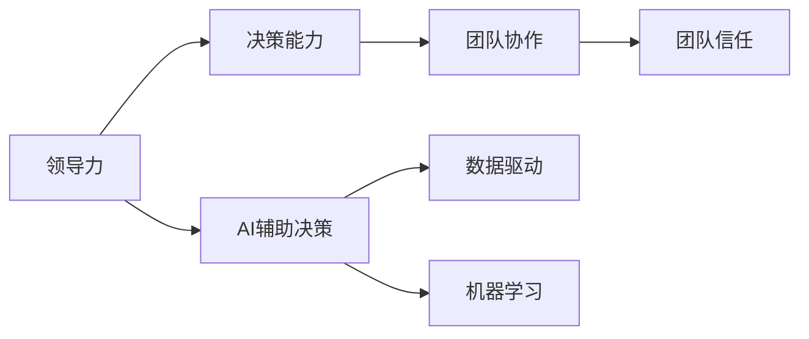
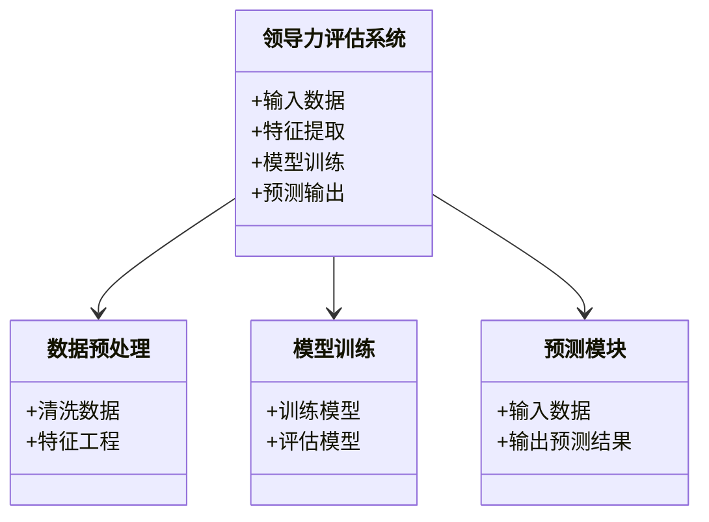
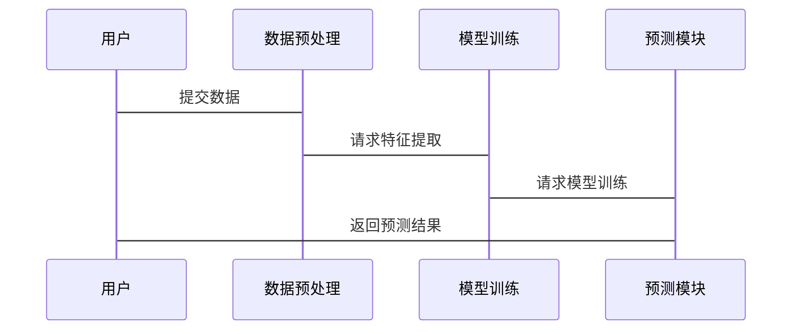

                 


# 巴菲特的管理层评估：人工智能辅助决策时代的领导力

---

## 关键词：
巴菲特、领导力、人工智能、管理层评估、决策系统、数据驱动、机器学习

---

## 摘要：
在人工智能辅助决策的时代，领导力的定义和实践正在发生深刻的变化。本文以巴菲特的管理层评估为切入点，探讨AI技术如何影响领导力的核心要素，分析领导力在数据驱动和算法支持下的新特征，并提出在AI辅助决策时代，领导力的提升策略。通过结合巴菲特的投资哲学和现代AI技术，本文旨在为读者提供一个全新的视角，理解领导力在数字化转型中的重要性。

---

# 正文

---

## 第一部分：领导力的背景与挑战

### 第1章：领导力的定义与核心要素

#### 1.1 领导力的定义与核心要素
- **领导力的定义**：领导力是通过影响力影响他人或团队，实现目标的能力。
- **领导力的核心要素**：
  - **战略思维**：制定长期目标和计划。
  - **决策能力**：在复杂情况下做出合理决策。
  - **团队协作**：激励和协调团队成员。
  - **适应能力**：应对变化和不确定性。
  - **影响力**：通过沟通和行动影响他人。

#### 1.2 AI辅助决策时代的领导力挑战
- **传统领导力的局限性**：
  - 数据依赖性：传统决策可能缺乏数据支持。
  - 速度问题：面对快速变化，传统决策可能滞后。
- **AI辅助决策对领导力的影响**：
  - 数据驱动：AI提供更精准的数据支持。
  - 算法优化：AI优化决策过程，提高效率。
  - 智能辅助：AI帮助领导者更好地理解复杂问题。
- **领导力在AI时代的角色转变**：
  - 从“决策者”到“决策辅助者”。
  - 从“直觉驱动”到“数据+直觉双驱动”。

#### 1.3 巴菲特的领导力框架
- **巴菲特的投资哲学**：
  - 长期投资、价值投资、安全边际。
- **巴菲特的领导力特点**：
  - 以数据为基础，结合直觉和经验。
  - 强调团队合作和信任。
- **巴菲特领导力的现代启示**：
  - 数据的重要性：AI时代，数据是决策的基础。
  - 人类经验的价值：AI是工具，人类判断是关键。
  - 团队协作的重要性：AI无法替代团队合作。

#### 1.4 本章小结
本章从领导力的基本定义出发，分析了AI辅助决策时代领导力面临的挑战，并以巴菲特的领导力框架为例，探讨了传统领导力与AI辅助决策的结合。

---

## 第二部分：领导力的核心概念与联系

### 第2章：领导力的维度与AI辅助决策的关系

#### 2.1 领导力的维度分析
- **战略思维**：
  - 领导者需要制定长期目标，并预见未来趋势。
- **决策能力**：
  - 领导者需要在复杂情况下做出正确决策。
- **团队协作**：
  - 领导者需要激励团队成员，协调各方资源。

#### 2.2 AI辅助决策的核心原理
- **数据驱动的决策**：
  - AI通过数据分析提供决策支持。
- **机器学习与预测**：
  - 利用机器学习模型预测未来趋势。
- **自然语言处理在决策中的应用**：
  - 通过NLP技术分析文本数据，提取有用信息。

#### 2.3 领导力与AI决策的对比分析
- **属性特征对比表**

| 属性         | 领导力                      | AI辅助决策                 |
|--------------|----------------------------|---------------------------|
| 数据依赖性    | 低                        | 高                        |
| 决策速度      | 较慢                      | 快                        |
| 可解释性      | 较高                      | 较低                      |
| 灵活性        | 高                        | 低                        |
- **领导力与AI决策的关系图（Mermaid）**



#### 2.4 本章小结
本章分析了领导力的三个核心维度，即战略思维、决策能力和团队协作，并探讨了AI辅助决策的核心原理。通过对比分析和关系图，明确了领导力与AI决策的关系。

---

## 第三部分：AI辅助决策的算法原理

### 第3章：AI辅助决策的算法与数学模型

#### 3.1 机器学习算法在决策中的应用
- **线性回归模型**：
  - 用于预测连续型变量。
- **支持向量机（SVM）**：
  - 用于分类问题。
- **随机森林与决策树**：
  - 用于分类和回归问题。

#### 3.2 算法流程图（Mermaid）


#### 3.3 算法实现代码
- **线性回归模型示例**：

```python
import numpy as np
from sklearn.linear_model import LinearRegression

# 示例数据
X = np.array([[1], [2], [3], [4]])
y = np.array([2, 4, 6, 8])

# 模型训练
model = LinearRegression()
model.fit(X, y)

# 预测
print(model.predict([[5]]))  # 输出: [[10]]
```

#### 3.4 数学模型与公式
- **线性回归公式**：
  $$ y = \beta_0 + \beta_1 x + \epsilon $$
- **机器学习决策树示例**：
  $$ \text{预测结果} = \text{决策规则}(x) $$

#### 3.5 本章小结
本章详细介绍了机器学习算法在决策中的应用，通过代码示例和数学公式，展示了AI辅助决策的核心原理。

---

## 第四部分：系统分析与架构设计方案

### 第4章：系统架构设计

#### 4.1 问题场景介绍
- **问题场景**：如何利用AI技术辅助领导力评估。
- **项目介绍**：构建一个基于AI的领导力评估系统。

#### 4.2 系统功能设计（领域模型图）


#### 4.3 系统架构设计（架构图）


#### 4.4 系统接口设计
- **输入接口**：接收领导力评估数据。
- **输出接口**：输出AI辅助决策结果。

#### 4.5 系统交互序列图（Mermaid）


#### 4.6 本章小结
本章从系统架构的角度，详细设计了一个基于AI的领导力评估系统，展示了系统的功能模块和交互流程。

---

## 第五部分：项目实战

### 第5章：项目实战与分析

#### 5.1 环境安装与配置
- **Python环境**：安装Python 3.8及以上版本。
- **库的安装**：安装numpy、pandas、scikit-learn等库。

#### 5.2 核心代码实现
- **数据预处理代码**：

```python
import pandas as pd

# 示例数据
data = {
    '特征1': [1, 2, 3, 4],
    '特征2': [5, 6, 7, 8],
    '目标': [10, 20, 30, 40]
}

df = pd.DataFrame(data)
print(df)
```

- **模型训练代码**：

```python
from sklearn.model_selection import train_test_split
from sklearn.linear_model import LinearRegression

# 数据分割
X = df[['特征1', '特征2']]
y = df['目标']
X_train, X_test, y_train, y_test = train_test_split(X, y, test_size=0.2, random_state=42)

# 模型训练
model = LinearRegression()
model.fit(X_train, y_train)

# 模型评估
print(model.score(X_test, y_test))
```

#### 5.3 案例分析与解读
- **案例分析**：假设我们有一个领导力评估数据集，通过AI模型预测领导者的潜在能力。
- **结果分析**：模型预测结果与实际结果对比，分析误差原因。

#### 5.4 项目小结
本章通过实际项目实战，展示了如何利用AI技术辅助领导力评估，帮助领导者更好地理解和提升自己的能力。

---

## 第六部分：总结与展望

### 第6章：总结与展望

#### 6.1 最佳实践 tips
- **数据的重要性**：确保数据的准确性和完整性。
- **模型的可解释性**：选择易于解释的模型，以便更好地理解决策过程。
- **人类判断的核心作用**：AI是工具，最终决策需要结合人类判断。

#### 6.2 小结
本文从领导力的定义出发，分析了AI辅助决策的核心原理，并结合实际项目，展示了AI技术在领导力评估中的应用。

#### 6.3 注意事项
- **数据隐私**：确保数据的安全性和隐私性。
- **模型局限性**：AI模型可能存在局限性，需结合实际情况使用。
- **技术更新**：AI技术不断进步，需持续学习和更新知识。

#### 6.4 拓展阅读
- 推荐书籍：《算法导论》、《机器学习实战》。
- 推荐论文：关于AI辅助决策的最新研究。

#### 6.5 本章小结
本章总结了全文的主要内容，并提出了未来的研究方向和实践建议。

---

# 结语

在AI辅助决策的时代，领导力的定义和实践正在发生深刻的变化。通过结合巴菲特的领导力框架和现代AI技术，我们可以更好地理解领导力在数字化转型中的重要性。未来，随着AI技术的不断发展，领导力的提升将更加依赖于数据驱动和算法支持。希望本文能为读者提供一个全新的视角，帮助他们在AI辅助决策的时代中更好地发挥领导力。

---

# END

