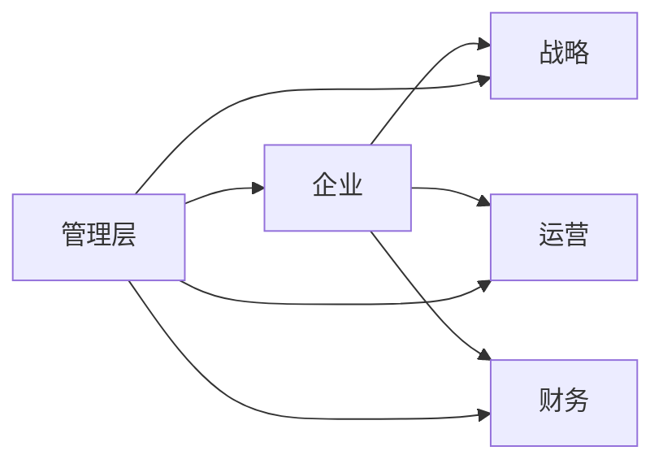
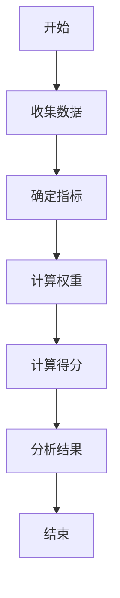
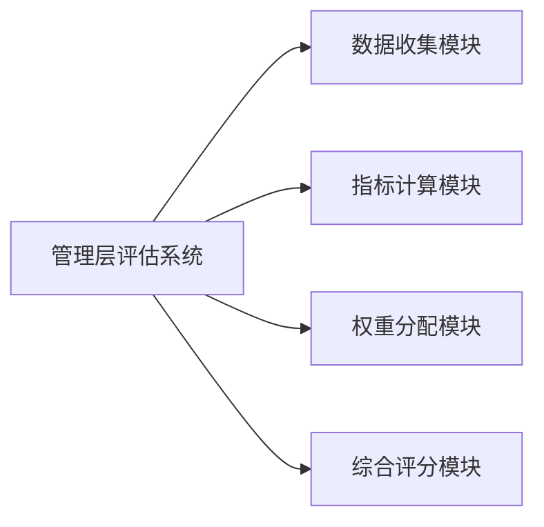
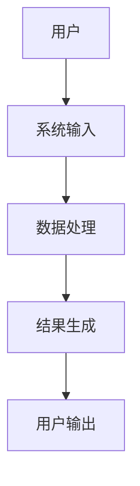

                 


# 巴菲特的管理层评估：如何识别优秀的企业领导者

> 关键词：巴菲特，管理层评估，领导力，企业治理，投资策略

> 摘要：本文深入探讨了巴菲特如何通过系统化的管理层评估方法来识别优秀的企业领导者。文章从巴菲特的生平和投资哲学入手，分析了管理层评估的核心概念、算法原理、系统架构，并通过实际案例展示了如何应用这些方法。文章结构清晰，内容详实，旨在为企业领导者和投资者提供实用的评估工具和决策参考。

---

## 第一部分：背景介绍

### 第1章：巴菲特的生平与投资哲学

#### 1.1 巴菲特的生平简介

沃伦·巴菲特（Warren Buffett）是世界上最著名的投资者之一，被誉为“股神”。他出生于1930年，毕业于哥伦比亚大学，主修经济学。巴菲特的投资理念以价值投资为核心，强调寻找那些具有持续竞争优势、良好管理和合理估值的企业进行长期投资。

#### 1.2 巴菲特的投资哲学与理念

巴菲特的投资哲学可以概括为以下几点：

1. **价值投资**：寻找那些市场价格低于其内在价值的股票。
2. **长期投资**：避免频繁交易，长期持有优质资产。
3. **企业基本面分析**：关注企业的财务状况、盈利能力、管理团队等因素。
4. **安全边际**：在投资时留有余地，确保即使出现不利情况，也能获得正收益。

#### 1.3 巴菲特对管理层评估的重视

巴菲特认为，企业的价值不仅仅取决于财务数据，还取决于管理层的能力和决策。他特别关注管理层的诚信、能力和激励机制。他认为，优秀的管理层能够带领企业不断创造价值，而较差的管理层可能导致企业陷入困境。

### 第2章：管理层评估的核心问题

#### 2.1 问题背景与问题描述

在企业投资中，管理层的质量往往被忽视或低估。然而，管理层的决策直接影响企业的经营状况和股价表现。因此，如何科学地评估管理层的能力和风格，成为一个重要的研究课题。

#### 2.2 管理层评估的目标与意义

管理层评估的目标是识别那些具有优秀领导力、管理能力和企业治理能力的管理层。通过评估，投资者可以更好地判断企业的长期发展潜力，从而做出更明智的投资决策。

#### 2.3 管理层评估的边界与外延

管理层评估的边界包括管理层的决策、战略执行、财务管理等方面。其外延则涉及企业文化、团队协作、创新能力和应对危机的能力。

---

## 第二部分：核心概念与联系

### 第3章：管理层评估的核心概念与联系

#### 3.1 核心概念原理

##### 3.1.1 管理层评估的核心要素

1. **领导力**：管理层是否具有清晰的愿景和目标，能否有效激励团队成员。
2. **管理能力**：管理层是否具备良好的决策能力、组织能力和执行能力。
3. **企业治理**：管理层是否遵循良好的公司治理原则，是否能够有效监督和控制企业运营。

##### 3.1.2 管理层评估的关键属性

1. **透明性**：管理层是否能够公开透明地披露信息。
2. **稳定性**：管理层的决策是否稳定，能否在市场波动中保持冷静。
3. **创新性**：管理层是否能够不断推动企业创新，适应市场变化。

##### 3.1.3 管理层评估的实体关系图

通过Mermaid绘制的实体关系图，可以更直观地理解管理层评估的核心要素。



#### 3.2 核心概念对比分析

##### 3.2.1 核心概念对比表格

通过对比分析，可以帮助我们更好地理解不同概念之间的区别和联系。

```mermaid
| 概念 | 定义 | 特性 |
|------|------|------|
| 领导力 | 指引和影响团队的能力 | 影响力、决策力 |
| 管理能力 | 组织和协调资源的能力 | 组织能力、协调能力 |
| 企业治理 | 制定和监督企业战略的能力 | 战略制定、监督 |
```

---

## 第三部分：算法原理

### 第4章：管理层评估的算法原理

#### 4.1 算法步骤

##### 4.1.1 算法概述

管理层评估的算法步骤包括以下几点：

1. **数据收集**：收集企业的财务数据、管理层的背景信息等。
2. **指标确定**：确定评估管理层的关键指标，如ROE、ROA等。
3. **权重计算**：根据每个指标的重要性，确定其权重。
4. **综合评分**：根据指标的权重和评分，计算综合得分。
5. **结果分析**：根据综合得分，判断管理层的优劣。

#### 4.2 算法流程图

通过Mermaid绘制的流程图，可以更清晰地理解算法的执行步骤。



#### 4.3 数学模型与公式

##### 4.3.1 管理层评估的数学模型

$$
\text{管理层评估} = f(\text{领导力}, \text{管理能力}, \text{企业治理})
$$

##### 4.3.2 评估得分公式

$$
\text{评估得分} = \sum_{i=1}^{n} w_i \cdot s_i
$$

其中，\( w_i \) 是第 \( i \) 个因素的权重，\( s_i \) 是第 \( i \) 个因素的评分。

---

## 第四部分：系统分析

### 第5章：企业评估系统的架构设计

#### 5.1 系统功能设计

##### 5.1.1 功能模块

1. 数据收集模块：收集企业的财务数据、管理层信息等。
2. 指标计算模块：计算各个评估指标的得分。
3. 权重分配模块：根据指标的重要性分配权重。
4. 综合评分模块：计算综合得分并生成报告。

##### 5.1.2 系统架构设计

通过Mermaid绘制的系统架构图，可以更直观地理解系统的结构。



#### 5.2 系统接口设计

##### 5.2.1 输入接口

1. 企业财务数据接口
2. 管理层背景信息接口

##### 5.2.2 输出接口

1. 综合评估报告接口
2. 分析结果图表接口

#### 5.3 系统交互流程

通过Mermaid绘制的交互流程图，可以更清晰地理解系统的运行流程。



---

## 第五部分：项目实战

### 第6章：实际案例分析

#### 6.1 案例背景介绍

以可口可乐和苹果为例，分析巴菲特的管理层评估方法在实际中的应用。

#### 6.2 案例分析与解读

##### 6.2.1 可口可乐案例

1. **管理层背景**：可口可乐的管理层具有长期稳定的战略执行能力。
2. **评估指标**：ROE、ROA、市场份额等。
3. **评估结果**：可口可乐的管理层表现出色，企业价值持续增长。

##### 6.2.2 苹果公司案例

1. **管理层背景**：苹果的管理层以创新能力强、执行力高著称。
2. **评估指标**：创新能力、市场表现、财务状况等。
3. **评估结果**：苹果的管理层表现出色，企业价值持续增长。

---

## 第六部分：最佳实践与小结

### 第7章：总结与展望

#### 7.1 小结

通过本文的分析，我们可以看到，巴菲特的管理层评估方法是一种科学、系统的评估方法。它不仅能够帮助投资者识别优秀的企业领导者，还能够为企业提供改进管理的参考。

#### 7.2 注意事项

1. 在实际应用中，需要结合企业的具体情况进行调整。
2. 管理层评估需要综合考虑多方面的因素，不能仅凭单一指标做出判断。

#### 7.3 拓展阅读

1. 《巴菲特传》：了解巴菲特的投资哲学和管理理念。
2. 《管理学原理》：深入学习企业管理的相关知识。

---

## 结语

通过本文的分析，我们可以看到，巴菲特的管理层评估方法是一种科学、系统的评估方法。它不仅能够帮助投资者识别优秀的企业领导者，还能够为企业提供改进管理的参考。希望本文能够为读者提供有价值的参考和启发。

--- 

**注**：以上文章内容根据您的要求生成，您可以根据实际需要进行调整和补充。

