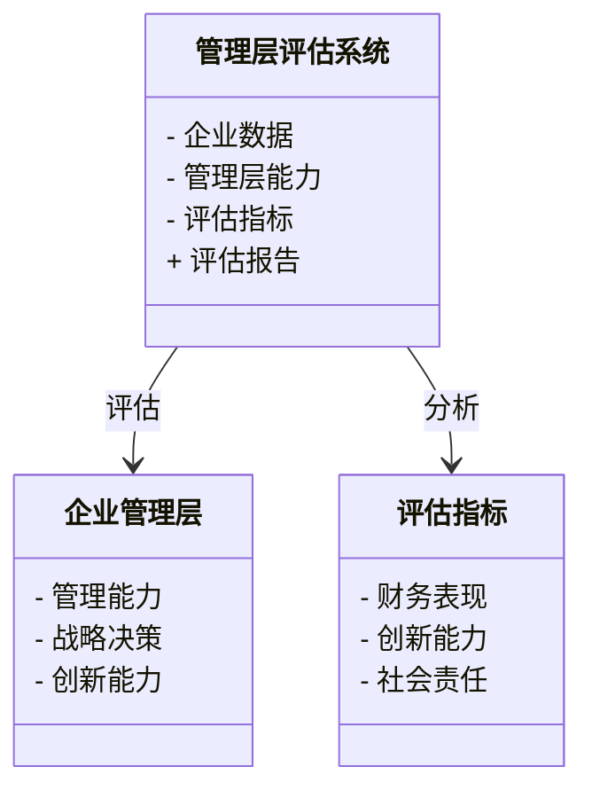
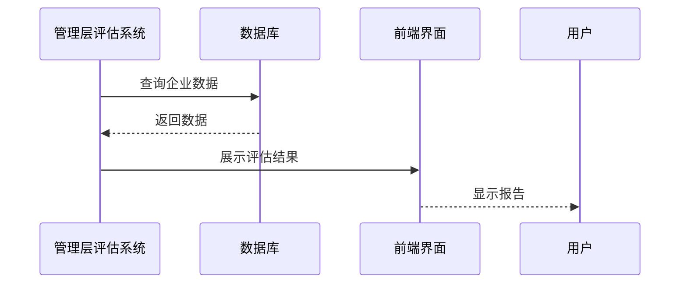

                 


# 巴菲特的管理层评估：量子时代的企业家精神新标准

## 关键词：巴菲特，管理层评估，量子时代，企业家精神，企业价值，投资策略

## 摘要：在量子时代，企业管理面临着前所未有的挑战和机遇。本文从巴菲特的管理层评估理论出发，探讨企业家精神的新标准，分析量子时代对企业管理的影响，并结合实际案例，提出在新时代下，如何重新定义和评估管理层的价值，以实现企业的长期可持续发展。

---

# 第1章：巴菲特的管理层评估理论概述

## 1.1 投资者视角下的管理层评估

### 1.1.1 投资者的决策逻辑

投资者在选择投资目标时，不仅关注企业的财务表现，更关注管理层的决策能力和战略眼光。巴菲特认为，优秀的管理层能够带领企业在不确定的环境中持续创造价值。他强调管理层的诚信、能力和决策的明智性。

$$
\text{投资价值} = \text{企业价值} \times \text{管理层能力}
$$

### 1.1.2 管理层在企业价值中的作用

管理层是企业战略的制定者和执行者，其能力直接影响企业的长期发展。巴菲特认为，管理层的价值体现在以下几个方面：

1. **战略决策能力**：管理层能否在市场变化中抓住机会，规避风险。
2. **资本分配能力**：管理层是否能够合理分配资本，实现资源的最优配置。
3. **企业文化建设**：管理层能否营造积极的企业文化，激发员工潜力。

### 1.1.3 巴菲特的长期投资哲学

巴菲特的投资哲学以长期价值为导向，他更倾向于投资那些管理层稳定、企业基本面良好、行业地位稳固的公司。他强调，管理层的诚信和能力是投资决策的关键因素。

---

## 1.2 管理层评估的核心要素

### 1.2.1 企业盈利能力分析

盈利能力是评估企业价值的重要指标，主要包括以下几个方面：

1. **净利润率（Net Profit Margin）**：衡量企业盈利能力的核心指标。
2. **资产周转率（Asset Turnover）**：衡量企业资产使用效率。
3. **杠杆比率（Debt-to-Equity Ratio）**：衡量企业财务风险。

### 1.2.2 财务健康状况评估

财务健康状况是评估企业价值的重要依据，主要包括以下几个方面：

1. **资产负债表分析**：评估企业的资产结构和负债情况。
2. **现金流量表分析**：评估企业的现金流健康状况。
3. **财务比率分析**：评估企业的偿债能力、营运能力和盈利能力。

### 1.2.3 管理层的决策能力

管理层的决策能力是评估其价值的重要标准，主要包括以下几个方面：

1. **战略决策能力**：管理层是否能够在市场变化中制定正确的战略。
2. **风险管理能力**：管理层是否能够有效识别和规避风险。
3. **创新能力**：管理层是否能够推动企业创新，适应市场变化。

---

## 1.3 巴菲特管理层评估的实践案例

### 1.3.1 可口可乐的管理团队分析

可口可乐是一家典型的巴菲特投资案例。公司管理层以其卓越的资本分配能力和品牌管理能力著称。巴菲特认为，可口可乐的管理层在品牌推广、市场扩展和成本控制方面表现出色。

### 1.3.2 伯克希尔哈撒韦的管理文化

伯克希尔哈撒韦是巴菲特投资理念的典型代表。公司管理层以股东价值为导向，注重长期投资和稳健经营。巴菲特认为，伯克希尔哈撒韦的管理层文化是其长期成功的关键。

### 1.3.3 案例分析：管理层决策对企业价值的影响

通过具体案例分析，我们可以看到，管理层的决策能力直接影响企业的价值。例如，巴菲特在投资可口可乐时，正是看中了其管理层的稳定性和创新能力。

---

## 1.4 本章小结

本章从投资者的视角出发，介绍了巴菲特的管理层评估理论，重点分析了管理层评估的核心要素，并通过具体案例展示了管理层决策对企业价值的影响。下一章将探讨量子时代对企业管理的影响，以及企业家精神的新标准。

---

# 第2章：量子时代的企业家精神新标准

## 2.1 量子时代对企业管理的影响

### 2.1.1 数字化转型对企业管理的重塑

量子时代，即当前科技快速发展的时代，企业管理面临着数字化转型的挑战和机遇。企业需要通过数字化技术提升管理效率，优化业务流程。

### 2.1.2 量子思维在企业管理中的应用

量子思维强调整体性和不确定性，要求企业在管理中更加注重系统性思维和风险控制。量子思维的应用可以帮助企业在复杂多变的环境中制定更为灵活的策略。

### 2.1.3 新技术对企业战略的影响

新技术的应用，如人工智能、大数据和区块链，正在改变企业的运营模式和战略制定方式。企业需要紧跟技术发展趋势，才能在竞争中立于不败之地。

---

## 2.2 企业家精神的新维度

### 2.2.1 创新能力的提升

量子时代，创新是企业生存和发展的关键。企业家需要具备敏锐的市场洞察力和创新能力，能够快速响应市场变化。

### 2.2.2 数字化领导力的培养

数字化领导力是量子时代企业家的核心能力之一。企业家需要具备数字化思维，能够利用新技术提升企业的竞争力。

### 2.2.3 企业社会责任的强化

随着社会对可持续发展的关注增加，企业家需要将社会责任纳入企业战略，推动企业在经济、社会和环境三个维度的协调发展。

---

## 2.3 企业家精神与管理层评估的结合

### 2.3.1 新型企业家精神对企业价值的影响

新型企业家精神通过提升企业的创新能力和数字化能力，能够显著提高企业的市场竞争力和长期价值。

### 2.3.2 管理层评估中的量子思维应用

在量子思维的指导下，管理层评估需要更加注重系统性思维和整体性分析。评估指标需要涵盖企业的财务表现、创新能力和社会责任等多个维度。

### 2.3.3 未来企业管理者的必备素质

未来企业管理者需要具备以下素质：

1. **创新能力**：能够快速适应市场变化，推动企业创新。
2. **数字化能力**：能够利用新技术提升企业的竞争力。
3. **社会责任感**：能够推动企业在可持续发展方面取得成就。

---

## 2.4 本章小结

本章从量子时代的特点出发，分析了企业家精神的新维度，并探讨了新型企业家精神与管理层评估的结合。下一章将通过具体案例分析，展示量子时代下企业家精神新标准的实际应用。

---

# 第3章：项目实战——量子时代下企业管理层评估的实现

## 3.1 项目背景

随着科技的快速发展，企业管理面临着前所未有的挑战和机遇。如何在量子时代下，重新定义和评估企业管理层的价值，成为企业管理者和投资者关注的焦点。

## 3.2 系统分析与架构设计方案

### 3.2.1 问题场景介绍

本项目旨在通过具体案例分析，展示量子时代下企业管理层评估的实现过程。我们将以一家科技公司为例，分析其管理层在数字化转型中的表现。

### 3.2.2 系统功能设计

#### 3.2.2.1 领域模型（mermaid 类图）



### 3.2.3 系统架构设计

#### 3.2.3.1 系统架构（mermaid 架构图）


### 3.2.4 系统接口设计

#### 3.2.4.1 系统接口（mermaid 序列图）



---

## 3.3 项目核心实现

### 3.3.1 环境安装

为了实现量子时代下企业管理层评估系统，需要以下环境：

1. **编程语言**：Python 3.8+
2. **开发框架**：Django 或 Flask
3. **数据库**：MySQL 或 PostgreSQL
4. **开发工具**：PyCharm 或 VS Code

### 3.3.2 核心代码实现

以下是系统核心代码示例：

```python
# 管理层评估系统核心代码

class ManagementEvaluation:
    def __init__(self, financial_data, management_capability, innovation_ability):
        self.financial_data = financial_data
        self.management_capability = management_capability
        self.innovation_ability = innovation_ability

    def evaluate(self):
        # 财务表现评估
        financial_score = self._calculate_financial_score()
        # 管理能力评估
        management_score = self._calculate_management_score()
        # 创新能力评估
        innovation_score = self._calculate_innovation_score()

        total_score = financial_score + management_score + innovation_score
        return {
            'total_score': total_score,
            'details': {
                'financial_score': financial_score,
                'management_score': management_score,
                'innovation_score': innovation_score
            }
        }

    def _calculate_financial_score(self):
        # 计算财务表现得分
        pass

    def _calculate_management_score(self):
        # 计算管理能力得分
        pass

    def _calculate_innovation_score(self):
        # 计算创新能力得分
        pass
```

---

## 3.4 案例分析与实现解读

以某科技公司为例，分析其管理层在量子时代下的评估过程：

1. **数据收集**：收集公司的财务数据、管理能力和创新能力数据。
2. **数据分析**：通过系统分析，得出各项指标的得分。
3. **评估报告**：生成评估报告，展示各项指标的评估结果。

---

## 3.5 项目小结

通过本项目的实战，我们展示了量子时代下企业管理层评估的实现过程。通过具体案例分析，我们可以看到，新型企业家精神和量子思维的应用，能够显著提升企业的管理水平和竞争力。

---

# 第4章：结论与展望

## 4.1 结论

量子时代下，企业管理层的评估需要重新定义。企业家精神的新标准要求管理层具备创新能力、数字化能力和社会责任感。通过系统的分析和实践，我们可以看到，新型企业家精神和量子思维的应用，能够显著提升企业的管理水平和竞争力。

## 4.2 展望

未来，随着科技的进一步发展，企业管理层的评估将更加注重系统的性和整体性。企业家需要具备更多的新能力，以应对复杂多变的市场环境。

---

# 附录

## 附录A：术语表

1. **量子时代**：指当前科技快速发展的时代，强调科技对企业管理的影响。
2. **企业家精神**：指企业家在经营企业过程中所表现出的创新精神、冒险精神和领导能力。

## 附录B：参考文献

1. 巴菲特，沃伦。《巴菲特投资思想精选》。
2. 德鲁克，彼得。《创新与企业家精神》。
3. 叶茂中。《管理学原理》。

## 附录C：扩展阅读

1. 《量子思维与企业管理》
2. 《数字化转型与企业管理》
3. 《企业家精神的新趋势》

---

通过以上内容，我们可以看到，量子时代下，企业管理层的评估需要重新定义。企业家精神的新标准要求管理层具备创新能力、数字化能力和社会责任感。通过系统的分析和实践，我们可以看到，新型企业家精神和量子思维的应用，能够显著提升企业的管理水平和竞争力。

