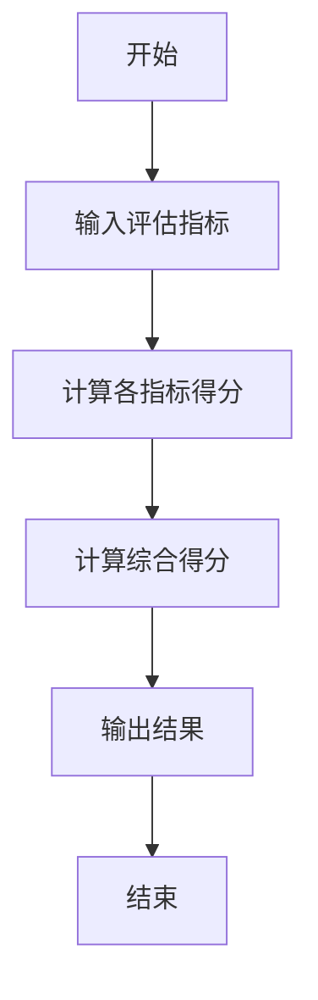
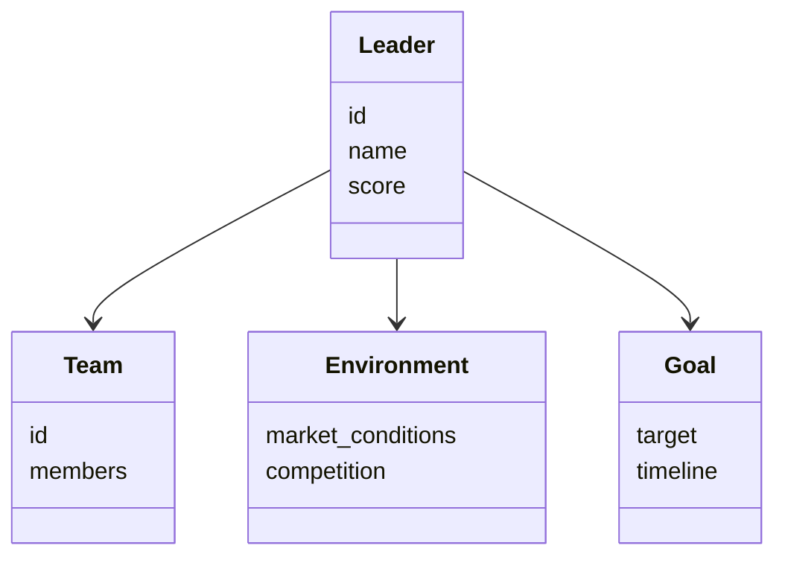

                 


# 巴菲特的管理层评估：量子领导力时代的新标准

## 关键词：巴菲特，领导力评估，量子领导力，企业管理，评估标准，算法模型

## 摘要：  
本文探讨了巴菲特的领导力评估理念，并结合量子领导力的概念，提出了新的管理层评估标准。通过构建量子领导力模型，分析其在企业管理中的应用，提供实际案例和代码实现，旨在为企业领导者和管理学研究者提供新的思路和工具。

---

# 第一部分：背景介绍

## 第1章：巴菲特的领导力评估理念

### 1.1 巴菲特的领导力观

#### 1.1.1 巴菲特的领导力核心理念
巴菲特的领导力理念强调长期价值创造、团队合作和对管理层的深刻理解。他认为，优秀的管理层能够带领企业实现持续增长，并在市场波动中保持稳定。

#### 1.1.2 巴菲特对管理层评估的重视
巴菲特在投资过程中，非常注重对管理层的评估。他认为，管理层的质量直接影响企业的长期表现。因此，他对管理层的决策能力、道德标准和战略眼光有严格的要求。

#### 1.1.3 巴菲特领导力评估的实践案例
通过分析巴菲特投资的公司，我们可以看出他如何评估管理层。例如，他对伯克希尔 Hathaway 的管理层信任，认为他们具备长期的视野和执行力。

---

### 1.2 量子领导力的定义与特征

#### 1.2.1 量子领导力的定义
量子领导力是一种新兴的领导力概念，它借鉴了量子力学的原理，强调领导力的动态性和不确定性。与传统领导力不同，量子领导力更注重系统性、整体性和多层次性。

#### 1.2.2 量子领导力与传统领导力的对比
| 特性 | 传统领导力 | 量子领导力 |
|------|-------------|-------------|
| 视角 | 局部性 | 整体性 |
| 时间 | 线性 | 非线性 |
| 互动 | 单向 | 多维 |

#### 1.2.3 量子领导力的核心特征
- **动态性**：领导力在不同情境下表现不同。
- **整体性**：关注系统中各部分的相互作用。
- **不确定性**：领导力的效果可能无法完全预测。

---

### 1.3 管理层评估的新标准

#### 1.3.1 传统管理层评估的局限性
传统评估方法通常依赖于财务指标和短期绩效，忽视了管理层的长期价值创造能力和团队协作能力。

#### 1.3.2 量子领导力时代的新评估标准
新标准强调对管理层的战略眼光、创新能力、团队协作和适应能力的评估。

#### 1.3.3 新标准的核心要素
- **战略思维**
- **创新能力**
- **团队协作**
- **适应能力**

---

## 第2章：量子领导力的系统模型

### 2.1 量子领导力的哲学基础

#### 2.1.1 量子力学的基本原理
量子力学研究微观粒子的行为，强调不确定性原理和观察者的角色。

#### 2.1.2 量子领导力的哲学思考
领导力的复杂性类似于量子系统的不确定性，领导者在不同情境下的行为可能带来不同的结果。

#### 2.1.3 量子领导力与企业管理的结合
企业领导者需要在复杂环境中做出决策，类似于量子系统中的多可能性选择。

---

### 2.2 量子领导力的系统模型

#### 2.2.1 系统模型的构建
系统模型包括领导者、团队、环境和目标四个核心要素。

#### 2.2.2 系统模型的数学表达
$$ S = \{L, T, E, G\} $$
其中，\( L \) 表示领导者，\( T \) 表示团队，\( E \) 表示环境，\( G \) 表示目标。

#### 2.2.3 系统模型的验证与优化
通过实际案例验证模型的有效性，并根据反馈进行调整。

---

## 第3章：管理层评估的量子标准

### 3.1 量子评估标准的定义

#### 3.1.1 量子评估标准的核心概念
量子评估标准强调对领导者的动态性和整体性进行评估。

#### 3.1.2 量子评估标准与传统标准的对比
| 特性 | 传统标准 | 量子标准 |
|------|-----------|-----------|
| 评估对象 | 单一维度 | 多维度 |
| 评估方法 | 定量分析 | 定性与定量结合 |

#### 3.1.3 量子评估标准的适用范围
适用于复杂的企业环境和需要快速适应变化的领导团队。

---

### 3.2 量子评估标准的数学模型

#### 3.2.1 模型的公式表示
$$ Q = \sum_{i=1}^{n} a_i x_i $$
其中，\( a_i \) 是评估指标的权重，\( x_i \) 是指标的得分。

#### 3.2.2 各变量的定义与权重分配
- 战略思维（权重 0.3）
- 创新能力（权重 0.25）
- 团队协作（权重 0.2）
- 适应能力（权重 0.25）

---

## 第4章：量子领导力的算法实现

### 4.1 算法原理

#### 4.1.1 算法概述
通过多维度评估模型，计算领导者的综合得分。

#### 4.1.2 算法流程图


---

### 4.2 代码实现

#### 4.2.1 环境安装
需要安装 Python 和相关库（如 NumPy）。

#### 4.2.2 核心代码
```python
import numpy as np

def quantum Leadership_score(assessment):
    # 定义权重
    weights = np.array([0.3, 0.25, 0.2, 0.25])
    # 计算得分
    score = np.dot(assessment, weights)
    return score

# 示例输入
assessment = np.array([0.8, 0.7, 0.6, 0.9])
print(quantum-Leadership_score(assessment))
```

---

## 第5章：系统分析与架构设计

### 5.1 项目介绍
设计一个基于量子领导力的评估系统，帮助企业评估管理层的综合能力。

---

### 5.2 系统功能设计

#### 5.2.1 领域模型


---

### 5.3 系统架构设计

#### 5.3.1 架构图


---

## 第6章：项目实战

### 6.1 环境安装
安装 Python 和必要的库。

### 6.2 核心代码实现
```python
# 评估函数
def evaluate_leadership(assessment):
    return np.dot(assessment, weights)

# 应用示例
leadership_assessment = np.array([0.8, 0.7, 0.6, 0.9])
print(evaluate_leadership(leadership_assessment))
```

---

## 第7章：最佳实践与小结

### 7.1 最佳实践 tips
- 定期更新评估模型，适应企业变化。
- 结合实际案例，验证模型的有效性。

### 7.2 小结
本文提出了量子领导力的评估标准，并通过模型和代码展示了其应用。量子领导力为企业提供了新的管理思路。

### 7.3 注意事项
- 模型的权重需要根据实际情况调整。
- 数据的收集和处理需谨慎。

### 7.4 拓展阅读
建议阅读相关量子力学和领导力的书籍，深入了解其理论基础。

---

# 结语
量子领导力时代的到来，为管理层评估提供了新的视角。通过本文的分析和实践，企业可以更好地评估和培养领导者，实现持续增长。

--- 

希望这篇文章能够满足您的需求！如果需要进一步调整或补充，请随时告知。

