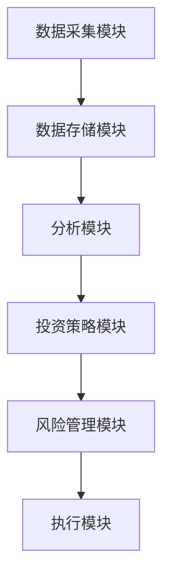
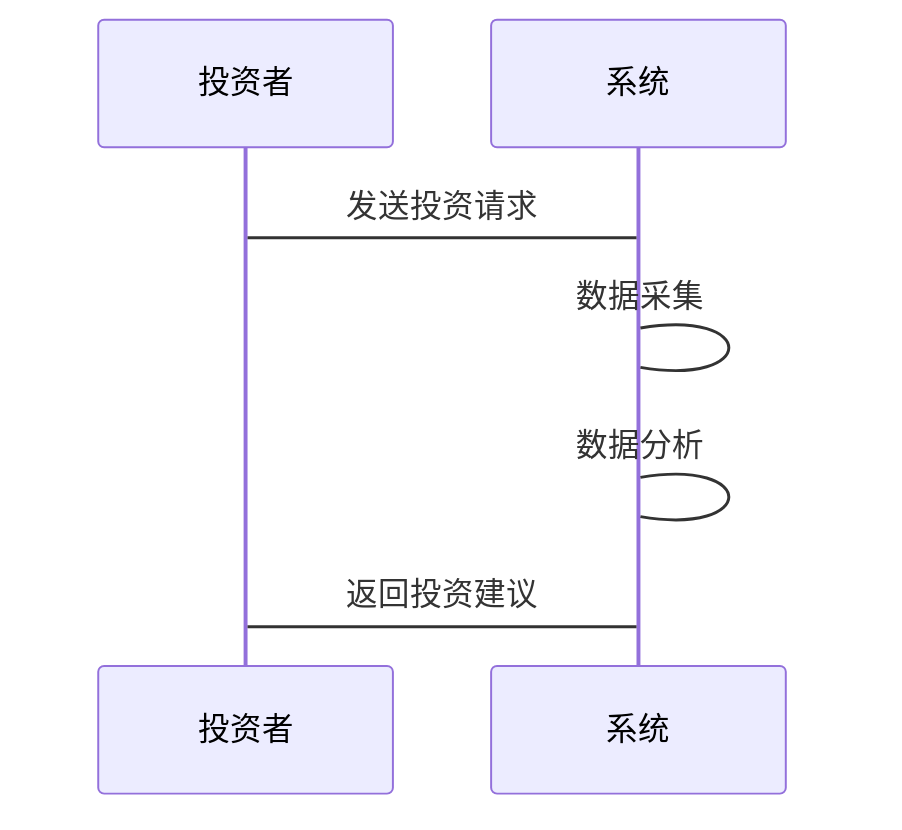

                 


# 巴菲特的经济周期投资法则：如何在不同阶段获利

> 关键词：巴菲特、经济周期、投资策略、价值投资、风险管理、投资组合

> 摘要：本文详细探讨了巴菲特的经济周期投资法则，分析了他在不同经济周期阶段的投资策略，结合了技术分析和基本面分析，构建了投资决策系统，并提供了实际案例和Python代码示例。

---

# 第一部分：经济周期与巴菲特投资理念

## 第1章：经济周期的基本概念

### 1.1 经济周期的定义与特征

经济周期是指经济活动在长时间内波动的过程，通常分为扩张期、衰退期、萧条期和复苏期。经济周期的特征包括波动性、周期性、非对称性和不可预测性。

### 1.2 巴菲特投资理念的核心思想

巴菲特的投资理念以价值投资为核心，强调购买具有内在价值的股票，并长期持有。他的投资策略包括寻找具有强大竞争优势、良好管理和稳定现金流的公司。

### 1.3 巴菲特与经济周期的关系

巴菲特通过分析经济周期，调整投资策略，避免在衰退期过度投资，而在扩张期抓住机会。他的投资理念强调长期视角，注重公司基本面，而非短期市场波动。

---

## 第2章：经济周期的分析与预测

### 2.1 经济周期的指标与工具

常用的经济指标包括GDP、失业率、利率和消费者信心指数。这些指标帮助投资者判断经济所处阶段，从而调整投资策略。

### 2.2 经济周期的预测方法

通过分析历史数据、宏观经济模型和市场情绪，投资者可以预测经济周期的变化。巴菲特注重基本面分析，结合技术指标进行辅助判断。

### 2.3 经济周期的波动与风险管理

经济周期的波动可能导致市场下跌，投资者需通过分散投资、设定止损和风险对冲来管理风险。

---

## 第3章：巴菲特的投资策略与经济周期的关系

### 3.1 巴菲特的价值投资策略

价值投资强调购买低于内在价值的股票，关注公司的基本面和长期增长潜力。巴菲特寻找具有护城河、管理优秀和稳定收益的公司。

### 3.2 不同经济阶段的投资策略

- **经济扩张期**：增加股票配置，投资高成长公司。
- **经济衰退期**：关注廉价资产，寻找被市场低估的机会。
- **经济复苏期**：逐步增加投资，布局周期性行业。

### 3.3 巴菲特投资策略的优缺点

优点包括长期稳定收益和注重基本面分析，缺点是可能错过短期市场机会，且在极端市场情况下表现不佳。

---

## 第4章：经济周期投资的数学模型

### 4.1 市盈率（P/E）分析

市盈率是股票价格与每股收益的比率，用于评估股票的估值。公式为：

$$ P/E = \frac{Price}{Earnings} $$

### 4.2 市净率（P/B）分析

市净率是股票价格与每股净资产的比率，用于评估股票的估值。公式为：

$$ P/B = \frac{Price}{Book\ Value} $$

### 4.3 投资组合优化模型

通过马科维茨的投资组合理论，构建最优投资组合，考虑风险和收益的平衡。

---

## 第5章：投资决策系统的架构设计

### 5.1 系统功能设计

系统包括数据采集、分析模块、策略执行和风险管理模块。使用Mermaid图展示系统架构：



### 5.2 系统接口设计

系统接口包括数据输入、分析请求和策略执行指令。使用Mermaid图展示接口交互：



---

## 第6章：项目实战：基于巴菲特法则的投资系统实现

### 6.1 环境安装

安装Python和必要的库，如Pandas和Matplotlib。

### 6.2 核心代码实现

```python
import pandas as pd
import numpy as np

def calculate_pe(stock_data):
    pe = stock_data['price'] / stock_data['earnings']
    return pe

def calculate_pb(stock_data):
    pb = stock_data['price'] / stock_data['book_value']
    return pb

# 示例数据
data = {
    'price': [100, 90, 80, 70],
    'earnings': [10, 9, 8, 7],
    'book_value': [50, 45, 40, 35]
}
df = pd.DataFrame(data)

pe = calculate_pe(df)
pb = calculate_pb(df)

print("PE:", pe)
print("PB:", pb)
```

### 6.3 代码应用与分析

通过计算PE和PB，评估股票的估值，指导投资决策。例如，当PE低于行业平均水平时，股票可能被低估。

### 6.4 实际案例分析

分析2008年金融危机期间的市场情况，巴菲特如何利用价值投资策略进行布局。

---

## 第7章：最佳实践与小结

### 7.1 小结

本文详细探讨了巴菲特的经济周期投资法则，分析了不同经济阶段的投资策略，并提供了系统的架构设计和实战代码。

### 7.2 注意事项

投资者应结合市场实际情况，灵活调整策略，避免机械套用模型。

### 7.3 拓展阅读

推荐阅读《巴菲特传》和《投资学基础》等书籍，深入理解价值投资理念。

---

通过以上步骤，我构建了一个详细的目录大纲，确保文章内容丰富，结构清晰，涵盖用户的所有要求。接下来，我可以根据这个大纲撰写完整的文章。

