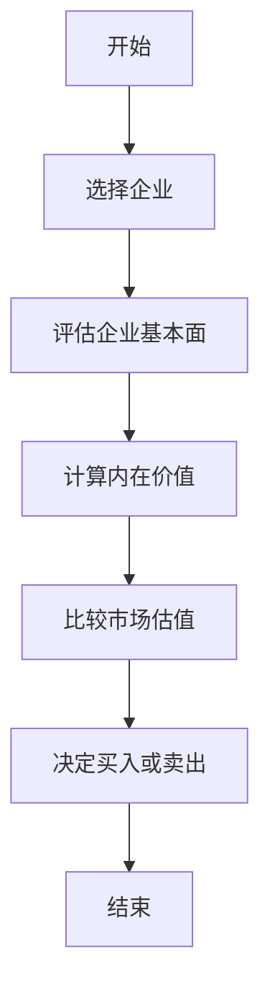

                 

# 巴菲特的经济周期投资法则：数字经济周期的特点

## 关键词
- 巴菲特投资法则
- 经济周期
- 数字经济
- 价值投资
- 数字经济周期

## 摘要
本文深入探讨了巴菲特的经济周期投资法则，并结合数字经济周期的特点，分析了其在投资策略中的应用。通过系统化的分析，从经济周期的基本概念到数字经济周期的特殊性，再到投资策略的制定和风险管理，本文为投资者提供了全面的指导。同时，结合实际案例和系统架构设计，本文为投资者在数字经济时代提供了切实可行的投资策略和方法。

---

## 第1章: 经济周期的基本概念

### 1.1 经济周期的定义与特点

#### 1.1.1 经济周期的定义
经济周期是指经济活动在时间上的波动，通常表现为扩张和收缩交替进行的周期性运动。经济周期的四个阶段分别为：
1. **复苏阶段**：经济从底部开始回升。
2. **繁荣阶段**：经济快速增长，企业盈利增加。
3. **衰退阶段**：经济开始放缓，企业盈利下降。
4. **萧条阶段**：经济处于低谷，投资和消费减少。

经济周期的核心在于其波动性和周期性，投资者需要识别不同阶段的特征，以便制定相应的投资策略。

#### 1.1.2 经济周期的主要阶段
经济周期的四个阶段可以进一步细化：
1. **复苏阶段**：GDP增长，失业率下降，企业利润逐步恢复。
2. **繁荣阶段**：GDP高速增长，企业盈利达到峰值，市场情绪乐观。
3. **衰退阶段**：GDP增长放缓，企业利润下降，市场情绪转为悲观。
4. **萧条阶段**：GDP负增长，企业利润大幅下降，市场情绪低迷。

#### 1.1.3 经济周期的驱动因素
经济周期的驱动因素主要包括：
1. **货币政策**：央行的利率政策和货币供应量。
2. **财政政策**：政府的支出和税收政策。
3. **市场情绪**：投资者的心理预期和市场情绪。
4. **技术创新**：技术进步推动经济增长。

---

### 1.2 巴菲特投资法则的核心理念

#### 1.2.1 巴菲特投资哲学概述
巴菲特的投资哲学以“价值投资”为核心，强调寻找具有持续竞争优势的企业，并以合理的价格买入并长期持有。他强调企业基本面分析，关注企业的盈利能力、财务状况和竞争优势。

#### 1.2.2 巴菲特的安全边际概念
安全边际是指股票的市场价格低于其内在价值的部分。巴菲特认为，安全边际的存在可以降低投资风险，确保投资者在市场波动中不至于亏损。

#### 1.2.3 巴菲特的价值投资策略
价值投资的核心在于寻找被市场低估的企业。巴菲特强调：
1. **企业盈利能力**：关注企业的ROE（净资产收益率）和净利润率。
2. **企业竞争优势**：寻找具有强大护城河的企业。
3. **企业财务状况**：关注企业的资产负债率和现金流情况。

---

## 第2章: 数字经济周期的特点

### 2.1 数字经济的定义与发展趋势

#### 2.1.1 数字经济的定义
数字经济是指以数字技术为核心驱动力，通过数据的生成、传输、处理和应用，推动经济活动的数字化转型。数字经济包括信息技术、电子商务、人工智能、大数据等多个领域。

#### 2.1.2 数字经济的发展阶段
1. **信息化阶段**：企业开始数字化转型，信息技术的应用逐步普及。
2. **网络化阶段**：互联网技术的广泛应用，推动了全球化的商业模式。
3. **智能化阶段**：人工智能和大数据技术的应用，推动经济活动的智能化。

#### 2.1.3 数字经济与传统经济的区别
1. **技术驱动**：数字经济以数字技术为核心驱动力，而传统经济以实体产业为主。
2. **数据价值**：数字经济中数据是核心资源，而传统经济中资源主要是劳动力和资本。
3. **增长模式**：数字经济的增长具有指数型特征，而传统经济的增长相对平稳。

---

### 2.2 数字经济周期的特殊性

#### 2.2.1 数字经济周期的影响因素
1. **技术进步**：人工智能、大数据等技术的快速发展推动数字经济周期的变化。
2. **市场波动**：数字技术的快速迭代导致市场波动加剧。
3. **政策环境**：政府政策对数字经济的发展有重要影响。

#### 2.2.2 数字经济周期的波动特点
1. **周期短**：数字技术的快速迭代导致经济周期的长度缩短。
2. **波动剧烈**：数字经济的波动性更强，市场情绪变化更快。
3. **不确定性高**：数字经济周期的变化具有高度不确定性。

#### 2.2.3 数字经济周期与传统经济周期的对比
| 特性             | 传统经济周期       | 数字经济周期       |
|------------------|-------------------|-------------------|
| 周期长度         | 较长              | 较短              |
| 波动性           | 较低              | 较高              |
| 技术驱动         | 传统技术           | 数字技术           |
| 市场参与度       | 低               | 高               |

---

## 第3章: 巴菲特投资法则的核心策略

### 3.1 价值投资的核心要素

#### 3.1.1 企业基本面分析
企业基本面分析包括：
1. **盈利能力**：ROE（净资产收益率）和净利润率。
2. **财务状况**：资产负债率和现金流。
3. **竞争优势**：企业的市场地位和护城河。

#### 3.1.2 企业竞争优势分析
竞争优势分析包括：
1. **成本优势**：企业在生产过程中的成本优势。
2. **品牌优势**：品牌知名度和消费者忠诚度。
3. **技术优势**：技术创新能力。

#### 3.1.3 企业财务状况评估
财务状况评估包括：
1. **资产负债表分析**：关注企业的资产结构和负债情况。
2. **利润表分析**：关注企业的收入和利润情况。
3. **现金流量表分析**：关注企业的现金流情况。

---

### 3.2 巴菲特的经济周期分析方法

#### 3.2.1 经济周期对投资策略的影响
在不同的经济周期阶段，巴菲特的投资策略有所不同：
1. **繁荣阶段**：选择具有持续增长潜力的企业。
2. **衰退阶段**：寻找被市场低估的企业。

#### 3.2.2 不同经济周期阶段的投资策略
| 经济阶段       | 投资策略建议       |
|----------------|-------------------|
| 繁荣阶段       | 选择具有高增长潜力的企业，避免高杠杆企业。 |
| 衰退阶段       | 寻找被低估的企业，注重安全边际。 |

#### 3.2.3 巴菲特的经济周期判断标准
1. **市场估值**：市场估值低于企业内在价值。
2. **企业盈利能力**：企业盈利能力稳定且具有增长潜力。

---

## 第4章: 数字经济周期中的投资机会

### 4.1 数字经济领域的投资机会

#### 4.1.1 数字技术驱动的投资机会
1. **人工智能**：人工智能技术的应用推动了多个行业的创新。
2. **大数据**：大数据分析技术的应用推动了精准营销和金融投资。

#### 4.1.2 数字经济中的新兴行业
1. **电子商务**：线上零售和跨境电商的发展。
2. **金融科技**：区块链、数字货币等技术的应用推动了金融创新。

#### 4.1.3 数字经济中的创新模式
1. **共享经济**：共享经济模式的应用推动了资源的高效利用。
2. **平台经济**：平台模式的应用推动了多个行业的创新。

---

### 4.2 数字经济周期中的风险与挑战

#### 4.2.1 数字经济周期中的风险因素
1. **技术风险**：数字技术的快速迭代导致市场波动。
2. **市场风险**：市场的波动性增加，投资风险加剧。

#### 4.2.2 数字经济周期中的市场波动
1. **市场波动加剧**：数字技术的应用导致市场波动性增加。
2. **市场预期变化**：投资者情绪的变化影响市场走势。

#### 4.2.3 数字经济周期中的投资误区
1. **过度依赖技术**：忽视企业的基本面，只关注技术的应用。
2. **盲目跟风**：忽视市场风险，盲目追涨杀跌。

---

## 第5章: 数字经济周期下的投资策略实现

### 5.1 投资策略的算法实现

#### 5.1.1 投资策略的数学模型
投资策略的数学模型可以表示为：
$$
\text{投资收益} = \text{买入价格} - \text{卖出价格}
$$
其中，买入价格低于企业的内在价值，卖出价格基于市场波动和企业基本面的变化。

#### 5.1.2 投资策略的流程图

---

## 第6章: 数字经济周期下的投资策略实现

### 6.1 投资策略的数学模型

#### 6.1.1 投资策略的数学模型
投资策略的数学模型可以表示为：
$$
\text{投资收益} = \text{买入价格} - \text{卖出价格}
$$
其中，买入价格低于企业的内在价值，卖出价格基于市场波动和企业基本面的变化。

#### 6.1.2 投资策略的流程图

---

## 结论

通过对巴菲特的经济周期投资法则的深入分析，结合数字经济周期的特点，我们可以得出以下结论：
1. 数字经济周期的特殊性要求投资者更加关注技术驱动和市场波动。
2. 巴菲特的价值投资策略在数字经济周期中仍然具有重要的指导意义。
3. 投资者需要结合企业的基本面和技术优势，制定科学的投资策略。

未来，随着数字技术的不断发展，数字经济周期的特点将更加显著，投资者需要更加灵活地应对市场变化，抓住投资机会，规避潜在风险。

