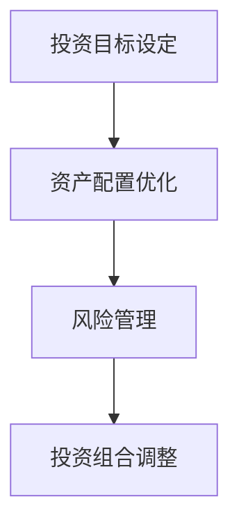

                 


# 巴菲特的经济周期投资策略

## 关键词：巴菲特，经济周期，投资策略，价值投资，风险管理，资产配置

## 摘要：本文将深入探讨巴菲特的经济周期投资策略，分析其核心理念、关键工具与方法，以及在不同经济周期阶段的投资策略调整。结合数学模型和系统架构设计，详细解读巴菲特投资策略的系统功能设计、架构图、接口设计，以及实际案例分析。最后，通过项目实战部分，展示如何在实际投资中应用这些策略，帮助读者更好地理解和掌握巴菲特的经济周期投资智慧。

---

# 第一部分: 经济周期与巴菲特投资策略基础

## 第1章: 经济周期的基本概念

### 1.1 经济周期的定义与特征

#### 1.1.1 经济周期的定义
经济周期是指经济活动在长期趋势中围绕趋势上下波动的周期性现象。经济周期通常分为四个阶段：繁荣、衰退、萧条和复苏。

#### 1.1.2 经济周期的主要阶段
1. **繁荣阶段**：经济增长迅速，企业盈利增加，股票市场表现良好。
2. **衰退阶段**：经济增长放缓，企业盈利下降，股票市场表现不佳。
3. **萧条阶段**：经济活动极度低迷，企业盈利大幅下降，股票市场表现极差。
4. **复苏阶段**：经济开始逐步恢复，企业盈利逐渐回升，股票市场开始反弹。

#### 1.1.3 经济周期的核心特征
- **波动性**：经济活动的波动性是经济周期的核心特征之一。
- **周期性**：经济活动呈现周期性波动，周期长度和幅度各不相同。
- **不可预测性**：尽管经济周期有一定的规律，但其具体起止时间往往难以预测。

### 1.2 巴菲特投资策略的核心理念

#### 1.2.1 巴菲特投资策略的起源
巴菲特的投资策略源于价值投资理念，他强调以低于内在价值的价格购买优质企业股票。

#### 1.2.2 巴菲特投资策略的核心要素
1. **安全边际**：买入价格低于内在价值，确保投资的安全性。
2. **长期投资**：长期持有优质股票，避免频繁交易。
3. **企业基本面分析**：注重企业的财务状况、盈利能力、竞争优势等基本面因素。

#### 1.2.3 巴菲特投资策略与经济周期的关系
巴菲特的投资策略在不同经济周期阶段具有不同的表现，他在经济衰退期寻找低估的投资机会，而在经济繁荣期则注重资产的合理配置。

---

## 第2章: 巴菲特投资策略的关键工具与方法

### 2.1 股票估值的核心工具

#### 2.1.1 股息率的计算与应用
股息率是衡量股票收益能力的重要指标，计算公式为：
$$ \text{股息率} = \frac{\text{每股股息}}{\text{股价}} $$

#### 2.1.2 市盈率的定义与使用场景
市盈率是衡量股票估值的重要指标，计算公式为：
$$ \text{市盈率} = \frac{\text{股价}}{\text{每股收益}} $$

#### 2.1.3 内在价值的计算方法
内在价值是企业未来现金流的现值，计算公式为：
$$ \text{内在价值} = \sum_{t=1}^{\infty} \frac{\text{现金流}_t}{(1 + r)^t} $$

### 2.2 投资组合优化的数学模型

#### 2.2.1 投资组合的收益与风险公式
投资组合的预期收益和风险可以通过以下公式计算：
$$ \text{预期收益} = \sum_{i=1}^n w_i \times r_i $$
$$ \text{风险} = \sqrt{\sum_{i=1}^n \sum_{j=1}^n w_i w_j \sigma_i \sigma_j \rho_{ij}} $$

其中，$w_i$ 是第 $i$ 只股票的权重，$r_i$ 是第 $i$ 只股票的预期收益率，$\sigma_i$ 是第 $i$ 只股票的收益标准差，$\rho_{ij}$ 是第 $i$ 只股票和第 $j$ 只股票之间的相关系数。

#### 2.2.2 马科维茨均值-方差模型
马科维茨均值-方差模型用于优化投资组合的风险和收益，其目标是最小化投资组合的方差，同时满足预期收益的约束。

$$ \text{目标函数：} \quad \min_w \sigma^2(w) $$
$$ \text{约束条件：} \quad \sum_{i=1}^n w_i = 1 $$

其中，$\sigma^2(w)$ 是投资组合的方差，$w_i$ 是第 $i$ 只股票的权重。

#### 2.2.3 巴菲特投资组合优化的实践应用
巴菲特在实践中通过分析企业的基本面，选择具有长期竞争优势的企业，并合理配置资产，以实现投资组合的最优风险收益比。

---

## 第3章: 经济周期分析与投资策略

### 3.1 经济周期对投资策略的影响

#### 3.1.1 经济周期对股票市场的整体影响
经济周期的波动直接影响股票市场的表现，例如在经济衰退期，股票市场通常表现不佳，而在经济繁荣期，股票市场表现良好。

#### 3.1.2 不同经济周期阶段的投资策略调整
1. **经济繁荣期**：注重资产的合理配置，避免过度集中于高风险资产。
2. **经济衰退期**：寻找低估的投资机会，增加对优质企业的投资。
3. **经济转型期**：关注新兴行业和具有创新能力的企业。

#### 3.1.3 经济周期与企业盈利能力的关系
经济周期的波动直接影响企业的盈利能力，例如在经济衰退期，企业盈利下降，而在经济繁荣期，企业盈利上升。

### 3.2 巴菲特在不同经济周期中的投资行为

#### 3.2.1 经济繁荣期的投资策略
在经济繁荣期，巴菲特注重资产的合理配置，避免过度集中于高风险资产，同时关注具有长期竞争优势的企业。

#### 3.2.2 经济衰退期的投资机会
在经济衰退期，巴菲特寻找低估的投资机会，增加对优质企业的投资，以实现长期的超额收益。

#### 3.2.3 经济转型期的投资布局
在经济转型期，巴菲特关注新兴行业和具有创新能力的企业，布局未来的增长点。

---

# 第二部分: 巴菲特投资策略的系统分析与架构设计

## 第4章: 投资策略的系统架构

### 4.1 投资策略的系统功能设计

#### 4.1.1 投资目标设定模块
投资目标设定模块用于确定投资目标，例如资产保值、资本增值等。

#### 4.1.2 资产配置优化模块
资产配置优化模块用于根据经济周期和市场环境，优化投资组合的资产配置。

#### 4.1.3 风险管理模块
风险管理模块用于监控和管理投资组合的风险，例如市场风险、流动性风险等。

### 4.2 投资策略的系统架构图



### 4.3 投资策略的接口设计

#### 4.3.1 数据输入接口
数据输入接口用于接收市场数据、经济指标等输入数据。

#### 4.3.2 策略执行接口
策略执行接口用于执行投资策略，例如买入、卖出等操作。

#### 4.3.3 结果输出接口
结果输出接口用于输出投资组合的表现、风险指标等结果。

## 第5章: 投资策略的数学模型与算法

### 5.1 投资组合优化的数学模型

#### 5.1.1 均值-方差模型
均值-方差模型用于优化投资组合的风险和收益，其目标是最小化投资组合的方差，同时满足预期收益的约束。

$$ \text{目标函数：} \quad \min_w \sigma^2(w) $$
$$ \text{约束条件：} \quad \sum_{i=1}^n w_i = 1 $$

其中，$\sigma^2(w)$ 是投资组合的方差，$w_i$ 是第 $i$ 只股票的权重。

#### 5.1.2 风险调整后的收益模型
风险调整后的收益模型用于比较不同投资组合的风险调整后收益，例如夏普比率。

$$ \text{夏普比率} = \frac{\text{投资组合收益} - \text{无风险收益}}{\text{投资组合收益的标准差}} $$

### 5.2 算法实现

#### 5.2.1 优化算法
以下是一个优化算法的Python实现示例：

```python
import numpy as np
from scipy.optimize import minimize

# 定义目标函数
def portfolio_variance(weights, covariance_matrix):
    return np.dot(weights.T, np.dot(covariance_matrix, weights))

# 定义约束条件
def portfolio_sum(weights):
    return np.sum(weights) - 1

# 优化问题设置
covariance_matrix = np.array([[0.04, 0.02], [0.02, 0.04]])
initial_weights = [0.5, 0.5]
constraints = [{'type': 'eq', 'fun': portfolio_sum}]

# 调用优化函数
result = minimize(portfolio_variance, initial_weights, args=covariance_matrix, constraints=constraints)

# 输出优化结果
print("优化结果：", result)
```

---

## 第6章: 项目实战

### 6.1 环境安装

#### 6.1.1 Python环境安装
安装Python和必要的库，例如numpy、pandas、scipy等。

```bash
pip install numpy pandas scipy
```

### 6.2 系统核心实现源代码

#### 6.2.1 投资组合优化代码

```python
import numpy as np
from scipy.optimize import minimize

# 定义目标函数
def portfolio_variance(weights, covariance_matrix):
    return np.dot(weights.T, np.dot(covariance_matrix, weights))

# 定义约束条件
def portfolio_sum(weights):
    return np.sum(weights) - 1

# 优化问题设置
covariance_matrix = np.array([[0.04, 0.02], [0.02, 0.04]])
initial_weights = [0.5, 0.5]
constraints = [{'type': 'eq', 'fun': portfolio_sum}]

# 调用优化函数
result = minimize(portfolio_variance, initial_weights, args=covariance_matrix, constraints=constraints)

# 输出优化结果
print("优化结果：", result)
```

#### 6.2.2 经济周期分析代码

```python
import pandas as pd
import numpy as np

# 假设我们有一个包含经济指标的数据框
data = pd.DataFrame({
    'GDP': [2, 3, 4, 5, 6],
    '利率': [1, 2, 3, 4, 5],
    '通胀率': [2, 3, 4, 5, 6]
})

# 计算经济周期阶段
def determine_phase(data):
    phases = []
    for index in data.index:
        gdp = data.loc[index, 'GDP']
        interest = data.loc[index, '利率']
        inflation = data.loc[index, '通胀率']
        # 简单的经济周期阶段判断逻辑
        if gdp > 5 and interest < 3 and inflation < 4:
            phases.append('繁荣期')
        elif gdp < 3 and interest > 5 and inflation > 5:
            phases.append('衰退期')
        else:
            phases.append('复苏期')
    return phases

# 添加阶段列
data['阶段'] = determine_phase(data)
print(data)
```

### 6.3 实际案例分析与详细解读

#### 6.3.1 案例背景
假设我们有一个包含GDP、利率和通胀率的数据集，我们需要根据这些数据判断经济周期阶段，并制定相应的投资策略。

#### 6.3.2 数据分析与解读
通过分析GDP、利率和通胀率的变化，我们可以判断经济周期阶段，并根据不同的阶段调整投资策略。

#### 6.3.3 投资策略调整
在繁荣期，我们增加对高增长行业的投资；在衰退期，我们寻找低估的投资机会；在复苏期，我们保持资产的合理配置。

### 6.4 项目小结

通过本项目，我们学会了如何根据经济周期阶段调整投资策略，并通过数学模型和算法优化投资组合的风险和收益。

---

# 第三部分: 总结与展望

## 第7章: 总结与展望

### 7.1 总结
本文深入探讨了巴菲特的经济周期投资策略，分析了其核心理念、关键工具与方法，以及在不同经济周期阶段的投资策略调整。通过数学模型和系统架构设计，详细解读了巴菲特投资策略的系统功能设计、架构图、接口设计，以及实际案例分析。

### 7.2 展望
未来，我们可以进一步研究经济周期对不同类型资产的影响，探索更多投资策略，并结合人工智能技术，优化投资组合的管理和调整。

---

# 结语

巴菲特的经济周期投资策略不仅是一种投资方法，更是一种智慧。通过本文的分析，我们希望读者能够更好地理解和掌握巴菲特的经济周期投资智慧，并在实际投资中取得优异的成绩。

---

