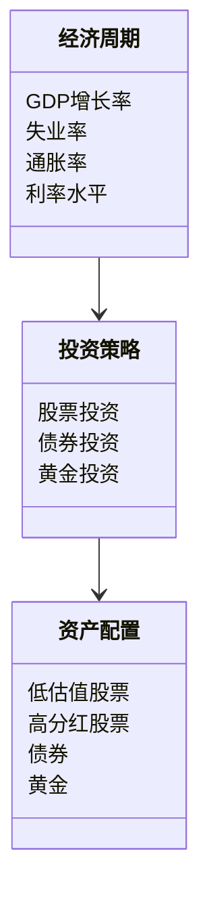
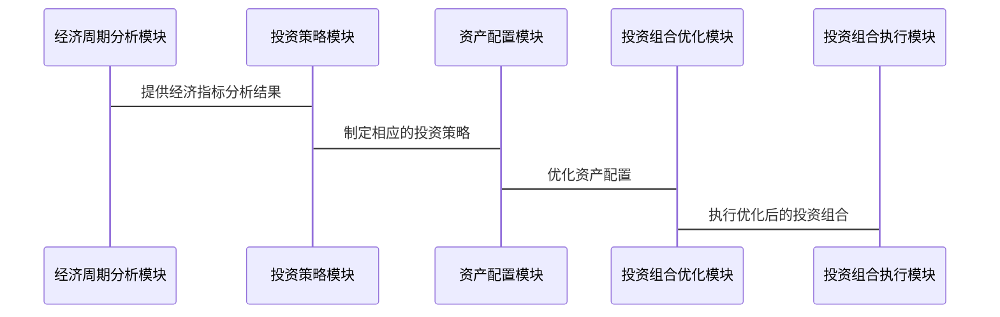

                 


# 巴菲特的经济周期投资：如何在不同阶段调整策略

## 关键词：
- 巴菲特投资策略
- 经济周期
- 价值投资
- 资产配置
- 投资决策

## 摘要：
本文深入探讨巴菲特如何在不同经济周期阶段调整其投资策略。通过分析经济周期的基本概念、巴菲特的投资理念、经济周期分析方法，以及他在衰退、复苏、繁荣和萧条期的具体投资策略，结合实际案例和系统架构设计，为投资者提供在不同经济环境下优化投资组合的实用指导。

---

# 第一部分：经济周期与巴菲特投资策略概述

## 第1章：经济周期的基本概念

### 1.1 经济周期的定义与特征

#### 1.1.1 经济周期的定义
经济周期是指经济活动在一定时期内经历的扩张和收缩交替变化的过程。通常分为四个阶段：衰退、复苏、繁荣和萧条。经济周期的变化对企业和市场产生深远影响。

#### 1.1.2 经济周期的主要阶段
- **衰退期**：经济增长放缓，企业盈利下降，市场情绪低迷。
- **复苏期**：经济开始恢复，企业盈利逐步回升，市场情绪改善。
- **繁荣期**：经济增长迅速，企业盈利高，市场情绪高涨。
- **萧条期**：经济极度低迷，企业大量倒闭，市场情绪恐慌。

#### 1.1.3 经济周期对投资的影响
经济周期的变化直接影响股票、债券等资产的价格波动。投资者需要根据经济周期的变化调整投资策略，以规避风险并抓住投资机会。

### 1.2 巴菲特的投资理念

#### 1.2.1 价值投资的核心思想
巴菲特的价值投资理念强调购买具有内在价值的股票，并长期持有。他认为市场波动是短期的，而企业的内在价值是长期的。

#### 1.2.2 长期投资与复利效应
巴菲特强调长期投资的重要性，通过复利效应实现财富的稳步增长。他认为短期市场波动不应影响长期投资决策。

#### 1.2.3 巴菲特的投资风格与特点
巴菲特注重企业的基本面分析，寻找具有持续盈利能力、良好管理和强大竞争优势的企业。他偏好低估值、高分红的股票，并在市场低迷时积极投资。

### 1.3 巴菲特与经济周期的关系

#### 1.3.1 经济周期对巴菲特投资策略的影响
经济周期的变化直接影响巴菲特的投资决策。例如，在衰退期，他倾向于寻找被低估的企业进行投资；在繁荣期，他则更谨慎，避免高估的资产。

#### 1.3.2 巴菲特如何识别经济周期
巴菲特通过分析经济指标、市场情绪和企业盈利情况来判断经济周期的变化。他认为经济周期是不可预测的，但可以通过长期投资来规避短期波动的风险。

#### 1.3.3 巴菲特在不同经济周期下的投资策略
- **衰退期**：巴菲特倾向于购买具有强大竞争优势和低估值的企业，利用市场恐慌获取廉价筹码。
- **复苏期**：巴菲特逐步增加投资，寻找那些在经济复苏中表现良好的企业。
- **繁荣期**：巴菲特保持谨慎，避免过度投资，选择优质企业进行长期持有。
- **萧条期**：巴菲特积极投资，利用市场的低估机会，进行长期布局。

---

## 第2章：巴菲特的经济周期分析方法

### 2.1 经济周期的指标与信号

#### 2.1.1 主要经济指标
- **GDP增长率**：衡量经济整体表现的重要指标。
- **失业率**：反映经济活动的活跃程度。
- **通胀率**：影响货币政策和企业成本的重要因素。
- **利率水平**：影响企业和个人借贷成本的关键因素。

#### 2.1.2 市场情绪与投资者心理
巴菲特认为市场情绪是影响投资决策的重要因素。在经济周期的不同阶段，投资者情绪会发生显著变化，从而影响市场价格。

#### 2.1.3 行业与企业周期分析
不同行业在经济周期中的表现差异显著。例如，周期性行业（如制造业）在经济衰退期表现较差，而在繁荣期表现优异。巴菲特通过分析企业的行业地位和盈利周期，判断其投资价值。

### 2.2 巴菲特的经济周期判断标准

#### 2.2.1 判断经济周期的关键因素
- **经济指标**：GDP增长率、失业率、通胀率等。
- **市场情绪**：投资者信心指数、市场波动率等。
- **企业盈利**：企业净利润增长率、利润率等。

#### 2.2.2 巴菲特的经济周期模型
巴菲特的经济周期模型结合了宏观经济指标和企业基本面分析，用于判断经济周期所处的阶段，并制定相应的投资策略。

#### 2.2.3 经济周期波动对投资决策的影响
经济周期的波动会导致市场波动加剧，企业盈利变化，投资者心理变化。因此，投资者需要根据经济周期的变化，灵活调整投资策略。

### 2.3 巴菲特的经济周期投资策略

#### 2.3.1 不同经济周期下的投资策略
- **衰退期**：寻找低估值、高分红的企业，进行长期投资。
- **复苏期**：逐步增加投资，选择那些在经济复苏中表现良好的企业。
- **繁荣期**：保持谨慎，避免高估资产，选择优质企业长期持有。
- **萧条期**：积极投资，利用市场的低估机会，进行长期布局。

#### 2.3.2 巴菲特在衰退期的投资策略
在衰退期，巴菲特倾向于购买具有强大竞争优势和低估值的企业，利用市场恐慌获取廉价筹码。他注重企业的内在价值，而非短期市场波动。

#### 2.3.3 巴菲特在复苏期的投资策略
在复苏期，巴菲特逐步增加投资，选择那些在经济复苏中表现良好的企业。他关注企业的盈利能力和行业地位，寻找具有增长潜力的股票。

#### 2.3.4 巴菲特在繁荣期的投资策略
在繁荣期，巴菲特保持谨慎，避免过度投资。他选择那些具有持续盈利能力、良好管理和强大竞争优势的企业，进行长期持有。

#### 2.3.5 巴菲特在萧条期的投资策略
在萧条期，巴菲特积极投资，利用市场的低估机会，进行长期布局。他寻找那些具有强大竞争优势和低估值的企业，进行长期投资。

---

## 第3章：巴菲特的经济周期投资模型

### 3.1 经济周期与企业价值评估

#### 3.1.1 企业价值的内在评估方法
巴菲特的企业价值评估方法注重企业的盈利能力、成长潜力和竞争优势。他通过分析企业的财务报表和行业地位，判断其内在价值。

#### 3.1.2 经济周期对企业盈利能力的影响
经济周期的变化直接影响企业的盈利能力。例如，在衰退期，企业盈利下降；在繁荣期，企业盈利增长。

#### 3.1.3 巴菲特的企业价值评估模型
巴菲特的企业价值评估模型结合了宏观经济指标和企业基本面分析，用于判断企业的内在价值。他注重企业的盈利能力、成长潜力和竞争优势。

### 3.2 巴菲特的资产配置策略

#### 3.2.1 不同经济周期下的资产配置
- **衰退期**：增加防御性资产（如债券、黄金）的配置，减少股票投资。
- **复苏期**：逐步增加股票投资，选择那些在经济复苏中表现良好的企业。
- **繁荣期**：保持股票投资，选择那些具有持续盈利能力、良好管理和强大竞争优势的企业。
- **萧条期**：积极增加股票投资，利用市场的低估机会，进行长期布局。

#### 3.2.2 巴菲特的防御性投资策略
在经济衰退期，巴菲特倾向于进行防御性投资，选择那些具有强大竞争优势和低估值的企业，进行长期持有。他注重企业的内在价值，而非短期市场波动。

#### 3.2.3 巴菲特的进攻性投资策略
在经济繁荣期，巴菲特倾向于进行进攻性投资，选择那些具有持续盈利能力、良好管理和强大竞争优势的企业，进行长期持有。他注重企业的成长潜力和竞争优势。

---

## 第4章：系统分析与架构设计方案

### 4.1 问题场景介绍

#### 4.1.1 问题背景
在经济周期变化的背景下，投资者需要根据经济周期的变化，灵活调整投资策略。然而，传统的投资策略往往过于注重短期市场波动，而忽视了经济周期对企业盈利能力和市场价值的影响。

#### 4.1.2 问题描述
如何在经济周期变化的背景下，制定和优化投资策略，以实现长期稳定的收益。

#### 4.1.3 问题解决
通过分析经济周期的变化，制定相应的投资策略，优化资产配置，规避短期市场波动的风险，实现长期稳定的收益。

### 4.2 项目介绍

#### 4.2.1 项目目标
通过分析经济周期的变化，制定和优化投资策略，实现长期稳定的收益。

#### 4.2.2 项目范围
- 分析经济周期的变化
- 制定相应的投资策略
- 优化资产配置
- 避免短期市场波动的风险

### 4.3 系统功能设计

#### 4.3.1 领域模型（Mermaid 类图）


#### 4.3.2 系统架构设计（Mermaid 架构图）


#### 4.3.3 系统接口设计
- 经济周期分析模块：提供经济指标的分析功能，判断经济周期所处的阶段。
- 投资策略模块：根据经济周期的变化，制定相应的投资策略。
- 资产配置模块：根据投资策略，优化资产配置，实现长期稳定的收益。

#### 4.3.4 系统交互设计（Mermaid 序列图）


---

## 第5章：项目实战

### 5.1 环境安装

#### 5.1.1 系统环境
- 操作系统：Windows 10 或 macOS 10.15 或更高版本
- 开发工具：Python 3.8 或更高版本，Jupyter Notebook
- 数据库：MySQL 8.0 或更高版本

#### 5.1.2 第三方库安装
```bash
pip install pandas numpy matplotlib seaborn
```

### 5.2 系统核心实现源代码

#### 5.2.1 经济周期分析模块

```python
import pandas as pd
import numpy as np

def analyze_economic_cycle(gdp_growth, unemployment_rate, inflation_rate, interest_rate):
    if gdp_growth < -2 and unemployment_rate > 8 and inflation_rate < 0:
        return "衰退期"
    elif -2 <= gdp_growth < 2 and unemployment_rate < 8 and inflation_rate < 2:
        return "复苏期"
    elif gdp_growth > 2 and unemployment_rate < 6 and inflation_rate < 4:
        return "繁荣期"
    else:
        return "萧条期"
```

#### 5.2.2 投资策略模块

```python
def determine_strategy(economic_cycle):
    if economic_cycle == "衰退期":
        return "防御性投资"
    elif economic_cycle == "复苏期":
        return "逐步增加投资"
    elif economic_cycle == "繁荣期":
        return "谨慎投资"
    else:
        return "积极投资"
```

#### 5.2.3 资产配置模块

```python
def asset_allocation(strategy):
    if strategy == "防御性投资":
        return {"债券": 60%, "黄金": 20%, "股票": 20%}
    elif strategy == "逐步增加投资":
        return {"股票": 40%, "债券": 40%, "黄金": 20%}
    elif strategy == "谨慎投资":
        return {"股票": 50%, "债券": 30%, "黄金": 20%}
    else:
        return {"股票": 60%, "债券": 20%, "黄金": 20%}
```

### 5.3 代码应用解读与分析

#### 5.3.1 经济周期分析模块
该模块通过分析经济指标（GDP增长率、失业率、通胀率、利率水平），判断经济周期所处的阶段。这有助于投资者根据经济周期的变化，制定相应的投资策略。

#### 5.3.2 投资策略模块
根据经济周期的分析结果，投资策略模块制定相应的投资策略。例如，在衰退期，投资者应进行防御性投资，选择低风险资产（如债券和黄金）进行配置。

#### 5.3.3 资产配置模块
资产配置模块根据投资策略，优化资产配置比例。例如，在衰退期，投资者应增加防御性资产（如债券和黄金）的配置比例，减少股票投资比例。

### 5.4 实际案例分析

#### 5.4.1 案例背景
假设当前经济指标显示GDP增长率为-1.5%，失业率为9%，通胀率为-1%，利率水平为2%。根据经济周期分析模块的分析结果，当前经济处于衰退期。

#### 5.4.2 投资策略制定
根据投资策略模块的分析结果，当前经济处于衰退期，应采取防御性投资策略。

#### 5.4.3 资产配置优化
根据资产配置模块的分析结果，防御性投资策略下，资产配置比例为债券60%，黄金20%，股票20%。

### 5.5 项目小结

通过以上分析和实现，投资者可以根据经济周期的变化，灵活调整投资策略，优化资产配置，规避短期市场波动的风险，实现长期稳定的收益。

---

## 第6章：最佳实践与小结

### 6.1 最佳实践 tips

#### 6.1.1 理解经济周期的重要性
经济周期的变化直接影响投资决策。投资者需要根据经济周期的变化，灵活调整投资策略，优化资产配置，规避短期市场波动的风险。

#### 6.1.2 长期投资的重要性
长期投资是巴菲特成功的关键。通过长期持有优质资产，投资者可以避免短期市场波动的影响，实现复利效应。

#### 6.1.3 价值投资的核心思想
价值投资的核心思想是寻找具有内在价值的资产进行投资。投资者需要关注企业的基本面，选择那些具有持续盈利能力、良好管理和强大竞争优势的资产。

### 6.2 小结

本文深入探讨了巴菲特的经济周期投资策略，分析了经济周期的基本概念、巴菲特的投资理念、经济周期分析方法，以及他在不同经济阶段下的投资策略。通过实际案例分析和系统架构设计，为投资者提供了在不同经济环境下优化投资组合的实用指导。

### 6.3 注意事项

- 投资有风险，投资者需要根据自身的风险承受能力和投资目标，制定相应的投资策略。
- 市场波动是不可预测的，投资者需要根据经济周期的变化，灵活调整投资策略。
- 价值投资需要长期坚持，投资者需要具备耐心和信心，避免短期市场波动的干扰。

### 6.4 拓展阅读

- 巴菲特的《聪明的投资者》
- 投资学经典著作《证券分析》
- 经济周期研究的相关文献

---

通过以上内容，投资者可以更好地理解巴菲特的经济周期投资策略，并在实际投资中灵活应用这些策略，实现长期稳定的收益。

