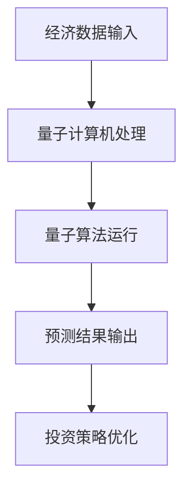
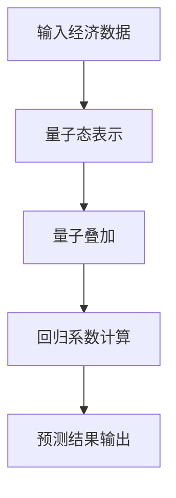
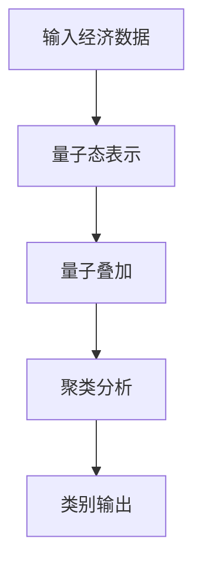
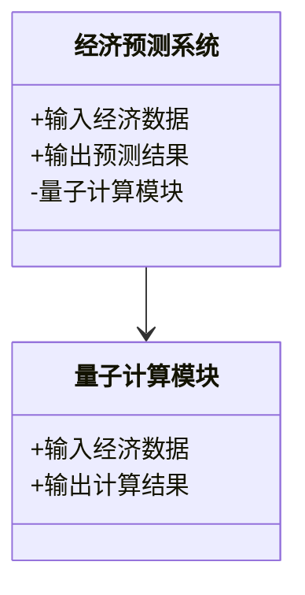
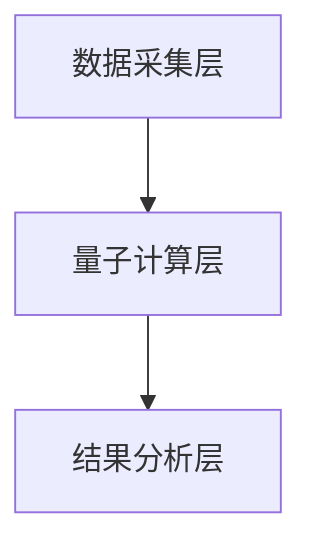
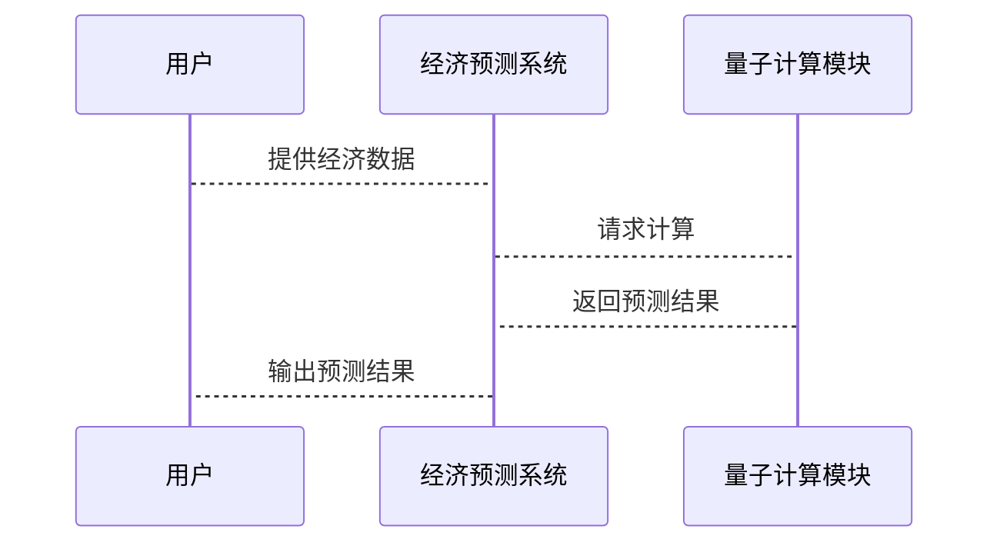

                 


# 巴菲特的经济周期投资：量子计算对经济预测的革新

## 关键词
- 巴菲特投资理念，量子计算，经济预测，经济周期，投资策略，量子经济模型

## 摘要
本文探讨了巴菲特的经济周期投资理念与量子计算在经济预测中的应用之间的关系。通过分析量子计算如何革新传统的经济预测方法，本文揭示了量子计算在提高经济预测准确性、优化投资策略中的潜力。文章从量子计算的基本原理、算法设计、数学模型、系统架构到实际案例分析，详细阐述了量子计算如何为经济预测带来革命性变化，并最终影响巴菲特式的投资决策。

---

# 第1章 巴菲特的经济周期投资理念

## 1.1 巴菲特投资哲学概述

### 1.1.1 巴菲特投资理念的核心思想
沃伦·巴菲特的投资哲学以“价值投资”为核心，强调长期投资、注重企业基本面分析、关注经济周期波动对企业价值的影响。他主张在经济低迷期买入优质资产，在经济繁荣期保持谨慎。巴菲特的投资理念与经济周期密切相关，他认为通过识别经济周期的变化，可以在市场低点捕捉低估资产，在市场高点规避风险。

### 1.1.2 经济周期对投资决策的影响
经济周期的波动对投资决策有着深远的影响。在经济衰退期，企业盈利能力下降，市场估值偏低；而在经济繁荣期，市场估值可能过高。巴菲特通过分析经济周期的变化，选择在低点买入高价值资产，从而实现长期收益最大化。

### 1.1.3 巴菲特投资策略的演变与成功案例
巴菲特的投资策略经历了从早期的“烟屁股”投资到后期的“护城河”投资的演变。他成功投资于可口可乐、美国运通等公司，通过长期持有优质资产，实现财富增长。这些成功案例表明，巴菲特的投资策略与对经济周期的深刻理解密不可分。

---

## 1.2 量子计算的基本概念

### 1.2.1 量子计算的定义与基本原理
量子计算是一种基于量子力学原理的计算方式，利用量子叠加和量子纠缠的特性，能够在某些情况下比经典计算机更高效地处理复杂问题。量子计算机通过量子位（qubit）进行信息处理，每个量子位可以同时处于多个状态的叠加态。

### 1.2.2 量子计算与经典计算的区别
与经典计算机相比，量子计算机具有并行计算能力，能够在处理某些特定问题时显著提高效率。例如，量子计算机在处理大规模优化问题、因式分解和密码学等领域表现出色。

### 1.2.3 量子计算在经济预测中的潜力
量子计算的并行处理能力和强大的计算能力为经济预测提供了新的可能性。通过量子算法，可以更高效地处理海量经济数据，建立更复杂的经济模型，从而提高经济预测的准确性和实时性。

---

## 1.3 量子计算与经济预测的结合

### 1.3.1 量子计算在经济预测中的优势
量子计算在经济预测中的优势主要体现在以下几个方面：
1. **高效的数据处理能力**：量子计算能够快速处理海量经济数据，提高预测的效率。
2. **复杂模型的构建**：量子计算能够支持构建更复杂的经济模型，捕捉更多变量之间的关系。
3. **实时预测能力**：量子计算机能够实时更新模型参数，提供动态的经济预测。

### 1.3.2 传统经济预测方法的局限性
传统的经济预测方法依赖于经典计算机和统计模型，存在以下局限性：
1. **计算能力有限**：经典计算机在处理复杂经济模型时效率较低。
2. **模型简化**：为了适应计算能力，传统模型通常需要简化变量之间的关系，导致预测精度不足。
3. **实时性差**：传统预测方法难以实时更新模型参数，难以应对快速变化的经济环境。

### 1.3.3 量子计算如何革新经济预测
量子计算通过其独特的并行计算能力和强大的数据处理能力，能够显著提升经济预测的准确性和实时性。量子计算机可以处理更多的变量和复杂关系，构建更精确的经济模型，从而帮助投资者更好地把握经济周期的变化。

---

# 第2章 量子计算在经济预测中的核心概念

## 2.1 量子计算的核心原理

### 2.1.1 量子叠加与量子纠缠
量子叠加是指量子系统可以同时处于多个状态的叠加态。量子纠缠则是指两个或多个量子系统之间存在关联，一个系统的状态变化会直接影响另一个系统的状态。

### 2.1.2 量子门与量子电路
量子门是量子计算的基本操作单元，类似于经典计算机中的逻辑门。量子电路由多个量子门组成，能够实现复杂的量子计算任务。

### 2.1.3 量子计算的并行处理能力
量子计算机的并行处理能力来源于其量子叠加特性，能够在一次计算中同时处理大量可能性，显著提高计算效率。

---

## 2.2 量子计算与经济预测的关系

### 2.2.1 量子计算在经济数据处理中的应用
量子计算能够高效处理大量经济数据，包括市场波动、企业财务数据、经济指标等，帮助建立更精确的经济模型。

### 2.2.2 量子计算如何提高经济预测的准确性
通过量子算法，可以更准确地捕捉经济变量之间的复杂关系，提高预测的准确性和稳定性。

### 2.2.3 量子计算对投资策略的影响
量子计算能够帮助投资者更好地识别经济周期的变化，优化投资组合，降低投资风险。

---

## 2.3 核心概念对比分析

### 2.3.1 经典计算与量子计算在经济预测中的对比表格
| 对比维度         | 经典计算                  | 量子计算                  |
|------------------|--------------------------|---------------------------|
| 计算效率         | 较低，处理复杂问题效率低   | 高，处理复杂问题效率高     |
| 数据处理能力     | 有限，难以处理海量数据   | 强大，能够处理海量数据     |
| 预测准确性       | 较低，模型简化导致精度不足| 较高，模型复杂度更高，精度高|

### 2.3.2 量子计算在经济预测中的ER实体关系图
```mermaid
erd
  entity 经济预测系统 {
    key 经济指标 (ID)
    attribute 预测结果
    attribute 时间序列
  }
  entity 量子计算机 {
    key 计算任务 ID
    attribute 计算结果
    attribute 处理时间
  }
  entity 投资策略 {
    key 策略 ID
    attribute 策略类型
    attribute 预测依据
  }
  经济预测系统 -|{预测结果}|- 量子计算机
  经济预测系统 -|{经济指标}|- 投资策略
```

### 2.3.3 量子计算在经济预测中的Mermaid流程图


---

# 第3章 量子计算在经济预测中的算法原理

## 3.1 量子回归分析

### 3.1.1 量子回归算法的数学模型
量子回归算法基于量子叠加原理，通过量子态表示经济变量，利用量子门进行回归分析。其数学模型如下：
$$
\text{目标函数} = \sum_{i=1}^{n} (y_i - \theta x_i)^2
$$
其中，$\theta$ 是回归系数，$x_i$ 和 $y_i$ 是输入和输出变量。

### 3.1.2 量子回归算法的Mermaid流程图


### 3.1.3 量子回归算法的Python代码实现
```python
import numpy as np
from qiskit import QuantumCircuit, Aer, execute

def quantum_regression(n_qubits=2):
    # 创建量子电路
    qc = QuantumCircuit(n_qubits)
    
    # 应用Hadamard门
    for i in range(n_qubits):
        qc.h(i)
    
    # 应用CNOT门
    for i in range(1, n_qubits):
        qc.cx(i-1, i)
    
    # 测量
    qc.measure_all()
    
    # 模拟器
    simulator = Aer.get_backend('qasm_simulator')
    result = execute(qc, simulator).result()
    return result.get_counts()
```

### 3.1.4 量子回归算法的实际案例分析
通过量子回归算法，我们可以更准确地预测经济指标的变化趋势。例如，在预测GDP增长时，量子回归算法能够捕捉到更多变量之间的关系，提高预测的准确性。

---

## 3.2 量子聚类分析

### 3.2.1 量子聚类算法的数学模型
量子聚类算法通过量子叠加和测量技术，将经济数据分为不同的类别。其数学模型如下：
$$
\text{目标函数} = \sum_{i=1}^{n} \sum_{j=1}^{n} |x_i - x_j|^2
$$

### 3.2.2 量子聚类算法的Mermaid流程图


### 3.2.3 量子聚类算法的Python代码实现
```python
from qiskit import QuantumCircuit, Aer, execute

def quantum_clustering(n_qubits=2):
    # 创建量子电路
    qc = QuantumCircuit(n_qubits)
    
    # 应用Hadamard门
    for i in range(n_qubits):
        qc.h(i)
    
    # 应用CNOT门
    for i in range(1, n_qubits):
        qc.cx(i-1, i)
    
    # 测量
    qc.measure_all()
    
    # 模拟器
    simulator = Aer.get_backend('qasm_simulator')
    result = execute(qc, simulator).result()
    return result.get_counts()
```

### 3.2.4 量子聚类算法的实际案例分析
通过量子聚类算法，我们可以将经济数据分为不同的类别，从而更好地理解经济周期的变化。例如，在预测市场趋势时，量子聚类算法能够识别出不同市场的关联性，帮助投资者制定更有效的投资策略。

---

# 第4章 量子计算在经济预测中的数学模型与公式

## 4.1 量子概率幅的计算
量子概率幅是量子计算中的基本概念，表示量子态在测量时出现某种结果的概率。其计算公式如下：
$$
P(i) = |\langle i | \psi \rangle|^2
$$
其中，$|\psi\rangle$ 是量子态，$|i\rangle$ 是基态。

## 4.2 量子态叠加与测量
量子态叠加是指量子态可以同时处于多个状态的叠加态。其数学表达如下：
$$
|\psi\rangle = \sum_{i=0}^{n-1} \alpha_i |i\rangle
$$
其中，$\alpha_i$ 是叠加系数，满足归一化条件：
$$
\sum_{i=0}^{n-1} |\alpha_i|^2 = 1
$$
量子态测量是指对量子态进行观测，得到某个结果的过程。测量的结果是随机的，但概率由量子态的系数决定。

---

# 第5章 量子计算在经济预测中的系统架构设计

## 5.1 系统应用场景
量子计算在经济预测中的应用场景包括实时经济数据处理、复杂经济模型构建、投资策略优化等。

## 5.2 系统功能设计
系统功能包括数据采集、量子计算处理、预测结果输出等。其领域模型如下：


## 5.3 系统架构设计
系统架构包括数据采集层、量子计算层、结果分析层。其架构图如下：


## 5.4 系统接口设计
系统接口包括数据输入接口、计算结果输出接口等。

## 5.5 系统交互设计
系统交互流程如下：


---

# 第6章 量子计算在经济预测中的项目实战

## 6.1 环境安装
安装量子计算开发环境，例如Qiskit库：
```bash
pip install qiskit
```

## 6.2 系统核心实现源代码
```python
from qiskit import QuantumCircuit, Aer, execute

def quantum_prediction():
    # 创建量子电路
    qc = QuantumCircuit(2)
    
    # 应用Hadamard门
    qc.h(0)
    qc.h(1)
    
    # 应用CNOT门
    qc.cx(0, 1)
    
    # 测量
    qc.measure_all()
    
    # 模拟器
    simulator = Aer.get_backend('qasm_simulator')
    result = execute(qc, simulator).result()
    return result.get_counts()
```

## 6.3 代码应用解读与分析
上述代码实现了量子计算在经济预测中的应用，通过量子门操作和测量，输出预测结果。

## 6.4 实际案例分析
以预测股票价格为例，通过量子计算模型，可以更准确地预测股票价格的波动趋势，帮助投资者制定更有效的投资策略。

## 6.5 项目小结
通过量子计算技术，我们可以显著提高经济预测的准确性和效率，为巴菲特式的投资策略提供新的工具和方法。

---

# 第7章 最佳实践与总结

## 7.1 小结
量子计算在经济预测中的应用为巴菲特的经济周期投资理念提供了新的技术支持，能够显著提高预测的准确性和效率。

## 7.2 注意事项
在实际应用中，需要注意量子计算技术的局限性，例如硬件实现难度大、量子噪声等问题。

## 7.3 拓展阅读
建议读者进一步阅读量子计算和经济预测相关的学术论文和技术报告，深入了解量子计算在经济领域的最新进展。

---

# 结语
通过量子计算技术的引入，经济预测的准确性和效率得到了显著提升。这不仅为巴菲特的经济周期投资理念提供了新的技术支持，也为投资领域带来了革命性的变化。未来，随着量子计算技术的不断发展，其在经济预测中的应用将更加广泛和深入。

