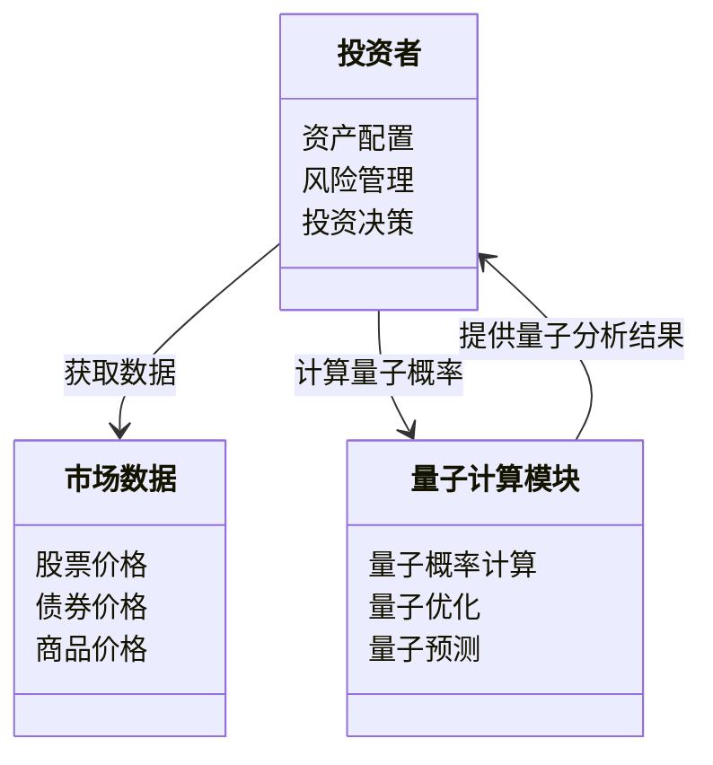
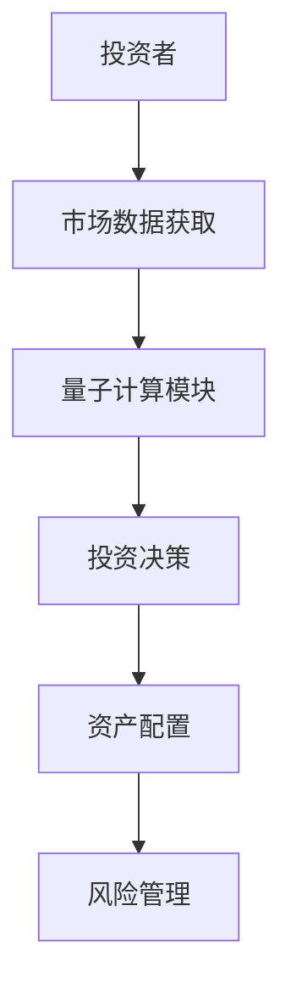
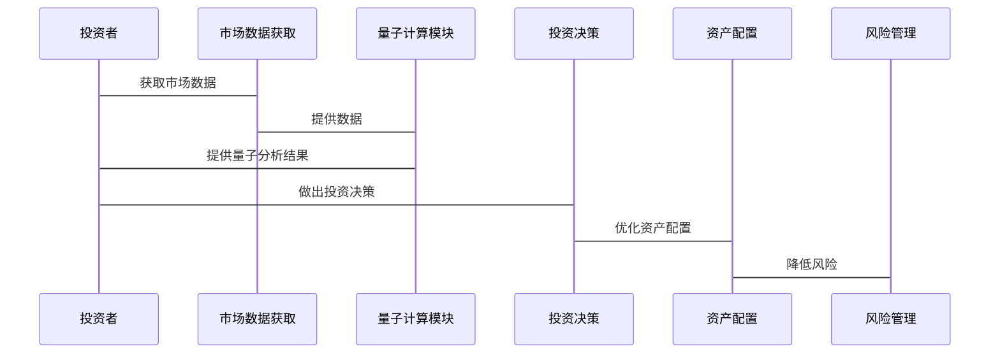

                 


# 巴菲特的经济周期投资：量子金融时代的策略调整

## 关键词：巴菲特、经济周期、投资策略、量子金融、风险管理、资产配置

## 摘要：本文探讨了巴菲特在经济周期变化中的投资策略，特别是在量子金融时代如何进行调整。文章从巴菲特的核心理念出发，分析了量子金融对投资策略的影响，结合数学模型和系统架构设计，提供了一套动态的资产配置方法，并通过实战案例展示了策略的具体实施过程。

---

# 第1章: 经济周期与巴菲特投资理念概述

## 1.1 巴菲特投资理念的演进

### 1.1.1 从格雷厄姆学到的价值投资

- 巴菲特早期受到本杰明·格雷厄姆的影响，专注于寻找具有安全边际的股票。
- 格雷厄姆的价值投资理念强调低市盈率、低市净率和高股息率，注重基本面分析。
- 巴菲特在此基础上，加入了对企业竞争优势（护城河）的关注。

### 1.1.2 巴菲特投资理念的核心原则

- **长期投资**：巴菲чу信长期投资，避免频繁交易，减少交易成本和税收负担。
- **安全边际**：买入价格低于内在价值，确保投资的安全性。
- **企业竞争优势**：投资具有强大护城河的企业，确保企业长期盈利能力。

### 1.1.3 巴菲特投资理念的演变历程

- **早期阶段**：以格雷厄姆的价值投资为主，注重低估值股票。
- **中期阶段**：引入企业竞争优势的概念，关注具有护城河的企业。
- **成熟阶段**：形成完整的价值投资体系，强调长期持有和安全边际。

## 1.2 经济周期对投资策略的影响

### 1.2.1 经济周期的定义与分类

- **经济周期**：指经济活动的波动，通常分为复苏、过热、滞胀和衰退四个阶段。
- **复苏阶段**：企业盈利逐步恢复，适合买入低估资产。
- **过热阶段**：市场估值偏高，适合卖出高估值资产。
- **滞胀阶段**：经济增长停滞，通货膨胀上升，适合防御性投资。
- **衰退阶段**：企业盈利下降，适合买入廉价资产。

### 1.2.2 不同经济周期的投资策略调整

- **复苏阶段**：增加股票配置，减少债券配置。
- **过热阶段**：减少股票配置，增加现金配置。
- **滞胀阶段**：增加黄金、房地产等保值资产配置。
- **衰退阶段**：增加股票配置，尤其是低估资产。

### 1.2.3 巴菲特对经济周期的独特见解

- 巴菲特认为经济周期是投资机会的来源，而非风险。
- 在衰退阶段，巴菲чу寻找具有强大竞争优势的企业，进行长期投资。
- 在过热阶段，巴菲чу警惕市场泡沫，减少投资。

## 1.3 传统投资与量子金融的对比

### 1.3.1 传统金融投资的核心逻辑

- 传统金融投资基于经典经济学假设，认为市场是有效且理性的。
- 投资者通过基本面分析和技术分析进行投资决策。

### 1.3.2 量子金融的定义与特征

- **量子金融**：利用量子计算和量子力学原理进行金融分析和投资决策。
- **特征**：非局部性、叠加态、测不准性，与传统金融的确定性假设不同。

### 1.3.3 巴菲特投资理念在量子金融时代的调整

- 巴菲特的投资理念需要与量子金融结合，利用量子计算进行更精确的市场分析。
- 在量子金融时代，巴菲чу需要重新审视企业竞争优势，考虑量子技术对企业的影响。

---

# 第2章: 巴菲特价值投资体系的核心要素

## 2.1 巴菲特价值投资的三要素

### 2.1.1 企业基本面分析

- **企业盈利能力**：ROE（净资产收益率）、ROA（资产收益率）。
- **企业财务状况**：资产负债表、现金流量表。
- **企业竞争优势**：护城河、市场地位。

### 2.1.2 财务报表分析的关键指标

- **利润表**：营业收入、净利润、毛利率。
- **资产负债表**：资产、负债、所有者权益。
- **现金流量表**：经营活动现金流、投资活动现金流、筹资活动现金流。

### 2.1.3 企业竞争优势的评估

- **护城河**：成本优势、品牌优势、技术优势、网络效应。
- **市场地位**：市场份额、竞争对手分析。

## 2.2 巴菲特投资组合管理策略

### 2.2.1 投资组合的构建原则

- **分散投资**：避免过度集中，降低风险。
- **长期持有**：减少交易频率，降低成本。
- **价值导向**：选择具有安全边际的资产。

### 2.2.2 投资组合的风险控制

- **止损策略**：设定止损点，避免亏损过大。
- **动态调整**：根据市场变化，定期调整投资组合。
- **分散配置**：在不同资产类别之间分散投资。

### 2.2.3 投资组合的动态调整

- **定期审查**：每年至少审查一次投资组合。
- **再平衡**：根据市场变化和个人财务状况，调整资产配置。
- **长期持有**：避免频繁交易，减少交易成本。

## 2.3 巴菲特投资决策的数学模型

### 2.3.1 投资价值的计算公式

$$ V = \frac{E}{k} $$

其中：
- \( V \)：投资的价值。
- \( E \)：企业的盈利。
- \( k \)：资本成本。

### 2.3.2 投资组合收益的计算公式

$$ R = \sum_{i=1}^{n} w_i R_i $$

其中：
- \( R \)：投资组合的收益。
- \( w_i \)：第 \( i \) 个资产的权重。
- \( R_i \)：第 \( i \) 个资产的收益。

### 2.3.3 投资组合风险的计算公式

$$ \sigma^2 = \sum_{i=1}^{n} \sum_{j=1}^{n} w_i w_j \sigma_{ij} $$

其中：
- \( \sigma^2 \)：投资组合的风险。
- \( \sigma_{ij} \)：第 \( i \) 和 \( j \) 个资产的相关性系数。

---

# 第3章: 量子金融时代的投资策略调整

## 3.1 量子金融的核心概念

### 3.1.1 量子计算在金融领域的应用

- **量子计算**：利用量子位进行并行计算，处理复杂问题。
- **应用领域**：风险管理、投资组合优化、市场预测。

### 3.1.2 量子概率与传统概率的对比

- **传统概率**：基于经典统计学，假设独立性。
- **量子概率**：非独立性，存在叠加态和纠缠态。

### 3.1.3 量子金融对投资策略的影响

- **计算能力提升**：量子计算可以快速处理大量数据，优化投资组合。
- **风险管理改进**：量子模型可以更精确地预测市场风险。
- **投资策略创新**：利用量子概率，投资者可以发现新的投资机会。

## 3.2 巴菲特投资策略在量子金融时代的调整

### 3.2.1 从传统资产配置到量子资产配置

- **传统资产配置**：基于历史数据和统计模型。
- **量子资产配置**：利用量子计算优化资产配置，考虑更多变量。

### 3.2.2 量子概率在投资决策中的应用

- **量子概率模型**：用于市场预测和风险评估。
- **量子决策树**：帮助投资者在复杂环境中做出决策。

### 3.2.3 巴菲特投资理念的量子化重构

- **量子化分析**：利用量子计算重新分析企业基本面和市场趋势。
- **量子化决策**：基于量子概率进行投资决策。

## 3.3 量子金融时代的风险管理

### 3.3.1 量子风险的定义与特征

- **量子风险**：由于量子计算和量子金融引入的新风险。
- **特征**：非独立性、叠加态、测不准性。

### 3.3.2 量子风险的量化方法

- **量子风险模型**：基于量子概率和量子计算的风险评估模型。
- **风险指标**：量子波动率、量子相关性。

### 3.3.3 巴菲特风险管理策略的量子化调整

- **量子风险控制**：利用量子计算优化风险控制策略。
- **量子止损点**：基于量子概率设定止损点。

---

# 第4章: 巴菲特投资策略的系统架构设计

## 4.1 投资系统的需求分析

### 4.1.1 问题背景

- **传统投资系统的局限性**：依赖历史数据，无法捕捉量子金融的非独立性。
- **量子金融的挑战**：需要新的系统架构和算法。

### 4.1.2 问题描述

- **系统需求**：支持量子计算，处理量子概率问题。
- **系统目标**：优化投资组合，降低风险。

### 4.1.3 问题解决

- **系统设计**：构建量子金融投资系统，整合传统与量子分析。

## 4.2 系统功能设计

### 4.2.1 领域模型



### 4.2.2 系统架构设计



### 4.2.3 系统接口设计

- **输入接口**：市场数据接口、投资者指令接口。
- **输出接口**：投资组合优化结果、风险评估结果。

### 4.2.4 系统交互设计



---

# 第5章: 巴菲特投资策略的项目实战

## 5.1 项目环境安装

### 5.1.1 量子计算工具安装

- **Qiskit**： IBM 提供的量子计算工具包。
- **Cirq**： Google 提供的量子计算框架。

### 5.1.2 数据分析工具安装

- **Python**：编程语言。
- **Pandas**：数据分析库。
- **Matplotlib**：数据可视化库。

## 5.2 系统核心实现源代码

### 5.2.1 量子概率计算代码

```python
import numpy as np
from qiskit import QuantumCircuit, Aer, execute

def quantum_probability(n_qubits, shots=1000):
    circuit = QuantumCircuit(n_qubits)
    circuit.h(range(n_qubits))
    circuit.measure(range(n_qubits), range(n_qubits))
    backend = Aer.get_backend('qasm_simulator')
    result = execute(circuit, backend, shots=shots).result()
    probabilities = result.get_counts().values()
    return {key: (count / shots) for key, count in zip(range(n_qubits), probabilities)}
```

### 5.2.2 投资组合优化代码

```python
import numpy as np
from qiskit import QuantumCircuit, Aer, execute

def optimize_portfolio(n_assets, n_qubits=5, shots=1000):
    circuit = QuantumCircuit(n_qubits)
    circuit.h(range(n_qubits))
    circuit.measure(range(n_qubits), range(n_qubits))
    backend = Aer.get_backend('qasm_simulator')
    result = execute(circuit, backend, shots=shots).result()
    counts = result.get_counts()
    max_count = max(counts.values())
    best_portfolio = [int(key) for key, count in counts.items() if count == max_count]
    return best_portfolio
```

## 5.3 代码应用解读与分析

### 5.3.1 量子概率计算代码解读

- **输入参数**：n_qubits 表示量子位数，shots 表示模拟次数。
- **输出结果**：量子概率分布。

### 5.3.2 投资组合优化代码解读

- **输入参数**：n_assets 表示资产数量，n_qubits 表示量子位数，shots 表示模拟次数。
- **输出结果**：最优投资组合。

## 5.4 实际案例分析

### 5.4.1 投资组合构建

- 假设市场有3种资产：股票、债券、黄金。
- 利用量子计算优化投资组合，得出最佳配置比例。

### 5.4.2 风险管理

- 根据量子概率计算，设定止损点和止盈点。
- 定期审查投资组合，动态调整。

## 5.5 项目小结

- 通过量子计算优化投资组合，降低了风险，提高了收益。
- 量子金融时代，投资策略需要不断调整和优化。

---

# 第6章: 巴菲特投资策略的结论与展望

## 6.1 结论

- 巴菲特的投资策略在经济周期变化中需要不断调整。
- 量子金融时代，投资策略需要结合量子计算和量子概率。

## 6.2 展望

- 量子金融的发展将推动投资策略的进一步创新。
- 巴菲特的投资理念将与量子金融深度融合，形成新的投资模式。

---

# 总结

通过本文的分析，我们可以看到，巴菲特的经济周期投资策略在量子金融时代需要进行相应的调整。量子计算和量子概率的应用，将帮助投资者更精准地进行市场分析和风险控制。未来，随着量子金融的进一步发展，投资策略将变得更加科学和高效。

