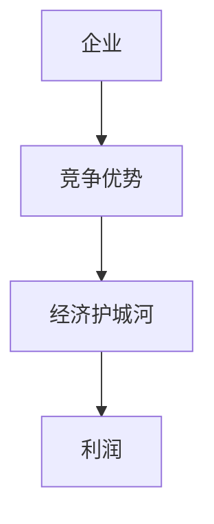
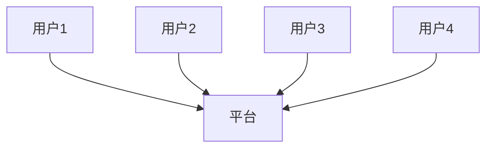
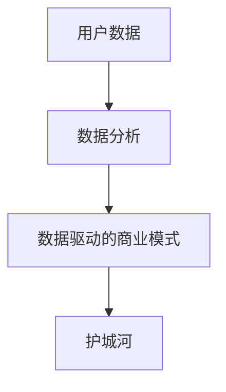
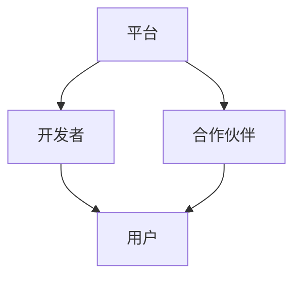

                 

# 巴菲特的经济护城河更新：平台经济时代的竞争优势

> 关键词：巴菲特，经济护城河，平台经济，竞争优势，商业模式，数据驱动，网络效应

> 摘要：本文探讨了巴菲特的经济护城河理论在平台经济时代的演变与应用，分析了平台经济中护城河的新型形式，如数据垄断和网络效应，并提出了构建和管理护城河的新策略。通过结合实际案例和理论分析，本文为企业在平台经济时代如何保持竞争优势提供了深刻的见解。

---

## 第1章：经济护城河的核心概念与背景

### 1.1 经济护城河的定义与特征

经济护城河是巴菲特投资理论中的核心概念，指的是企业所拥有的竞争优势，能够长期抵御竞争对手的侵蚀，并为企业创造超额利润。以下是经济护城河的几个关键特征：

1. **可持续性**：护城河不是一劳永逸的，而是需要持续维护和更新。
2. **防御性**：护城河的本质是防御竞争对手的攻击，而不是主动进攻。
3. **经济价值**：护城河能够为企业的商业模式和利润提供保障。

**图1-1：经济护城河的实体关系图**

经济护城河的构建需要企业具备独特的资源和能力，例如技术优势、品牌影响力和成本优势等。

### 1.2 平台经济的特点与挑战

平台经济是一种基于互联网的商业模式，通过构建平台连接供需双方，形成双边或多边市场。以下是平台经济的特点：

1. **双边市场**：平台同时吸引两个或多个不同的用户群体，例如消费者和商家。
2. **网络效应**：随着用户数量的增加，平台的价值也随之增加。
3. **数据驱动**：平台通过收集和分析用户数据，优化用户体验和商业模式。

**图1-2：平台经济的网络效应**

平台经济的核心竞争优势在于其网络效应和数据垄断能力。然而，平台经济也面临着监管风险和用户隐私问题等挑战。

---

## 第2章：平台经济中的护城河与传统经济的对比

### 2.1 平台经济中的护城河类型

平台经济的护城河类型与传统经济有所不同，以下是几种主要的护城河形式：

1. **网络效应**：用户数量的增加会增强平台的价值，形成正反馈循环。例如，社交媒体平台的用户增长会吸引更多用户加入。
2. **数据驱动的护城河**：平台通过收集和分析用户数据，优化商业模式和用户体验。例如，亚马逊通过用户数据优化其推荐算法。
3. **生态系统护城河**：平台通过构建生态系统，吸引第三方开发者和合作伙伴，形成强大的生态壁垒。例如，苹果的App Store生态系统。
4. **成本优势护城河**：通过规模经济和技术优势降低运营成本，例如亚马逊的物流网络。
5. **品牌忠诚度护城河**：通过品牌影响力和用户体验，吸引用户长期使用平台，例如苹果和特斯拉。

**图2-1：平台经济的护城河类型对比**

| 护城河类型       | 描述                     | 示例平台         |
|------------------|--------------------------|-----------------|
| 网络效应         | 用户数量增加，平台价值提升 | Facebook         |
| 数据驱动         | 数据垄断，优化商业模式   | Google          |
| 生态系统         | 生态壁垒，吸引开发者     | Apple           |
| 成本优势         | 规模经济，降低成本       | Amazon          |
| 品牌忠诚度       | 品牌影响力，用户粘性       | Tesla           |

### 2.2 平台经济护城河与传统经济护城河的对比

平台经济的护城河具有动态性和不确定性，传统经济的护城河则更加静态和可预测。以下是两者的对比：

| 特征           | 传统经济护城河         | 平台经济护城河         |
|----------------|------------------------|------------------------|
| 核心要素       | 技术、品牌、成本优势    | 数据、网络效应、生态系统|
| 动态性         | 较低                   | 较高                   |
| 可持续性       | 较高                   | 较低                   |
| 竞争优势       | 专注于产品和服务         | 专注于用户和数据         |

平台经济的护城河需要企业具备快速适应市场变化的能力，同时注重数据的收集和分析能力。

---

## 第3章：巴菲特护城河理论在平台经济中的应用

### 3.1 巴菲特护城河理论的演变

巴菲特的护城河理论在平台经济时代经历了演变，以下是其主要变化：

1. **从防御到进攻**：传统的护城河主要用于防御竞争对手，而平台经济的护城河需要主动构建和扩大。
2. **从单一到多元**：传统护城河注重单一优势，而平台经济的护城河需要多元化策略，例如数据和网络效应的结合。
3. **从静态到动态**：传统的护城河相对静态，而平台经济的护城河需要动态更新和优化。

### 3.2 平台经济中的新护城河构建

平台经济的护城河构建需要企业具备以下能力：

1. **数据垄断**：通过收集和分析用户数据，构建数据壁垒。
2. **网络效应**：通过吸引更多的用户，增强平台的网络效应。
3. **技术创新**：通过技术优势，保持平台的核心竞争力。

**图3-1：数据垄断与护城河的构建**

数据垄断是平台经济中最重要的护城河之一，企业需要通过技术创新和用户体验优化，增强数据收集和分析能力。

---

## 第4章：平台经济中的商业模式创新与护城河

### 4.1 平台经济的商业模式创新

平台经济的商业模式创新是护城河构建的重要部分，以下是几种常见的商业模式创新：

1. **免费模式**：通过免费服务吸引用户，通过广告或增值服务盈利。例如，Google的搜索服务免费，通过广告盈利。
2. **双边市场**：同时吸引两个或多个不同的用户群体，例如滴滴出行吸引司机和乘客。
3. **长尾经济**：通过服务小众市场，形成差异化竞争优势。例如，亚马逊通过长尾书市场获得竞争优势。

### 4.2 护城河与平台生态系统的构建

平台生态系统是护城河的重要组成部分，以下是其构建的关键要素：

1. **生态系统的设计**：平台需要设计合理的生态系统，吸引第三方开发者和合作伙伴。
2. **生态系统的管理**：平台需要通过规则和激励机制，管理生态系统中的各方参与者。
3. **生态系统的扩展**：平台需要不断扩展生态系统，增强其竞争力。

**图4-1：平台生态系统的构建**

平台生态系统的核心是通过多方参与，形成强大的生态壁垒。

---

## 第5章：护城河的构建与管理策略

### 5.1 护城河的构建策略

护城河的构建需要企业具备以下策略：

1. **数据资产的管理**：企业需要通过数据收集、分析和利用，构建数据壁垒。
2. **网络效应的放大**：通过吸引更多的用户，增强平台的网络效应。
3. **技术创新的驱动**：通过技术创新，保持平台的核心竞争力。

### 5.2 护城河的动态管理

护城河的管理需要企业具备动态调整的能力，以下是其管理的关键点：

1. **护城河的维护与更新**：企业需要定期维护和更新护城河，确保其持续有效。
2. **护城河的扩展与延伸**：企业需要通过扩展和延伸护城河，增强其竞争力。
3. **护城河的风险管理**：企业需要通过风险管理，降低护城河被破坏的风险。

---

## 第6章：平台经济中的护城河与未来趋势

### 6.1 平台经济的未来趋势

平台经济的未来趋势是数据驱动和技术创新，以下是其主要方向：

1. **技术驱动的护城河**：通过人工智能和大数据技术，构建更强大的护城河。
2. **数字化转型**：企业需要通过数字化转型，增强其平台经济的竞争力。
3. **全球化竞争**：平台经济的全球化竞争将更加激烈，企业需要具备全球化的视野和能力。

### 6.2 护城河的未来挑战与机遇

护城河的未来面临以下挑战与机遇：

1. **技术变革的挑战**：技术变革可能削弱现有的护城河，企业需要具备快速适应能力。
2. **监管环境的影响**：监管政策的变化可能影响护城河的构建和管理。
3. **用户需求的变化**：用户需求的变化可能影响护城河的有效性，企业需要具备灵活应对能力。

---

## 第7章：总结与展望

平台经济时代的经济护城河需要企业具备数据驱动和网络效应的能力，同时注重生态系统和技术创新。通过构建和管理护城河，企业可以在平台经济时代保持竞争优势。未来，随着技术的不断发展和市场的变化，护城河的构建和管理将面临更多的挑战和机遇。

---

* 如果您觉得这个内容对您有帮助，可以点赞支持，我会继续创作更多优质内容。

