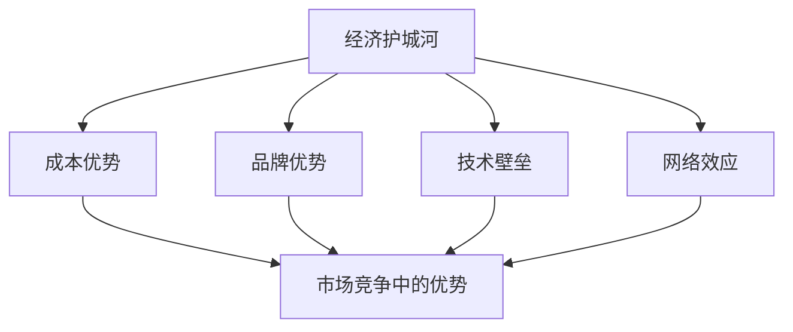
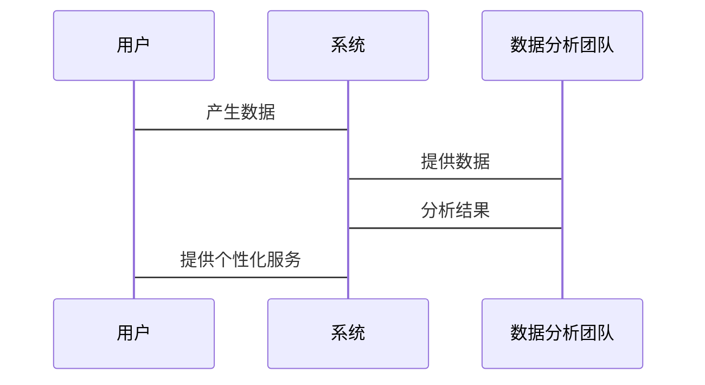

                 

# 巴菲特的经济护城河更新：数字时代的竞争优势

## 关键词
- 巴菲特经济护城河
- 数字时代
- 竞争优势
- 数据资产
- 技术创新
- 网络效应

## 摘要
本文探讨了巴菲特经济护城河在数字时代的演变，分析了数据和技术对企业竞争优势的影响，详细阐述了数字企业如何构建和强化护城河，并通过实际案例展示了护城河的评估与优化策略。文章从传统经济护城河的概念出发，结合数字时代的特点，分析了护城河的新要素和新策略，为投资者和企业管理者提供了在数字环境中构建和维护竞争优势的深度见解。

---

# 巴菲特的经济护城河更新：数字时代的竞争优势

## 第1章：经济护城河的核心概念

### 1.1 经济护城河的定义与背景

经济护城河是巴菲特投资理论中的核心概念，指的是企业能够长期保持竞争优势的结构性特征。这种优势使得企业能够在竞争中抵御竞争对手的侵蚀，从而实现超额利润。护城河的构建依赖于企业的独特资源、技术优势、品牌影响力和市场进入壁垒。

**核心要素对比表**

| 要素       | 描述                                             |
|------------|--------------------------------------------------|
| 成本优势   | 企业以更低的成本生产产品或服务，竞争对手难以复制 |
| 品牌优势   | 强大的品牌认知度和用户忠诚度，形成市场壁垒       |
| 技术壁垒   | 独特的技术或专利，难以被竞争对手复制             |
| 网络效应   | 用户数量的增加使平台更有价值，形成正反馈循环     |

**Mermaid流程图：护城河结构**

### 1.2 护城河的核心要素

#### 1.2.1 成本优势

成本优势是护城河的重要组成部分，企业通过规模经济、垂直整合或技术创新降低成本，从而在价格竞争中占据优势。

#### 1.2.2 品牌优势

强大的品牌能够吸引客户并建立忠诚度，形成市场进入壁垒。品牌优势在消费品行业尤为重要。

#### 1.2.3 技术壁垒

技术壁垒通过专利、专有技术或复杂的生产工艺，阻止竞争对手进入市场。

#### 1.2.4 网络效应

网络效应指用户数量的增加使平台更具价值，例如社交网络或操作系统。

### 1.3 护城河的边界与外延

护城河的边界在于其可持续性和难以复制性。外延则包括企业如何利用护城河在不同市场和产品中扩展优势。

### 1.4 护城河的结构与组成

护城河的结构包括核心竞争力、可持续性和难以复制性。核心竞争力是护城河的基础，而可持续性和难以复制性确保其长期有效性。

---

## 第2章：数字时代的竞争优势

### 2.1 数字时代的特点

数字时代的特点包括数据的重要性、技术驱动的创新和平台经济的崛起。

#### 2.1.1 数据的重要性

数据是数字时代的新型资产，企业通过收集和分析数据，优化运营和决策。

#### 2.1.2 技术驱动的创新

技术创新速度加快，企业需要不断投入研发以保持竞争优势。

#### 2.1.3 平台经济的崛起

平台模式通过连接供需双方，形成网络效应，增强竞争优势。

### 2.2 数字时代的竞争优势

#### 2.2.1 数据资产

数据资产是数字时代的经济护城河，企业通过数据驱动的决策和个性化服务，提升竞争力。

#### 2.2.2 技术创新

技术创新如人工智能和大数据分析，成为企业构建护城河的关键因素。

#### 2.2.3 用户粘性

通过个性化体验和无缝服务，企业增强用户粘性，形成持续竞争优势。

### 2.3 传统护城河的转变

#### 2.3.1 从成本优势到数据优势

企业不再仅依赖成本优势，而是通过数据优化运营和产品。

#### 2.3.2 从品牌优势到用户忠诚度

品牌优势演变为通过数据驱动的个性化服务提升用户忠诚度。

#### 2.3.3 从技术壁垒到生态系统

技术壁垒扩展为生态系统，通过平台和合作伙伴构建更广泛的护城河。

---

## 第3章：数字企业的护城河构建

### 3.1 数据资产的积累与利用

#### 3.1.1 数据的收集与分析

企业通过收集用户行为数据，利用大数据分析优化产品和服务。

#### 3.1.2 数据驱动的决策

数据驱动的决策使企业能够快速响应市场变化，提升效率。

#### 3.1.3 数据安全与隐私

数据安全是数据资产保护的关键，企业需遵守数据隐私法规。

**Mermaid序列图：数据驱动决策流程**

### 3.2 技术壁垒的建立

#### 3.2.1 人工智能与大数据技术

人工智能和大数据技术提升企业自动化水平，优化决策过程。

#### 3.2.2 云计算与SaaS模式

云计算和软件即服务（SaaS）模式提供弹性和高效的IT基础设施，支持业务扩展。

#### 3.2.3 开放平台与生态系统

开放平台吸引合作伙伴，构建生态系统，增强竞争力。

### 3.3 网络效应的强化

#### 3.3.1 用户增长与网络效应

用户数量的增加使平台更具价值，形成正反馈循环。

#### 3.3.2 社交媒体与用户互动

通过社交媒体增强用户互动，提升品牌影响力和用户粘性。

#### 3.3.3 平台经济与双边市场

平台连接供需双方，通过双边市场效应扩大护城河。

---

## 第4章：护城河的评估与优化

### 4.1 护城河的评估指标

评估护城河的强弱需要考虑市场地位、盈利能力、可持续性和用户粘性等指标。

#### 4.1.1 市场地位

企业在市场中的份额和影响力是评估护城河的重要指标。

#### 4.1.2 盈利能力

盈利能力反映了护城河的有效性，高盈利能力表明企业能够持续创造价值。

#### 4.1.3 可持续性

护城河的可持续性取决于其适应市场变化和技术创新的能力。

### 4.2 护城河的动态评估

动态评估需要考虑行业变化、竞争对手策略和技术进步的影响。

#### 4.2.1 行业变化的影响

行业趋势和技术进步会改变护城河的有效性，企业需要及时调整。

#### 4.2.2 竞争对手的动态

竞争对手的创新和进入策略会影响企业的市场地位。

#### 4.2.3 技术进步的冲击

技术进步可能导致原有护城河失效，企业需要不断创新。

---

## 第5章：数字企业与传统企业护城河的对比

### 5.1 数字企业的护城河特点

数字企业的护城河依赖于数据和技术，具有更强的动态性和扩展性。

### 5.2 传统企业的护城河特点

传统企业护城河主要依赖于成本和品牌，但在数字时代面临挑战。

### 5.3 传统企业向数字企业转型的挑战

传统企业需要适应数字时代的变化，构建新的护城河。

---

## 第6章：护城河的未来展望

### 6.1 新兴技术的影响

人工智能、区块链等新兴技术将进一步改变企业的竞争优势。

### 6.2 全球化与本地化

全球化市场需要企业具备全球视野和本地化策略。

### 6.3 可持续性与社会责任

可持续发展和社会责任将影响企业的长期竞争优势。

---

## 第7章：结论与建议

### 7.1 总结

数字时代，护城河的构建需要结合数据和技术，企业需要不断创新和适应变化。

### 7.2 建议

- 投资于数据和技术基础设施。
- 建立开放平台，吸引合作伙伴。
- 关注用户需求，增强用户粘性。
- 动态评估护城河，及时调整策略。

### 7.3 展望

随着技术进步和市场变化，护城河的构建将更加复杂，企业需要保持灵活性和创新性。

---

## 参考文献

- 巴菲特，沃伦。《巴菲特致股东的信》
- 市场分析相关书籍和报告
- 数字经济相关研究论文

---

通过以上结构，文章详细探讨了巴菲特的经济护城河在数字时代的演变，分析了数据和技术对企业竞争优势的影响，并通过实际案例展示了护城河的构建与优化策略。希望这篇文章能为投资者和企业管理者提供在数字环境中构建和维护竞争优势的深度见解。

