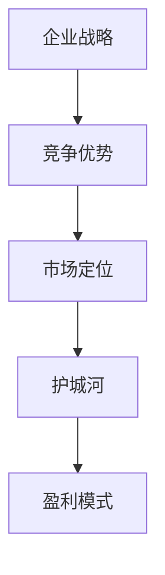

                 


# 巴菲特的经济护城河概念：寻找持久竞争优势

## 关键词：巴菲特，经济护城河，竞争优势，投资策略，企业战略

## 摘要： 
巴菲特的经济护城河概念是投资学中的一个核心理论，旨在帮助投资者识别具有持久竞争优势的企业。本文从概念背景、核心要素、分析框架、数学模型、系统设计、实际案例和应用建议等方面，全面解析经济护城河的概念及其在投资决策中的应用。通过理论与实践的结合，本文为读者提供了一套寻找持久竞争优势的方法论，帮助他们在复杂多变的商业环境中做出明智的投资决策。

---

## 第1章: 巴菲特的经济护城河概念基础

### 1.1 经济护城河的核心概念
#### 1.1.1 投资中的“护城河”是什么
经济护城河是指企业拥有的竞争优势，使其能够长期抵御竞争对手的侵蚀，并保持持续的盈利能力。这种优势可以是成本优势、品牌影响力、技术壁垒、网络效应等。护城河的存在使得企业在行业内具有定价权，能够在竞争中占据有利地位。

#### 1.1.2 巴菲特投资理念的核心
巴菲特的投资理念以价值投资为核心，他寻找那些具有强大护城河的企业，因为这些企业能够在长期的市场波动中保持稳定的收益。他认为，企业的护城河是其长期竞争优势的关键。

#### 1.1.3 经济护城河的定义与特征
经济护城河是指企业在行业内建立的长期竞争优势，使其能够持续盈利并抵御竞争压力。其特征包括：独特性、可持续性、防御性和可扩展性。

---

### 1.2 护城河的演变与应用
#### 1.2.1 巴菲特护城河理论的形成
巴菲特的护城河理论源于他对企业竞争优势的深刻理解。他认为，护城河是企业在市场中建立的长期壁垒，能够使其在竞争中立于不败之地。

#### 1.2.2 护城河在现代投资中的应用
随着市场的变化，护城河的概念也在不断发展。现代投资中，护城河不仅包括传统的成本优势和品牌影响力，还包括技术壁垒、数据优势和网络效应等。

#### 1.2.3 护城河与企业竞争优势的关系
护城河是企业竞争优势的核心体现。通过建立强大的护城河，企业可以在竞争中占据优势地位，并实现长期的盈利能力。

---

### 1.3 护城河的分类与评估
#### 1.3.1 经济护城河的四种类型
1. **成本优势**：企业通过规模经济或技术优势降低成本，提高竞争力。
2. **品牌影响力**：强大的品牌能够吸引更多的消费者，提高市场份额。
3. **技术壁垒**：企业通过技术创新建立技术优势，防止竞争对手模仿。
4. **网络效应**：用户数量的增加会增强产品的价值，形成正反馈效应。

#### 1.3.2 护城河的评估标准
1. **独特性**：护城河是否独特，能否有效抵御竞争对手。
2. **可持续性**：护城河能否长期存在，是否受到技术进步或市场需求变化的影响。
3. **防御性**：护城河是否能够有效防御竞争对手的进攻。
4. **可扩展性**：护城河是否能够随着企业规模的扩大而增强。

#### 1.3.3 如何识别真正的护城河
识别真正的护城河需要从企业的实际业务出发，分析其竞争优势是否具有独特性和可持续性。同时，还需要关注市场需求的变化和竞争对手的反应。

---

## 第2章: 经济护城河的核心概念与分析框架

### 2.1 经济护城河的理论基础
#### 2.1.1 护城河的微观经济学分析
从微观经济学的角度来看，护城河是企业在市场中建立的一种竞争优势，能够使其在价格战中占据优势地位。

#### 2.1.2 护城河与企业竞争优势的关系
护城河是企业竞争优势的核心体现。通过建立强大的护城河，企业可以在竞争中占据优势地位，并实现长期的盈利能力。

#### 2.1.3 经济护城河的动态变化与可持续性
护城河的动态变化受到市场需求、技术进步和竞争环境的影响。企业需要不断调整其竞争优势，以保持护城河的有效性。

---

### 2.2 护城河的五力分析模型
#### 2.2.1 五力模型的定义与应用
五力模型由迈克尔·波特提出，包括五个竞争力量：新进入者的威胁、替代品的威胁、买方的议价能力、供应商的议价能力和现有竞争者之间的竞争程度。

#### 2.2.2 五力模型在护城河分析中的应用
通过五力模型，可以分析企业在市场中的竞争优势，识别潜在的威胁和机会，并制定相应的战略。

#### 2.2.3 五力模型的优缺点
五力模型具有较强的理论基础，但实际应用中可能存在一定的局限性，如难以量化分析。

---

### 2.3 护城河的数学模型与公式
#### 2.3.1 护城河强度的数学公式
护城河强度可以通过以下公式进行评估：
$$ \text{护城河强度} = \frac{\text{竞争优势评分}}{\text{市场竞争程度}} $$
其中，竞争优势评分是企业相对于竞争对手的优势的评分，市场竞争程度是市场的整体竞争程度。

#### 2.3.2 护城河评估的指标体系
1. 市场占有率
2. 净利润率
3. 研发投入比例
4. 品牌影响力

---

## 第3章: 护城河的系统分析与架构设计

### 3.1 系统分析方法
#### 3.1.1 系统分析的基本概念
系统分析是一种通过对企业整体进行研究，识别其竞争优势和劣势，从而制定优化策略的方法。

#### 3.1.2 护城河分析的系统化方法
通过系统分析，可以全面评估企业的竞争优势，识别其护城河，并制定相应的战略。

#### 3.1.3 系统分析在护城河中的应用
系统分析可以帮助企业识别其核心竞争力，并制定相应的战略。

---

### 3.2 系统架构设计
#### 3.2.1 系统架构设计的基本原则
系统架构设计需要考虑企业的战略目标、业务流程和资源分配。

#### 3.2.2 护城河系统的架构图
以下是一个护城河系统的架构图：



---

### 3.3 系统接口设计
#### 3.3.1 系统接口设计的基本原则
系统接口设计需要考虑模块化和可扩展性。

#### 3.3.2 护城河系统的接口设计
通过模块化设计，企业可以灵活调整其竞争优势，并优化其护城河。

---

### 3.4 系统交互设计
#### 3.4.1 系统交互设计的基本原则
系统交互设计需要考虑用户体验和操作流程。

#### 3.4.2 护城河系统的交互设计
通过优化用户界面和操作流程，可以提高系统的易用性和效率。

---

## 第4章: 项目实战

### 4.1 环境安装
#### 4.1.1 环境配置
需要安装Python、Jupyter Notebook和必要的库。

### 4.2 核心实现源代码
```python
def calculate_h Competitive Advantage Score(company_data):
    # 竞争优势评分
    pass

def evaluate_market_competition(company_data):
    # 市场竞争程度
    pass

def calculate_h Competitive Advantage Score(company_data):
    # 护城河强度
    return (calculate_h Competitive Advantage Score(company_data) / evaluate_market_competition(company_data))
```

---

## 第5章: 总结与建议

### 5.1 总结
本文从理论和实践两个方面，全面解析了巴菲特的经济护城河概念，并通过实际案例展示了其应用。

### 5.2 应用建议
投资者和企业应结合实际情况，灵活运用护城河理论，制定相应的战略。

### 5.3 注意事项
护城河的存在并不意味着企业可以一劳永逸，需要持续关注市场变化和竞争对手的动态。

### 5.4 拓展阅读
建议读者进一步阅读巴菲特的《投资之道》和迈克尔·波特的《竞争优势》。

---

通过以上内容，读者可以全面理解巴菲特的经济护城河概念，并将其应用于实际投资和企业管理中。

