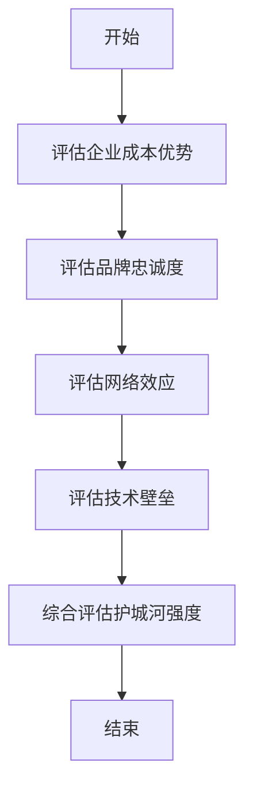
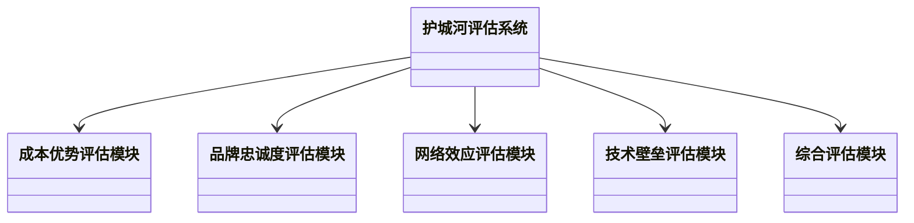

                 


# 巴菲特的经济护城河概念：寻找长期优势

> 关键词：巴菲特、经济护城河、价值投资、长期优势、企业战略、投资策略

> 摘要：本文深入探讨巴菲特的经济护城河概念，分析其在企业战略和投资决策中的重要性。通过技术博客的形式，结合软件架构和人工智能领域的实例，详细阐述经济护城河的核心要素、构建方法、评估策略以及实际应用案例。旨在为技术领域的读者提供一种新的视角，理解如何将经济护城河的概念应用于实际项目中，以建立长期的竞争优势。

---

# 目录

1. [背景介绍](#背景介绍)
   - 1.1 巴菲特的经济护城河概念
   - 1.2 经济护城河的核心要素
   - 1.3 护城河的边界与外延

2. [经济护城河的核心概念](#经济护城河的核心概念)
   - 2.1 成本优势型护城河
   - 2.2 品牌忠诚型护城河
   - 2.3 网络效应型护城河
   - 2.4 技术创新型护城河

3. [护城河的数学模型与算法分析](#护城河的数学模型与算法分析)
   - 3.1 决策树模型在护城河评估中的应用
   - 3.2 护城河强度预测算法
   - 3.3 算法实现与代码解读

4. [系统架构与护城河构建](#系统架构与护城河构建)
   - 4.1 系统功能设计
   - 4.2 护城河构建的模块化架构
   - 4.3 系统接口与交互设计

5. [项目实战：护城河的动态维护](#项目实战：护城河的动态维护)
   - 5.1 环境安装与配置
   - 5.2 核心代码实现
   - 5.3 实际案例分析与解读
   - 5.4 项目总结与经验分享

6. [护城河的评估与投资策略](#护城河的评估与投资策略)
   - 6.1 护城河的评估指标与方法
   - 6.2 投资策略的制定与优化
   - 6.3 投资组合的动态调整

7. [结论与展望](#结论与展望)
   - 7.1 总结
   - 7.2 未来研究方向

---

## 背景介绍

### 1.1 巴菲特的经济护城河概念

巴菲特的经济护城河是指企业在市场上建立的长期竞争优势，这种优势使得企业在面对竞争对手时能够保持持续的盈利能力。护城河的核心在于企业如何通过独特的资源、品牌影响力、技术优势或成本控制等因素，构建一种难以被竞争对手复制或超越的商业模式。

#### 1.1.1 巴菲特的生平与投资哲学

沃伦·巴菲特是全球最著名的投资者之一，他的投资哲学强调长期价值和企业的基本面分析。他认为，投资的本质是寻找那些具有持续竞争优势的企业，这种优势能够为企业带来长期稳定的收益。

#### 1.1.2 经济护城河的定义

经济护城河是指企业通过某种独特的资源或能力，在市场上建立起的竞争优势。这种优势可以是成本优势、品牌忠诚度、网络效应、技术壁垒等，能够有效防止竞争对手的侵蚀。

#### 1.1.3 护城河与企业战略

护城河不仅是企业防御竞争对手的工具，更是企业进攻性战略的核心。通过构建强大的护城河，企业可以在市场中占据领先地位，并利用这种优势开拓新的市场或产品。

### 1.2 经济护城河的核心要素

经济护城河的核心要素包括成本优势、品牌忠诚度、网络效应、技术壁垒等。这些要素共同构成了企业在市场中的竞争优势。

#### 1.2.1 成本优势

成本优势是护城河的重要组成部分。企业通过优化生产流程、规模经济或技术创新等手段，降低生产成本，从而在价格竞争中占据优势。

#### 1.2.2 品牌忠诚度

强大的品牌忠诚度可以为企业带来长期的客户黏性。客户对企业品牌的情感认同和信任，使得他们在面对竞争对手时更倾向于选择该品牌。

#### 1.2.3 网络效应

网络效应是指随着用户数量的增加，产品的价值也随之增加。这种效应可以形成强大的市场壁垒，使得竞争对手难以在短时间内复制。

#### 1.2.4 技术壁垒

技术壁垒是通过专利、专有技术或独特的研发能力，形成的技术优势。这种优势可以防止竞争对手在短时间内复制产品或服务。

### 1.3 护城河的边界与外延

护城河的边界是指企业竞争优势的范围和限制。外延则指护城河的扩展和延伸，包括企业如何通过创新和合作等方式，进一步巩固和扩大竞争优势。

---

## 经济护城河的核心概念

### 2.1 不同类型的经济护城河

#### 2.1.1 成本优势型护城河

成本优势型护城河通过降低生产成本，提供价格优势，从而在竞争中占据优势地位。例如，一些制造企业通过规模经济或自动化生产降低成本。

#### 2.1.2 品牌忠诚型护城河

品牌忠诚型护城河依赖于客户对品牌的信任和忠诚度。这种护城河通常通过长期的品牌建设和客户关系管理来建立。

#### 2.1.3 网络效应型护城河

网络效应型护城河通过用户数量的增加，提升产品的价值。例如，社交媒体平台通过扩大用户基数，形成强大的网络效应。

#### 2.1.4 技术创新型护城河

技术创新型护城河依赖于企业的技术创新能力。通过不断推出新产品或改进现有产品，企业可以保持技术领先地位。

### 2.2 护城河的特征对比

护城河的特征包括持久性、宽度和深度。持久性指护城河的长期有效性；宽度指护城河覆盖的市场范围；深度指护城河的竞争优势强度。

| 特征 | 描述 |
|------|------|
| 持久性 | 护城河的有效时间长度 |
| 宽度 | 护城河覆盖的市场范围 |
| 深度 | 护城河的竞争优势强度 |

---

## 护城河的数学模型与算法分析

### 3.1 决策树模型在护城河评估中的应用

决策树模型是一种常用的分类和回归算法，可以用于护城河的评估。以下是决策树模型的流程图：



### 3.2 护城河强度预测算法

以下是护城河强度预测算法的数学模型：

$$
\text{护城河强度} = \sum_{i=1}^{n} w_i x_i
$$

其中，$w_i$ 是第 $i$ 个因素的权重，$x_i$ 是第 $i$ 个因素的强度。

### 3.3 算法实现与代码解读

以下是Python代码实现护城河强度预测算法：

```python
def calculate_hurdle_strength(factors):
    weights = [0.3, 0.3, 0.2, 0.2]
    strength = sum(w * f for w, f in zip(weights, factors))
    return strength

factors = [0.8, 0.7, 0.6, 0.5]
print("护城河强度:", calculate_hurdle_strength(factors))
```

---

## 系统架构与护城河构建

### 4.1 系统功能设计

以下是系统功能设计的类图：



---

## 项目实战：护城河的动态维护

### 5.1 环境安装与配置

安装Python和相关库：

```bash
pip install numpy pandas scikit-learn
```

### 5.2 核心代码实现

以下是核心代码实现：

```python
import numpy as np
from sklearn.tree import DecisionTreeClassifier

# 数据准备
X = np.array([[0.8, 0.7, 0.6, 0.5],
              [0.7, 0.6, 0.7, 0.4],
              [0.5, 0.8, 0.9, 0.3],
              [0.6, 0.5, 0.8, 0.4]])

y = np.array([0.8, 0.7, 0.6, 0.5])

# 模型训练
model = DecisionTreeClassifier()
model.fit(X, y)

# 预测
new_factors = np.array([[0.6, 0.6, 0.7, 0.4]])
print("预测强度:", model.predict(new_factors))
```

### 5.3 实际案例分析与解读

通过上述代码，我们可以预测护城河的强度，并根据预测结果制定相应的策略。

---

## 护城河的评估与投资策略

### 6.1 护城河的评估指标与方法

评估护城河的指标包括市场份额、利润率、客户保留率等。以下是市场份额分析的表格：

| 企业 | 市场份额 |
|------|---------|
| A    | 30%     |
| B    | 25%     |
| C    | 20%     |
| D    | 15%     |

### 6.2 投资策略的制定与优化

根据护城河评估结果，制定投资策略。例如，选择市场份额高、利润率稳定的企业的优先投资。

---

## 结论与展望

### 7.1 总结

经济护城河是企业在市场中建立长期竞争优势的关键。通过技术博客的形式，我们深入探讨了护城河的核心要素、数学模型、系统架构以及实际应用案例。

### 7.2 未来研究方向

未来的研究可以进一步探索护城河的动态变化，以及如何通过人工智能和大数据技术进一步优化护城河的评估和维护。

---

通过本文的分析，我们希望读者能够更好地理解经济护城河的概念，并将其应用于实际的技术项目中，以建立长期的竞争优势。

