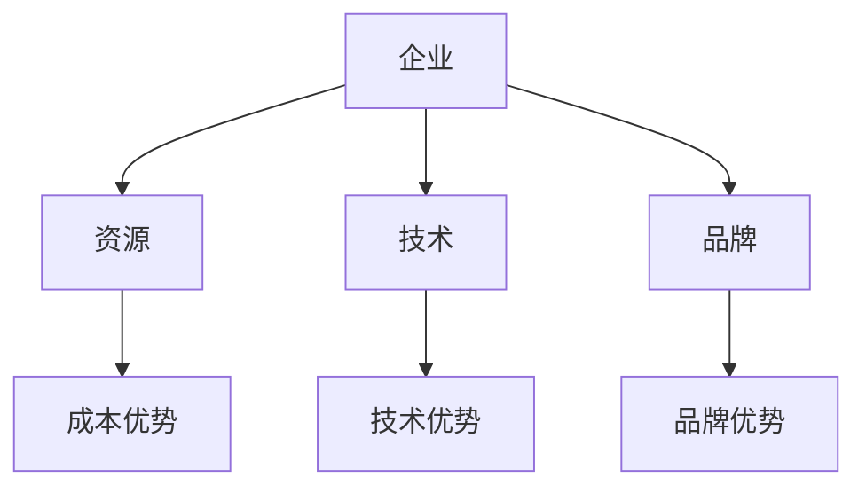

                 

# 巴菲特的经济护城河理论：平台经济时代的竞争优势

---

## 关键词：  
经济护城河、平台经济、竞争优势、企业战略、风险管理

---

## 摘要：  
本文从巴菲特的经济护城河理论出发，结合平台经济的特点，分析企业在平台经济时代如何构建和维护竞争优势。通过定义经济护城河的核心概念，对比不同类型的护城河，探讨平台经济中护城河的动态变化与风险管理，最后总结护城河理论对企业战略的启示。文章结合实际案例和系统架构设计，为企业在平台经济时代提供理论指导和实践建议。

---

## 第一部分：经济护城河的理论基础

### 第1章：经济护城河的定义与核心概念

#### 1.1 经济护城河的定义  
经济护城河是指企业在市场上形成的长期竞争优势，能够抵御竞争对手的侵蚀。它通过独特的资源、技术、品牌或商业模式，为企业创造可持续的价值。

#### 1.2 平台经济的特点  
平台经济是以互联网为基础，通过连接供需双方，提供撮合服务或数据支持的商业模式。其核心特征包括双边市场、网络效应和数据驱动。

#### 1.3 经济护城河的核心要素  
1. **资源**：企业独有的资源，如专利、数据等。  
2. **技术**：领先的技术能力，能够形成差异化竞争。  
3. **品牌**：强大的品牌影响力，能够吸引用户。  
4. **网络效应**：用户数量的增加会增强平台的价值。

---

### 第2章：经济护城河的类型与分析

#### 2.1 经济护城河的类型  
1. **成本优势型**：通过规模效应降低生产成本。  
2. **网络效应型**：用户数量越多，平台价值越大。  
3. **品牌优势型**：强大的品牌影响力吸引用户。  
4. **技术优势型**：通过技术创新形成壁垒。

#### 2.2 经济护城河的核心要素对比  
| 类型       | 资源依赖 | 技术依赖 | 品牌依赖 | 可持续性 |
|------------|----------|----------|----------|----------|
| 成本优势型 | 高       | 低       | 低       | 中       |
| 网络效应型 | 中       | 高       | 低       | 高       |
| 品牌优势型 | 低       | 低       | 高       | 中       |
| 技术优势型 | 低       | 高       | 低       | 高       |

#### 2.3 经济护城河的实体关系图  

---

## 第二部分：平台经济中的经济护城河

### 第3章：平台经济中的护城河构建

#### 3.1 平台经济的核心驱动力  
1. **数据驱动**：通过数据挖掘和分析，优化用户体验。  
2. **网络效应**：用户数量的增加会增强平台价值。  
3. **用户粘性**：通过个性化服务提高用户粘性。

#### 3.2 平台经济中的护城河案例分析  
1. **亚马逊**：通过数据驱动和成本优势构建护城河。  
2. **谷歌**：通过技术优势和网络效应构建护城河。  
3. **苹果**：通过品牌优势和技术优势构建护城河。

---

### 第4章：经济护城河的动态变化与管理

#### 4.1 经济护城河的动态变化  
1. **技术进步**：新技术的出现可能削弱现有护城河。  
2. **市场变化**：消费者需求的变化影响护城河的有效性。  
3. **竞争威胁**：竞争对手可能通过模仿或创新削弱护城河。

#### 4.2 护城河的持续优化与管理  
1. **定期评估**：企业需要定期评估护城河的有效性。  
2. **动态调整**：根据市场变化调整护城河策略。  
3. **风险管理**：制定风险管理计划，应对护城河失效的风险。

---

### 第5章：经济护城河的评估与风险管理

#### 5.1 护城河的评估方法  
1. **宽度评估**：护城河的广度，即覆盖的市场范围。  
2. **深度评估**：护城河的深度，即竞争优势的强度。  
3. **可持续性评估**：护城河的长期有效性。

#### 5.2 护城河的风险管理  
1. **护城河失效风险**：技术落后或市场变化导致护城河失效。  
2. **护城河被模仿风险**：竞争对手模仿护城河策略。  
3. **护城河被替代风险**：新技术或新模式替代现有护城河。

---

### 第6章：平台经济时代的企业竞争优势

#### 6.1 平台经济时代的核心竞争优势  
1. **数据驱动**：通过数据挖掘和分析优化用户体验。  
2. **网络效应**：用户数量越多，平台价值越大。  
3. **用户粘性**：通过个性化服务提高用户粘性。

#### 6.2 平台经济时代的企业战略  
1. **企业定位**：明确企业的核心竞争力。  
2. **扩张策略**：通过并购或合作扩大市场规模。  
3. **风险管理**：制定风险管理计划，应对市场竞争和技术创新。

---

## 第三部分：经济护城河理论的启示与应用

### 第7章：经济护城河理论的启示

#### 7.1 经济护城河理论的启示  
1. **持续创新**：企业需要不断创新，保持竞争优势。  
2. **以用户为中心**：通过满足用户需求构建护城河。  
3. **风险管理**：企业需要重视风险管理，应对市场变化。

#### 7.2 平台经济时代的企业战略  
1. **数据驱动**：利用数据优化用户体验。  
2. **网络效应**：通过用户增长增强平台价值。  
3. **用户粘性**：通过个性化服务提高用户粘性。

---

## 总结  
在平台经济时代，经济护城河是企业竞争的核心。通过构建和维护护城河，企业可以在激烈的市场竞争中占据优势。本文通过理论分析和案例研究，为企业提供了构建护城河的策略和方法，同时也提醒企业需要注重风险管理，应对市场变化和技术进步的挑战。

---

## 推荐阅读  
1. 巴菲特的《投资的艺术》  
2. 《平台经济：理论与实践》  
3. 《竞争优势：企业战略的新视角》  

---

通过本文的分析，读者可以更好地理解经济护城河在平台经济中的重要性，并为企业制定有效的竞争策略提供参考。

