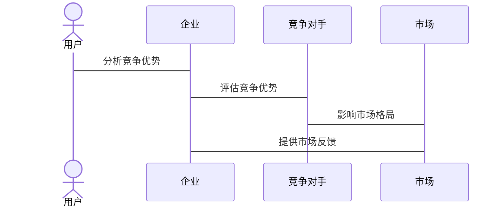

                 


# 巴菲特的经济护城河理论：持久竞争优势的来源

## 关键词：巴菲特，经济护城河，竞争优势，投资策略，企业战略，系统分析

## 摘要：  
本文深入探讨了巴菲特的经济护城河理论，分析了企业如何通过构建持久的竞争优势来实现长期成功。文章从理论背景、核心要素、构建方法、系统分析、项目实战等多个维度展开，结合技术语言和专业方法，为读者提供了一套完整的分析框架。通过详细的技术分析、案例研究和系统设计，本文为投资者和企业管理者提供了实用的决策工具和策略建议。

---

## 第一部分: 巴菲特的经济护城河理论基础

### 第1章: 巴菲特投资理念与经济护城河概述

#### 1.1 巴菲特投资理念的核心思想

- **1.1.1 巴菲特的长期投资哲学**
  - 巴菲特强调长期投资和价值投资，认为市场的短期波动不应影响长期投资决策。
  - 投资的本质是寻找具有持续竞争优势的企业。

- **1.1.2 投资中的“护城河”概念**
  - 护城河是指企业在行业中形成的竞争优势，能够抵御竞争对手的侵蚀。
  - 护城河的宽度和深度决定了企业的长期盈利能力。

- **1.1.3 经济护城河与企业竞争优势**
  - 经济护城河是企业核心竞争力的体现，包括成本优势、品牌忠诚度、网络效应和技术壁垒等。

#### 1.2 经济护城河的定义与特征

- **1.2.1 经济护城河的定义**
  - 经济护城河是指企业在市场中形成的独特优势，能够使其在竞争中占据主导地位。
  - 护城河的核心在于可持续性和可扩展性。

- **1.2.2 护城河的三大核心特征**
  - **可持续性**：竞争优势能够在较长的时间内保持。
  - **可扩展性**：竞争优势能够随着企业规模的扩大而增强。
  - **防御性**：能够抵御竞争对手的攻击和市场的变化。

- **1.2.3 护城河的边界与外延**
  - 护城河的边界是企业竞争优势的范围，外延则是其影响力和覆盖领域。

#### 1.3 经济护城河的核心要素

- **1.3.1 成本优势**
  - 成本优势是企业通过更低的成本结构获得竞争优势。
  - 衡量指标包括单位产品成本、生产效率等。

- **1.3.2 品牌忠诚度**
  - 品牌忠诚度是客户对企业品牌的情感依赖和长期信任。
  - 衡量指标包括客户满意度、品牌认知度等。

- **1.3.3 网络效应**
  - 网络效应是指用户数量的增加会增强产品的价值。
  - 衡量指标包括用户增长率、用户互动频率等。

- **1.3.4 技术壁垒**
  - 技术壁垒是企业通过技术创新形成的竞争优势。
  - 衡量指标包括专利数量、技术领先性等。

#### 1.4 经济护城河的分类

- **1.4.1 可持续的竞争优势**
  - 成本优势、品牌忠诚度等属于可持续竞争优势。

- **1.4.2 不可持续的竞争优势**
  - 暂时的价格优势、地理位置优势等属于不可持续竞争优势。

- **1.4.3 临时性竞争优势**
  - 短期的市场垄断、政策优惠等属于临时性竞争优势。

#### 1.5 本章小结

- 本章介绍了巴菲特的经济护城河理论，分析了护城河的定义、特征、核心要素和分类，为后续的深入分析奠定了基础。

---

## 第二部分: 经济护城河的系统分析与构建

### 第2章: 经济护城河的来源与分析框架

#### 2.1 经济护城河的主要来源

- **2.1.1 成本优势的来源**
  - 企业通过技术创新、规模效应等降低成本。

- **2.1.2 品牌忠诚度的来源**
  - 通过优质产品、卓越服务和品牌营销建立客户信任。

- **2.1.3 网络效应的来源**
  - 用户数量的增加和互动频率的提高增强产品价值。

- **2.1.4 技术壁垒的来源**
  - 通过研发创新形成技术领先性。

#### 2.2 护城河分析的框架

- **2.2.1 行业分析法**
  - 从行业结构、竞争格局等角度分析护城河的形成。

- **2.2.2 企业分析法**
  - 从企业的财务数据、管理能力等角度分析护城河的强弱。

- **2.2.3 竞争分析法**
  - 通过对比竞争对手的优势和劣势，寻找企业的独特竞争优势。

#### 2.3 护城河的动态变化

- **2.3.1 护城河的增强**
  - 通过持续创新和投资增强竞争优势。

- **2.3.2 护城河的削弱**
  - 竞争对手模仿、市场变化等因素可能导致护城河的削弱。

- **2.3.3 护城河的消失**
  - 技术进步、政策变化等因素可能导致护城河的消失。

#### 2.4 本章小结

- 本章分析了护城河的来源和分析框架，强调了护城河的动态变化对企业战略的重要性。

### 第3章: 经济护城河的核心要素分析

#### 3.1 成本优势的分析

- **3.1.1 成本优势的定义**
  - 通过更低的成本结构获得竞争优势。

- **3.1.2 成本优势的衡量指标**
  - 单位产品成本、生产效率、供应链管理能力。

- **3.1.3 成本优势的实现路径**
  - 技术创新、规模效应、供应链优化。

#### 3.2 品牌忠诚度的分析

- **3.2.1 品牌忠诚度的定义**
  - 客户对企业品牌的情感依赖和长期信任。

- **3.2.2 品牌忠诚度的衡量指标**
  - 客户满意度、品牌认知度、客户忠诚度。

- **3.2.3 品牌忠诚度的实现路径**
  - 提供优质产品、卓越服务、品牌营销。

#### 3.3 网络效应的分析

- **3.3.1 网络效应的定义**
  - 用户数量的增加会增强产品的价值。

- **3.3.2 网络效应的衡量指标**
  - 用户增长率、用户互动频率、用户粘性。

- **3.3.3 网络效应的实现路径**
  - 提供优质服务、增强用户互动、扩大用户基数。

#### 3.4 技术壁垒的分析

- **3.4.1 技术壁垒的定义**
  - 通过技术创新形成的技术领先性。

- **3.4.2 技术壁垒的衡量指标**
  - 专利数量、技术领先性、研发投入占比。

- **3.4.3 技术壁垒的实现路径**
  - 持续创新、技术研发、专利布局。

#### 3.5 本章小结

- 本章详细分析了护城河的核心要素，包括成本优势、品牌忠诚度、网络效应和技术壁垒，为后续的构建与管理提供了理论支持。

### 第4章: 经济护城河的构建与管理

#### 4.1 护城河的构建策略

- **4.1.1 确定核心竞争优势**
  - 通过分析行业和竞争对手，找到企业的独特优势。

- **4.1.2 投资于可持续竞争优势**
  - 将资源投入到能够长期保持竞争优势的领域。

- **4.1.3 避免依赖短期竞争优势**
  - 避免依赖价格战、短期营销等难以持久的竞争手段。

#### 4.2 护城河的管理方法

- **4.2.1 定期评估竞争优势**
  - 通过定期评估确保竞争优势的持续性。

- **4.2.2 及时优化竞争优势**
  - 根据市场变化和竞争对手的动态，及时调整竞争优势。

- **4.2.3 建立防御机制**
  - 通过法律、技术、品牌等多种手段保护竞争优势。

#### 4.3 本章小结

- 本章提出了护城河的构建策略和管理方法，强调了持续优化和防御机制的重要性。

---

## 第三部分: 项目实战与案例分析

### 第5章: 经济护城河的系统分析与设计

#### 5.1 项目背景与目标

- **项目背景**
  - 某企业希望通过构建经济护城河提升市场竞争优势。

- **项目目标**
  - 分析企业竞争优势，设计护城河构建方案。

#### 5.2 系统功能设计

- **5.2.1 领域模型（Mermaid类图）**
  ```mermaid
  classDiagram
  class 企业 {
      成本优势
      品牌忠诚度
      网络效应
      技术壁垒
  }
  ```

- **5.2.2 系统架构设计（Mermaid架构图）**
  ```mermaid
  architecture
  title 经济护城河系统架构
  网络层 --> 企业层
  企业层 --> 战略层
  战略层 --> 竞争优势层
  ```

- **5.2.3 系统接口设计**
  - 输入：企业数据、行业分析报告。
  - 输出：竞争优势评估报告、护城河构建方案。

#### 5.3 系统交互设计（Mermaid序列图）



#### 5.4 本章小结

- 本章通过系统分析和设计，展示了如何将经济护城河理论应用于实际项目中。

### 第6章: 经济护城河的数学模型与算法实现

#### 6.1 数学模型设计

- **竞争优势评估模型**
  - 通过加权评分法对企业竞争优势进行量化评估。
  - 权重：成本优势（30%）、品牌忠诚度（30%）、网络效应（20%）、技术壁垒（20%）。

#### 6.2 算法实现

- **Python源代码实现**

```python
def calculate_competitive_edge(cost_adv=0.3, brand_adv=0.3, network_adv=0.2, tech_adv=0.2):
    total_edge = cost_adv + brand_adv + network_adv + tech_adv
    return total_edge

# 示例计算
cost_adv = 0.8
brand_adv = 0.7
network_adv = 0.6
tech_adv = 0.5

edge = calculate_competitive_edge(cost_adv, brand_adv, network_adv, tech_adv)
print(f"竞争优势总得分：{edge}")
```

#### 6.3 数学公式与模型解读

- **竞争优势评估公式**
  $$ \text{总竞争优势} = \sum (\text{各要素权重} \times \text{要素得分}) $$

#### 6.4 本章小结

- 本章通过数学模型和算法实现，展示了如何量化评估企业竞争优势，为护城河的构建提供数据支持。

### 第7章: 经济护城河的项目实战

#### 7.1 环境安装与数据准备

- **环境安装**
  - 安装Python、数据分析工具（如Pandas、NumPy）。

- **数据准备**
  - 收集企业数据、行业分析报告、竞争对手信息。

#### 7.2 核心实现代码

- **竞争优势评估代码**

```python
import pandas as pd
import numpy as np

def calculate_competitive_edge(df):
    # 加权平均法计算竞争优势得分
    weights = {'成本优势':0.3, '品牌忠诚度':0.3, '网络效应':0.2, '技术壁垒':0.2}
    edge_score = df[list(weights.keys())].apply(lambda x: np.dot(x, list(weights.values())))
    return edge_score

# 示例数据
data = {
    '成本优势': [0.8, 0.7, 0.6],
    '品牌忠诚度': [0.7, 0.8, 0.5],
    '网络效应': [0.6, 0.5, 0.7],
    '技术壁垒': [0.5, 0.6, 0.8]
}
df = pd.DataFrame(data)

# 计算竞争优势得分
edge_score = calculate_competitive_edge(df)
print("竞争优势得分：", edge_score)
```

#### 7.3 实际案例分析

- **案例背景**
  - 某科技公司希望通过技术壁垒和网络效应建立竞争优势。

- **案例分析**
  - 技术壁垒：通过研发专利技术形成技术领先。
  - 网络效应：通过用户增长和互动增强产品价值。

#### 7.4 项目小结

- 本章通过实际案例展示了经济护城河理论的应用，强调了理论与实践的结合。

---

## 第四部分: 总结与拓展

### 第8章: 总结与最佳实践

#### 8.1 总结

- 本文系统分析了巴菲特的经济护城河理论，从理论基础到实际应用进行了全面探讨。

#### 8.2 最佳实践

- **持续优化竞争优势**
  - 定期评估竞争优势，及时调整战略。

- **注重技术研发**
  - 通过技术创新形成技术壁垒。

- **加强品牌建设**
  - 提升品牌忠诚度，增强客户粘性。

#### 8.3 小结

- 本章总结了全文，并提出了最佳实践建议，为读者提供了实用的决策工具和策略建议。

### 第9章: 未来展望与拓展阅读

#### 9.1 未来展望

- 随着技术的进步和市场的变化，经济护城河理论将不断 evolve，新的竞争优势形式将不断涌现。

#### 9.2 拓展阅读

- 推荐阅读巴菲特的《 Intelligent Investor》和相关投资策略书籍。

#### 9.3 本章小结

- 本章展望了未来的发展方向，并推荐了进一步学习的资源。

---

## 附录: 经济护城河相关工具与资源

- **工具推荐**
  - 数据分析工具：Python、Pandas、NumPy。
  - 图形化工具：Mermaid、Tableau。
  - 竞争分析工具：SWOT分析、PEST分析。

- **资源推荐**
  - 巴菲特投资理念相关书籍。
  - 竞争优势分析框架。

---

通过以上详细目录和内容安排，我们可以看到本文从理论到实践，从分析到设计，全面探讨了巴菲特的经济护城河理论，并结合技术语言和专业方法，为读者提供了完整的分析框架和实践指南。

