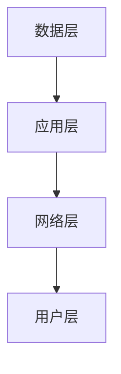

                 


# 巴菲特的经济护城河理论：量子加密时代的数据安全优势

## 关键词：
- 巴菲特经济护城河
- 量子加密
- 数据安全
- 企业竞争优势
- 量子计算威胁

## 摘要：
本文探讨了巴菲特的经济护城河理论在量子加密时代的数据安全中的应用。首先，我们介绍了经济护城河的定义和其在企业竞争优势中的作用。接着，分析了量子计算对传统加密算法的威胁，以及如何通过数据安全构建企业的经济护城河。我们详细解释了量子加密算法的原理，并通过数学模型和系统架构设计展示了数据安全在量子加密时代的重要性。最后，通过项目实战和最佳实践，我们提供了如何在企业中实施量子-resistant数据安全解决方案的指导。

---

# 第一部分：经济护城河理论与量子加密时代的数据安全挑战

## 第1章：巴菲特的经济护城河理论

### 1.1 经济护城河的核心概念

#### 1.1.1 经济护城河的定义与背景
经济护城河是巴菲特投资理论中的核心概念，指的是企业通过某种竞争优势（如成本优势、品牌优势、技术壁垒等）建立的长期竞争优势，能够有效抵御竞争对手的侵蚀。在数据驱动的数字经济时代，数据安全成为企业新的竞争优势，而量子加密技术则是保障数据安全的关键技术。

#### 1.1.2 经济护城河的类型与特征
- **成本优势**：企业通过技术创新降低生产成本，形成价格优势。
- **品牌优势**：强大的品牌影响力吸引更多的客户。
- **技术壁垒**：拥有独特的技术或专利，形成市场准入门槛。
- **网络效应**：用户数量的增加带来更大的价值，形成正反馈循环。

#### 1.1.3 经济护城河与企业竞争优势的关系
经济护城河通过降低竞争压力、提高客户忠诚度和增强盈利能力，帮助企业获得可持续的竞争优势。在量子加密时代，数据安全成为企业新的经济护城河，通过保护数据资产，企业能够巩固其竞争优势。

### 1.2 量子计算与数据安全的威胁

#### 1.2.1 量子计算的基本原理
量子计算利用量子叠加和量子纠缠的特性，能够在短时间内完成传统计算机无法完成的复杂计算。与经典计算机相比，量子计算机在处理特定问题（如大数分解和密码破解）时具有指数级的计算优势。

#### 1.2.2 量子计算对传统加密算法的威胁
- **RSA算法**：基于大数分解的公钥加密算法，容易被量子计算机破解。
- **椭圆曲线加密**：基于椭圆曲线离散对数问题的公钥加密算法，也容易被量子计算机破解。
- **AES加密**：对称加密算法，虽然目前被认为是安全的，但在量子计算机的攻击下可能面临威胁。

#### 1.2.3 量子加密时代的数据安全需求
为了应对量子计算的威胁，需要开发新的加密算法（如格密钥加密、代码签名加密和同态加密）来保护数据安全。这些算法能够在量子计算时代提供长期的安全性。

## 第2章：经济护城河与数据安全的结合

### 2.1 数据安全在企业竞争中的价值
- **数据资产**：数据是企业的核心资产，需要通过加密技术进行保护。
- **数据安全对企业竞争优势的影响**：通过保护数据资产，企业能够巩固其市场地位和竞争优势。

### 2.2 量子加密时代的数据安全优势
- **量子-resistant加密技术**：通过采用新的加密算法，企业能够有效防御量子计算的威胁。
- **数据安全作为经济护城河的核心要素**：数据安全成为企业长期竞争优势的重要组成部分。

---

# 第二部分：经济护城河的数学模型与量子加密算法的实现

## 第3章：经济护城河的数学模型

### 3.1 经济护城河的数学建模

#### 3.1.1 经济护城河的变量定义与关系
- **变量定义**：包括企业竞争优势、数据安全性、市场占有率等。
- **变量关系**：通过数学模型描述经济护城河如何影响企业的长期价值。

#### 3.1.2 经济护城河模型的数学表达式
经济护城河模型可以表示为：
$$
\text{竞争优势} = f(\text{数据安全性}, \text{技术壁垒}, \text{品牌影响力})
$$

#### 3.1.3 模型的假设与边界条件
- 假设：企业通过数据安全技术建立经济护城河。
- 边界条件：数据安全技术的有效性依赖于加密算法的强度。

### 3.2 数据安全的数学模型

#### 3.2.1 数据安全风险的量化方法
数据安全风险可以通过概率论和统计学方法进行量化，例如：
$$
\text{风险} = \text{威胁} \times \text{漏洞} \times \text{影响}
$$

#### 3.2.2 数据安全防护的数学模型
数据安全防护模型可以表示为：
$$
\text{防护强度} = f(\text{加密算法}, \text{安全策略}, \text{监控能力})
$$

#### 3.2.3 数据安全与企业价值的数学关系
企业价值与数据安全的关系可以通过以下公式表示：
$$
\text{企业价值} = g(\text{数据安全性}, \text{竞争优势}, \text{市场地位})
$$

## 第4章：量子加密算法的原理与实现

### 4.1 量子加密算法的数学基础

#### 4.1.1 量子计算的基本数学原理
量子计算依赖于量子叠加和量子纠缠的特性，通过量子位（qubit）进行计算。量子位的状态可以用以下公式表示：
$$
\text{量子状态} = \alpha|0\rangle + \beta|1\rangle
$$
其中，$\alpha$ 和 $\beta$ 是概率幅，满足 $\alpha^2 + \beta^2 = 1$。

#### 4.1.2 量子加密算法的数学模型
量子加密算法的数学模型可以表示为：
$$
\text{加密过程} = E(\text{明文}, \text{密钥})
$$
$$
\text{解密过程} = D(\text{密文}, \text{密钥})
$$

#### 4.1.3 量子加密算法与经典加密算法的对比
- 经典加密算法：基于大数分解和离散对数问题，容易被量子计算机破解。
- 量子加密算法：基于量子力学原理，具有抗量子计算攻击的能力。

### 4.2 量子加密算法的实现

#### 4.2.1 量子加密算法的实现步骤
1. 生成量子密钥：通过量子密钥分发协议（QKD）生成共享密钥。
2. 数据加密：使用量子加密算法对明文进行加密。
3. 数据传输：将密文通过安全通道传输给接收方。
4. 数据解密：接收方使用共享密钥对密文进行解密。

#### 4.2.2 量子加密算法的代码实现
以下是一个简单的量子加密算法实现的伪代码：
```python
def quantum_encryption(plaintext, key):
    encrypted = ""
    for i in range(len(plaintext)):
        encrypted += chr(ord(plaintext[i]) ^ key[i % len(key)])
    return encrypted

def quantum_decryption(ciphertext, key):
    decrypted = ""
    for i in range(len(ciphertext)):
        decrypted += chr(ord(ciphertext[i]) ^ key[i % len(key)])
    return decrypted
```

#### 4.2.3 量子加密算法的性能分析
- 时间复杂度：量子加密算法的时间复杂度取决于具体的算法实现，通常比经典加密算法更高。
- 空间复杂度：量子加密算法需要额外的存储空间来保存量子密钥。

---

# 第三部分：数据安全系统的架构设计与实现

## 第5章：数据安全系统的架构设计

### 5.1 数据安全系统的功能设计

#### 5.1.1 数据安全系统的需求分析
- 数据加密：对敏感数据进行加密，防止未经授权的访问。
- 数据完整性：确保数据在传输过程中不被篡改。
- 数据访问控制：基于角色的访问控制（RBAC）。

#### 5.1.2 数据安全系统的功能模块
- 加密模块：负责对数据进行加密和解密。
- 访问控制模块：基于角色的访问控制。
- 安全监控模块：实时监控数据安全状态，发现异常立即告警。

### 5.2 数据安全系统的架构设计

#### 5.2.1 系统架构设计
系统架构可以采用分层设计，包括数据层、应用层、网络层和用户层。

#### 5.2.2 系统架构图
以下是一个数据安全系统的架构图：


#### 5.2.3 系统接口设计
- 加密接口：`encrypt(plaintext: str, key: str) -> str`
- 解密接口：`decrypt(ciphertext: str, key: str) -> str`
- 访问控制接口：`access_control(role: str, resource: str) -> bool`

## 第6章：量子-resistant数据安全系统的实现

### 6.1 系统环境安装

#### 6.1.1 系统环境需求
- 操作系统：支持量子计算的环境，如特定的量子计算平台。
- 软件环境：安装量子加密算法库，如QKD协议实现库。

#### 6.1.2 系统核心实现源代码
以下是一个量子-resistant加密系统的实现代码：
```python
import qiskit

def quantum_key_distribution():
    # 创建量子电路
    circuit = qiskit.QuantumCircuit(2, 2)
    circuit.h(0)
    circuit.cx(0, 1)
    circuit.measure(0, 0)
    circuit.measure(1, 1)
    # 执行量子计算
    backend = qiskit.Aer.get_backend('qasm_simulator')
    result = qiskit.execute(circuit, backend).result()
    # 获取结果
    counts = result.get_counts()
    return counts
```

### 6.2 系统核心实现

#### 6.2.1 数据加密与解密
- 使用量子加密算法对数据进行加密。
- 通过量子密钥分发协议生成共享密钥。

#### 6.2.2 系统交互设计
- 用户发起数据加密请求。
- 系统生成量子密钥并加密数据。
- 用户接收加密数据并进行解密。

### 6.3 项目实战

#### 6.3.1 项目背景
开发一个基于量子-resistant加密技术的数据安全系统，保护企业的核心数据资产。

#### 6.3.2 实施步骤
1. 安装必要的量子计算库和工具。
2. 设计系统架构，包括数据层、应用层、网络层和用户层。
3. 实现量子密钥分发协议。
4. 集成量子-resistant加密算法。
5. 测试系统性能和安全性。

### 6.4 项目小结
通过量子-resistant加密技术，企业能够有效保护数据安全，构建强大的经济护城河，确保在量子计算时代保持竞争优势。

---

# 第四部分：最佳实践与未来展望

## 第7章：最佳实践与未来展望

### 7.1 关键点总结
- 量子计算对传统加密算法的威胁不容忽视。
- 数据安全是企业经济护城河的重要组成部分。
- 通过量子-resistant加密技术，企业能够应对未来的安全挑战。

### 7.2 小结
在量子计算时代，数据安全将成为企业竞争的关键因素。通过建立经济护城河，企业能够有效保护数据资产，确保长期竞争优势。

### 7.3 注意事项
- 定期更新加密算法，应对量子计算的威胁。
- 加强安全意识培训，提升员工的安全意识。
- 建立完善的安全监控体系，及时发现和应对安全威胁。

### 7.4 未来展望
随着量子计算技术的发展，数据安全将面临更大的挑战。企业需要持续关注量子-resistant加密技术的研究和应用，确保在未来的竞争中占据优势。

---

通过以上目录结构，我们可以系统地探讨巴菲特的经济护城河理论在量子加密时代的数据安全中的应用，为企业在数据安全领域的实践提供理论支持和实践指导。

