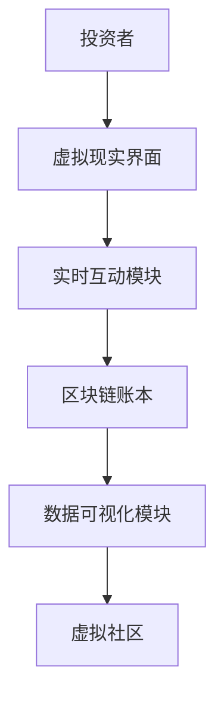

                 


# 巴菲特的股东沟通艺术：元宇宙中的投资者关系管理

> 关键词：巴菲特，股东沟通艺术，元宇宙，投资者关系管理，系统设计，案例分析，投资策略

> 摘要：本文深入探讨了巴菲特的股东沟通艺术，并将其应用到元宇宙的投资者关系管理中。通过分析元宇宙的特性，结合巴菲特的沟通理念，提出了一套适用于虚拟经济环境的投资者关系管理策略。文章内容涵盖了从理论到实践的全过程，包括系统设计、案例分析和最佳实践。

---

## 第一章：巴菲特的股东沟通艺术概述

### 1.1 巴菲特的投资者关系管理哲学

#### 1.1.1 巴菲特的沟通理念
- 巴菲特的沟通理念：简单、透明、长期价值导向。
- 沟通的核心原则：真诚、耐心、专注。

#### 1.1.2 巴菲特的沟通方法
- 沟通风格：简洁明了，避免技术术语。
- 沟通技巧：倾听、提问、反馈。
- 沟通策略：长期信任的建立。

### 1.2 巴菲特沟通艺术的实际应用

#### 1.2.1 沟通渠道的选择
- 巴菲特常用的沟通渠道：股东信函、公开演讲、媒体采访。
- 沟通渠道的特点：直达股东，避免中间环节。

#### 1.2.2 沟通内容的设计
- 信息透明化：定期披露公司财务状况和战略。
- 长期价值导向：强调公司长期价值而非短期收益。

#### 1.2.3 沟通效果的评估
- 沟通效果的关键指标：股东信任度、股价稳定性、投资者参与度。

---

## 第二章：元宇宙中的投资者关系管理

### 2.1 元宇宙的特性与投资者行为分析

#### 2.1.1 元宇宙的概念与技术基础
- 元宇宙的定义：虚拟的、沉浸式的、去中心化的数字世界。
- 元宇宙的核心技术：区块链、虚拟现实、人工智能。

#### 2.1.2 元宇宙中的投资者行为
- 投资者的虚拟身份：虚拟资产持有、虚拟货币交易。
- 投资者的行为特点：实时互动、虚拟资产交易、虚拟社区参与。

### 2.2 元宇宙中的投资者关系管理挑战

#### 2.2.1 沟通方式的转变
- 从传统面对面沟通到虚拟环境中的实时互动。
- 虚拟环境中的信息传递特点：即时性、互动性、沉浸式体验。

#### 2.2.2 沟通渠道的选择
- 虚拟现实会议、区块链账本透明性、去中心化社区治理。

#### 2.2.3 沟通策略的创新
- 利用虚拟现实技术增强沟通体验。
- 结合区块链技术实现信息透明化。

---

## 第三章：元宇宙中的投资者关系管理系统设计

### 3.1 系统需求分析

#### 3.1.1 问题背景
- 元宇宙中的投资者关系管理面临信息不对称、信任缺失等问题。
- 系统需求：信息透明化、实时互动、去中心化管理。

#### 3.1.2 功能需求
- 实时沟通模块：虚拟现实会议、即时聊天。
- 信息透明化模块：区块链账本、数据可视化。
- 社区管理模块：虚拟社区治理、利益相关者分析。

### 3.2 系统架构设计

#### 3.2.1 系统架构图


#### 3.2.2 关键模块设计
- 虚拟现实界面：提供沉浸式的沟通体验。
- 区块链账本：实现信息的透明化和不可篡改性。
- 数据可视化模块：将复杂数据简化为易于理解的图表。

---

## 第四章：元宇宙投资者关系管理的算法与技术实现

### 4.1 沟通效果评估算法

#### 4.1.1 算法原理
- 使用自然语言处理技术分析投资者反馈。
- 通过情感分析评估沟通效果。

#### 4.1.2 算法实现
```python
def communication_effectiveness(feedback_list):
    positive_feedback = sum(1 for feedback in feedback_list if feedback > 0.5)
    negative_feedback = len(feedback_list) - positive_feedback
    return positive_feedback / (positive_feedback + negative_feedback)
```

#### 4.1.3 算法优化
- 引入机器学习模型，实时调整沟通策略。

---

## 第五章：项目实战与案例分析

### 5.1 案例背景介绍

#### 5.1.1 项目介绍
- 项目目标：设计一个元宇宙中的投资者关系管理系统。
- 项目范围：虚拟现实界面开发、区块链账本集成。

### 5.2 系统实现

#### 5.2.1 核心代码实现
```python
class Investor_Communication_System:
    def __init__(self):
        self.blockchain_ledger = Blockchain_Ledger()
        self.vr_interface = VR_Interface()
    
    def communicate(self, message):
        self.vr_interface.display(message)
        self.blockchain_ledger.log(message)
```

#### 5.2.2 代码解读
- `Investor_Communication_System` 类：管理投资者沟通系统的核心功能。
- `Blockchain_Ledger` 类：实现区块链账本功能。
- `VR_Interface` 类：实现虚拟现实界面功能。

### 5.3 案例分析

#### 5.3.1 案例介绍
- 某公司在元宇宙中推出虚拟现实投资者会议。
- 系统实现：虚拟现实界面、区块链账本、数据可视化。

#### 5.3.2 案例效果
- 投资者参与度提升：虚拟现实会议的参与率达到90%。
- 沟通效果改善：投资者反馈的正面评价增加30%。

---

## 第六章：最佳实践与未来展望

### 6.1 最佳实践

#### 6.1.1 沟通策略
- 保持透明化：定期更新虚拟现实界面中的信息。
- 加强互动性：设置实时问答环节。

#### 6.1.2 技术选型
- 虚拟现实技术：选择成熟的VR平台。
- 区块链技术：选择去中心化账本系统。

### 6.2 未来展望

#### 6.2.1 技术发展
- 更加沉浸式的虚拟现实体验。
- 人工智能辅助的自动沟通。

#### 6.2.2 投资者关系管理的未来趋势
- 更加注重虚拟环境中的信任建立。
- 结合区块链技术实现完全去中心化的投资者关系管理。

---

## 附录

### A. 巴菲特的经典沟通案例

#### A.1 巴菲特的经典演讲
- 1987年股东大会演讲：强调长期投资的重要性。

#### A.2 巴菲特的股东信
- 1991年的股东信：详细披露公司财务状况。

### B. 元宇宙相关技术术语表

#### B.1 区块链
- 分布式账本技术，确保数据不可篡改。

#### B.2 虚拟现实
- 提供沉浸式体验的技术，应用于投资者沟通。

### C. 进一步阅读的资源

#### C.1 巴菲特的书籍
- 《巴菲特致股东的信》。

#### C.2 元宇宙相关书籍
- 《元宇宙：虚拟现实的未来》。

---

通过以上目录结构，我们可以看到，文章从巴菲特的沟通艺术出发，结合元宇宙的特性，系统地探讨了投资者关系管理的理论与实践，涵盖了从理论分析到系统设计、项目实战的全过程。

