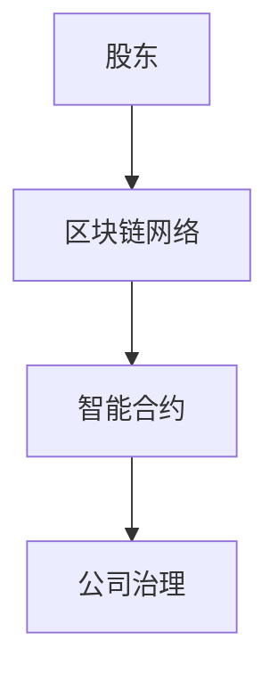

                 


# 巴菲特的股东沟通艺术：区块链时代的公司治理

## 关键词：巴菲特, 股东沟通, 区块链, 公司治理, 智能合约

## 摘要：本文探讨了巴菲特的股东沟通艺术，并将其与区块链时代的公司治理相结合。通过分析区块链技术的特点，如透明性、去中心化和智能合约，本文提出了一种新的公司治理模式，结合长期主义和技术创新，以实现更高效、更透明的股东沟通和公司治理。

---

## 第一部分：传统公司治理与区块链时代的变化

## 第1章：传统公司治理的局限性

### 1.1 传统公司治理的定义与特点
- **定义**：公司治理是指公司如何管理和监督其业务，确保公司目标的实现和股东利益的保护。
- **特点**：
  - 中心化决策
  - 信息不对称
  - 治理透明度有限

### 1.2 区块链时代对公司治理的影响
- **技术驱动**：区块链技术的出现改变了传统的公司治理模式。
- **特点**：
  - 去中心化
  - 透明性
  - 不可篡改性

## 第2章：巴菲特的股东沟通艺术

### 2.1 股东沟通的核心概念
- **定义**：股东沟通是指公司与股东之间的信息交流，旨在提高股东对公司运作的理解和信任。
- **核心要素**：
  - 透明性
  - 及时性
  - 有效性

### 2.2 巴菲特的长期主义
- **长期主义**：巴菲特强调长期投资和长期信任的建立。
- **实践**：
  - 通过年度报告与股东沟通
  - 保持与股东的持续互动
  - 提供真实、准确的信息

## 第3章：区块链技术与股东沟通的结合

### 3.1 区块链技术的特点
- **去中心化**：没有单一点控制整个系统。
- **透明性**：所有交易记录在区块链上，可供任何人查看。
- **不可篡改性**：数据一旦写入区块链，无法被修改。

### 3.2 智能合约在股东沟通中的应用
- **智能合约**：自动执行预定义的合同条款，确保双方按照协议履行义务。
- **应用**：
  - 股权分配与转让
  - 股东投票
  - 信息自动传递

## 第4章：区块链时代公司治理的算法原理

### 4.1 共识算法
- **共识算法**：用于确保区块链网络中的所有节点达成一致。
- **常用算法**：
  - 工作量证明（PoW）
  - 权益证明（PoS）
  - 拜占庭容错（BFT）

### 4.2 智能合约的执行流程
- **步骤**：
  1. **触发条件**：当满足特定条件时，智能合约自动执行。
  2. **状态检查**：检查当前区块链的状态，确保触发条件成立。
  3. **执行操作**：根据智能合约的逻辑，执行相应的操作。
  4. **记录结果**：将执行结果记录在区块链上，确保透明性和不可篡改性。

## 第5章：系统架构设计

### 5.1 系统功能设计
- **核心功能**：
  - 股东信息管理
  - 股东投票
  - 智能合约执行
  - 信息透明化

### 5.2 系统架构图


### 5.3 系统接口设计
- **股东接口**：提供股东与区块链网络交互的界面。
- **治理接口**：公司管理层与区块链网络交互的界面。

## 第6章：项目实战与案例分析

### 6.1 环境安装
- **工具**：
  - 区块链平台（如Ethereum）
  - 智能合约开发工具（如Solidity）

### 6.2 核心代码实现
```solidity
// 智能合约示例：股东投票系统
contract ShareholderVoting {
    mapping(address => uint) public shares;

    function vote(address[] memory candidates, uint[] memory votes) public {
        require(shares[msg.sender] > 0, "You don't have shares to vote");
        for (uint i = 0; i < candidates.length; i++) {
            if (votes[i] > 0) {
                shares[candidates[i]] += votes[i];
            }
        }
    }
}
```

### 6.3 案例分析
- **案例背景**：某公司采用区块链技术实现股东投票系统。
- **实施过程**：
  1. **部署智能合约**：在区块链上部署股东投票智能合约。
  2. **股东注册**：股东在区块链上注册并持有股权。
  3. **投票执行**：股东通过智能合约进行投票。
  4. **结果记录**：投票结果记录在区块链上，确保透明性和不可篡改性。

## 第7章：总结与展望

### 7.1 总结
- **核心观点**：通过区块链技术实现的智能合约和去中心化治理，能够提高公司治理的透明性和效率。
- **巴菲特的长期主义**：结合长期主义和技术创新，能够实现更高效的股东沟通和公司治理。

### 7.2 未来展望
- **技术发展**：区块链技术的进一步发展将推动公司治理的更多创新。
- **应用场景**：更多的公司可能采用区块链技术来优化公司治理流程。

### 7.3 注意事项
- **技术复杂性**：区块链技术的实施需要专业的技术支持。
- **合规性**：确保区块链应用符合相关法律法规。

### 7.4 最佳实践 tips
- **选择合适的区块链平台**：根据具体需求选择适合的区块链平台。
- **确保数据安全**：在区块链上处理敏感数据时，需确保数据的安全性。
- **持续学习**：关注区块链技术的最新发展，及时更新知识和技能。

---

# 结语

通过将巴菲特的股东沟通艺术与区块链技术相结合，我们可以实现更高效、更透明的公司治理。区块链技术的应用不仅提高了股东沟通的效率，还确保了信息的透明性和不可篡改性。未来，随着区块链技术的进一步发展，我们期待看到更多创新的公司治理模式出现。

