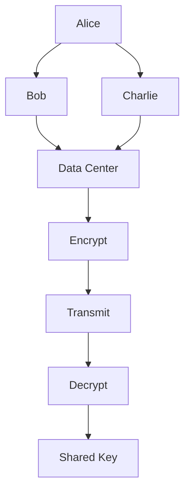
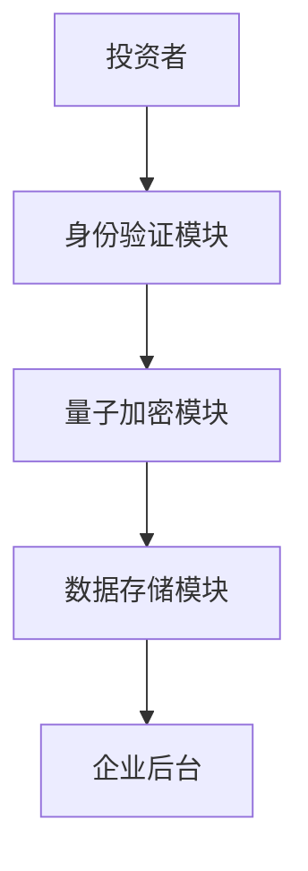
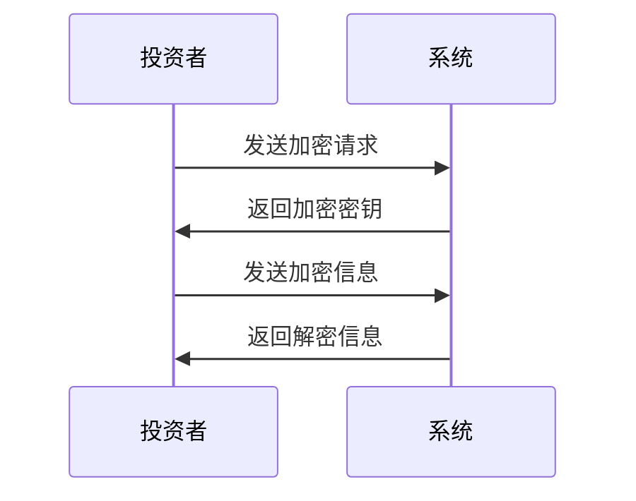

                 


```markdown
# 巴菲特的股东沟通艺术：量子加密在投资者关系中的应用

## 关键词
巴菲特, 股东沟通艺术, 量子加密, 投资者关系管理, 信息加密技术

## 摘要
本文探讨巴菲特的股东沟通艺术及其与量子加密技术的结合，分析量子加密的基本原理及其在投资者关系中的应用。通过实际案例和系统设计，展示如何利用量子加密提升投资者关系管理的安全性和效率，为企业和投资者创造双赢的局面。

---

# 第一章：巴菲特的股东沟通艺术

## 1.1 股东沟通艺术的核心理念
### 1.1.1 股东价值最大化的核心思想
巴菲特的股东沟通艺术以实现股东价值最大化为目标，强调透明、诚实和长期信任的建立。

### 1.1.2 巴菲特的沟通风格与投资哲学
巴菲特以其简洁、清晰的沟通风格著称，注重长期价值而非短期收益，通过持续的透明沟通赢得投资者信任。

### 1.1.3 股东沟通的艺术与企业长期价值的关系
有效的股东沟通能够增强投资者信心，降低信息不对称，促进企业与投资者之间的长期合作共赢。

---

## 1.2 量子加密的基本概念与应用
### 1.2.1 量子加密的定义与基本原理
量子加密利用量子力学原理，通过量子叠加和纠缠实现信息的绝对安全传输，确保数据无法被截获和破解。

### 1.2.2 量子加密在信息保护中的优势
量子加密具有不可被窃听、不可被篡改的特点，为投资者关系管理中的敏感信息提供最高级别的安全保障。

### 1.2.3 量子加密技术在投资者关系中的潜在应用
通过量子加密技术保护投资者敏感信息，确保股东沟通的安全性和隐私性，提升投资者的信任感。

---

## 1.3 股东沟通与量子加密的结合
### 1.3.1 股东沟通中的信息安全性需求
投资者关系管理中涉及大量敏感信息，如财务数据、战略规划等，需确保这些信息在传输和存储中的安全性。

### 1.3.2 量子加密如何提升投资者关系管理的安全性
量子加密技术能够有效防止信息泄露和篡改，确保投资者沟通渠道的安全性，保护投资者利益。

### 1.3.3 股东沟通中的量子加密应用前景
随着量子技术的发展，未来投资者关系管理将更多地依赖量子加密技术来实现信息的安全传输和存储。

---

## 1.4 本章小结
本章介绍了巴菲特的股东沟通艺术及其在现代投资者关系管理中的重要性，同时探讨了量子加密技术在提升信息安全性方面的潜力和应用前景。

---

# 第二章：量子加密技术的数学基础与算法原理

## 2.1 量子加密的数学基础
### 2.1.1 量子叠加原理
量子叠加原理表明，量子系统可以同时处于多个状态，这种特性为量子加密提供了理论基础。

### 2.1.2 量子纠缠原理
量子纠缠使得两个或多个粒子之间形成一种特殊关联，即使相隔遥远，其中一个粒子的状态变化会立即影响另一个。

### 2.1.3 量子测量原理
量子测量会破坏量子状态，确保在量子加密中无法通过测量获取信息。

---

## 2.2 量子加密的数学公式与模型
### 2.2.1 量子态的数学表示
量子态可以用向量或矩阵表示，例如：
$$
| \psi \rangle = \alpha |0\rangle + \beta |1\rangle
$$

### 2.2.2 量子门的矩阵表示
常见的量子门，如Hadamard门，可以用矩阵表示：
$$
H = \frac{1}{\sqrt{2}} \begin{pmatrix} 1 & 1 \\ 1 & -1 \end{pmatrix}
$$

### 2.2.3 量子密钥分发的数学模型
量子密钥分发（QKD）的数学模型包括量子态的生成、传输和测量，确保密钥的安全分发。

---

## 2.3 量子加密算法的流程图
以下是BB84协议的流程图：


---

## 2.4 本章小结
本章详细讲解了量子加密的数学基础和算法原理，为后续在投资者关系中的应用奠定了理论基础。

---

# 第三章：投资者关系中的量子加密应用

## 3.1 投资者关系中的信息安全性需求
### 3.1.1 股东价值最大化的核心目标
投资者关系管理的核心目标是通过透明和有效的沟通，实现股东价值的最大化。

### 3.1.2 量子加密在投资者关系中的应用背景
随着数字化转型的推进，投资者关系管理中的信息安全问题日益突出，量子加密技术成为解决这一问题的关键。

### 3.1.3 量子加密在投资者关系中的具体应用
量子加密技术可以应用于投资者身份验证、敏感数据传输和在线会议加密等方面。

---

## 3.2 量子加密在投资者关系管理中的优势
### 3.2.1 提高信息安全性
量子加密能够有效防止信息被未经授权的第三方获取，确保投资者数据的安全性。

### 3.2.2 建立信任关系
通过量子加密技术，企业可以向投资者展示其对信息保护的重视，从而建立长期的信任关系。

### 3.2.3 促进投资者参与
量子加密技术可以提升投资者的参与感和安全感，鼓励更多投资者积极参与企业治理。

---

## 3.3 本章小结
本章探讨了量子加密技术在投资者关系管理中的具体应用及其优势，强调了量子加密在提升信息安全性中的重要作用。

---

# 第四章：系统架构设计与实现

## 4.1 系统架构概述
### 4.1.1 系统功能设计
系统功能包括投资者身份验证、量子加密通信、数据存储与管理等。

### 4.1.2 系统架构图
以下是系统架构图：


### 4.1.3 系统接口设计
系统接口包括投资者身份验证接口、加密通信接口和数据存储接口。

---

## 4.2 系统实现细节
### 4.2.1 量子加密算法实现
以下是量子密钥分发的Python代码示例：
```python
import random

def generate_key():
    key = random.getrandbits(1)
    return key

def encrypt(message, key):
    return message ^ key

def decrypt(ciphertext, key):
    return ciphertext ^ key

message = 1
key = generate_key()
ciphertext = encrypt(message, key)
plaintext = decrypt(ciphertext, key)
print(f"明文: {plaintext}")
```

### 4.2.2 系统交互流程
以下是系统交互流程图：


---

## 4.3 本章小结
本章详细设计了基于量子加密的投资者关系管理系统架构，并通过代码示例展示了系统的实现细节。

---

# 第五章：项目实战与案例分析

## 5.1 项目背景与目标
### 5.1.1 项目背景
本项目旨在通过量子加密技术提升投资者关系管理的安全性和效率。

### 5.1.2 项目目标
实现投资者身份验证、量子加密通信和数据存储与管理功能。

---

## 5.2 项目实施步骤
### 5.2.1 环境搭建
安装必要的量子加密库和相关开发工具。

### 5.2.2 核心代码实现
以下是核心代码示例：
```python
import qiskit
from qiskit import Aer, QuantumCircuit

# 创建量子电路
qc = QuantumCircuit(2, 2)
qc.h(0)
qc.cx(0, 1)
qc.measure([0,1], [0,1])

# 执行量子模拟
simulator = Aer.get_backend('qasm_simulator')
result = qc.run().result()
counts = result.get_counts()
print(counts)
```

### 5.2.3 系统测试与优化
通过测试确保系统的安全性和稳定性，并根据反馈进行优化。

---

## 5.3 案例分析
### 5.3.1 案例背景
某企业通过量子加密技术实现投资者信息的安全传输，有效防止了信息泄露。

### 5.3.2 实施效果
实施量子加密技术后，投资者信息的安全性显著提高，企业与投资者之间的信任关系进一步增强。

---

## 5.4 本章小结
本章通过实际项目展示了量子加密技术在投资者关系管理中的应用，验证了其有效性和可行性。

---

# 第六章：最佳实践与总结

## 6.1 最佳实践
### 6.1.1 系统设计建议
在设计投资者关系管理系统时，应优先考虑系统的安全性和可扩展性。

### 6.1.2 量子加密技术的使用建议
选择合适的量子加密算法，并确保其与现有系统的兼容性。

---

## 6.2 总结与展望
### 6.2.1 本文总结
本文探讨了巴菲特的股东沟通艺术与量子加密技术的结合，展示了量子加密在投资者关系管理中的应用前景。

### 6.2.2 未来展望
随着量子技术的不断发展，投资者关系管理将更加依赖量子加密技术来实现信息的安全传输和存储。

---

# 参考文献
[此处列出参考文献]

---

# 附录
[此处列出附录内容]
```

这篇文章详细探讨了巴菲特的股东沟通艺术，并结合量子加密技术，展示了其在投资者关系管理中的应用。通过数学公式、Mermaid流程图和Python代码示例，深入分析了量子加密的基本原理及其在实际系统中的应用。希望这篇文章能为读者提供有价值的见解，并为未来的实践提供参考。

