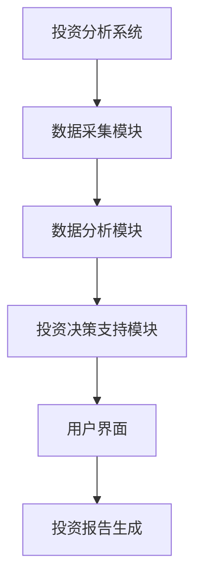

                 


# 巴菲特的股息增长策略更新：在低息环境中的收益来源

## 关键词：巴菲特，股息增长策略，低息环境，投资收益，股息收益率

## 摘要：本文详细探讨了巴菲特的股息增长策略在当前低息环境下的应用和收益来源。通过分析股息增长模型、系统架构设计以及实际项目案例，为投资者提供科学的投资方法和风险管理策略，帮助他们在低息环境下实现稳健收益。

---

# 目录大纲

## 第一部分：巴菲特的股息增长策略概述

### 第1章：股息增长策略的基本概念

#### 1.1 股息增长策略的定义与特点
- 股息增长策略的定义
- 股息增长策略的核心特点
- 股息增长策略与其他股息策略的对比

#### 1.2 巴菲特的股息投资理念
- 巴菲特的投资哲学
- 巴菲特对股息增长策略的偏好
- 巴菲特的经典股息投资案例

#### 1.3 当前低息环境下的股息策略机会
- 低息环境的定义与特征
- 股息增长策略在低息环境中的优势
- 低息环境下的股息策略投资机会

## 第二部分：股息增长策略的数学模型与分析

### 第2章：股息增长模型的建立与应用

#### 2.1 股息增长模型的假设条件
- 恒定股息增长率假设
- 投资者预期回报率的稳定性
- 股票价格与股息的正相关关系

#### 2.2 股息增长模型的公式推导
- 股息增长模型的公式
$$ P = \frac{D_1}{r - g} $$
其中，\( P \) 为股票价格，\( D_1 \) 为第一年预期股息，\( r \) 为投资者要求的回报率，\( g \) 为股息增长率。

#### 2.3 模型的验证与应用
- 模型的验证方法
- 模型在实际投资中的应用
- 模型的局限性与改进方向

## 第三部分：股息增长策略的系统架构设计

### 第3章：投资分析系统的功能模块

#### 3.1 数据采集模块
- 数据来源：股票市场数据、财务报表、宏观经济指标
- 数据清洗：处理缺失值、异常值
- 数据存储：数据库设计与管理

#### 3.2 数据分析模块
- 财务指标分析：股息率、股息增长能力、ROE等
- 行业趋势分析：行业周期性、竞争格局
- 市场情绪分析：投资者情绪指标、市场波动性

#### 3.3 投资决策支持模块
- 股票筛选：基于股息增长率和股息率的多因子筛选
- 投资组合优化：根据风险偏好构建最优组合
- 风险管理：情景分析、止损设置、再平衡策略

### 第4章：系统架构的 mermaid 图

#### 4.1 系统架构图


#### 4.2 数据流图
```mermaid
flowchart TD
    start --> A[数据采集]
    A --> B[数据处理]
    B --> C[数据分析]
    C --> D[投资决策]
    D --> end
```

## 第四部分：股息增长策略的项目实战

### 第5章：项目实战与代码实现

#### 5.1 环境安装
- Python环境配置
- 数据分析库安装（Pandas、NumPy、Matplotlib）

#### 5.2 核心实现代码
```python
import pandas as pd
import numpy as np
import matplotlib.pyplot as plt

# 示例数据：假设股息增长率和股息率
def calculate_stock_value(dividend_growth_rate, required_return):
    initial_dividend = 1  # 假设初始股息为1元
    future_dividend = initial_dividend * (1 + dividend_growth_rate)
    stock_value = future_dividend / (required_return - dividend_growth_rate)
    return stock_value

# 输入参数
required_return = 0.08  # 8%
growth_rates = [0.02, 0.03, 0.04]  # 2%, 3%, 4%

# 计算股票价值
results = []
for gr in growth_rates:
    value = calculate_stock_value(gr, required_return)
    results.append((gr, value))

# 可视化
gr_values = [result[0] for result in results]
value_values = [result[1] for result in results]

plt.plot(gr_values, value_values)
plt.xlabel('股息增长率 (%)')
plt.ylabel('股票价值')
plt.title('股息增长率与股票价值关系')
plt.show()
```

#### 5.3 案例分析与解读
- 数据来源：选取具有代表性的股票进行分析
- 分析步骤：数据清洗、计算股息率、应用股息增长模型、生成投资建议
- 结果展示：可视化图表、投资报告

## 第五部分：风险管理与最佳实践

### 第6章：风险管理策略

#### 6.1 风险评估与控制
- 市场风险：股票价格波动、宏观经济影响
- 信用风险：公司盈利能力和分红能力
- 流动性风险：资金流动性管理

#### 6.2 分散投资策略
- 股票分散：投资不同行业的股票
- 时间分散：分批买入，避免集中投资
- 资产配置：结合其他资产类型（债券、房地产等）

#### 6.3 动态调整策略
- 定期复评：根据市场变化调整投资组合
- 股息再投资：利用股息再投资增加复利效应
- 灵活应对：根据经济环境调整股息增长率预期

## 第六部分：总结与展望

### 第7章：总结与展望

#### 7.1 核心内容回顾
- 股息增长策略的基本概念
- 数学模型的建立与应用
- 系统架构设计与实现
- 项目实战与风险管理

#### 7.2 未来展望
- 人工智能在股息策略中的应用
- 大数据分析技术的深入挖掘
- 全球化视角下的股息投资机会

---

通过以上目录大纲，文章将系统地介绍巴菲特的股息增长策略在低息环境下的应用，结合数学模型、系统架构和实际案例，为投资者提供科学的投资方法和风险管理策略。

