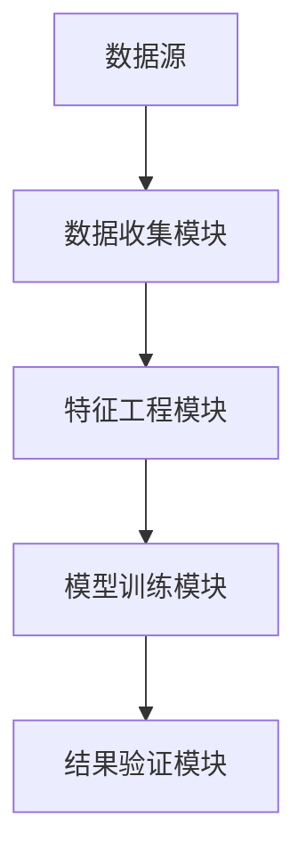
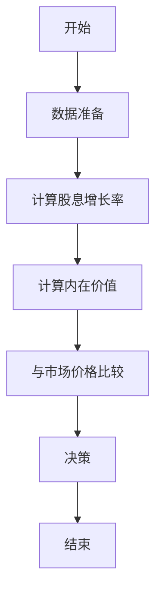
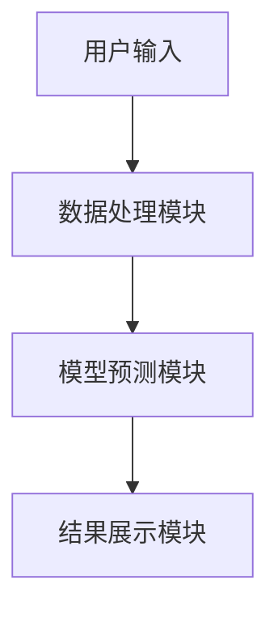

                 


# 巴菲特的股息增长策略：稳定现金流的长期价值

> 关键词：巴菲特，股息增长，股息贴现模型，价值投资，长期价值，股息率，股息支付率

> 摘要：本文深入分析巴菲特的股息增长策略，探讨其在稳定现金流和长期投资价值中的作用。通过数学模型、系统分析和实际案例，揭示股息增长策略的核心原理、评估方法和应用实践。

---

## 目录

### 第一部分：背景介绍

#### 第1章：股息增长策略的定义与背景

##### 1.1 股息增长策略的核心概念

- 什么是股息增长策略
- 股息增长策略的历史与发展
- 巴菲特与股息增长策略的关联

##### 1.2 股息增长策略的优势

- 稳定现金流的特点
- 长期价值的实现路径
- 抗风险能力的分析

##### 1.3 股息增长策略与股息投资的区别

- 股息贴现模型的定义与应用
- 股息增长策略与成长型投资的对比
- 股息增长策略与防御性投资的对比

### 第二部分：核心概念与联系

#### 第2章：股息增长模型的数学分析

##### 2.1 股息贴现模型（DDM）

- DDM的基本原理
- DDM的公式推导
- DDM的变量解释和假设条件

##### 2.2 股息增长模型的数学推导

- 股息增长率的计算公式
- 内在价值的计算公式
- 股票价格的动态变化

##### 2.3 股息增长与股票价值的关系

- 股息增长率对股票价值的影响
- 股息率与股息支付率的平衡
- 股票估值的合理性分析

#### 第3章：股息增长策略的系统架构

##### 3.1 系统功能设计

- 数据收集模块
- 特征工程模块
- 模型训练模块
- 结果验证模块

##### 3.2 系统架构图



##### 3.3 系统接口设计

- 数据接口：数据来源和格式
- 模型接口：输入输出定义
- 结果接口：可视化展示

### 第三部分：算法原理

#### 第4章：股息增长策略的算法实现

##### 4.1 股息增长模型的算法流程



##### 4.2 股息贴现模型的算法实现

- 使用Python的pandas库进行数据处理
- 使用numpy库进行矩阵运算
- 使用scikit-learn库进行回归分析

##### 4.3 股息增长模型的数学公式

- 股息增长率的计算：
  $$ g = (D_{t+1} / D_t) - 1 $$
- 内在价值的计算：
  $$ V = \frac{D_1}{k - g} $$
  其中，\( D_1 \) 是下一期的股息，\( k \) 是折现率，\( g \) 是股息增长率。

### 第四部分：系统分析与架构设计

#### 第5章：股息增长策略的系统分析

##### 5.1 投资模型的构建

- 数据收集与清洗
- 特征工程：选择股息增长率、股息率、股息支付率等特征
- 模型训练：使用线性回归或机器学习模型预测股息增长率

##### 5.2 投资决策支持系统的设计

- 系统架构图：


- 系统功能模块的交互：
  - 用户输入目标股票代码
  - 数据处理模块获取历史股息数据
  - 模型预测模块计算股息增长率和内在价值
  - 结果展示模块显示预测结果和投资建议

### 第五部分：项目实战

#### 第6章：股息增长策略的Python实现

##### 6.1 环境安装

- 安装必要的库：
  ```bash
  pip install pandas numpy scikit-learn
  ```

##### 6.2 核心代码实现

- 数据收集与处理：
  ```python
  import pandas as pd
  import numpy as np

  # 假设我们有一个包含历史股息数据的DataFrame df
  df = pd.DataFrame({
      'Year': [2017, 2018, 2019, 2020, 2021],
      'Dividends': [1.0, 1.04, 1.08, 1.12, 1.16]
  })

  # 计算股息增长率
  df['Dividend Growth'] = df['Dividends'].pct_change()
  ```

- 模型训练：
  ```python
  from sklearn.linear_model import LinearRegression

  # 假设我们有一个特征矩阵X和目标向量y
  X = df[['Year']]
  y = df['Dividend Growth']

  model = LinearRegression()
  model.fit(X, y)
  ```

- 预测与评估：
  ```python
  # 预测未来一年的股息增长率
  future_year = 2022
  future_X = pd.DataFrame({'Year': [future_year]})
  predicted_growth = model.predict(future_X)
  ```

##### 6.3 案例分析：以苹果公司为例

- 分析苹果的历史股息数据
- 计算股息增长率
- 使用股息贴现模型评估其内在价值

### 第六部分：最佳实践

#### 第7章：股息增长策略的最佳实践

##### 7.1 投资策略的注意事项

- 数据质量的重要性
- 模型假设的合理性
- 市场波动对股息增长的影响

##### 7.2 小结

- 股息增长策略的优势与局限
- 长期投资的重要性
- 组合投资的风险分散

##### 7.3 扩展阅读

- 推荐书籍：《巴菲特传》、《股市长青》
- 推荐博客：技术分析与投资策略结合

---

### 总结

通过本文的详细分析，读者可以深入了解巴菲特的股息增长策略，掌握其背后的数学模型和系统架构，并通过实际案例和Python代码实现，将理论应用于实践。这种策略不仅能够帮助投资者实现稳定现金流，还能在长期投资中创造价值。

