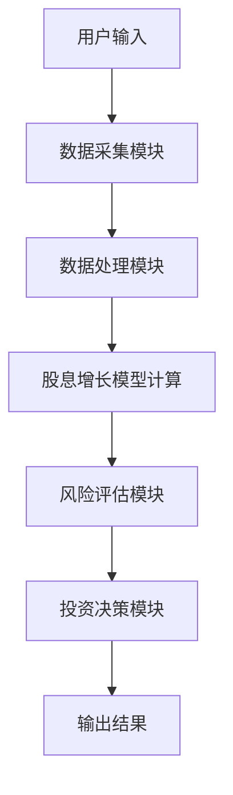
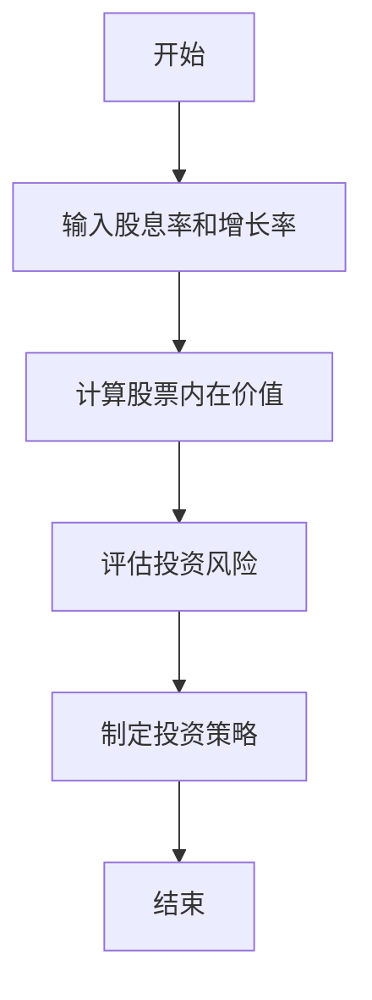

                 


# 巴菲特的股息增长策略：通缩经济下的收益来源

## 关键词：巴菲特、股息增长策略、通缩经济、投资策略、股息率、财务分析

## 摘要：  
巴菲特的股息增长策略是其投资哲学的重要组成部分，尤其在通缩经济环境下，股息增长策略成为稳定收益的重要来源。本文详细分析了巴菲特的股息增长策略的核心要素，包括股息增长模型、系统架构和算法原理，并结合实际案例，探讨了通缩经济下的投资机会和风险管理。通过本文，读者将深入了解股息增长策略的应用方法，并能够掌握在通缩经济中利用股息增长策略实现稳健收益的技巧。

---

# 第1章: 巴菲特的投资理念与股息增长策略

## 1.1 巴菲特的生平与投资哲学

### 1.1.1 巴菲特的生平简介  
沃伦·巴菲特（Warren Buffett）是世界著名投资者，生于1934年，被誉为“股神”。他从15岁开始投资，逐渐积累了丰富的投资经验。巴菲特的投资哲学以“价值投资”为核心，强调长期持有优质资产，追求企业内在价值的增长。

### 1.1.2 巴菲特的投资哲学  
巴菲特的投资哲学强调以下几点：  
1. **长期投资**：避免频繁交易，长期持有优质股票。  
2. **安全边际**：以低于内在价值的价格买入股票。  
3. **企业质量**：投资具有强大竞争优势和持续盈利能力的企业。  
4. **股息再投资**：通过复利效应，将股息再投资以获得更高收益。

### 1.1.3 巴菲特对股息投资的重视  
巴菲特认为，股息是企业盈利能力的体现，也是投资者稳定的收益来源。他偏好那些能够持续增长股息的公司，因为这些公司通常具有稳定的盈利能力和较强的分红能力。

---

## 1.2 股息增长策略的核心概念

### 1.2.1 股息增长策略的定义  
股息增长策略是指投资那些股息率稳定增长的公司，通过长期持有这些股票，利用复利效应，实现资产的稳步增长。

### 1.2.2 股息增长策略的特点  
- **稳定性**：股息增长企业通常具有稳定的盈利能力和分红能力。  
- **长期性**：股息增长策略强调长期投资，避免短期波动的影响。  
- **复利效应**：通过股息再投资，实现收益的指数级增长。

### 1.2.3 股息增长策略的优势与劣势  
**优势**：  
- 稳定的收益来源。  
- 复利效应带来长期收益。  
- 通缩环境下，股息增长企业更具防御性。  

**劣势**：  
- 需要选择优质企业，对投资者的选股能力要求较高。  
- 短期内可能跑输市场，但长期表现稳健。

---

## 1.3 股息增长策略的适用场景

### 1.3.1 通缩经济下的投资机会  
在通缩经济环境下，企业盈利下降，但具有强大竞争优势的企业仍能保持稳定的股息增长。股息增长策略在这种环境下更具吸引力，因为股息收益可以提供防御性收益，同时企业估值可能被低估。

### 1.3.2 股息增长策略的长期收益来源  
股息增长策略的核心在于企业盈利能力的持续增长和股息的稳步增加。长期来看，股息增长策略能够为投资者提供稳定的收益，尤其是在通缩环境下，股息收益可以有效抵消通缩带来的资产贬值。

### 1.3.3 股息增长策略在不同经济周期的表现  
- **牛市**：股息增长策略的表现可能不如高增长型股票，但能够提供稳定的收益。  
- **熊市或通缩**：股息增长策略更具防御性，收益相对稳定。  

---

# 第2章: 股息增长策略的核心要素

## 2.1 股息增长策略的数学模型

### 2.1.1 股息增长模型的公式推导  
股息增长模型通常采用“股息增长模型”（Dividend Growth Model）来评估股票的内在价值。公式如下：  
$$ P = \frac{D_0 \times (1+g)}{k - g} $$  
其中：  
- $P$：股票的内在价值  
- $D_0$：当前股息率  
- $g$：股息增长率  
- $k$：资本成本  

### 2.1.2 股息增长模型的假设条件  
- 股息增长率 $g$ 是恒定的。  
- 股票的资本成本 $k$ 是已知的。  
- 企业盈利能力稳定增长，能够持续分红。  

### 2.1.3 股息增长模型的实际应用  
以可口可乐为例，假设当前股息率为 $D_0 = 2.5\%$，股息增长率 $g = 5\%$，资本成本 $k = 8\%$，则股票的内在价值为：  
$$ P = \frac{0.025 \times (1 + 0.05)}{0.08 - 0.05} = \frac{0.02625}{0.03} \approx 87.5 \text{元} $$  

---

## 2.2 股息增长策略的系统架构

### 2.2.1 系统功能设计  
股息增长策略的系统架构包括以下功能模块：  
1. **数据采集**：收集股票的股息率、增长率等数据。  
2. **模型计算**：使用股息增长模型计算股票的内在价值。  
3. **风险评估**：评估股票的投资风险。  
4. **投资决策**：根据计算结果，制定投资策略。  

### 2.2.2 系统架构图（Mermaid）  



---

## 2.3 股息增长策略的算法原理

### 2.3.1 股息增长算法的流程图（Mermaid）  



### 2.3.2 算法实现的Python代码  

```python
def dividend_growth_model(dividend, growth_rate, required_return):
    return (dividend * (1 + growth_rate)) / (required_return - growth_rate)

# 示例
current_dividend = 0.025  # 当前股息率
growth_rate = 0.05         # 股息增长率
required_return = 0.08     # 资本成本

intrinsic_value = dividend_growth_model(current_dividend, growth_rate, required_return)
print(f"股票的内在价值为：{intrinsic_value}")
```

---

## 2.4 股息增长策略的数学模型

### 2.4.1 股息增长模型的数学推导  
股息增长模型的假设是股息增长率 $g$ 和资本成本 $k$ 是恒定的，因此可以通过公式 $$ P = \frac{D_0 (1+g)}{k - g} $$ 计算股票的内在价值。

### 2.4.2 股息增长模型的扩展  
在实际情况中，股息增长率可能不是恒定的，因此可以采用多阶段股息增长模型，例如：  
1. 初期增长阶段：$g_1$，持续 $n$ 年。  
2. 稳定增长阶段：$g_2$，之后保持不变。  

---

# 第3章: 通缩经济下的股息增长策略分析

## 3.1 通缩经济的特征与影响

### 3.1.1 通缩经济的定义与特征  
通缩经济是指物价水平持续下降的经济环境，通常伴随着需求不足、企业盈利下降和货币供应减少。

### 3.1.2 通缩经济对投资的影响  
在通缩经济环境下，传统高增长型股票可能表现不佳，而具有稳定股息增长的防御性股票更具吸引力。

### 3.1.3 通缩经济下的收益来源  
在通缩环境下，股息增长策略的优势在于：  
- 稳定的股息收益可以抵消通缩带来的资产贬值。  
- 具有强大竞争优势的企业能够保持股息的稳定增长。  

---

## 3.2 股息增长策略在通缩经济中的应用

### 3.2.1 股息增长策略的核心优势  
- 股息收益可以提供防御性收益。  
- 具有强大竞争优势的企业能够在通缩环境下保持股息增长。  

### 3.2.2 股息增长策略在通缩经济中的具体表现  
在通缩环境下，股息增长策略的表现优于高增长型股票，尤其是在市场波动较大时，股息增长股票能够提供稳定的收益。

### 3.2.3 股息增长策略的风险与应对  
- 风险：企业盈利下降可能导致股息减少。  
- 应对：选择具有强大竞争优势和稳定盈利的企业，分散投资以降低风险。

---

## 3.3 股息增长策略的案例分析

### 3.3.1 经典案例一：巴菲特投资可口可乐  
可口可乐是巴菲特的经典投资案例。通过长期持有可口可乐股票，巴菲特获得了稳定的股息收益，并通过复利效应实现了资产的快速增长。

### 3.3.2 经典案例二：巴菲特投资吉列公司  
吉列公司（现为高露洁）是一家具有强大竞争优势的消费品公司，巴菲特通过长期持有该公司股票，获得了稳定的股息收益。

### 3.3.3 案例分析总结  
巴菲特的股息增长策略成功的关键在于选择具有强大竞争优势、稳定盈利能力和持续股息增长的企业。

---

# 第4章: 股息增长策略的风险管理

## 4.1 股息增长策略的风险来源

### 4.1.1 股息增长策略的主要风险  
- 企业盈利下降导致股息减少。  
- 市场波动可能导致股价下跌。  

### 4.1.2 股息增长策略的风险评估  
通过分析企业的财务状况、行业竞争地位和股息增长率，评估投资风险。

### 4.1.3 股息增长策略的风险控制  
- 分散投资：避免过度集中于单一行业或企业。  
- 长期持有：避免短期波动的影响。  

---

## 4.2 股息增长策略的优化与调整

### 4.2.1 股息增长策略的优化方法  
- 定期评估企业的财务状况和股息增长率。  
- 根据市场环境调整投资组合。  

### 4.2.2 股息增长策略的调整策略  
在通缩经济环境下，可以适当增加防御性股票的投资比例，降低投资组合的风险。

### 4.2.3 股息增长策略的动态管理  
根据市场环境和企业状况，动态调整投资组合，确保投资收益的最大化。

---

# 第5章: 股息增长策略的实战案例

## 5.1 项目介绍

### 5.1.1 项目背景  
通过分析实际市场数据，验证股息增长策略的有效性。

### 5.1.2 项目目标  
选择具有稳定股息增长能力的企业，构建投资组合，并分析其在通缩环境下的表现。

---

## 5.2 系统实现

### 5.2.1 数据采集与处理  
从金融数据源获取股票的股息率、增长率等数据。

### 5.2.2 股息增长模型的实现  
使用股息增长模型计算股票的内在价值，并评估投资风险。

### 5.2.3 投资组合的构建  
根据股息增长模型的结果，选择具有稳定股息增长能力的企业，构建投资组合。

---

## 5.3 案例分析

### 5.3.1 实际案例分析  
以某通缩经济环境下的市场为例，分析股息增长策略的实际表现。

### 5.3.2 案例总结  
通过实际案例分析，验证股息增长策略的有效性，并总结经验教训。

---

# 第6章: 股息增长策略的投资组合构建

## 6.1 股息增长策略的资产配置

### 6.1.1 资产配置的原则  
- 以股息增长股票为主，适当配置其他资产。  
- 根据市场环境调整资产配置比例。  

### 6.1.2 资产配置的实施  
通过定期评估市场环境和企业状况，动态调整资产配置比例。

---

## 6.2 股息增长策略的长期持有

### 6.2.1 长期持有的优势  
- 避免短期波动的影响，实现长期收益。  
- 复利效应带来更高的收益。  

### 6.2.2 长期持有的风险  
- 长期持有可能导致错失短期收益机会。  
- 市场波动可能影响短期收益。  

---

## 6.3 股息增长策略的优化与调整

### 6.3.1 投资组合的优化  
通过分析市场环境和企业状况，优化投资组合，降低风险。

### 6.3.2 投资组合的调整  
根据市场环境的变化，动态调整投资组合，确保投资收益的最大化。

---

# 第7章: 股息增长策略的总结与展望

## 7.1 投资策略的总结

### 7.1.1 股息增长策略的核心思想  
- 长期持有具有稳定股息增长能力的企业。  
- 通过复利效应实现资产的稳步增长。  

### 7.1.2 股息增长策略的成功关键  
- 选择具有强大竞争优势和稳定盈利的企业。  
- 长期持有，避免短期波动的影响。  

---

## 7.2 投资策略的展望

### 7.2.1 股息增长策略的未来发展趋势  
随着经济全球化和金融市场的进一步发展，股息增长策略将继续受到投资者的重视。

### 7.2.2 股息增长策略的未来发展建议  
- 加强对企业的基本面分析，选择具有稳定股息增长能力的企业。  
- 根据市场环境的变化，动态调整投资组合。  

---

## 7.3 投资策略的注意事项

### 7.3.1 投资者应关注的风险  
- 企业盈利下降导致股息减少。  
- 市场波动可能影响短期收益。  

### 7.3.2 投资者应采取的策略  
- 分散投资，降低风险。  
- 长期持有，利用复利效应实现收益最大化。  

---

## 7.4 投资策略的拓展阅读

### 7.4.1 推荐书籍  
- 《巴菲特的股票投资策略》  
- 《股息投资的艺术》  

### 7.4.2 推荐网站  
- 网站1：[财经网站](https://finance.yahoo.com)  
- 网站2：[投资分析网站](https://www.investopedia.com)  

---

## 7.5 投资策略的小结

通过本文的分析，我们可以看到，巴菲特的股息增长策略是一种稳健的投资策略，尤其在通缩经济环境下，具有显著的优势。通过选择具有稳定股息增长能力的企业，长期持有，可以实现资产的稳步增长。然而，投资者在实际操作中需要注重风险管理，分散投资，避免过度集中于单一企业或行业。同时，随着市场环境的变化，投资者需要动态调整投资组合，以确保投资收益的最大化。

