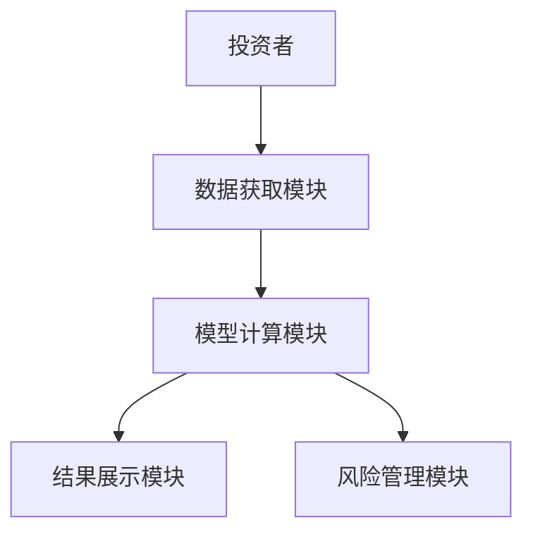
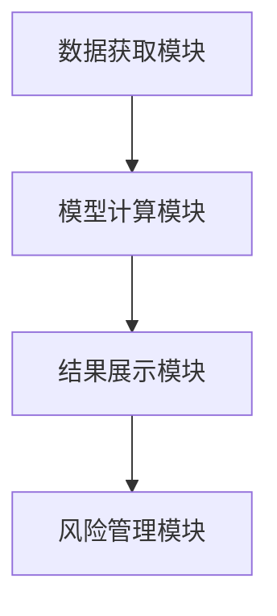
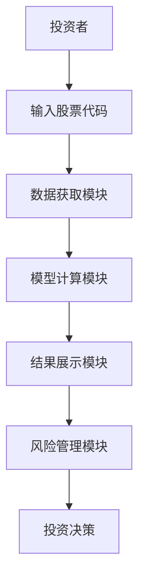

                 


# 巴菲特的股息增长策略：通货膨胀时代的收益来源

---

## 关键词  
巴菲特, 股息增长策略, 通货膨胀, 股票投资, 投资策略, 股息贴现模型

---

## 摘要  
本文深入探讨了巴菲特的股息增长策略在通货膨胀时代的应用与优势。通过分析股息增长策略的核心原理、数学模型、系统设计和实际案例，本文为投资者提供了在通货膨胀环境下利用股息增长策略实现稳健收益的深度见解。文章结合技术语言和投资策略，详细解读了股息增长策略的实现方法，并通过实际项目案例展示了其在通货膨胀环境下的收益潜力。

---

# 第1章 巴菲特的投资理念与股息增长策略概述

## 1.1 巴菲特的投资哲学  
### 1.1.1 巴菲特的生平与投资理念  
沃伦·巴菲特是全球最成功的投资者之一，他的投资哲学以“价值投资”为核心。他强调购买优质企业的一部分，并长期持有，而非频繁交易。  
**核心观点**：巴菲特认为，投资的本质是寻找那些具有持续竞争优势、良好治理结构和稳定盈利能力的企业，并通过长期持有实现价值增长。  

### 1.1.2 巴菲特的价值投资原则  
巴菲特的价值投资原则包括以下几点：  
1. **寻找具有护城河的企业**：企业应具备竞争优势，能够在较长时期内保持高盈利能力。  
2. **关注企业的基本面**：包括收入、利润、资产负债表和现金流等财务指标。  
3. **长期持有**：避免短期市场波动的干扰，耐心等待企业的价值体现。  

### 1.1.3 巴菲特对股息投资的独特见解  
巴菲特早期并不偏好股息投资，但随着年龄增长，他逐渐意识到股息收入在投资组合中的重要性。他认为，股息是企业盈利能力的体现，也是投资组合收益的重要来源。  

---

## 1.2 股息增长策略的核心概念  
### 1.2.1 股息增长策略的定义  
股息增长策略是指通过投资那些能够持续增长股息的公司，以实现投资组合收益最大化的一种投资策略。其核心在于选择股息收益率稳定增长的股票。  

### 1.2.2 股息增长策略的特点  
1. **稳定性**：股息收入能够提供稳定的现金流，降低投资组合的波动性。  
2. **抗通胀性**：在通货膨胀环境下，股息的增长可以部分抵消通胀对投资收益的侵蚀。  
3. **可持续性**：优质企业的股息增长能力通常较强，能够为投资者提供长期稳定的收益。  

### 1.2.3 股息增长策略与巴菲特投资理念的结合  
巴菲特的投资理念与股息增长策略高度契合，因为两者都强调选择具有持续盈利能力的企业。巴菲特的股息增长策略注重企业的股息支付能力、股息增长潜力和财务稳定性。  

---

## 1.3 股息增长策略的优势与局限性  
### 1.3.1 股息增长策略的优势  
1. **稳定的现金流**：股息收入能够为投资者提供稳定的现金流，尤其是在经济下行周期中，股息收入的稳定性尤为显著。  
2. **抗通胀能力**：股息的增长能够部分抵消通货膨胀对购买力的侵蚀。  
3. **长期收益潜力**：股息增长型企业通常具有较高的ROE（净资产收益率）和稳定的盈利能力，能够为投资者带来长期收益。  

### 1.3.2 股息增长策略的局限性  
1. **市场波动风险**：尽管股息收入稳定，但股价仍受市场波动影响。  
2. **依赖企业盈利**：股息增长依赖于企业的盈利能力，如果企业盈利下降，股息增长可能受到限制。  
3. **初始收益率较低**：与高股息收益率股票相比，股息增长型股票的初始股息收益率可能较低。  

### 1.3.3 股息增长策略的适用场景  
股息增长策略适用于长期投资者，尤其是那些希望通过稳定股息收入实现财富增长的投资者。在通货膨胀环境下，股息增长策略的抗通胀特性使其更具吸引力。  

---

# 第2章 股息增长策略的数学模型与分析  

## 2.1 股息增长模型的建立  
### 2.1.1 股息增长模型的定义  
股息增长模型（Dividend Growth Model）是一种用于评估股票内在价值的数学模型。它假设股息将以恒定速率增长，并通过股息贴现模型（DDM）计算股票的公允价值。  

### 2.1.2 股息增长模型的假设条件  
1. 股息将以恒定速率 \( g \) 增长。  
2. 股票的资本利得风险（beta）为零。  
3. 投资者的预期回报率 \( k \) 大于股息增长率 \( g \)。  

### 2.1.3 股息增长模型的公式推导  
股息增长模型的公式为：  
$$ V = \frac{D_1}{k - g} $$  
其中，\( D_1 \) 是第一期的股息，\( k \) 是投资者要求的回报率，\( g \) 是股息增长率。  

---

## 2.2 股息增长模型的数学分析  
### 2.2.1 股息增长模型的数学表达式  
$$ V = \frac{D_0 (1 + g)}{k - g} $$  
其中，\( D_0 \) 是当前股息，\( g \) 是股息增长率，\( k \) 是投资者要求的回报率。  

### 2.2.2 股息增长模型的变量解释  
- **股息增长率 \( g \)**：企业的股息增长速度，通常基于历史股息增长率或管理层的股息增长承诺。  
- **投资者回报率 \( k \)**：投资者对投资的预期回报率，与市场利率和风险偏好相关。  

### 2.2.3 股息增长模型的适用范围  
股息增长模型适用于那些股息稳定增长、具有持续盈利能力的企业。  

---

## 2.3 股息增长模型的实际应用  
### 2.3.1 股息增长模型在巴菲特投资中的应用  
巴菲特通常选择那些股息增长率稳定且具有较高ROE的企业。例如，可口可乐和富国银行就是典型的股息增长型企业。  

### 2.3.2 股息增长模型的案例分析  
假设某企业的当前股息为 $1，股息增长率为 5%，投资者的预期回报率为 10%。根据股息增长模型，该股票的公允价值为：  
$$ V = \frac{1 \times (1 + 0.05)}{0.10 - 0.05} = \frac{1.05}{0.05} = 21 $$  
因此，该股票的公允价值为 $21。  

### 2.3.3 股息增长模型的优缺点  
- **优点**：简单易用，能够快速评估股票的内在价值。  
- **缺点**：假设股息增长率恒定，与实际市场情况可能存在偏差。  

---

# 第3章 股息增长策略在通货膨胀环境下的表现  

## 3.1 通货膨胀对股息增长策略的影响  
### 3.1.1 通货膨胀的定义与特征  
通货膨胀是指物价水平持续上涨，导致货币购买力下降的经济现象。  

### 3.1.2 通货膨胀对股息收益率的影响  
在通货膨胀环境下，股息收益率的实际购买力会下降。因此，股息增长型企业需要通过提高股息支付率来维持实际股息收入。  

### 3.1.3 通货膨胀对股息增长策略的挑战  
1. 股息增长率可能低于通货膨胀率，导致实际股息收入下降。  
2. 股价可能受到通货膨胀预期的影响，出现非理性上涨。  

---

## 3.2 股息增长策略在通货膨胀环境下的优势  
### 3.2.1 股息增长策略的抗通胀能力  
股息增长策略通过持续增加股息支付，能够在一定程度上抵消通货膨胀对购买力的侵蚀。  

### 3.2.2 股息增长策略在通胀周期中的表现  
在通货膨胀周期中，股息增长型企业通常能够保持较高的盈利能力，并通过增加股息支付率保护股东利益。  

### 3.2.3 股息增长策略在通胀环境下的风险管理  
投资者可以通过分散投资、选择具有强健财务状况的企业以及关注股息增长率来降低通货膨胀风险。  

---

## 3.3 股息增长策略的历史案例分析  
### 3.3.1 巴菲特的经典投资案例  
巴菲特投资可口可乐公司就是一个典型的股息增长策略案例。可口可乐公司长期保持稳定的股息增长，为巴菲特提供了稳定的现金流。  

### 3.3.2 股息增长策略在历史通胀周期中的表现  
在20世纪70年代的高通胀时期，股息增长型企业表现优于其他类型的企业。  

### 3.3.3 股息增长策略的未来展望  
随着全球经济的不确定性增加，股息增长策略在通货膨胀环境下的优势将更加明显。  

---

# 第4章 股息增长策略的系统分析与架构设计  

## 4.1 股息增长策略的系统架构  
### 4.1.1 系统架构的定义  
股息增长策略的投资决策支持系统由数据获取、模型计算、结果展示和风险管理四个模块组成。  

### 4.1.2 股息增长策略的系统模块划分  
- **数据获取模块**：从金融数据源获取企业的股息数据和财务报表。  
- **模型计算模块**：使用股息增长模型计算股票的公允价值。  
- **结果展示模块**：将计算结果以可视化形式呈现。  
- **风险管理模块**：监控投资组合的风险，并提出风险管理建议。  

### 4.1.3 系统架构的图示化展示（使用Mermaid图）  


---

## 4.2 股息增长策略的功能设计  
### 4.2.1 系统功能模块的划分  
- **数据获取模块**：支持从Yahoo Finance等数据源获取股票数据。  
- **模型计算模块**：实现股息增长模型的计算功能。  
- **结果展示模块**：以图表形式展示计算结果。  
- **风险管理模块**：提供风险评估和预警功能。  

### 4.2.2 每个功能模块的详细描述  
- **数据获取模块**：通过API接口获取股票的历史股息数据和财务报表。  
- **模型计算模块**：使用股息增长模型计算股票的公允价值，并生成股息增长曲线。  
- **结果展示模块**：以折线图形式展示股息增长率和股票价值的变化趋势。  
- **风险管理模块**：基于VaR（在险价值）模型评估投资组合的风险。  

### 4.2.3 功能模块之间的交互关系  


---

## 4.3 股息增长策略的接口设计  
### 4.3.1 系统接口的定义  
- **输入接口**：接收股票代码和股息数据。  
- **输出接口**：提供股票的公允价值和股息增长曲线。  

### 4.3.2 系统接口的详细描述  
- **输入接口**：投资者输入股票代码，系统从数据源获取股息数据。  
- **输出接口**：系统计算股票的公允价值，并以图表形式展示股息增长曲线。  

---

## 4.4 股息增长策略的系统交互流程  


---

# 第5章 股息增长策略的项目实战  

## 5.1 项目环境与工具安装  
### 5.1.1 项目环境的搭建  
- **操作系统**：Windows 10 或 macOS 10.15以上。  
- **编程语言**：Python 3.8以上。  
- **开发工具**：PyCharm或VS Code。  
- **数据源**：Yahoo Finance API。  

### 5.1.2 项目工具的安装与配置  
- **安装Python库**：`pandas`, `numpy`, `yfinance`, `matplotlib`。  
- **配置Yahoo Finance API**：注册并获取API密钥。  

---

## 5.2 项目核心实现源代码  
```python
import yfinance as yf
import pandas as pd
import numpy as np
import matplotlib.pyplot as plt

def calculate_dividend_growth_value(stock_ticker, dividend_growth_rate, required_return):
    # 获取股票的历史股息数据
    stock_data = yf.Ticker(stock_ticker)
    dividend_history = stock_data.dividends
    current_dividend = dividend_history.iloc[-1]
    
    # 计算股票的公允价值
    value = current_dividend * (1 + dividend_growth_rate) / (required_return - dividend_growth_rate)
    return value

# 示例：计算可口可乐的股息增长价值
ticker = "KO"
dividend_growth_rate = 0.05
required_return = 0.10
value = calculate_dividend_growth_value(ticker, dividend_growth_rate, required_return)
print(f"{ticker}的公允价值为：{value:.2f}")
```

---

## 5.3 项目实现步骤与代码解读  
### 5.3.1 数据获取  
使用Yahoo Finance API获取股票的历史股息数据。  

### 5.3.2 模型计算  
根据股息增长模型公式计算股票的公允价值。  

### 5.3.3 结果展示  
将计算结果以图表形式展示，帮助投资者直观了解股息增长策略的表现。  

---

## 5.4 项目小结  
通过本项目，投资者可以掌握股息增长策略的实际应用方法，并通过Python代码实现股息增长模型的计算。这为投资者在通货膨胀环境下制定投资决策提供了有力支持。  

---

# 第6章 股息增长策略的最佳实践与风险管理  

## 6.1 投资策略与风险管理  
### 6.1.1 投资组合的构建  
投资者应根据自身的风险承受能力和投资目标构建投资组合。  

### 6.1.2 股票筛选标准  
1. 股息增长率稳定且高于通货膨胀率。  
2. 企业具有持续盈利能力。  
3. 企业财务状况健康，资产负债率合理。  

---

## 6.2 投资策略的优化与调整  
### 6.2.1 定期复盘与调整  
投资者应定期复盘投资组合的表现，并根据市场环境调整投资策略。  

### 6.2.2 关注宏观经济指标  
关注通货膨胀率、利率和市场波动等宏观经济指标，及时调整投资策略。  

---

## 6.3 最佳实践 tips  
1. **分散投资**：避免将所有资金投入单一股票，降低投资风险。  
2. **长期持有**：股息增长策略需要时间积累，耐心是成功的关键。  
3. **关注企业基本面**：选择具有持续盈利能力的企业，确保股息增长的可持续性。  

---

## 6.4 项目小结  
股息增长策略是一种有效的投资策略，但在实际操作中需要结合市场环境和企业基本面进行调整。投资者应注重风险管理，避免盲目跟风，确保投资决策的科学性和稳健性。  

---

# 第7章 总结与展望  

## 7.1 股息增长策略的总结  
股息增长策略通过选择具有持续股息增长能力的企业，能够在通货膨胀环境下为投资者提供稳定的收益。  

## 7.2 股息增长策略的未来展望  
随着全球经济的不确定性增加，股息增长策略在通货膨胀环境下的优势将更加明显。投资者应密切关注宏观经济指标和企业基本面，灵活调整投资策略，以应对市场的变化。  

---

# 附录  

## 附录1：巴菲特经典语录  
- “股息是企业的利润的一部分，而利润是企业的核心。”  
- “我最喜欢的投资是那些能够持续派发股息的企业。”  

## 附录2：推荐阅读  
1. 《巴菲特的智慧》  
2. 《股息投资实战指南》  

## 附录3：工具推荐  
1. **Yahoo Finance API**：用于获取股票数据。  
2. **Excel/Google Sheets**：用于简单的股息增长模型计算。  
3. **Python**：用于实现股息增长策略的自动化分析。  

---

# 结语  
通过本文的深入探讨，读者可以全面了解巴菲特的股息增长策略，并掌握其在通货膨胀环境下的应用方法。希望本文能够为投资者在复杂多变的市场环境中提供有益的指导和启示。

