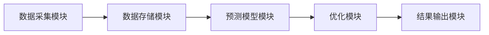

                 


# 巴菲特的股息增长策略：量子科技公司的现金流管理

## 关键词
巴菲特，股息增长策略，现金流管理，量子科技公司，投资策略，财务分析

## 摘要
本文探讨巴菲特的股息增长策略在量子科技公司现金流管理中的应用，分析其核心原理和实际操作，提供详尽的案例分析和系统设计，帮助读者理解如何通过现金流管理优化股息分配，实现长期投资价值。

---

## 第一部分：背景介绍

### 第1章：股息增长策略与量子科技公司的现金流管理

#### 1.1 股息增长策略的背景
- **1.1.1 股息增长策略的定义**  
  股息增长策略是一种长期投资策略，强调选择股息收益率稳定且持续增长的公司，通过 reinvest 追加投资，实现财富的指数级增长。

- **1.1.2 股息增长策略的历史发展**  
  巴菲特推崇股息增长策略，认为稳定的现金流是企业长期发展的基石。通过股息再投资，投资者可以享受复利效应。

- **1.1.3 股息增长策略的核心理念**  
  选择具备持续盈利能力和稳定现金流的公司，通过长期持有和股息再投资，实现财富的稳步增长。

#### 1.2 量子科技公司的现金流管理
- **1.2.1 量子科技公司的定义**  
  量子科技公司是指在量子计算、量子通信等领域的高科技企业，通常具有高研发投入、高成长性和高风险的特点。

- **1.2.2 现金流管理的重要性**  
  量子科技公司的现金流管理至关重要，因为这些公司通常需要大量资金支持研发和扩张，稳定的现金流是企业生存和发展的关键。

- **1.2.3 量子科技公司现金流管理的独特性**  
  量子科技公司的现金流管理需要考虑高研发投入、技术更新快和市场不确定性等特殊因素，这对现金流预测和管理提出了更高的要求。

#### 1.3 股息增长策略与现金流管理的结合
- **1.3.1 股息增长策略与现金流管理的关系**  
  现金流是股息分配的基础，稳定的现金流是股息增长的前提。

- **1.3.2 量子科技公司应用股息增长策略的优势**  
  通过有效的现金流管理，量子科技公司可以实现股息的稳定增长，吸引更多长期投资者，提升企业价值。

- **1.3.3 应用中的挑战与解决方案**  
  量子科技公司的高研发投入和高风险可能导致现金流不稳定，解决方案包括加强现金流预测和优化资本结构。

---

## 第二部分：核心概念与联系

### 第2章：股息增长策略的核心概念

#### 2.1 股息增长策略的原理
- 股息增长策略依赖于企业的盈利能力、股息支付率和股息增长率。
- 企业需要保持稳定的现金流，以支持股息的增长。

#### 2.2 现金流管理的原理
- 现金流管理涉及现金流的预测、监控和优化。
- 通过有效的现金流管理，企业可以确保股息的稳定分配和业务的持续发展。

#### 2.3 股息增长策略与现金流管理的联系
- 股息增长策略依赖于现金流管理，现金流管理是股息增长的基础。
- 通过优化现金流管理，企业可以实现股息的持续增长，提升股东价值。

---

## 第三部分：算法原理讲解

### 第3章：股息增长策略的算法原理

#### 3.1 现金流预测的算法
- **数据收集**：收集历史财务数据，包括收入、成本、利润等。
- **模型选择**：使用时间序列模型（如ARIMA）或机器学习模型进行预测。
- **预测结果**：输出未来现金流的预测值。

```python
from statsmodels.tsa.arima_model import ARIMA
import pandas as pd

# 假设我们有一个名为 cash_flow的历史现金流数据
data = pd.read_csv('cash_flow.csv')
model = ARIMA(data['cash'], order=(1, 1, 1))
model_fit = model.fit()
forecast = model_fit.forecast(steps=5)
print(forecast)
```

#### 3.2 股息分配的算法
- **股息支付率计算**：股息支付率 = 股息/净利润。
- **股息增长率计算**：股息增长率 = (本年股息 - 上年股息)/上年股息。
- **股息分配优化**：根据现金流预测和股息支付率，优化股息分配策略。

```python
def calculate_dividend_growth(last_year_dividend, current_year_dividend):
    growth_rate = ((current_year_dividend - last_year_dividend) / last_year_dividend) * 100
    return growth_rate

last_year_dividend = 1.0
current_year_dividend = 1.1
growth_rate = calculate_dividend_growth(last_year_dividend, current_year_dividend)
print(f"股息增长率：{growth_rate}%")
```

#### 3.3 现金流预测与股息分配的协同优化
- **协同优化步骤**：
  1. 预测未来现金流。
  2. 根据预测现金流和净利润，计算股息支付率。
  3. 确定股息分配策略，确保股息的可持续增长。

---

## 第四部分：数学模型和公式

### 第4章：数学模型与公式

#### 4.1 现金流的时间价值模型
- 现金流的现值计算公式：
$$ PV = \sum_{t=1}^{n} \frac{CF_t}{(1 + r)^t} $$

#### 4.2 股息增长模型
- 股息增长模型的公式：
$$ P = \frac{D_1}{r - g} $$
其中，P为股票价格，D1为下一周期的股息，r为折现率，g为股息增长率。

#### 4.3 现金流预测的数学公式
- 线性回归模型用于现金流预测：
$$ CF_t = a + bt + \epsilon $$

---

## 第五部分：系统分析与架构设计

### 第5章：系统分析与架构设计

#### 5.1 系统组成部分
- **数据采集模块**：收集财务数据。
- **预测模型模块**：预测现金流。
- **优化模块**：优化股息分配策略。

#### 5.2 系统功能设计
- **数据处理功能**：清洗和转换数据。
- **预测功能**：使用ARIMA模型预测现金流。
- **优化功能**：优化股息分配策略。

#### 5.3 系统架构设计
- 使用微服务架构，各模块独立运行，通过API进行通信。



---

## 第六部分：项目实战

### 第6章：项目实战

#### 6.1 环境安装
- 安装Python和相关库（如pandas、statsmodels）。
- 安装Jupyter Notebook用于数据分析和可视化。

#### 6.2 核心实现
- 实现现金流预测和股息分配优化的代码。

```python
import pandas as pd
from statsmodels.tsa.arima_model import ARIMA

# 数据加载
data = pd.read_csv('cash_flow.csv')

# 建立ARIMA模型
model = ARIMA(data['cash'], order=(1, 1, 1))
model_fit = model.fit()

# 预测未来5期现金流
forecast = model_fit.forecast(steps=5)
print(forecast)

# 股息分配优化
last_year_dividend = 1.0
current_year_dividend = 1.1
growth_rate = ((current_year_dividend - last_year_dividend) / last_year_dividend) * 100
print(f"股息增长率：{growth_rate}%")
```

#### 6.3 案例分析
- 以一家量子科技公司为例，分析其现金流和股息分配情况。
- 通过模型预测未来现金流，并优化股息分配策略。

---

## 第七部分：最佳实践

### 第7章：最佳实践

#### 7.1 小结
- 巴菲特的股息增长策略与量子科技公司的现金流管理密切相关。
- 通过有效的现金流管理，可以实现股息的持续增长，提升企业价值。

#### 7.2 注意事项
- 现金流预测需要考虑多种不确定性因素。
- 股息分配需要平衡短期利益和长期发展。

#### 7.3 拓展阅读
- 推荐阅读巴菲特的《巴菲特致股东的信》。
- 参考相关学术论文，深入了解现金流管理和股息增长策略的最新研究。

---

通过本文的分析和实践，读者可以深入了解巴菲特的股息增长策略在量子科技公司现金流管理中的应用，并掌握相关的算法和系统设计方法。希望本文能为投资者和企业管理人员提供有价值的参考。

