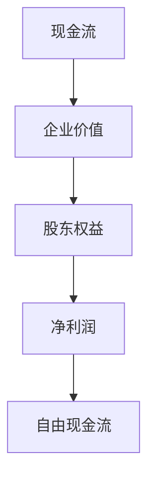

                 

# 巴菲特的自由现金流分析：公司价值的核心指标

## 关键词：巴菲特、自由现金流、企业估值、投资决策、财务分析、价值投资

## 摘要：本文深入探讨了巴菲特的自由现金流分析方法，揭示其在公司估值和投资决策中的核心作用。通过详细分析自由现金流的计算、应用、行业案例以及系统架构，帮助读者掌握这一关键指标，提升投资分析能力。

---

# 第一部分: 巴菲特的自由现金流分析基础

## 第1章: 巴菲特投资理念与自由现金流概述

### 1.1 巴菲特投资理念的核心思想

#### 1.1.1 巴菲特的价值投资哲学
巴菲特的价值投资哲学以“寻找具有持续竞争优势、良好管理团队和合理估值的企业”为核心。他强调企业内在价值的重要性，认为市场波动不应影响长期投资决策。

#### 1.1.2 自由现金流在巴菲特投资中的地位
自由现金流是巴菲特评估企业内在价值的核心指标之一。他认为，企业应能产生稳定的自由现金流，以支持持续的股东价值创造。

#### 1.1.3 自由现金流与企业价值的关系
自由现金流直接反映了企业的盈利能力和财务健康状况。高且稳定的自由现金流意味着企业具有较强的盈利能力和支付能力。

### 1.2 自由现金流的定义与特点

#### 1.2.1 自由现金流的定义
自由现金流（FCF，Free Cash Flow）是指企业在扣除运营所需资本支出后的剩余现金流，用于偿还债务、分红或再投资。

#### 1.2.2 自由现金流的核心特点
- **可自由支配性**：现金流可用于股东回报或再投资。
- **可持续性**：稳定的自由现金流表明企业具备持续盈利能力。
- **时间价值性**：现金流的时间价值需通过折现法评估。

#### 1.2.3 自由现金流与净利润的区别
自由现金流扣除资本支出后，更能反映企业的实际盈利能力。净利润包含非现金项目，可能无法真实反映企业现金流状况。

### 1.3 自由现金流的计算方法

#### 1.3.1 自由现金流的基本计算公式
$$\text{FCF} = \text{净利润} + \text{非现金费用} - \text{资本支出}$$

#### 1.3.2 调整后自由现金流的计算
调整后的自由现金流考虑了营运资本变化和其他现金流调整，更准确地反映企业实际现金流状况。

#### 1.3.3 自由现金流与企业价值的关系
自由现金流是企业价值的核心驱动因素，通过折现模型评估企业整体价值。

---

## 第2章: 自由现金流分析的背景与意义

### 2.1 自由现金流分析的背景

#### 2.1.1 传统财务指标的局限性
净利润和营业收入等指标可能无法真实反映企业现金流状况，尤其是在资本密集型行业。

#### 2.1.2 自由现金流分析的兴起
随着价值投资兴起，投资者意识到自由现金流在评估企业内在价值中的重要性。

#### 2.1.3 巴菲特对自由现金流的重视
巴菲特认为自由现金流是评估企业财务健康和投资价值的关键指标。

### 2.2 自由现金流分析的意义

#### 2.2.1 评估企业财务健康的核心指标
自由现金流反映企业的盈利能力和财务健康状况。

#### 2.2.2 识别企业内在价值的关键工具
通过自由现金流分析，投资者可以识别企业的内在价值，做出明智的投资决策。

#### 2.2.3 投资决策中的应用
自由现金流分析帮助投资者评估企业的成长潜力和分红能力。

---

## 第3章: 自由现金流的核心概念与联系

### 3.1 自由现金流的核心概念

#### 3.1.1 自由现金流的构成要素
- **经营现金流**：企业经营活动中产生的现金流。
- **资本支出**：维持或扩展企业经营所需的投资。
- **非现金费用**：如折旧和摊销。

#### 3.1.2 自由现金流的时间价值
现金流的时间价值需通过折现法评估，以确定其现值。

#### 3.1.3 自由现金流的风险因素
行业风险、市场风险和企业特有风险均影响自由现金流的稳定性。

### 3.2 自由现金流与相关概念的对比

#### 3.2.1 自由现金流与净利润的对比
净利润包含非现金项目，而自由现金流扣除资本支出，更能反映企业实际现金流状况。

#### 3.2.2 自由现金流与经营活动现金流的对比
经营活动现金流反映企业日常运营产生的现金流，而自由现金流进一步扣除资本支出。

#### 3.2.3 自由现金流与股东权益的对比
自由现金流用于股东回报，而股东权益是企业资产减去负债后的净值。

### 3.3 自由现金流的ER实体关系图

---

## 第4章: 自由现金流分析的数学模型与公式

### 4.1 自由现金流的基本公式

$$\text{FCF} = \text{净利润} + \text{非现金费用} - \text{资本支出}$$

### 4.2 自由现金流的折现模型

$$\text{企业价值} = \sum_{t=1}^{n} \frac{FCF_t}{(1+r)^t}$$

### 4.3 自由现金流的

---

# 第二部分: 自由现金流分析的应用与实战

## 第5章: 自由现金流分析的核心技巧与应用

### 5.1 自由现金流的核心技巧

#### 5.1.1 如何准确计算自由现金流
确保所有相关数据准确无误，考虑所有可能影响现金流的因素。

#### 5.1.2 自由现金流的质量评估
评估自由现金流的稳定性和可持续性，考虑企业盈利能力和市场环境。

#### 5.1.3 自由现金流的风险调整

---

## 第6章: 自由现金流分析的行业案例与实战

### 6.1 行业分析与自由现金流

#### 6.1.1 高 tech行业的自由现金流分析
以苹果公司为例，分析其自由现金流的计算和趋势。

#### 6.1.2 公用事业行业的自由现金流分析
以巴菲特投资的公司为例，分析公用事业行业的自由现金流特征。

---

## 第7章: 自由现金流分析的系统架构与工具

### 7.1 系统分析与架构设计

#### 7.1.1 数据收集与处理
收集企业财务报表数据，处理现金流相关数据。

#### 7.1.2 系统架构设计
构建自由现金流分析系统，包括数据输入、模型计算和结果输出。

---

## 第8章: 总结与展望

### 8.1 总结

### 8.2 未来展望

---

通过以上详细分析和实际案例，我们深入探讨了巴菲特的自由现金流分析方法及其在公司估值和投资决策中的核心作用。希望本文能为投资者提供实用的分析工具和方法，帮助他们在投资决策中更准确地评估企业价值。

