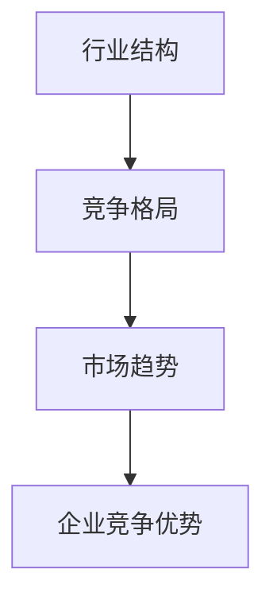
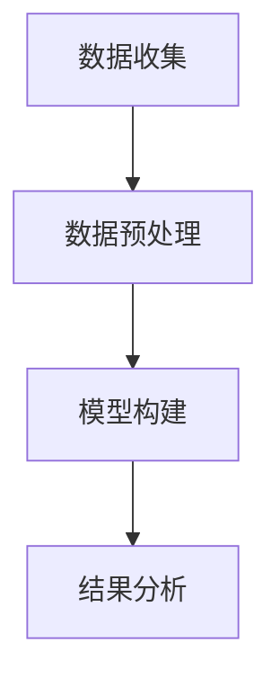
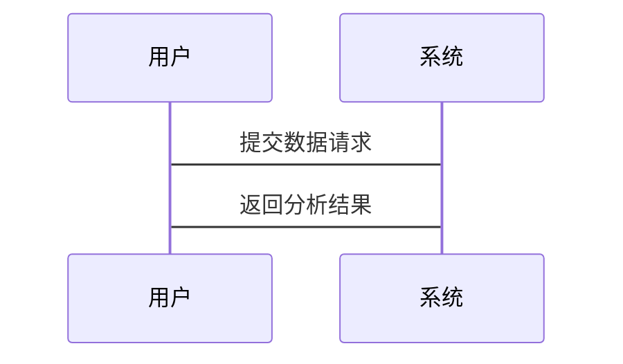

                 


# 巴菲特的行业分析方法：应对产业边界模糊化的挑战

## 关键词：巴菲特，行业分析，产业边界，投资策略，数学模型

## 摘要：本文深入探讨巴菲特的行业分析方法，结合现代产业边界模糊化的挑战，分析其核心概念、数学模型和系统架构，提供实际案例和最佳实践，帮助读者掌握应对产业变化的策略。

---

## 第1章 巴菲特的行业分析方法概述

### 1.1 巴菲特的投资理念

#### 1.1.1 价值投资的定义与核心思想

价值投资是一种以内在价值为导向的投资策略，巴菲特是其最著名的实践者。他强调购买价格低于内在价值的股票，长期持有，避免频繁交易。

#### 1.1.2 巴菲特的投资策略

巴菲特的投资策略包括寻找具有持续竞争优势、良好管理和财务健康的企业。他偏好那些能够在经济周期中稳定表现的公司。

#### 1.1.3 行业分析在巴菲特投资中的重要性

行业分析帮助巴菲特识别行业趋势、竞争优势和风险，从而做出更明智的投资决策。

### 1.2 巴菲特的行业分析框架

#### 1.2.1 行业分析的核心要素

行业分析涉及市场需求、竞争格局、财务指标和政策环境等因素。

#### 1.2.2 巴菲特的行业分析步骤

包括数据收集、竞争分析、财务评估和投资决策。

#### 1.2.3 行业分析与企业竞争优势识别

识别企业竞争优势是行业分析的关键，包括成本优势、品牌影响力和市场地位。

---

## 第2章 产业边界模糊化的挑战

### 2.1 产业边界模糊化的定义与表现

#### 2.1.1 传统产业边界的特点

传统产业边界清晰，跨行业融合较少。

#### 2.1.2 产业边界模糊化的现象

数字化转型和跨界融合导致产业边界模糊。

#### 2.1.3 模糊化对行业分析的影响

增加了分析复杂性和不确定性。

### 2.2 产业边界模糊化的成因分析

#### 2.2.1 技术进步的影响

技术进步推动跨行业融合，模糊产业边界。

#### 2.2.2 数字化与跨界融合

数字化转型使企业跨行业扩展，模糊了传统边界。

#### 2.2.3 新兴产业的出现

新兴产业的出现打破了传统的产业划分。

### 2.3 应对产业边界模糊化的必要性

#### 2.3.1 行业分析方法的演变

从传统分析转向多维度、动态分析。

#### 2.3.2 巴菲特方法的适应性

巴菲特方法仍适用，需结合新趋势进行调整。

---

## 第3章 行业分析的核心概念与工具

### 3.1 核心概念与联系

#### 3.1.1 核心概念的定义

行业结构、竞争格局和市场趋势是关键概念。

#### 3.1.2 核心概念对比表格

| 概念       | 定义                                                                 |
|------------|----------------------------------------------------------------------|
| 行业结构   | 行业内的企业分布和竞争状态                                           |
| 竞争格局   | 行业主要竞争对手及其市场份额                                         |
| 市场趋势   | 市场需求变化和未来发展方向                                             |

#### 3.1.3 分析框架的Mermaid流程图



---

## 第4章 数学模型与算法

### 4.1 数学模型的定义

数学模型用于量化分析行业和企业表现。

### 4.2 常用算法与流程图



### 4.3 Python代码实现

```python
import pandas as pd
import numpy as np

def industry_analysis(data):
    # 数据预处理
    data = data.dropna()
    # 计算市场份额
    market_share = data['revenue'] / data['revenue'].sum()
    # 竞争强度评估
    competition_intensity = np.mean(abs(market_share - market_share.mean()))
    return competition_intensity

# 示例数据
data = {
    'revenue': [100, 200, 300, 400],
    'profit': [20, 30, 40, 50]
}
df = pd.DataFrame(data)
print(industry_analysis(df))
```

---

## 第5章 系统分析与架构设计方案

### 5.1 系统架构设计

#### 5.1.1 功能模块设计

| 模块       | 功能描述                                   |
|------------|------------------------------------------|
| 数据收集   | 收集行业数据                               |
| 数据分析   | 分析数据并生成报告                         |
| 可视化展示 | 展示分析结果                               |

#### 5.1.2 系统架构图


#### 5.1.3 接口设计

- 数据收集接口：接收外部数据源。
- 分析接口：处理数据并返回结果。
- 展示接口：显示分析结果。

#### 5.1.4 交互流程



---

## 第6章 项目实战

### 6.1 项目背景与目标

分析电动汽车行业的竞争格局和市场趋势。

### 6.2 核心代码实现

```python
import matplotlib.pyplot as plt

def plot_market_trend(data):
    plt.figure(figsize=(10, 6))
    plt.plot(data['year'], data['sales'], label='销售额')
    plt.xlabel('年份')
    plt.ylabel('销售额')
    plt.title('市场趋势分析')
    plt.legend()
    plt.show()

# 示例数据
data = {
    'year': [2018, 2019, 2020, 2021],
    'sales': [1000, 1200, 1500, 2000]
}
df = pd.DataFrame(data)
plot_market_trend(df)
```

### 6.3 实际案例分析

以电动汽车行业为例，分析市场需求和竞争格局，识别行业趋势和潜在投资机会。

---

## 第7章 最佳实践与总结

### 7.1 最佳实践

1. **数据准确性**：确保数据来源可靠。
2. **可视化工具**：使用图表清晰展示分析结果。
3. **定期更新**：行业分析需持续更新以应对变化。

### 7.2 项目小结

通过案例分析，展示了巴菲特方法在应对产业边界模糊化中的应用，强调了动态分析的重要性。

### 7.3 注意事项

- 避免过度依赖单一数据源。
- 定期评估分析模型的有效性。
- 保持对行业趋势的敏感性。

### 7.4 拓展阅读

推荐书籍：《巴菲特选股之道》和工具：Excel、Python。

---

## 第8章 拓展阅读与未来展望

### 8.1 拓展阅读

推荐相关书籍和工具，帮助读者深入学习。

### 8.2 未来展望

行业分析将更多依赖AI和大数据技术，巴菲特方法将结合新技术持续发展。

---

## 总结

本文系统地探讨了巴菲特的行业分析方法，并结合现代产业边界模糊化的挑战，提供了理论、方法和实际案例。通过数学模型和系统设计，帮助读者应对复杂多变的产业环境。

