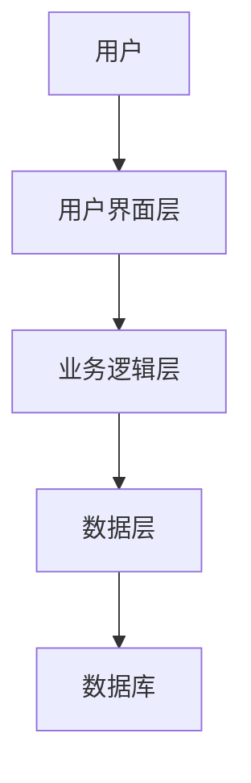
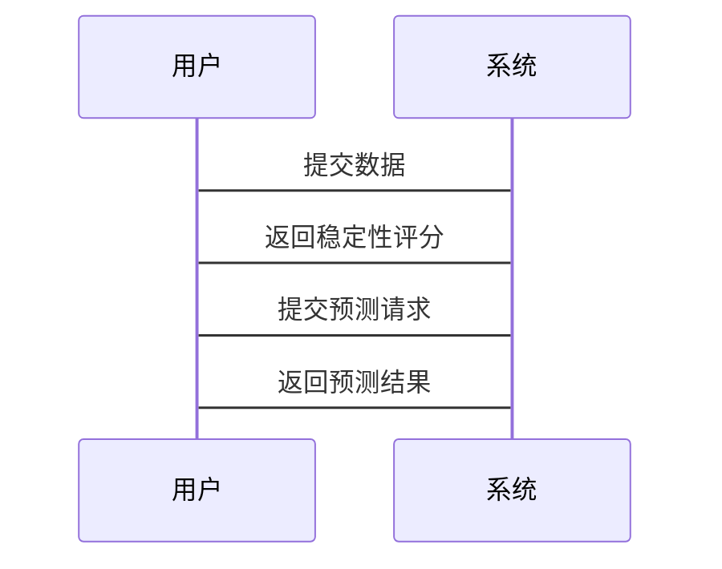

                 


# 巴菲特的行业选择标准：聚焦稳定性和可预测性

> 关键词：巴菲特，行业选择，稳定性，可预测性，投资策略，价值投资

> 摘要：本文从巴菲特的投资哲学出发，深入分析其行业选择标准，重点探讨稳定性和可预测性在投资决策中的重要性。通过技术术语的解析和实际案例的分析，展示如何将这些标准应用于技术领域，提供系统的分析框架和算法模型。

## 第一部分：背景介绍

### 第1章：巴菲特的投资哲学

#### 1.1 价值投资的核心理念
巴菲特的价值投资理念强调购买低于内在价值的股票，并长期持有。这种理念要求投资者深入分析企业的财务状况、行业地位和管理团队，以确保投资的安全性和稳定性。

#### 1.2 长期投资的重要性
长期投资是巴菲特策略的核心，他相信市场短期波动无法预测，但长期趋势可以通过对企业基本面的深入分析来把握。长期投资能够平滑短期波动带来的影响，实现稳定的收益。

#### 1.3 投资中的安全边际概念
安全边际是指股票的市场价格低于其内在价值的程度。通过购买具有较大安全边际的股票，巴菲特降低了投资的风险，确保了投资的稳定性。

### 第2章：行业选择的核心要素

#### 2.1 行业稳定性的定义
行业稳定性指的是企业在不同市场周期中的表现，包括收入、利润和市场份额的稳定性。稳定的行业通常在经济波动中表现出较小的波动性，从而为投资者提供更安全的投资环境。

#### 2.2 可预测性的核心要素
可预测性是指行业未来发展的明确程度，包括市场需求、技术发展和政策变化等方面。具有较高可预测性的行业通常具有稳定的增长趋势，使得投资者能够更好地规划和管理投资风险。

#### 2.3 行业选择的长期视角
巴菲特在选择行业时，通常关注那些具有长期增长潜力的行业，而非短期热点行业。他更倾向于投资那些在经济周期中表现稳定的行业，如公用事业、消费品和金融等。

## 第二部分：核心概念与联系

### 第3章：核心概念的原理

#### 3.1 行业稳定性的评估指标
- **财务稳定性**：通过分析企业的财务报表，评估其收入、利润和现金流的稳定性。
- **市场稳定性**：考察行业的市场集中度和竞争格局，确保行业不会因为过度竞争而出现波动。
- **政策稳定性**：分析行业受政策影响的程度，确保投资不会因为政策变化而遭受重大损失。

#### 3.2 可预测性的关键因素
- **市场需求**：评估行业的市场需求是否稳定且可预测。
- **技术发展**：分析行业的技术发展趋势，确保技术变革不会对行业产生重大影响。
- **政策环境**：考察政策环境的稳定性，确保行业不会因为政策变化而受到负面影响。

### 第4章：核心概念的联系

#### 4.1 稳定性与可预测性的对比分析
通过对比分析，我们可以发现，稳定性关注的是企业在不同市场环境下的表现，而可预测性关注的是行业未来发展的明确程度。两者共同构成了巴菲特行业选择的核心标准。

#### 4.2 稳定性与可预测性的关系
稳定性是可预测性的基础，只有在行业稳定的前提下，才能更准确地预测其未来的发展趋势。因此，巴菲特在选择行业时，通常会优先考虑那些具有较高稳定性的行业，然后再评估其可预测性。

## 第三部分：算法原理讲解

### 第5章：行业稳定性评估算法

#### 5.1 算法概述
行业稳定性评估算法旨在通过量化指标来评估行业的稳定性，包括财务稳定性、市场稳定性和政策稳定性等方面。

#### 5.2 算法步骤
1. **数据采集**：收集行业的财务数据、市场数据和政策数据。
2. **指标计算**：计算各个指标，如收入增长率、利润增长率、市场集中度等。
3. **指标加权**：根据各指标的重要性进行加权，得到行业稳定性的综合评分。
4. **结果分析**：根据评分结果，将行业分为稳定、中等稳定和不稳定三类。

#### 5.3 算法代码
```python
import pandas as pd

def calculate_stability_score(industry_data):
    # 计算财务稳定性指标
    financial_stability = industry_data['revenue_growth'] * 0.4 + industry_data['profit_growth'] * 0.4
    # 计算市场稳定性指标
    market_stability = industry_data['market_share'] * 0.3 + industry_data['competition_level'] * 0.3
    # 计算政策稳定性指标
    policy_stability = industry_data['policy_impact'] * 0.2 + industry_data['regulatory_environment'] * 0.2
    # 综合稳定性评分
    stability_score = financial_stability + market_stability + policy_stability
    return stability_score

# 示例数据
industry_data = {
    'revenue_growth': 0.12,
    'profit_growth': 0.10,
    'market_share': 0.25,
    'competition_level': 0.15,
    'policy_impact': 0.10,
    'regulatory_environment': 0.15
}

# 计算稳定性评分
stability_score = calculate_stability_score(industry_data)
print(f"行业稳定性评分：{stability_score}")
```

#### 5.4 算法优化
通过调整各指标的权重，可以优化算法的准确性。例如，可以增加政策稳定性指标的权重，以反映政策变化对行业稳定性的影响。

### 第6章：行业可预测性评估算法

#### 6.1 算法概述
行业可预测性评估算法旨在通过分析行业的历史数据和市场趋势，预测其未来的发展方向。

#### 6.2 算法步骤
1. **数据采集**：收集行业的历史数据，包括收入、利润、市场份额等。
2. **趋势分析**：分析行业的主要趋势，如收入增长趋势、利润增长趋势等。
3. **预测模型构建**：使用时间序列分析或其他预测模型，预测行业的未来发展趋势。
4. **结果分析**：根据预测结果，评估行业的可预测性。

#### 6.3 算法代码
```python
import numpy as np
from sklearn.linear_model import LinearRegression

def predict_industry_growth(data):
    # 数据预处理
    X = np.array(data['year']).reshape(-1, 1)
    y = np.array(data['revenue_growth'])
    
    # 训练线性回归模型
    model = LinearRegression()
    model.fit(X, y)
    
    # 预测未来一年的收入增长
    future_year = 2024
    future_X = np.array(future_year).reshape(-1, 1)
    predicted_growth = model.predict(future_X)
    
    return predicted_growth[0]

# 示例数据
industry_growth_data = {
    'year': [2018, 2019, 2020, 2021, 2022],
    'revenue_growth': [0.08, 0.09, 0.10, 0.11, 0.12]
}

# 预测未来一年的收入增长
predicted_growth = predict_industry_growth(industry_growth_data)
print(f"预测的2024年收入增长率：{predicted_growth}")
```

#### 6.4 算法优化
通过引入更多的预测模型，如ARIMA或随机森林，可以提高预测的准确性。同时，结合行业专家的意见，可以进一步优化预测结果。

## 第四部分：系统分析与架构设计

### 第7章：系统功能设计

#### 7.1 系统功能模块
- **数据采集模块**：负责收集行业的财务数据、市场数据和政策数据。
- **数据分析模块**：对收集到的数据进行清洗、处理和分析。
- **模型构建模块**：根据分析结果，构建稳定性评估模型和可预测性评估模型。
- **结果展示模块**：将评估结果以图表形式展示，便于用户理解和决策。

#### 7.2 系统架构设计
使用分层架构，包括数据层、业务逻辑层和用户界面层。数据层负责数据的存储和管理，业务逻辑层负责数据的处理和分析，用户界面层负责与用户的交互。

### 第8章：系统架构设计

#### 8.1 系统架构图


#### 8.2 系统接口设计
- **数据接口**：提供API接口，供其他系统调用数据。
- **模型接口**：提供API接口，供其他系统调用模型进行预测和评估。

#### 8.3 系统交互设计


## 第五部分：项目实战

### 第9章：环境安装

#### 9.1 安装必要的库
- **Python**：安装Python 3.8及以上版本。
- **Pandas**：用于数据处理。
- **Scikit-learn**：用于机器学习模型的构建。
- **Mermaid**：用于绘制图表。

#### 9.2 安装步骤
1. 安装Python：`python --version`检查Python版本。
2. 安装Pandas：`pip install pandas`
3. 安装Scikit-learn：`pip install scikit-learn`
4. 安装Mermaid：`pip install mermaid`

### 第10章：核心实现

#### 10.1 稳定性评估代码
```python
import pandas as pd

def calculate_stability_score(industry_data):
    financial_stability = industry_data['revenue_growth'] * 0.4 + industry_data['profit_growth'] * 0.4
    market_stability = industry_data['market_share'] * 0.3 + industry_data['competition_level'] * 0.3
    policy_stability = industry_data['policy_impact'] * 0.2 + industry_data['regulatory_environment'] * 0.2
    stability_score = financial_stability + market_stability + policy_stability
    return stability_score

# 示例数据
industry_data = {
    'revenue_growth': 0.12,
    'profit_growth': 0.10,
    'market_share': 0.25,
    'competition_level': 0.15,
    'policy_impact': 0.10,
    'regulatory_environment': 0.15
}

# 计算稳定性评分
stability_score = calculate_stability_score(industry_data)
print(f"行业稳定性评分：{stability_score}")
```

#### 10.2 可预测性评估代码
```python
import numpy as np
from sklearn.linear_model import LinearRegression

def predict_industry_growth(data):
    X = np.array(data['year']).reshape(-1, 1)
    y = np.array(data['revenue_growth'])
    model = LinearRegression()
    model.fit(X, y)
    future_year = 2024
    future_X = np.array(future_year).reshape(-1, 1)
    predicted_growth = model.predict(future_X)
    return predicted_growth[0]

# 示例数据
industry_growth_data = {
    'year': [2018, 2019, 2020, 2021, 2022],
    'revenue_growth': [0.08, 0.09, 0.10, 0.11, 0.12]
}

# 预测未来一年的收入增长
predicted_growth = predict_industry_growth(industry_growth_data)
print(f"预测的2024年收入增长率：{predicted_growth}")
```

### 第11章：案例分析

#### 11.1 案例背景
选择一个具体的行业，如科技行业，进行稳定性评估和可预测性分析。

#### 11.2 数据分析
收集科技行业的历史数据，包括收入、利润、市场份额等。

#### 11.3 结果展示
展示分析结果，包括稳定性评分和未来预测增长率。

## 第六部分：最佳实践

### 第12章：总结与反思

#### 12.1 总结
通过本文的分析和实践，我们可以看到，巴菲特的行业选择标准在技术领域同样具有重要的应用价值。稳定性与可预测性是投资成功的关键因素。

#### 12.2 反思
在实际应用中，可能会遇到数据不足、模型准确性等问题。需要不断优化算法和模型，以提高评估的准确性。

### 第13章：最佳实践

#### 13.1 投资建议
- **长期投资**：选择具有长期增长潜力的行业，避免短期波动的影响。
- **分散投资**：通过分散投资降低风险，避免将所有资金投入到单一行业。
- **持续学习**：不断学习新的知识和技能，提高自身的投资能力。

#### 13.2 拓展阅读
- 《巴菲特的选股标准》
- 《投资最重要的事》
- 《可预测性投资策略》

## 第七部分：附录

### 第14章：附录

#### 14.1 稳定性评估模型的详细公式
$$稳定性评分 = \alpha \times 财务稳定性 + \beta \times 市场稳定性 + \gamma \times 政策稳定性$$
其中，$\alpha + \beta + \gamma = 1$，且$\alpha > \beta > \gamma$。

#### 14.2 可预测性评估模型的详细公式
$$预测增长率 = \theta \times 历史增长率 + \phi \times 市场趋势 + \psi \times 政策影响$$
其中，$\theta + \phi + \psi = 1$，且$\theta > \phi > \psi$。

#### 14.3 行业稳定性评分标准
- **高评分**（0.8-1.0）：行业稳定性高，适合长期投资。
- **中评分**（0.6-0.8）：行业稳定性中等，投资需谨慎。
- **低评分**（0.4-0.6）：行业稳定性低，投资风险较高。

通过以上分析和实践，我们可以更好地理解巴菲特的行业选择标准，并将其应用于实际投资中，实现稳健的收益。

