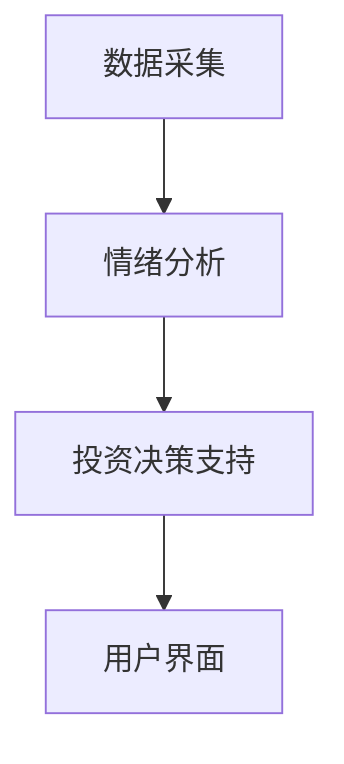
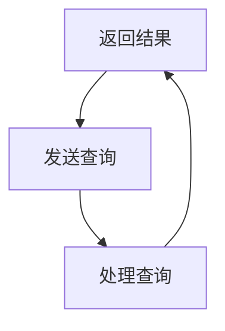

                 


# 巴菲特的行为金融学应用：社交媒体时代的群体心理

> **关键词**：巴菲特，行为金融学，社交媒体，群体心理，投资心理学，算法分析

> **摘要**：本文探讨了巴菲特投资理念与行为金融学的结合，特别是在社交媒体时代，群体心理如何影响投资决策。通过分析行为金融学的核心理论、社交媒体对投资者情绪的影响、算法与数学模型的应用，以及系统架构设计，本文为投资者提供了在社交媒体时代如何利用行为金融学提升投资决策的深度分析和实践指导。

---

## 第一部分：背景介绍

### 第1章：行为金融学与巴菲特投资理念概述

#### 1.1 行为金融学的基本概念
- **1.1.1 传统金融学的局限性**
  传统金融学基于“理性人假设”，认为市场是有效的，价格反映所有信息。然而，2008年金融危机暴露了这一假设的不足，投资者的非理性行为在市场中扮演了重要角色。
  
- **1.1.2 行为金融学的核心理论**
  行为金融学研究投资者心理与行为偏差，如过度自信、从众心理等，及其对市场的影响。其核心在于揭示人类行为的非理性如何影响决策。

- **1.1.3 巴菲特投资理念的形成**
  巴菲特的价值投资理念强调长期、安全边际和基本面分析，但他也承认市场情绪对价格的影响，这与行为金融学的非理性假设不谋而合。

#### 1.2 巴菲特投资策略的核心要素
- **1.2.1 价值投资的定义与特点**
  价值投资寻找市场低估的股票，强调安全边际和长期持有，而非短期价格波动。

- **1.2.2 巴菲特的选股标准**
  巴菲特偏好具有持续盈利能力、高ROE和管理团队的企业，同时关注市场价格与内在价值的差距。

- **1.2.3 长期投资与安全边际**
  长期投资避免短期波动的干扰，而安全边际提供价格下跌时的缓冲区，两者结合体现了巴菲特对非理性市场的认知。

#### 1.3 社交媒体时代的群体心理特征
- **1.3.1 社交媒体对投资行为的影响**
  社交媒体加速信息传播，放大投资者情绪，导致市场波动加剧。

- **1.3.2 群体心理的形成机制**
  群体心理通过从众效应和情绪传染形成，投资者在社交媒体上获取信息时，容易受到他人影响，产生非理性决策。

- **1.3.3 投资者情绪的传播与放大**
  社交媒体成为情绪传播的放大器，投资者在短时间内形成一致预期，导致市场过热或恐慌。

---

### 第2章：行为金融学的核心理论与模型

#### 2.1 行为金融学的理论基础
- **2.1.1 心理账户理论**
  心理账户将资金分割为不同类别，影响投资者的决策。例如，投资者可能将资金分为“可冒险”和“保守”部分，影响其风险偏好。

- **2.1.2 前景理论**
  前景理论强调损失厌恶，即投资者对损失的敏感度高于收益，导致他们在决策中倾向于避免损失，而非追求最大收益。

- **2.1.3 群体决策与从众心理**
  从众心理在群体中普遍存在，投资者往往跟随大众意见，导致市场泡沫和恐慌的出现。

#### 2.2 巴菲特投资理念与行为金融学的结合
- **2.2.1 价值投资中的行为偏差**
  投资者容易陷入过度自信，高估自己的分析能力，忽略市场整体情绪的影响。

- **2.2.2 安全边际的现实意义**
  安全边际是巴菲特对抗市场非理性的工具，通过预留价格折扣，降低非理性波动的影响。

- **2.2.3 长期投资与心理稳定性**
  长期投资帮助投资者避免短期情绪波动的干扰，保持理性决策。

---

### 第3章：社交媒体时代的行为金融学分析

#### 3.1 社交媒体对投资者情绪的影响
- **3.1.1 信息过载与决策疲劳**
  社交媒体的信息爆炸导致投资者难以筛选有效信息，决策疲劳影响判断。

- **3.1.2 网络群体心理的形成**
  在社交媒体上，投资者容易受到网络效应的影响，形成群体心理，进而影响市场走势。

- **3.1.3 情绪传染的机制**
  投资者通过社交媒体互动，情绪相互传染，放大市场波动。

#### 3.2 社交媒体时代的投资行为特征
- **3.2.1 短期交易的增加**
  投资者受社交媒体上快速信息的影响，倾向于短期交易，追求快速收益。

- **3.2.2 过度自信与从众心理**
  投资者在社交媒体上获取信息时，容易产生过度自信，忽视风险。

- **3.2.3 投资决策的非理性放大**
  群体心理和情绪传染导致投资决策的非理性放大，加剧市场波动。

---

### 第4章：行为金融学的算法与数学模型

#### 4.1 行为金融学的核心算法
- **4.1.1 情绪指数计算模型**
  通过分析社交媒体上的关键词和情感倾向，计算市场情绪指数，用于预测市场走势。

- **4.1.2 市场情绪预测算法**
  使用时间序列分析和自然语言处理，预测市场情绪的变化趋势。

- **4.1.3 投资者行为预测模型**
  基于历史数据和行为特征，预测投资者在不同市场条件下的行为。

#### 4.2 巴菲特投资理念的数学表达
- **4.2.1 安全边际的数学模型**
  安全边际可以通过市场价格与内在价值的差异进行量化，公式为：$ \text{安全边际} = \text{内在价值} - \text{市场价格} $。

- **4.2.2 价值评估的公式化**
  企业内在价值可以通过现金流折现模型（DCF）计算，公式为：$ V = \frac{CF}{r} $，其中$CF$为现金流，$r$为折现率。

- **4.2.3 长期投资的收益计算**
  长期投资的收益可以通过复利公式计算，公式为：$ A = P \times (1 + r)^n $，其中$P$为本金，$r$为年收益率，$n$为投资年数。

---

### 第5章：系统分析与架构设计

#### 5.1 系统功能设计
- **5.1.1 数据采集模块**
  采集社交媒体上的文本数据，包括 tweets 和新闻标题。

- **5.1.2 情绪分析模块**
  使用自然语言处理技术分析文本情绪，计算整体情绪指数。

- **5.1.3 投资决策支持模块**
  根据情绪指数和基本面分析，提供投资建议。

#### 5.2 系统架构设计
- **5.2.1 系统架构图**
  使用mermaid绘制系统架构图，展示各模块之间的交互。



#### 5.3 系统接口设计
- **5.3.1 数据接口**
  提供API接口，供其他系统调用情绪指数数据。

- **5.3.2 用户接口**
  提供友好的用户界面，方便投资者查看情绪指数和投资建议。

#### 5.4 系统交互流程
- **5.4.1 交互流程图**
  使用mermaid绘制用户与系统之间的交互流程。



---

### 第6章：项目实战

#### 6.1 环境安装
- **6.1.1 安装Python**
  安装Python 3.8或更高版本。

- **6.1.2 安装依赖库**
  使用pip安装必要的库，如`pandas`, `numpy`, `tweepy`。

#### 6.2 核心实现代码
- **6.2.1 数据采集代码**
  使用tweepy库获取社交媒体数据。

```python
import tweepy

consumer_key = "your_consumer_key"
consumer_secret = "your_consumer_secret"
access_token = "your_access_token"
access_token_secret = "your_access_token_secret"

auth = tweepy.OAuth1UserHandler(consumer_key, consumer_secret, access_token, access_token_secret)
api = tweepy.API(auth)

def get_tweets(query, count=100):
    tweets = []
    try:
        for tweet in tweepy.Cursor(api.search, query=query).items(count):
            tweets.append(tweet.text)
    except Exception as e:
        print(e)
    return tweets
```

- **6.2.2 情绪分析代码**
  使用TextBlob进行情绪分析。

```python
from textblob import TextBlob

def get_sentiment(text):
    blob = TextBlob(text)
    return blob.sentiment.polarity
```

#### 6.3 实际案例分析
- **6.3.1 案例分析**
  分析某段时间内的社交媒体情绪，评估其对市场的影响。

- **6.3.2 代码解读**
  解读上述代码的功能，说明如何应用于实际投资决策。

---

### 第7章：最佳实践、小结、注意事项与拓展阅读

#### 7.1 最佳实践
- 定期回顾投资组合，避免从众心理。
- 使用社交媒体情绪指数作为辅助决策工具，而非唯一依据。

#### 7.2 小结
- 本文结合巴菲特的价值投资理念和行为金融学理论，分析了社交媒体时代投资者行为的变化，提出了基于情绪分析的算法和系统设计，为投资者提供了实践指导。

#### 7.3 注意事项
- 投资者应保持理性，避免过度依赖社交媒体情绪。
- 系统设计时需考虑数据隐私和算法准确性。

#### 7.4 拓展阅读
- 建议阅读《影响力》（Influence）和《行为经济学》（Behavioral Economics）相关书籍，深入理解群体心理与投资行为。

---

通过以上内容，本文系统地探讨了巴菲特的行为金融学应用，结合社交媒体时代的群体心理，为投资者提供了理论与实践相结合的深度分析。

