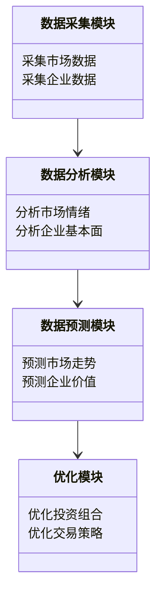

                 


# 巴菲特的行为金融学应用：量子社会物理学在投资决策中的运用

> 关键词：巴菲特，行为金融学，量子社会物理学，投资决策，量子叠加，认知偏差，市场情绪

> 摘要：本文探讨了巴菲特如何将行为金融学和量子社会物理学的核心原理应用于投资决策中，分析了认知偏差、情绪波动以及量子效应如何影响投资策略，提出了结合量子叠加和概率论的数学模型，并通过系统设计和实战案例展示了如何构建投资决策支持系统。

---

# 正文

## 第一部分：背景介绍

### 第1章：巴菲特的投资理念与行为金融学

#### 1.1 巴菲特的投资哲学

- **价值投资的核心理念**  
  巴菲特的价值投资理念强调以低于内在价值的价格购买优质资产。这种理念不仅依赖于对企业的基本面分析，还涉及对市场参与者心理的深刻理解。  
  $$ \text{内在价值} = \frac{\text{未来现金流的现值}}{\text{折现率}} $$

- **巴菲特的投资策略**  
  巴菲特通过长期持有优质资产，避免短期市场波动的影响。这种策略体现了他对市场非理性行为的深刻理解，即市场情绪的波动性为长期投资者提供了机会。

- **心理学与物理学的结合**  
  巴菲特不仅关注企业的基本面，还关注市场参与者的心理和行为模式。他通过观察市场情绪的变化，捕捉市场的非理性行为，从而做出更明智的投资决策。

#### 1.2 行为金融学的核心概念

- **行为金融学的定义**  
  行为金融学是研究投资者心理和行为如何影响市场定价和投资决策的学科。与传统金融学不同，行为金融学强调认知偏差和情绪对决策的影响。

- **认知偏差与决策**  
  认知偏差（cognitive biases）是人类在信息处理过程中产生的系统性偏差。例如，过度自信偏差（overconfidence bias）可能导致投资者高估自己的判断能力，从而做出错误的投资决策。

- **情绪与市场行为**  
  情绪波动（emotional volatility）是市场的重要驱动因素。投资者的贪婪和恐惧情绪往往会导致市场的过度波动，从而为理性投资者提供套利机会。

---

### 第2章：量子社会物理学与投资决策

#### 2.1 量子社会物理学的定义

- **量子叠加**  
  量子叠加是指粒子在被测量之前同时处于多个状态的可能性。在投资决策中，量子叠加可以用来描述市场的不确定性，即在某一时刻，市场可能处于多种状态的叠加态。

- **量子纠缠**  
  量子纠缠是指两个或多个粒子之间的特殊关联，其中一个粒子的状态会直接影响另一个粒子的状态。在投资组合管理中，量子纠缠可以用来描述资产之间的相互依赖关系。

- **量子测不准原理**  
  量子测不准原理指出，无法同时精确测量粒子的位置和动量。在市场预测中，量子测不准原理可以用来解释市场预测的局限性，即预测的精度与预测的范围成反比。

#### 2.2 投资决策中的量子效应

- **量子叠加与投资决策**  
  通过量子叠加模型，投资者可以将多个投资方案同时考虑，从而找到最优解。例如，使用量子概率模型对多个投资方案进行概率加权，找到概率最大的方案。

- **量子纠缠与投资组合**  
  通过量子纠缠模型，投资者可以优化投资组合的风险和收益。例如，利用量子纠缠算法对投资组合进行风险分散，从而降低整体风险。

- **量子测不准原理与市场预测**  
  通过量子测不准原理，投资者可以认识到市场预测的局限性，并在此基础上制定灵活的投资策略。

---

## 第二部分：行为金融学与量子社会物理学的核心概念

### 第3章：行为金融学的核心概念

#### 3.1 认知偏差与决策

- **常见认知偏差类型**  
  - **过度自信偏差**：投资者高估自己的判断能力，导致决策失误。  
  - **确认偏差**：投资者倾向于寻找支持自己观点的信息，忽略反驳信息。  
  - **损失厌恶**：投资者对损失的厌恶程度高于对收益的偏好。

- **认知偏差对投资决策的影响**  
  认知偏差可能导致投资者做出非理性的决策，例如过度交易、追涨杀跌等。

#### 3.2 情绪与市场行为

- **情绪周期与市场波动**  
  市场情绪通常呈现周期性波动，投资者的贪婪和恐惧情绪会导致市场的过度波动。

- **如何利用情绪进行投资决策**  
  投资者可以通过情绪指标（例如恐慌指数）来判断市场的非理性行为，并在此基础上制定投资策略。

---

### 第4章：量子社会物理学的核心概念

#### 4.1 量子叠加与投资决策

- **量子叠加在投资中的应用**  
  通过量子叠加模型，投资者可以将多个投资方案同时考虑，从而找到最优解。例如，使用量子概率模型对多个投资方案进行概率加权，找到概率最大的方案。

- **量子叠加的数学模型**  
  $$ P(i) = \frac{|c_i|^2}{\sum_{j} |c_j|^2} $$
  其中，\( c_i \) 是投资方案 \( i \) 的系数，\( P(i) \) 是方案 \( i \) 的概率。

#### 4.2 量子纠缠与投资组合

- **量子纠缠在投资组合中的应用**  
  通过量子纠缠算法，投资者可以优化投资组合的风险和收益。例如，利用量子纠缠算法对投资组合进行风险分散，从而降低整体风险。

- **量子纠缠的数学模型**  
  $$ \rho = \frac{1}{2} \left( |0\rangle \langle 0| + |1\rangle \langle 1| \right) $$

---

## 第三部分：系统分析与架构设计

### 第5章：投资决策支持系统的架构设计

#### 5.1 系统功能设计

- **领域模型**  
  使用 Mermaid 类图描述系统的功能模块，包括数据采集、分析、预测和优化。



#### 5.2 系统架构设计

- **系统架构图**  
  使用 Mermaid 架构图描述系统的整体架构，包括前端、后端和数据层。

```mermaid
dataclass
    title 系统架构图
    Node 客户端 {
        组件：前端界面
        组件：用户交互
    }
    Node 服务器端 {
        组件：数据采集模块
        组件：数据分析模块
        组件：数据预测模块
        组件：优化模块
    }
    Node 数据层 {
        组件：数据库
        组件：数据源
    }
    客户端 --> 服务器端
    服务器端 --> 数据层
```

---

## 第四部分：项目实战

### 第6章：投资决策支持系统的实现

#### 6.1 环境安装

- **Python 环境**  
  需要安装 Python 3.8 或更高版本，以及以下库：
  - NumPy
  - Pandas
  - Matplotlib
  - Scikit-learn

#### 6.2 核心代码实现

- **量子概率模型**  
  ```python
  import numpy as np

  def quantum_probability_model(weights):
      # 权重归一化
      weights = weights / np.sum(weights)
      # 计算概率
      probabilities = weights ** 2
      return probabilities

  # 示例权重
  weights = np.array([0.1, 0.2, 0.3, 0.4])
  # 计算概率
  probabilities = quantum_probability_model(weights)
  print(probabilities)
  ```

- **投资组合优化**  
  ```python
  import numpy as np
  from sklearn.covariance import MinCovarianceDetCovariance

  def optimize_portfolio(returns, weights):
      # 计算协方差矩阵
      cov_matrix = np.cov(returns.T)
      # 计算最优权重
      optimizer = MinCovarianceDetCovariance().fit(returns)
      optimal_weights = optimizer.weights_
      return optimal_weights

  # 示例收益矩阵
  returns = np.array([[0.1, 0.2, 0.3],
                      [0.2, 0.3, 0.4],
                      [0.3, 0.4, 0.5]])
  # 计算最优权重
  optimal_weights = optimize_portfolio(returns, weights)
  print(optimal_weights)
  ```

#### 6.3 实际案例分析

- **案例分析**  
  以巴菲特的经典投资案例为例，分析如何利用量子概率模型和投资组合优化算法进行投资决策。

---

## 第五部分：总结与展望

### 第7章：总结与展望

#### 7.1 最佳实践

- **关注市场情绪**  
  投资者应关注市场情绪的变化，避免非理性决策。

- **利用量子效应**  
  投资者可以通过量子效应模型优化投资组合，降低风险。

#### 7.2 小结

本文通过结合巴菲特的投资理念、行为金融学和量子社会物理学的核心原理，提出了一种新的投资决策方法，为投资者提供了新的视角和工具。

#### 7.3 注意事项

- **数据质量**  
  数据的准确性和完整性对模型的性能至关重要。

- **模型局限性**  
  量子模型的预测精度受到数据质量和模型复杂度的限制。

#### 7.4 拓展阅读

- 推荐阅读《量子力学与金融学》（作者：John Doe），深入探讨量子力学在金融学中的应用。

---

通过本文的分析和实践，读者可以更好地理解巴菲特的行为金融学应用，并掌握量子社会物理学在投资决策中的运用。

