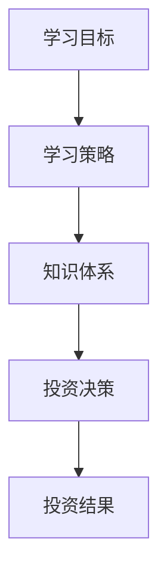
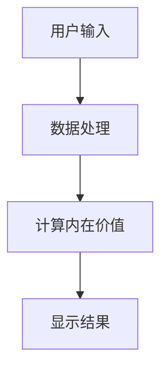

                 


# 巴菲特的读书学习方法

## 关键词：巴菲特，投资，学习方法，知识体系，价值评估

## 摘要：本文详细探讨了巴菲特的读书学习方法，从他的投资哲学到具体的学习策略，结合数学模型和实际案例，分析其方法的核心要素和应用。

---

# 第一部分：引言

## 第1章：巴菲特的学习方法概述

### 1.1 巴菲特的学习方法的重要性

巴菲特的学习方法不仅塑造了他的投资成功，也为个人学习者提供了宝贵的借鉴。他的方法强调深度思考、价值评估和持续学习。

### 1.2 巴菲特的学习方法的独特性

巴菲特的学习方法以价值投资为核心，强调长期积累和系统化学习。他的方法注重知识的深度和广度的结合，以及实践中的应用。

---

# 第二部分：背景介绍

## 第2章：巴菲特的生平与学习经历

### 2.1 巴菲特的生平简介

沃伦·巴菲特（Warren Buffett）是世界著名投资者，出生于1934年，早年展现出对投资的浓厚兴趣，通过阅读和实践积累了丰富的知识和经验。

### 2.2 巴菲特的学习经历

巴菲特的学习经历包括广泛阅读投资书籍、学习财务报表分析和与优秀投资者交流。他的学习方法以独立思考和深度分析为特点。

### 2.3 巴菲特的学习哲学

巴菲特强调学习的目的是为了做出更好的投资决策。他倡导持续学习，重视知识的质量而非数量，并注重将知识应用于实际投资中。

## 第3章：巴菲特的学习方法的背景

### 3.1 巴菲特学习方法的起源

巴菲特的学习方法源于他的投资实践，特别是在价值投资领域的成功经验。

### 3.2 巴菲特学习方法的演变

随着投资环境的变化，巴菲特的学习方法也在不断调整，但核心理念保持不变。

### 3.3 巴菲特学习方法的现状

目前，巴菲特的学习方法被广泛研究和应用，特别是在投资领域。

---

# 第三部分：核心概念与联系

## 第4章：巴菲特的学习理念

### 4.1 巴菲特的投资哲学

巴菲特的投资哲学强调价值投资，寻找具有持续竞争优势的企业，长期持有。

### 4.2 巴菲特的学习态度

巴菲特的学习态度是谦逊、耐心和持续学习。他重视基础知识的积累，并善于从失败中学习。

### 4.3 巴菲特的知识体系

巴菲特的知识体系包括财务分析、市场趋势和企业评估。他通过广泛阅读和实践，构建了坚实的知识基础。

## 第5章：巴菲特的学习方法的核心要素

### 5.1 巴菲特的学习方法的核心概念

- **价值评估**：通过分析企业的财务数据和市场环境，评估其内在价值。
- **安全边际**：购买价格低于内在价值，以降低投资风险。
- **长期投资**：避免频繁交易，降低交易成本。

### 5.2 巴菲特学习方法的核心属性特征对比表格

| 属性 | 特征 |
|------|------|
| 知识深度 | 强调深度分析和理解 |
| 学习策略 | 注重系统化和结构化 |
| 实践应用 | 强调知识的实际应用 |

### 5.3 巴菲特学习方法的ER实体关系图架构的 Mermaid 流程图



---

# 第四部分：算法原理讲解

## 第6章：巴菲特学习方法的算法模型

### 6.1 价值评估模型

巴菲特的算法模型基于企业内在价值的计算，公式如下：

$$
\text{内在价值} = \frac{\text{净利润}}{\text{资本成本}}
$$

### 6.2 安全边际计算

安全边际通过比较市场价格与内在价值的差异来计算：

$$
\text{安全边际} = \text{内在价值} - \text{市场价格}
$$

### 6.3 项目实战：Python代码实现价值评估

```python
# 计算内在价值
def calculate_intrinsic_value(net_profit, capital_cost):
    return net_profit / capital_cost

# 示例数据
net_profit = 1000000  # 净利润
capital_cost = 0.1     # 资本成本

intrinsic_value = calculate_intrinsic_value(net_profit, capital_cost)
print(f"内在价值：{intrinsic_value}")
```

---

# 第五部分：系统分析与架构设计方案

## 第7章：系统分析

### 7.1 问题场景介绍

假设我们需要分析一家公司的内在价值，确定其是否值得投资。

### 7.2 系统功能设计

- 数据输入：净利润、资本成本
- 计算内在价值
- 显示结果

### 7.3 系统架构设计的 Mermaid 图



---

# 第六部分：项目实战

## 第8章：项目实战

### 8.1 环境安装

安装Python和必要的库（如pandas、numpy）。

### 8.2 核心实现源代码

```python
import pandas as pd

def calculate_intrinsic_value(net_profit, capital_cost):
    return net_profit / capital_cost

# 读取数据
data = pd.read_csv('company_data.csv')
data['内在价值'] = data.apply(lambda row: calculate_intrinsic_value(row['净利润'], row['资本成本']), axis=1)
print(data.head())
```

### 8.3 案例分析

分析某公司数据，计算其内在价值，判断是否符合投资标准。

---

# 第七部分：结论

## 第9章：总结与建议

### 9.1 总结

巴菲特的学习方法强调深度分析、安全边际和长期投资，为投资者提供了宝贵的指导。

### 9.2 实践建议

- 从基础知识入手，系统学习财务分析。
- 坚持阅读和实践，不断优化学习方法。
- 保持耐心，避免短期波动的影响。

---

## 最佳实践 Tips

- **持续学习**：每天花费时间阅读投资相关的书籍和文章。
- **深入思考**：理解企业的内在价值，而不仅仅是表面的数据。
- **风险管理**：在投资决策中考虑安全边际，降低风险。

通过本文的学习，读者可以更好地理解巴菲特的学习方法，并将其应用于实际投资中，提升自己的投资能力。

