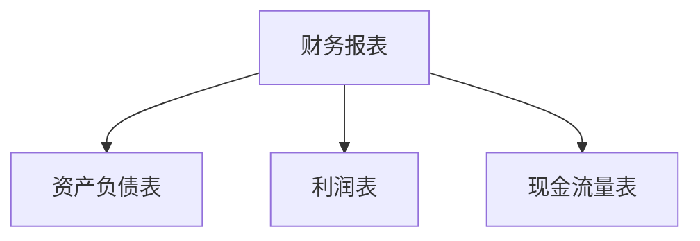

                 

# 巴菲特的财务报表分析方法：洞察公司真实状况

## 关键词：巴菲特、财务报表分析、投资策略、企业估值、ROE、ROA、安全边际

## 摘要：巴菲特的财务报表分析方法以其独特性和有效性著称，他通过深入分析财务报表来评估公司的财务健康状况和未来盈利能力。本文将系统地介绍巴菲特的分析方法，包括关键财务指标（如ROE、ROA）的计算与应用，如何通过财务数据评估管理层能力与公司治理，以及实际案例分析。通过这些方法，投资者可以更准确地判断公司价值，制定明智的投资决策。

---

## 第一部分: 财务报表分析基础

### 第1章: 财务报表基本概念与结构

#### 1.1 财务报表的基本概念

##### 背景介绍
财务报表是企业对外公开的财务信息，是投资者评估公司价值的重要工具。巴菲特认为，财务报表分析是投资决策的核心，通过分析财务数据，可以洞察公司的财务健康状况、盈利能力和发展潜力。

##### 核心概念
- **财务报表**：资产负债表、利润表、现金流量表的组合。
- **使用者**：投资者、债权人、管理层等。
- **目的**：评估公司财务状况、盈利能力和未来前景。

##### 关键术语对比
| 术语         | 定义与作用                 |
|--------------|--------------------------|
| 资产         | 公司拥有的资源，如现金、存货、固定资产。 |
| 负债         | 公司欠款，如贷款、应付账款。             |
| 所有者权益   | 股东对公司的净资产要求权。             |
| 收入         | 公司在一定时期内获得的收入来源。       |
| 净利润       | 收入减去费用后的利润，是公司盈利能力的核心指标。 |

##### 系统架构图

#### 1.2 资产负债表

##### 背景介绍
资产负债表反映了公司在某一特定时间点的资产、负债和所有者权益状况，是评估公司财务健康状况的基础。

##### 核心概念
- **资产**：分为流动资产（现金、应收账款）和非流动资产（固定资产、无形资产）。
- **负债**：流动负债（短期贷款）和非流动负债（长期债券）。
- **所有者权益**：资产减去负债后的净值。

##### 实际应用
通过资产负债表，可以评估公司的偿债能力、资本结构和财务稳定性。例如，流动比率（流动资产/流动负债）可以衡量公司短期偿债能力。

#### 1.3 利润表

##### 背景介绍
利润表展示了公司在一定时期内的收入、费用和利润情况，是评估公司盈利能力的关键。

##### 核心概念
- **收入**：公司销售商品或提供服务所获得的收入。
- **费用**：与收入相关的成本，如销售费用、管理费用。
- **净利润**：收入减去费用后的利润，是公司盈利能力的核心指标。

##### 实际应用
通过利润表，可以计算毛利率（毛利/收入）、净利率（净利润/收入）等指标，评估公司的盈利能力和成本控制能力。

#### 1.4 现金流量表

##### 背景介绍
现金流量表记录了公司在一定时期内现金的流入和流出情况，是评估公司财务健康状况的重要指标。

##### 核心概念
- **经营活动现金流**：公司日常运营产生的现金流。
- **投资活动现金流**：公司投资活动（如购买固定资产）产生的现金流。
- **筹资活动现金流**：公司通过借款或发行股票获得的现金流。

##### 实际应用
通过现金流量表，可以评估公司的现金流动性、投资活动的资金需求以及筹资活动的合理性。

---

### 第2章: 财务报表分析的基本方法

#### 2.1 财务比率分析

##### 背景介绍
财务比率是通过财务报表数据计算的指标，用于评估公司的偿债能力、盈利能力、营运能力和成长能力。

##### 核心概念
- **流动比率**：流动资产/流动负债，衡量短期偿债能力。
- **速动比率**：（流动资产 - 存货）/流动负债，更严格衡量短期偿债能力。
- **负债比率**：负债总额/资产总额，衡量资本结构。
- **利润率**：净利润/收入，衡量盈利能力。

##### 实际应用
通过计算这些比率，可以综合评估公司的财务状况。例如，流动比率过低可能表明公司短期偿债能力不足。

#### 2.2 财务报表分析的局限性

##### 背景介绍
财务报表分析虽然重要，但也存在一些局限性，如会计政策的选择、信息滞后性等。

##### 核心概念
- **会计政策**：不同公司可能采用不同的会计政策，影响财务数据的可比性。
- **信息滞后性**：财务报表反映的是过去的情况，不能完全预测未来。

##### 实际应用
投资者需要结合其他信息（如行业趋势、公司管理层变动）进行综合分析。

#### 2.3 财务报表分析的步骤与流程

##### 背景介绍
系统地进行财务报表分析，可以帮助投资者更准确地评估公司价值。

##### 核心概念
1. **确定分析目标**：明确分析的目的，如评估盈利能力或偿债能力。
2. **收集与整理数据**：获取公司最近的财务报表，确保数据准确。
3. **计算与分析比率**：选择适当的财务比率，进行计算和分析。
4. **综合评价**：结合多个指标，得出综合结论。

##### 实际应用
通过系统化的分析步骤，投资者可以更全面地评估公司的财务状况。

---

## 第二部分: 巴菲特的财务分析方法

### 第3章: 巴菲特的财务分析方法

#### 3.1 巴菲特的核心指标：ROE与ROA

##### 背景介绍
巴菲特高度重视投资回报率（ROE）和资产回报率（ROA），认为这些指标能够衡量公司的盈利能力。

##### 核心概念
- **ROE（净资产收益率）**：净利润/平均股东权益，衡量股东投资回报能力。
- **ROA（资产回报率）**：净利润/平均资产总额，衡量资产使用效率。

##### 实际应用
计算公式：
$$ROE = \frac{\text{净利润}}{\text{平均股东权益}}$$
$$ROA = \frac{\text{净利润}}{\text{平均资产总额}}$$

通过这些指标，巴菲特筛选出那些能够持续创造价值的公司。

#### 3.2 管理层能力与公司治理

##### 背景介绍
巴菲特认为，优秀的管理层和良好的公司治理是公司长期成功的关键。

##### 核心概念
- **管理层能力**：通过财务报表分析，评估管理层的决策能力和创新能力。
- **公司治理**：股权结构、董事会构成、高管薪酬等，影响公司治理效率。

##### 实际应用
通过分析公司治理结构，巴菲特筛选出那些治理良好、管理层有能力的公司。

#### 3.3 竞争地位与行业分析

##### 背景介绍
巴菲特注重公司所在行业的竞争地位，认为具有强大竞争优势的公司更有可能长期盈利。

##### 核心概念
- **竞争优势**：公司相对于竞争对手的独特优势，如品牌、技术、成本优势。
- **行业分析**：行业增长潜力、竞争格局、市场集中度等。

##### 实际应用
通过分析行业趋势和公司竞争地位，巴菲特判断公司的长期盈利能力。

---

## 第三部分: 投资策略与风险管理

### 第4章: 巴菲特的投资哲学与风险管理

#### 4.1 长期投资与价值投资

##### 背景介绍
巴菲特倡导长期投资和价值投资，注重公司长期价值而非短期市场波动。

##### 核心概念
- **长期投资**：持有优质股票，分享公司长期增长的收益。
- **价值投资**：以低于内在价值的价格买入优质股票，等待其价值回归。

##### 实际应用
通过长期持有优质股票，巴菲特实现了财富的持续增长。

#### 4.2 分散投资与安全边际

##### 背景介绍
巴菲特强调分散投资和安全边际，以降低投资风险。

##### 核心概念
- **分散投资**：通过投资不同行业、不同公司的股票，降低投资风险。
- **安全边际**：买入价格低于内在价值，为投资提供安全空间。

##### 实际应用
通过分散投资和设置安全边际，巴菲特能够在市场波动中保持稳健。

---

## 第四部分: 实际案例分析

### 第5章: 巴菲特的案例分析

#### 5.1 可口可乐：巴菲特的经典投资

##### 背景介绍
可口可乐是巴菲特的经典投资案例，通过分析其财务报表，可以了解巴菲特的选股逻辑。

##### 核心概念
- **ROE分析**：可口可乐的ROE长期保持在较高水平。
- **竞争地位**：可口可乐在全球饮料行业的竞争优势。

##### 实际应用
通过分析可口可乐的财务报表和行业地位，巴菲特判断其为优质投资标的。

#### 5.2 苹果：成长型企业的典范

##### 背景介绍
苹果作为一家成长型企业，其财务报表分析展示了巴菲特如何评估高成长公司的价值。

##### 核心概念
- **收入增长**：苹果的收入持续增长，显示出强大的市场潜力。
- **ROA分析**：苹果的ROA较高，显示出高效的资产使用效率。

##### 实际应用
通过分析苹果的财务数据，巴菲特判断其为高成长性的优质投资标的。

---

## 第五部分: 总结与展望

### 第6章: 总结与展望

#### 6.1 巴菲特分析方法的总结

##### 背景介绍
巴菲特的财务分析方法以其独特性和有效性著称，为投资者提供了重要的指导。

##### 核心概念
- **财务报表分析**：通过关键指标（ROE、ROA）评估公司价值。
- **长期投资**：注重公司长期价值，分散投资降低风险。

##### 实际应用
通过系统化的财务分析和长期投资策略，巴菲特实现了卓越的投资业绩。

#### 6.2 对未来投资的展望

##### 背景介绍
随着经济全球化和科技的进步，投资环境也在不断变化，投资者需要不断学习和调整策略。

##### 核心概念
- **适应性**：根据市场变化调整投资策略。
- **创新性**：结合新技术和新趋势，寻找新的投资机会。

##### 实际应用
投资者需要持续学习，适应市场变化，抓住新的投资机会。

---

## 结语

巴菲特的财务报表分析方法为投资者提供了重要的指导，通过系统化的财务分析和长期投资策略，投资者可以更准确地评估公司价值，制定明智的投资决策。未来，随着经济的发展和技术的进步，投资者需要不断学习和创新，以应对新的挑战和机遇。

---

## 最佳实践 Tips

- **持续学习**：关注行业动态，学习新的财务分析方法。
- **分散投资**：降低投资风险，避免过度集中。
- **长期投资**：耐心持有优质股票，分享公司长期增长的收益。

---

## 思考过程总结

通过系统地分析巴菲特的财务报表分析方法，我们了解了如何通过关键财务指标（如ROE、ROA）评估公司价值，如何评估管理层能力和公司治理，以及如何制定长期投资策略。这些方法不仅适用于巴菲特的投资，也适用于其他投资者的决策过程。

---

## 注意事项

- **数据准确性**：财务报表分析需要准确的数据支持，确保分析结果的可靠性。
- **市场变化**：市场环境不断变化，投资者需要及时调整分析方法和策略。
- **风险管理**：投资有风险，投资者需要做好风险管理，避免重大损失。

---

## 拓展阅读

- 巴菲特的其他投资策略和案例分析。
- 其他投资者的财务分析方法，如彼得·林奇的投资策略。
- 财务报表分析的高级技巧，如现金流分析、并购分析等。

---

通过本文的系统介绍，读者可以深入了解巴菲特的财务报表分析方法，并将其应用到实际投资中，制定更加科学和有效的投资策略。

