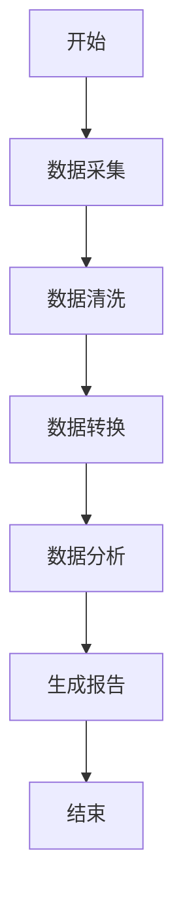
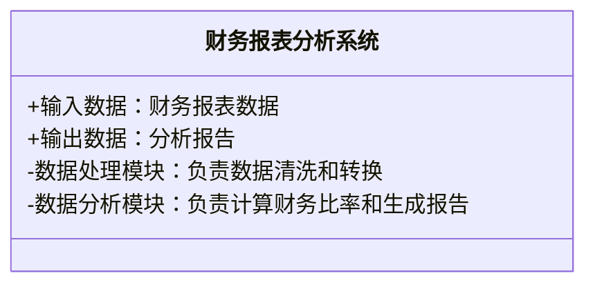
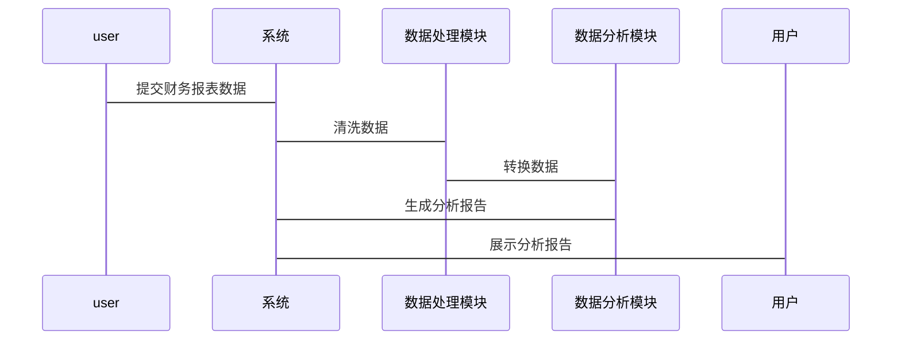

                 


# 巴菲特的财务报表深度解析：洞察公司真实价值

> **关键词**：巴菲特、财务报表分析、价值投资、投资策略、企业价值评估

> **摘要**：本文深入探讨了巴菲特的财务报表分析方法，结合其独特的价值投资理念，通过系统化的分析框架和实例分析，帮助读者洞察公司的真实价值。文章内容涵盖巴菲特的投资哲学、财务报表的核心指标、实例分析、系统化分析方法、项目实战以及高级内容，旨在为读者提供全面的财务报表分析指南。

---

## 第一章：巴菲特投资理念与财务报表分析概述

### 1.1 巴菲特投资理念的核心思想

#### 1.1.1 价值投资的定义与核心原则

价值投资是一种长期投资策略，强调以低于内在价值的价格购买优质资产。巴菲特的价值投资理念基于以下几个核心原则：

1. **安全边际**：买入价格低于内在价值，确保有一定的安全空间。
2. **长期持有**：投资优质企业，长期持有，避免频繁交易。
3. **竞争优势**：选择具有持续竞争优势的企业，如护城河、高利润率等。
4. **管理层诚信**：管理层应具备诚信和能力，能够为股东创造长期价值。

#### 1.1.2 巴菲特的投资策略与方法

巴菲特的投资策略可以总结为“三重过滤法”：

1. **行业分析与竞争优势**：选择具有长期增长潜力的行业，寻找具有竞争优势的企业。
2. **财务状况与盈利能力**：分析企业的财务报表，评估其财务健康状况和盈利能力。
3. **管理层诚信与企业治理**：考察管理层的诚信和企业治理结构，确保管理层能够为股东创造价值。

#### 1.1.3 财务报表在价值投资中的重要性

财务报表是巴菲特评估企业价值的核心工具。通过分析财务报表，巴菲特能够了解企业的财务状况、盈利能力、现金流情况以及竞争优势，从而做出投资决策。

---

### 1.2 财务报表的基本结构与内容

#### 1.2.1 资产负债表的核心要素

资产负债表反映了企业在某一特定时点的财务状况，包括以下三个主要部分：

1. **资产**：企业拥有的资源，包括流动资产（如现金、应收账款）和非流动资产（如固定资产、无形资产）。
2. **负债**：企业欠款的债务，包括流动负债（如应付账款、短期借款）和非流动负债（如长期借款）。
3. **股东权益**：股东对企业净资产的所有权，包括股本、资本公积、盈余公积等。

#### 1.2.2 利润表的主要内容

利润表反映了企业在一定会计期间内的经营成果，包括以下三个主要部分：

1. **收入**：企业通过销售产品或服务获得的收入。
2. **成本与费用**：与收入相关的成本和费用，包括营业成本、销售费用、管理费用等。
3. **利润**：收入减去成本和费用后的净收益，包括营业利润、净利润等。

#### 1.2.3 现金流量表的关键指标

现金流量表反映了企业在一定会计期间内的现金流情况，包括以下三个主要部分：

1. **经营活动现金流**：企业日常经营活动中产生的现金流，包括销售商品、提供服务等。
2. **投资活动现金流**：企业投资活动产生的现金流，包括购买或出售固定资产、股权投资等。
3. **筹资活动现金流**：企业筹资活动产生的现金流，包括发行债券、偿还债务等。

---

### 1.3 财务报表分析的基本方法

#### 1.3.1 财务比率分析

财务比率是衡量企业财务状况的重要工具，常用的财务比率包括：

1. **流动性比率**：衡量企业偿还短期债务的能力，如流动比率（流动资产/流动负债）和速动比率（速动资产/流动负债）。
2. **杠杆比率**：衡量企业负债与股东权益的比例，如资产负债率（总负债/总资产）和利息覆盖倍数（EBIT/利息支出）。
3. **盈利能力比率**：衡量企业盈利能力，如净利率（净利润/营业收入）和ROE（股东权益回报率）。

#### 1.3.2 财务指标的计算与解读

以ROE为例，ROE的计算公式为：

$$ROE = \frac{\text{净利润}}{\text{股东权益}}$$

ROE越高，说明企业利用股东权益创造利润的能力越强。巴菲特通常选择ROE较高的企业进行投资。

#### 1.3.3 财务报表分析的步骤与流程

1. **收集数据**：获取企业的财务报表，包括资产负债表、利润表和现金流量表。
2. **计算财务比率**：根据财务报表数据，计算各项财务比率。
3. **分析财务状况**：结合行业平均水平和企业自身历史数据，分析企业的财务状况。
4. **评估企业价值**：综合考虑企业的财务状况、行业地位和管理层能力，评估企业的真实价值。

---

## 第二章：财务报表分析的核心指标与比率

### 2.1 资产负债表分析

#### 2.1.1 资产结构分析

资产结构分析通过比较流动资产与非流动资产的比例，评估企业的流动性风险。公式为：

$$\text{流动资产比例} = \frac{\text{流动资产}}{\text{总资产}}$$

流动资产比例越高，企业的流动性越强，但可能意味着企业缺乏长期投资。

#### 2.1.2 负债结构分析

负债结构分析通过比较流动负债与非流动负债的比例，评估企业的偿债压力。公式为：

$$\text{流动负债比例} = \frac{\text{流动负债}}{\text{总负债}}$$

流动负债比例越高，企业的短期偿债压力越大。

#### 2.1.3 股东权益分析

股东权益分析通过比较股东权益与总负债的比例，评估企业的财务杠杆。公式为：

$$\text{股东权益比例} = \frac{\text{股东权益}}{\text{总资产}}$$

股东权益比例越高，企业的财务杠杆越低，财务风险越小。

---

### 2.2 利润表分析

#### 2.2.1 收入与成本分析

收入与成本分析通过比较收入与成本的增长趋势，评估企业的盈利能力。公式为：

$$\text{毛利率} = \frac{\text{营业收入} - \text{营业成本}}{\text{营业收入}} \times 100\%$$

毛利率越高，企业的盈利能力越强。

#### 2.2.2 利润率分析

利润率分析通过计算净利润率、销售利润率等指标，评估企业的整体盈利能力。公式为：

$$\text{净利润率} = \frac{\text{净利润}}{\text{营业收入}} \times 100\%$$

#### 2.2.3 营业利润率与净利润率的计算

以可口可乐为例，假设2022年营业收入为$X$，净利润为$Y$，则：

$$\text{营业利润率} = \frac{\text{营业收入} - \text{营业成本}}{\text{营业收入}} \times 100\%$$
$$\text{净利润率} = \frac{\text{净利润}}{\text{营业收入}} \times 100\%$$

---

### 2.3 现金流量表分析

#### 2.3.1 经营活动现金流分析

经营活动现金流分析通过比较经营活动现金流与净利润的比例，评估企业的经营效率。公式为：

$$\text{经营活动现金流/净利润} = \frac{\text{经营活动现金流}}{\text{净利润}}$$

该比例越接近1，说明企业的经营活动现金流质量越高。

#### 2.3.2 投资活动现金流分析

投资活动现金流分析通过比较投资活动现金流的正负，评估企业的投资活动。负数表示企业投资于长期资产，正数表示企业出售长期资产。

#### 2.3.3 筹资活动现金流分析

筹资活动现金流分析通过比较筹资活动现金流的正负，评估企业的融资能力。正数表示企业通过发行债券或股票融资，负数表示企业偿还债务或回购股票。

---

## 第三章：巴菲特的财务报表分析框架

### 3.1 巴菲特的“三重过滤法”

#### 3.1.1 行业分析与竞争优势

巴菲特注重选择具有长期增长潜力的行业，并寻找具有竞争优势的企业。竞争优势包括成本优势、品牌优势、技术优势等。

#### 3.1.2 财务状况与盈利能力

通过分析财务报表，评估企业的财务健康状况和盈利能力。巴菲特通常选择ROE较高、负债较低的企业。

#### 3.1.3 管理层诚信与企业治理

巴菲特注重企业的管理层诚信和企业治理结构。他倾向于投资管理层诚信可靠、治理结构透明的企业。

---

### 3.2 财务指标与企业价值评估

#### 3.2.1 市盈率与市净率的计算

市盈率（P/E）和市净率（P/B）是常用的估值指标。公式为：

$$\text{市盈率} = \frac{\text{股价}}{\text{每股净利润}}$$
$$\text{市净率} = \frac{\text{股价}}{\text{每股净资产}}$$

#### 3.2.2 股东权益回报率（ROE）分析

ROE是衡量企业盈利能力的重要指标，公式为：

$$\text{ROE} = \frac{\text{净利润}}{\text{股东权益}}$$

#### 3.2.3 股息率与股息支付率的评估

股息率（Dividend Yield）和股息支付率（Dividend Payout Ratio）是衡量企业分红能力的指标。公式为：

$$\text{股息率} = \frac{\text{每股股息}}{\text{股价}} \times 100\%$$
$$\text{股息支付率} = \frac{\text{股息支付总额}}{\text{净利润}} \times 100\%$$

---

## 第四章：实例分析：巴菲特的经典投资案例

### 4.1 可口可乐的财务报表分析

#### 4.1.1 可口可乐的行业地位与竞争优势

可口可乐是全球知名的饮料公司，具有强大的品牌优势和市场支配力。

#### 4.1.2 可口可乐的财务报表解读

通过分析可口可乐的财务报表，巴菲特发现其具有稳定的现金流、较高的ROE和较低的负债率。

#### 4.1.3 巴菲特的投资决策过程

巴菲特基于可口可乐的财务表现和行业地位，决定投资该公司，并长期持有。

### 4.2 伯克希尔哈撒韦的财务报表分析

#### 4.2.1 伯克希尔的业务结构与财务表现

伯克希尔哈撒韦是一家多元化企业集团，业务涵盖保险、投资、能源等多个领域。

#### 4.2.2 伯克希尔的股东权益与资本结构

伯克希尔的股东权益较高，资本结构稳健，财务风险较低。

#### 4.2.3 伯克希尔的分红政策与股东回报

伯克希尔坚持分红政策，回馈股东，同时保持资本的灵活性。

---

## 第五章：系统化财务报表分析方法

### 5.1 财务报表分析的系统架构

#### 5.1.1 系统功能模块划分

系统功能模块包括数据采集、数据处理、数据分析、结果展示等。

#### 5.1.2 数据流与信息处理流程

数据从财务报表采集，经过清洗、转换，再进行分析，最后生成报告。

#### 5.1.3 系统接口设计与交互流程

系统需要与数据库、前端界面进行交互，确保数据的准确传递和处理。

---

### 5.2 财务报表分析的算法原理

#### 5.2.1 算法原理与流程图

以下是财务报表分析的算法流程图：



---

### 5.3 系统架构设计

以下是系统架构设计的类图：



---

### 5.4 系统交互设计

以下是系统交互的序列图：



---

## 第六章：项目实战：系统化财务报表分析

### 6.1 环境安装

#### 6.1.1 安装Python与必要的库

安装Python和Pandas、NumPy、Matplotlib等库：

```bash
pip install pandas numpy matplotlib
```

---

#### 6.1.2 安装Jupyter Notebook

安装Jupyter Notebook：

```bash
pip install jupyter
jupyter notebook
```

---

### 6.2 系统核心实现源代码

#### 6.2.1 数据采集与清洗

以下是数据采集与清洗的代码示例：

```python
import pandas as pd

# 读取财务报表数据
df = pd.read_csv('financial_report.csv')

# 删除缺失值
df.dropna(inplace=True)

# 去除异常值
df = df[(df[' revenue'] > 0) & (df['净利润'] > 0)]
```

---

#### 6.2.2 数据转换与分析

以下是数据转换与分析的代码示例：

```python
# 计算ROE
df['ROE'] = df['净利润'] / df['股东权益']

# 计算毛利率
df['毛利率'] = (df['营业收入'] - df['营业成本']) / df['营业收入']

# 绘制ROE分布图
import matplotlib.pyplot as plt

plt.hist(df['ROE'], bins=10)
plt.xlabel('ROE')
plt.ylabel('频率')
plt.title('ROE分布图')
plt.show()
```

---

#### 6.2.3 生成分析报告

以下是生成分析报告的代码示例：

```python
# 生成分析报告
report = {}

# 计算平均ROE
report['平均ROE'] = df['ROE'].mean()

# 计算毛利率中位数
report['毛利率中位数'] = df['毛利率'].median()

# 展示报告
for key, value in report.items():
    print(f"{key}: {value}")
```

---

### 6.3 案例分析与详细解读

以可口可乐为例，使用上述代码进行财务报表分析，生成ROE和毛利率的分析报告。

---

## 第七章：高级内容与最佳实践

### 7.1 高级分析方法

#### 7.1.1 财务报表分析的高级指标

高级指标包括经济增加值（EVA）、股东权益回报率（ROE）等。

#### 7.1.2 行业比较与趋势分析

通过比较行业内的企业，分析企业的财务表现和竞争优势。

---

### 7.2 工具推荐与注意事项

#### 7.2.1 财务分析工具推荐

推荐使用Excel、Python（Pandas、NumPy）、Tableau等工具进行财务报表分析。

#### 7.2.2 注意事项与常见误区

1. **避免仅依赖财务报表**：财务报表反映历史数据，不能完全预测未来。
2. **关注非财务因素**：企业治理、管理层能力等因素同样重要。
3. **定期更新与分析**：企业财务状况可能随时间变化，需要定期更新分析。

---

## 第八章：总结与展望

### 8.1 全文总结

本文详细介绍了巴菲特的财务报表分析方法，结合实例分析和系统化分析，帮助读者洞察公司的真实价值。通过系统化的分析框架和实战项目，读者可以掌握财务报表分析的核心技能。

---

### 8.2 未来展望

随着人工智能和大数据技术的发展，财务报表分析将更加智能化和自动化。未来，投资者可以通过AI工具快速分析大量数据，发现投资机会，提升投资效率。

---

### 8.3 最佳实践 Tips

1. **持续学习**：财务报表分析是一门实践性很强的学科，需要不断学习和实践。
2. **关注行业动态**：了解行业趋势，帮助企业更好地评估企业价值。
3. **保持耐心**：投资需要耐心，长期持有优质资产才能获得稳定回报。

---

## 参考文献

1. 巴菲特的股东大会演讲与采访。
2. 《巴菲特的选股标准》。
3. 《财务报表分析与股票投资》。

---

## 致谢

感谢读者的耐心阅读，感谢巴菲特的投资理念对我的启发。希望本文能为您提供有价值的信息，帮助您更好地进行财务报表分析和投资决策。

---

**全文完**

