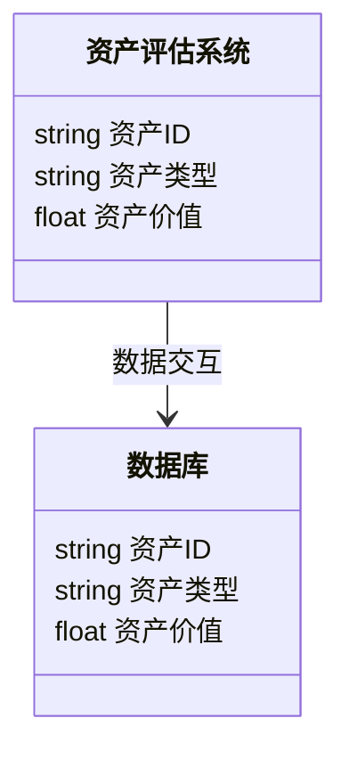
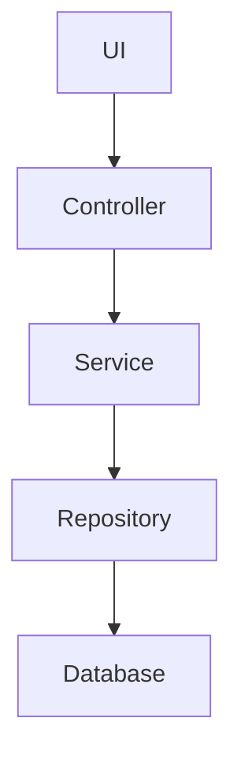
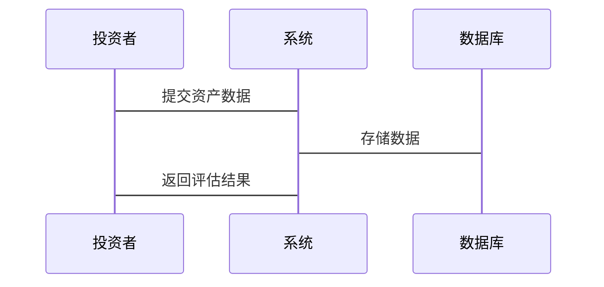

                 


```markdown
# 巴菲特的资产负债表分析：数字资产和无形资产的重新定义

## 关键词
- 巴菲特投资理念
- 资产负债表分析
- 数字资产
- 无形资产
- 价值投资

## 摘要
本文深入探讨巴菲特的资产负债表分析方法，特别是在数字资产和无形资产兴起的背景下，重新定义这些资产的评估方式。通过分析数字资产与无形资产的属性、关系以及在现代经济中的影响，结合数学模型和系统架构设计，提出优化的评估方法，并通过实际案例展示如何在实践中应用这些方法。

---

## 第1章: 巴菲特的资产负债表分析概述

### 1.1 巴菲特投资理念的核心

#### 1.1.1 价值投资的定义与特点
价值投资是一种以长期持有的策略，注重买入低于其内在价值的股票。其核心在于寻找市场先生的错误定价，并在安全边际内进行投资。价值投资的特点包括：
- 长期视角
- 安全边际
- 重视基本面分析

#### 1.1.2 巴菲特的资产负债表分析方法
巴菲特通过分析资产负债表来评估公司的内在价值。他关注的关键指标包括：
- 流动比率
- 速动比率
- 负债结构
- 资产周转率

#### 1.1.3 数字资产与无形资产的兴起
随着数字化转型的推进，数字资产（如加密货币、NFTs）和无形资产（如品牌价值、专利）的重要性日益增加。这些资产的传统分类方法已不足以反映其价值。

---

### 1.2 资产负债表的核心要素

#### 1.2.1 资产的定义与分类
- **流动资产**：现金、应收账款、存货等。
- **非流动资产**：长期投资、固定资产、无形资产等。
- 数字资产的兴起对流动资产的分类提出了新的挑战。

#### 1.2.2 负债的定义与分类
- **流动负债**：应付账款、短期债务等。
- **非流动负债**：长期债务、递延税款等。
- 无形资产的增加可能影响负债结构。

#### 1.2.3 所有者权益的定义与分类
- 包括股本、资本公积、盈余公积等。
- 数字资产的升值可能增加所有者权益。

---

### 1.3 巴菲特分析方法的独特性

#### 1.3.1 财务报表分析的三张报表
- 资产负债表：反映公司财务状况。
- 利润表：反映公司经营成果。
- 现金流量表：反映公司现金流动情况。

#### 1.3.2 资产负债表分析的关键指标
- **流动比率**：流动资产/流动负债。
- **速动比率**：(流动资产-存货)/流动负债。
- **负债结构**：短期负债与长期负债的比例。

#### 1.3.3 数字资产对传统资产负债表的影响
数字资产的出现要求资产负债表重新分类，传统资产分类已无法涵盖其价值。

---

### 1.4 数字资产与无形资产的挑战

#### 1.4.1 数字资产的定义与特点
- **定义**：数字资产是指以数字形式存在的资产，包括加密货币、NFTs等。
- **特点**：可分割性、可追踪性、去中心化。

#### 1.4.2 无形资产的定义与特点
- **定义**：无形资产是指没有实物形态的资产，如品牌价值、专利、商标等。
- **特点**：长期性、不可见性。

#### 1.4.3 数字资产与无形资产的边界与外延
- 数字资产与无形资产的界限模糊，需要重新定义其分类和评估方法。

---

## 第2章: 数字资产与无形资产的核心概念

### 2.1 数字资产与无形资产的属性对比

| 属性                | 数字资产                  | 无形资产                  |
|---------------------|--------------------------|--------------------------|
| **存在形式**        | 数字形式                 | 非物质形式               |
| **可分割性**        | 可分割                   | 不可分割                 |
| **可追踪性**        | 可追踪                   | 不可追踪                 |
| **风险**            | 市场波动大               | 法律风险高               |
| **价值评估**        | 主要基于市场供需         | 主要基于未来收益         |

---

### 2.2 数字资产与无形资产的ER实体关系图

```mermaid
erDiagram
    actor 投资者 {
        string 资产ID
        string 资产类型
        string 资产价值
    }
    actor 财务报表 {
        string 账户ID
        string 账户类型
        string 账户余额
    }
    investor --> financial_statement : 拥有
```

---

### 2.3 数字资产与无形资产的关系分析

#### 2.3.1 数字资产对无形资产的影响
数字资产的兴起可能提升无形资产的价值，例如品牌价值可以通过数字资产（如社交媒体影响力）来体现。

#### 2.3.2 无形资产对数字资产的影响
无形资产的强健性（如强大的品牌）可以增强数字资产的市场认可度和价值。

#### 2.3.3 两者关系的综合分析
数字资产和无形资产相互影响，共同构成了现代企业的核心价值。

---

## 第3章: 巴菲特资产负债表分析的算法原理

### 3.1 巴菲特分析方法的数学模型

#### 3.1.1 资产评估的数学公式
$$ \text{资产评估} = \frac{\text{未来现金流的现值}}{\text{折现率}} $$

---

### 3.2 算法实现

#### 3.2.1 未来现金流的预测
```python
import numpy as np
import pandas as pd

# 示例数据
data = {'年份': [2023, 2024, 2025, 2026],
         '现金流': [100, 150, 200, 250]}
df = pd.DataFrame(data)

# 计算未来现金流的现值
discount_rate = 0.10
present_value = df['现金流'].sum() / (1 + discount_rate)
print("未来现金流的现值为：", present_value)
```

---

### 3.3 算法优化与扩展

#### 3.3.1 引入机器学习
使用回归分析预测未来现金流，提高评估的准确性。

#### 3.3.2 结合大数据分析
利用行业趋势和市场数据优化评估模型，提升模型的鲁棒性。

---

## 第4章: 数字资产与无形资产的系统架构设计

### 4.1 问题场景介绍
假设一家科技公司，其数字资产和无形资产对其价值贡献显著，需要重新设计资产负债表的分析系统。

### 4.2 系统功能设计



---

### 4.3 系统架构设计



---

### 4.4 系统接口设计
- 数据接口：资产数据的导入与导出。
- 评估接口：资产价值的计算与输出。
- 用户接口：用户交互界面。

---

### 4.5 系统交互设计



---

## 第5章: 项目实战

### 5.1 环境安装
安装Python、Pandas、NumPy等工具。

### 5.2 核心实现
编写代码实现数字资产和无形资产的评估。

### 5.3 案例分析
以具体企业为例，分析其数字资产和无形资产的评估结果。

---

## 第6章: 最佳实践、小结、注意事项与拓展阅读

### 6.1 最佳实践 tips
- 数据来源要准确可靠。
- 模型要结合实际情况进行调整。

### 6.2 小结
本文重新定义了数字资产和无形资产的评估方法，结合巴菲特的分析理念，提出了优化的解决方案。

### 6.3 注意事项
- 注意数据的准确性和完整性。
- 定期更新模型，适应市场变化。

### 6.4 拓展阅读
- 《巴菲特的股票投资策略》
- 《数字资产与金融创新》

---

## 结语
通过本文的分析，读者可以更好地理解数字资产和无形资产的评估方法，并在实际投资中应用这些理念。
</think>

```markdown
# 巴菲特的资产负债表分析：数字资产和无形资产的重新定义

## 关键词
- 巴菲特投资理念
- 资产负债表分析
- 数字资产
- 无形资产
- 价值投资

## 摘要
本文深入探讨巴菲特的资产负债表分析方法，特别是在数字资产和无形资产兴起的背景下，重新定义这些资产的评估方式。通过分析数字资产与无形资产的属性、关系以及在现代经济中的影响，结合数学模型和系统架构设计，提出优化的评估方法，并通过实际案例展示如何在实践中应用这些方法。

---

## 第1章: 巴菲特的资产负债表分析概述

### 1.1 巴菲特投资理念的核心

#### 1.1.1 价值投资的定义与特点
价值投资是一种以长期持有的策略，注重买入低于其内在价值的股票。其核心在于寻找市场先生的错误定价，并在安全边际内进行投资。价值投资的特点包括：
- 长期视角
- 安全边际
- 重视基本面分析

#### 1.1.2 巴菲特的资产负债表分析方法
巴菲特通过分析资产负债表来评估公司的内在价值。他关注的关键指标包括：
- 流动比率
- 速动比率
- 负债结构
- 资产周转率

#### 1.1.3 数字资产与无形资产的兴起
随着数字化转型的推进，数字资产（如加密货币、NFTs）和无形资产（如品牌价值、专利）的重要性日益增加。这些资产的传统分类方法已不足以反映其价值。

---

### 1.2 资产负债表的核心要素

#### 1.2.1 资产的定义与分类
- **流动资产**：现金、应收账款、存货等。
- **非流动资产**：长期投资、固定资产、无形资产等。
- 数字资产的兴起对流动资产的分类提出了新的挑战。

#### 1.2.2 负债的定义与分类
- **流动负债**：应付账款、短期债务等。
- **非流动负债**：长期债务、递延税款等。
- 无形资产的增加可能影响负债结构。

#### 1.2.3 所有者权益的定义与分类
- 包括股本、资本公积、盈余公积等。
- 数字资产的升值可能增加所有者权益。

---

### 1.3 巴菲特分析方法的独特性

#### 1.3.1 财务报表分析的三张报表
- 资产负债表：反映公司财务状况。
- 利润表：反映公司经营成果。
- 现金流量表：反映公司现金流动情况。

#### 1.3.2 资产负债表分析的关键指标
- **流动比率**：流动资产/流动负债。
- **速动比率**：(流动资产-存货)/流动负债。
- **负债结构**：短期负债与长期负债的比例。

#### 1.3.3 数字资产对传统资产负债表的影响
数字资产的出现要求资产负债表重新分类，传统资产分类已无法涵盖其价值。

---

### 1.4 数字资产与无形资产的挑战

#### 1.4.1 数字资产的定义与特点
- **定义**：数字资产是指以数字形式存在的资产，包括加密货币、NFTs等。
- **特点**：可分割性、可追踪性、去中心化。

#### 1.4.2 无形资产的定义与特点
- **定义**：无形资产是指没有实物形态的资产，如品牌价值、专利、商标等。
- **特点**：长期性、不可见性。

#### 1.4.3 数字资产与无形资产的边界与外延
- 数字资产与无形资产的界限模糊，需要重新定义其分类和评估方法。

---

## 第2章: 数字资产与无形资产的核心概念

### 2.1 数字资产与无形资产的属性对比

| 属性                | 数字资产                  | 无形资产                  |
|---------------------|--------------------------|--------------------------|
| **存在形式**        | 数字形式                 | 非物质形式               |
| **可分割性**        | 可分割                   | 不可分割                 |
| **可追踪性**        | 可追踪                   | 不可追踪                 |
| **风险**            | 市场波动大               | 法律风险高               |
| **价值评估**        | 主要基于市场供需         | 主要基于未来收益         |

---

### 2.2 数字资产与无形资产的ER实体关系图

```mermaid
erDiagram
    actor 投资者 {
        string 资产ID
        string 资产类型
        string 资产价值
    }
    actor 财务报表 {
        string 账户ID
        string 账户类型
        string 账户余额
    }
    investor --> financial_statement : 拥有
```

---

### 2.3 数字资产与无形资产的关系分析

#### 2.3.1 数字资产对无形资产的影响
数字资产的兴起可能提升无形资产的价值，例如品牌价值可以通过数字资产（如社交媒体影响力）来体现。

#### 2.3.2 无形资产对数字资产的影响
无形资产的强健性（如强大的品牌）可以增强数字资产的市场认可度和价值。

#### 2.3.3 两者关系的综合分析
数字资产和无形资产相互影响，共同构成了现代企业的核心价值。

---

## 第3章: 巴菲特资产负债表分析的算法原理

### 3.1 巴菲特分析方法的数学模型

#### 3.1.1 资产评估的数学公式
$$ \text{资产评估} = \frac{\text{未来现金流的现值}}{\text{折现率}} $$

---

### 3.2 算法实现

#### 3.2.1 未来现金流的预测
```python
import numpy as np
import pandas as pd

# 示例数据
data = {'年份': [2023, 2024, 2025, 2026],
         '现金流': [100, 150, 200, 250]}
df = pd.DataFrame(data)

# 计算未来现金流的现值
discount_rate = 0.10
present_value = df['现金流'].sum() / (1 + discount_rate)
print("未来现金流的现值为：", present_value)
```

---

### 3.3 算法优化与扩展

#### 3.3.1 引入机器学习
使用回归分析预测未来现金流，提高评估的准确性。

#### 3.3.2 结合大数据分析
利用行业趋势和市场数据优化评估模型，提升模型的鲁棒性。

---

## 第4章: 数字资产与无形资产的系统架构设计

### 4.1 问题场景介绍
假设一家科技公司，其数字资产和无形资产对其价值贡献显著，需要重新设计资产负债表的分析系统。

### 4.2 系统功能设计


---

### 4.3 系统架构设计


---

### 4.4 系统接口设计
- 数据接口：资产数据的导入与导出。
- 评估接口：资产价值的计算与输出。
- 用户接口：用户交互界面。

---

### 4.5 系统交互设计


---

## 第5章: 项目实战

### 5.1 环境安装
安装Python、Pandas、NumPy等工具。

### 5.2 核心实现
编写代码实现数字资产和无形资产的评估。

### 5.3 案例分析
以具体企业为例，分析其数字资产和无形资产的评估结果。

---

## 第6章: 最佳实践、小结、注意事项与拓展阅读

### 6.1 最佳实践 tips
- 数据来源要准确可靠。
- 模型要结合实际情况进行调整。

### 6.2 小结
本文重新定义了数字资产和无形资产的评估方法，结合巴菲特的分析理念，提出了优化的解决方案。

### 6.3 注意事项
- 注意数据的准确性和完整性。
- 定期更新模型，适应市场变化。

### 6.4 拓展阅读
- 《巴菲特的股票投资策略》
- 《数字资产与金融创新》

---

## 结语
通过本文的分析，读者可以更好地理解数字资产和无形资产的评估方法，并在实际投资中应用这些理念。
```

