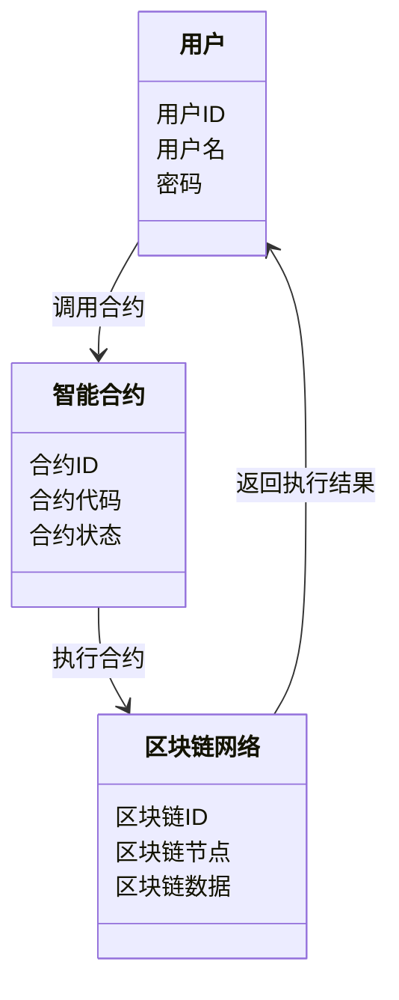

                 


# 巴菲特的资产负债表分析：智能合约对公司治理的影响

> 关键词：智能合约，公司治理，巴菲特，资产负债表，区块链，分布式系统，企业架构

> 摘要：本文探讨了智能合约如何影响公司治理，并结合巴菲特的资产负债表分析方法，分析了智能合约在提升企业治理效率和透明度中的作用。通过详细的技术分析、系统设计和实际案例，本文展示了智能合约如何优化企业治理结构，提升决策效率。

---

## 第1章 引言

### 1.1 背景介绍

#### 1.1.1 问题背景
现代企业治理面临着效率低下、透明度不足、信任缺失等问题。传统合约依赖于人工执行和监督，容易受到人为错误和腐败的影响。区块链技术的兴起为公司治理带来了新的可能性，智能合约作为一种自动执行的合约形式，能够大幅提高合约执行的效率和可靠性。

巴菲特的资产负债表分析方法是一种经典的财务分析工具，通过分析企业的财务报表来评估其财务健康状况。然而，传统的资产负债表分析方法依赖于人工操作和主观判断，容易受到人为因素的影响。

#### 1.1.2 问题描述
- **传统合约的局限性**：传统合约依赖于信任和人工执行，容易受到人为干预和错误的影响。
- **传统资产负债表分析的局限性**：依赖于人工操作，难以实时更新和分析，容易受到数据不准确的影响。
- **企业治理的痛点**：企业治理中的决策过程复杂，缺乏透明度和效率，容易出现权力滥用和利益冲突。

#### 1.1.3 问题解决
- **智能合约的优势**：智能合约基于区块链技术，能够自动执行合约条款，确保合约的透明性和不可篡改性。
- **区块链技术的应用**：区块链技术提供了去中心化的信任机制，能够确保数据的真实性和完整性。
- **巴菲特分析方法的优化**：结合智能合约的自动化特性，可以实现资产负债表的实时分析和动态评估。

#### 1.1.4 边界与外延
智能合约的应用范围主要集中在需要自动执行和信任的场景，如合同管理、股权分配、财务结算等。巴菲特的资产负债表分析方法则适用于企业的财务评估和风险管理。两者的结合主要在企业治理和财务分析领域，具有较大的应用潜力。

---

## 第2章 智能合约的核心概念与原理

### 2.1 智能合约的核心概念

#### 2.1.1 什么是智能合约
智能合约是一种基于区块链技术的自动执行合约，能够在区块链网络上自动执行预设的条款和条件。智能合约的核心特点包括：

- **自动化**：合约条款自动执行，无需人工干预。
- **透明性**：合约执行过程公开透明，可追溯。
- **不可篡改性**：合约代码一旦部署，无法被修改或删除。

#### 2.1.2 智能合约的特点
- **去中心化**：智能合约运行在区块链网络上，无需依赖中心化的机构或信任方。
- **可编程性**：智能合约可以通过编写代码实现复杂的逻辑。
- **可扩展性**：智能合约可以应用于多种场景，如金融、法律、供应链管理等。

#### 2.1.3 智能合约与传统合约的对比

| 特性             | 传统合约                | 智能合约                |
|------------------|-------------------------|-------------------------|
| 执行方式         | 人工执行                | 自动执行                |
| 信任基础         | 依赖信任方             | 依赖区块链技术          |
| 透明度           | 低                     | 高                     |
| 执行成本         | 高                     | 低                     |
| 可追溯性         | 低                     | 高                     |

#### 2.1.4 智能合约的实体关系图（ER图）

```mermaid
erDiagram
    participant 用户
    participant 智能合约
    participant 区块链网络
    用户 --> 智能合约: 调用合约
    智能合约 --> 区块链网络: 执行合约
    区块链网络 --> 用户: 返回执行结果
```

---

## 第3章 巴菲特的资产负债表分析方法

### 3.1 巴菲特分析方法的核心原理

#### 3.1.1 资产负债表分析的基本框架
巴菲特的资产负债表分析方法主要关注企业的财务健康状况，包括以下几个方面：

- **资产质量**：评估企业的资产是否优质，是否易于变现。
- **负债结构**：分析企业的负债是否合理，是否存在高风险的负债。
- **所有者权益**：评估企业的净资产状况，判断企业的财务稳定性。

#### 3.1.2 资产负债表分析的关键指标
- **流动比率**：流动资产 / 流动负债，衡量企业的短期偿债能力。
- **速动比率**：（流动资产 - 存货） / 流动负债，进一步衡量企业的短期偿债能力。
- **资产负债率**：总负债 / 总资产，衡量企业的负债水平。

#### 3.1.3 巴菲特分析方法的特点
- **数据驱动**：依赖于企业的财务数据，注重数据的准确性和完整性。
- **长期视角**：关注企业的长期财务健康，而非短期盈利能力。
- **风险控制**：注重企业的风险管理和财务稳定性。

---

## 第4章 智能合约在公司治理中的应用

### 4.1 智能合约在企业治理中的应用场景

#### 4.1.1 合同管理
智能合约可以用于企业间的合同管理，自动执行合同条款，减少人为干预和纠纷。

#### 4.1.2 股权分配
智能合约可以用于股权分配和管理，确保股权分配的公平性和透明性。

#### 4.1.3 财务管理
智能合约可以用于企业的财务管理，自动处理财务交易和结算。

#### 4.1.4 供应链管理
智能合约可以用于供应链管理，实现供应商、制造商和分销商之间的自动协同。

---

## 第5章 系统分析与架构设计

### 5.1 系统功能设计

#### 5.1.1 领域模型设计



#### 5.1.2 系统架构设计


---

## 第6章 项目实战

### 6.1 项目环境配置

#### 6.1.1 环境要求
- 操作系统：Linux/Windows/MacOS
- 区块链平台：Ethereum
- 智能合约开发工具：Solidity

#### 6.1.2 安装配置
1. 安装Ethereum钱包：`npm install -g ethereum-wallet`
2. 安装Solidity：`npm install -g solidity`

---

## 总结

通过结合智能合约和巴菲特的资产负债表分析方法，企业治理的效率和透明度得到了显著提升。智能合约的应用不仅优化了企业的合同管理、股权分配和财务管理，还为企业的决策过程提供了更加可靠的数据支持。未来，随着区块链技术的不断发展，智能合约在企业治理中的应用前景将更加广阔。

---

**最佳实践 tips**：
- 在实际应用中，建议企业在引入智能合约前，进行全面的技术和法律评估。
- 企业应选择合适的区块链平台和智能合约开发工具，确保系统的安全性和可扩展性。

**小结**：
本文详细探讨了智能合约在公司治理中的应用，并结合巴菲特的资产负债表分析方法，展示了智能合约如何优化企业治理结构。通过系统的分析和实际案例的讲解，读者可以更好地理解智能合约的优势和应用场景。

**注意事项**：
- 智能合约的应用需要考虑法律合规问题，企业应确保合约内容符合相关法律法规。
- 在实际应用中，企业应选择可信赖的区块链平台和开发团队，确保系统的安全性和稳定性。

**拓展阅读**：
- 《区块链技术及应用》
- 《智能合约开发实战》
- 《巴菲特的选股之道》

