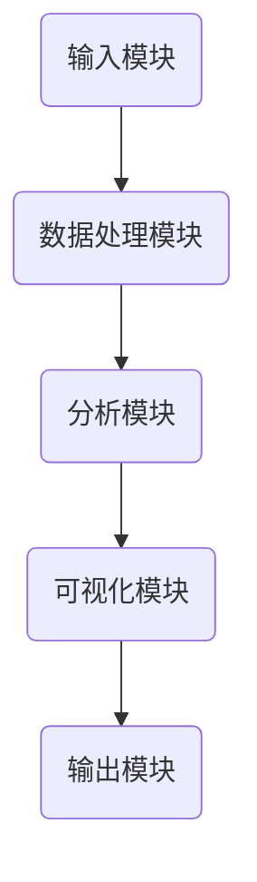

                 


# 巴菲特的资产负债表分析：透视公司财务健康状况

## 关键词：巴菲特，资产负债表，财务分析，投资理念，财务健康

## 摘要：本文深入探讨巴菲特分析公司财务健康状况的方法，重点讲解资产负债表的核心要素、分析技巧和实战案例，帮助读者掌握通过财务报表评估公司健康状况的技能。

---

## 第1章：巴菲特的投资理念与资产负债表概述

### 1.1 巴菲特的投资理念

#### 1.1.1 价值投资的核心思想

沃伦·巴菲特是价值投资的代表人物，他的投资理念基于对公司基本面的深入分析。他认为，市场先生的情绪波动为投资者提供了低价买入优质资产的机会。因此，理解公司财务报表，尤其是资产负债表，是评估公司内在价值的关键。

#### 1.1.2 资产负债表在投资中的重要性

资产负债表是公司财务健康状况的晴雨表。通过分析资产负债表，投资者可以了解公司的资产结构、负债水平和所有者权益，从而评估公司的财务风险和盈利能力。

#### 1.1.3 巴菲特分析公司财务的三大报表

巴菲特使用资产负债表、利润表和现金流量表来全面评估公司的财务状况。其中，资产负债表提供了公司在某一特定时点的资产、负债和所有者权益的结构。

---

### 1.2 资产负债表的基本结构

#### 1.2.1 资产、负债、所有者权益的定义

- **资产**：公司拥有的资源，预期能带来经济利益。
- **负债**：公司承担的债务，需在未来偿还。
- **所有者权益**：公司资产减去负债后归所有者的部分。

#### 1.2.2 资产负债表的编制与格式

资产负债表通常分为左右两部分，左侧列示资产，右侧列示负债和所有者权益。公司可以根据会计准则（如GAAP或IFRS）编制资产负债表。

#### 1.2.3 资产负债表的分析方法

分析资产负债表时，应关注资产的流动性、负债的偿付压力和所有者权益的稳定性。巴菲特常用的方法包括横向比较和纵向比较，以评估公司财务健康状况。

---

## 第2章：资产分析

### 2.1 流动资产

#### 2.1.1 现金及现金等价物

现金及现金等价物包括公司持有的现金、银行存款和短期投资。流动性高，但收益较低。

#### 2.1.2 存货

存货是公司尚未售出的产品或原材料。存货周转率是衡量存货管理效率的重要指标。

#### 2.1.3 应收账款

应收账款是公司因赊销而产生的债权。账龄分析可以帮助评估应收账款的回收风险。

#### 2.1.4 流动资产的流动性评估

流动资产的流动性越高，公司应对短期债务的能力越强。流动比率（流动资产/流动负债）是衡量流动资产流动性的重要指标。

---

### 2.2 非流动资产

#### 2.2.1 固定资产

固定资产包括土地、建筑物、设备等。固定资产的价值需要定期评估折旧情况。

#### 2.2.2 无形资产

无形资产包括专利、商标、商誉等。商誉是公司并购时产生的溢价，需谨慎评估其价值。

#### 2.2.3 其他长期资产

其他长期资产包括长期股权投资、投资性房地产等。这些资产的流动性较低，但可能为公司带来长期收益。

---

## 第3章：负债分析

### 3.1 流动负债

#### 3.1.1 短期借款

短期借款是公司为应对短期资金需求而获得的贷款。还款期限通常不超过一年。

#### 3.1.2 应付账款

应付账款是公司因购买原材料或服务而产生的债务。应付账款的账期管理是公司财务管理的重要部分。

#### 3.1.3 其他应付款

其他应付款包括应付利息、应付租金等。这些负债通常金额较小，但需按时偿还。

#### 3.1.4 流动负债的偿付压力

流动负债的偿付压力可以通过速动比率（速动资产/流动负债）来评估。速动资产包括现金、应收账款和存货。

---

### 3.2 非流动负债

#### 3.2.1 长期借款

长期借款是公司为满足长期资金需求而获得的贷款。长期借款通常具有较低的利率和较长的还款期限。

#### 3.2.2 应付债券

应付债券是公司发行的债务工具，通常附带固定的票面利率和期限。

#### 3.2.3 其他长期负债

其他长期负债包括长期应付票据、融资租赁负债等。这些负债通常金额较大，需长期偿还。

---

## 第4章：所有者权益分析

### 4.1 所有者权益的构成

#### 4.1.1 实收资本

实收资本是公司股东实际投入的股本，反映了股东对公司的初始投资。

#### 4.1.2 资本公积

资本公积是公司发行股票时超过面值的部分，用于抵消未来可能的债务损失。

#### 4.1.3 盈余公积

盈余公积是公司从净利润中提取的部分，用于公司未来发展或弥补亏损。

#### 4.1.4 未分配利润

未分配利润是公司净利润中尚未分配给股东的部分，反映了公司的积累能力。

---

## 第5章：财务比率分析

### 5.1 流动比率

流动比率（Current Ratio）= 流动资产 / 流动负债

- 公式：$$\text{流动比率} = \frac{\text{流动资产}}{\text{流动负债}}$$
- 示例：假设流动资产为1000万元，流动负债为500万元，则流动比率为2:1，表明公司有足够的流动资产偿还短期债务。

### 5.2 速动比率

速动比率（Quick Ratio）= 速动资产 / 流动负债

- 公式：$$\text{速动比率} = \frac{\text{速动资产}}{\text{流动负债}}$$
- 示例：假设速动资产为800万元，流动负债为500万元，则速动比率为1.6:1，表明公司在不依赖存货的情况下也能偿还短期债务。

### 5.3 负债比率

负债比率（Debt Ratio）= 总负债 / 总资产

- 公式：$$\text{负债比率} = \frac{\text{总负债}}{\text{总资产}}$$
- 示例：假设总负债为8000万元，总资产为10000万元，则负债比率为0.8，表明公司约80%的资产由负债支持。

### 5.4 负债与所有者权益比率

负债与所有者权益比率（Debt-to-Equity Ratio）= 总负债 / 所有者权益

- 公式：$$\text{负债与所有者权益比率} = \frac{\text{总负债}}{\text{所有者权益}}$$
- 示例：假设总负债为8000万元，所有者权益为2000万元，则负债与所有者权益比率为4:1，表明公司 heavily leveraged。

---

## 第6章：实战案例分析

### 6.1 项目背景

以某制造公司为例，分析其资产负债表。

### 6.2 数据收集

- 资产负债表数据：流动资产、流动负债、非流动资产、非流动负债、所有者权益。
- 利润表数据：营业收入、净利润。

### 6.3 分析步骤

#### 6.3.1 计算流动比率和速动比率

- 流动比率：1000万元 / 500万元 = 2:1
- 速动比率：800万元 / 500万元 = 1.6:1

#### 6.3.2 计算负债比率和负债与所有者权益比率

- 负债比率：8000万元 / 10000万元 = 0.8
- 负债与所有者权益比率：8000万元 / 2000万元 = 4:1

### 6.4 结论与建议

- 流动比率和速动比率较高，表明公司短期偿债能力较强。
- 负债比率较高，建议公司优化资本结构，降低负债比例，以降低财务风险。

---

## 第7章：系统分析与架构设计方案

### 7.1 系统分析

#### 7.1.1 问题场景

分析一家公司的资产负债表，评估其财务健康状况。

#### 7.1.2 系统功能设计

- 数据输入：资产负债表数据录入。
- 数据分析：计算财务比率，生成图表。
- 结果展示：显示分析结果，提供可视化图表。

### 7.2 系统架构设计

#### 7.2.1 系统架构图



#### 7.2.2 系统接口设计

- 输入接口：接受资产负债表数据。
- 输出接口：显示分析结果和图表。

---

## 第8章：项目实战

### 8.1 环境安装

安装Python和Pandas库，用于数据处理和分析。

### 8.2 核心实现

```python
import pandas as pd

# 假设资产负债表数据存储在Excel文件中
df = pd.read_excel('balance_sheet.xlsx')

# 计算流动比率
current_assets = df['流动资产'].sum()
current_liabilities = df['流动负债'].sum()
current_ratio = current_assets / current_liabilities

# 计算速动比率
quick_assets = df['速动资产'].sum()
quick_ratio = quick_assets / current_liabilities

print(f"流动比率: {current_ratio}")
print(f"速动比率: {quick_ratio}")
```

### 8.3 应用解读

通过Python代码计算流动比率和速动比率，帮助投资者快速评估公司的短期偿债能力。

---

## 第9章：最佳实践与小结

### 9.1 最佳实践

- 定期分析公司的资产负债表，关注流动比率和速动比率的变化。
- 结合利润表和现金流量表，全面评估公司的财务状况。

### 9.2 小结

通过本文的学习，读者可以掌握巴菲特的资产负债表分析方法，能够独立分析公司的财务健康状况，做出更明智的投资决策。

---

## 第10章：注意事项与拓展阅读

### 10.1 注意事项

- 财务分析需结合行业特点，不同行业的财务比率标准不同。
- 数据来源需可靠，确保分析结果的准确性。

### 10.2 拓展阅读

- 阅读巴菲特的《聪明的投资者》，深入理解价值投资理念。
- 学习财务报表分析的高级方法，如杜邦分析法。

---

通过以上章节的学习，读者可以全面掌握如何通过资产负债表分析公司的财务健康状况，提升投资决策的能力。

