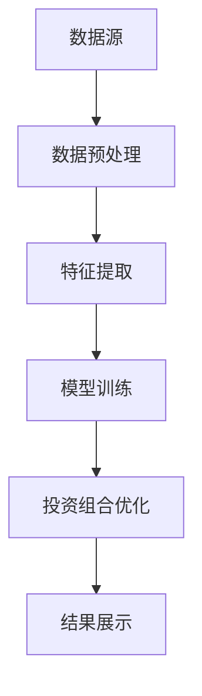

                 


# 巴菲特的资本配置艺术：人工智能辅助的投资组合优化

## 关键词：巴菲特，资本配置，人工智能，投资组合优化，机器学习，价值投资

## 摘要：  
本文探讨了如何将巴菲特的价值投资理念与现代人工智能技术相结合，以优化投资组合。通过分析资本配置的数学模型、机器学习算法和系统架构设计，展示了AI在投资决策中的应用潜力，并通过实际案例分析验证了其有效性。

---

## 第一部分: 巴菲特的资本配置艺术与人工智能概述

### 第1章: 巴菲特的资本配置理论

#### 1.1 巴菲特投资理念的核心思想
##### 1.1.1 价值投资的基本原则
巴菲特的价值投资理念强调购买具有持续竞争优势的企业，并以合理的价格买入。其核心思想是寻找市场中的“定价低于内在价值”的股票。

##### 1.1.2 资本配置的长期视角
巴菲特认为资本配置是企业价值创造的核心。他主张将资本分配到能够产生最大回报的领域，并长期持有优质资产。

##### 1.1.3 股东权益最大化的目标
巴菲特的目标是为股东创造最大价值，通过优化资本配置实现这一目标。

#### 1.2 巴菲特投资策略的关键要素
##### 1.2.1 财务指标分析
巴菲特注重企业的财务健康状况，关注ROE（净资产收益率）、ROA（资产回报率）等指标。

##### 1.2.2 企业竞争优势分析
他强调企业的“护城河”，即企业的竞争优势是否能长期持续。

##### 1.2.3 股票估值方法
巴菲特使用内在价值法，通过分析企业的未来现金流折现值来评估股票的合理价格。

### 第2章: 人工智能在金融投资中的应用现状

#### 2.1 人工智能在金融领域的应用领域
##### 2.1.1 股票预测
通过分析历史数据和市场情绪，利用机器学习模型预测股票价格走势。

##### 2.1.2 风险评估
AI可以帮助评估投资组合的风险，识别潜在的市场风险点。

##### 2.1.3 投资组合优化
利用AI技术优化投资组合的配置，以实现最大收益和最小风险。

#### 2.2 人工智能在投资组合优化中的优势
##### 2.2.1 数据处理能力
AI能够处理海量数据，提取有用的特征，帮助投资者做出更明智的决策。

##### 2.2.2 模型优化能力
通过机器学习算法，AI可以构建复杂的优化模型，提高投资组合的效率。

##### 2.2.3 实时决策能力
AI能够实时监控市场变化，快速调整投资策略，应对市场波动。

---

## 第二部分: 资本配置的数学模型与算法原理

### 第3章: 资本配置的数学模型

#### 3.1 投资组合优化的数学公式
##### 3.1.1 资本资产定价模型（CAPM）
$$ E(r_i) = r_f + β_i (E(r_m) - r_f) $$
其中，$E(r_i)$是资产i的预期回报率，$r_f$是无风险利率，$β_i$是资产i的贝塔系数，$E(r_m)$是市场预期回报率。

##### 3.1.2 马科维茨均值-方差模型
$$ \text{Minimize } \sigma^2 \text{ subject to } \mathbb{E}[r] = \text{target return} $$
其中，$\sigma^2$是投资组合的方差（风险），$\mathbb{E}[r]$是预期回报率。

#### 3.2 巴菲特资本配置模型的扩展
##### 3.2.1 价值投资的量化模型
通过量化分析企业的基本面指标，如市盈率、市净率等，筛选出具有投资价值的股票。

##### 3.2.2 多因子模型
利用多个因子（如市值、价值、动量等）构建投资组合，分散风险，提高收益。

##### 3.2.3 动态调整模型
根据市场变化和企业基本面的变化，动态调整投资组合的配置。

### 第4章: 基于人工智能的投资组合优化算法

#### 4.1 机器学习在投资组合优化中的应用
##### 4.1.1 回归分析
通过回归模型预测股票价格，辅助投资决策。

##### 4.1.2 支持向量机（SVM）
用于分类问题，如判断股票是上涨还是下跌。

##### 4.1.3 随机森林
用于特征重要性分析，帮助筛选关键的财务指标。

#### 4.2 基于深度学习的投资组合优化
##### 4.2.1 RNN在时间序列预测中的应用
利用循环神经网络（RNN）预测股票价格的时间序列变化。

##### 4.2.2 LSTM在股票价格预测中的应用
长短期记忆网络（LSTM）能够捕捉长期依赖关系，适用于股票价格预测。

##### 4.2.3 Transformer在多资产配置中的应用
Transformer架构用于多资产类别数据的分析，帮助构建多维投资组合。

---

## 第三部分: 系统分析与架构设计

### 第5章: 投资组合优化系统的架构设计

#### 5.1 系统功能需求分析
##### 5.1.1 数据采集模块
从多个数据源获取股票数据，包括历史价格、财务报表等。

##### 5.1.2 数据预处理模块
对数据进行清洗、标准化处理，提取特征。

##### 5.1.3 模型训练模块
利用机器学习算法训练投资组合优化模型。

##### 5.1.4 投资组合优化模块
根据训练好的模型，生成投资组合的优化配置。

##### 5.1.5 结果展示模块
将优化结果以可视化形式展示，供投资者参考。

#### 5.2 系统架构设计


---

## 第四部分: 项目实战

### 第6章: 项目实战与代码实现

#### 6.1 环境安装
安装必要的Python库，如Pandas、NumPy、Scikit-learn、TensorFlow等。

#### 6.2 系统核心实现源代码
以下是一个基于机器学习的投资组合优化的Python代码示例：

```python
import numpy as np
import pandas as pd
from sklearn.ensemble import RandomForestRegressor
from sklearn.model_selection import train_test_split
from sklearn.metrics import mean_squared_error

# 数据加载
data = pd.read_csv('stock_data.csv')

# 特征工程
features = data[['市盈率', '市净率', 'ROE', '营收增长']]
target = data['未来回报率']

# 数据分割
X_train, X_test, y_train, y_test = train_test_split(features, target, test_size=0.2, random_state=42)

# 模型训练
model = RandomForestRegressor(n_estimators=100, random_state=42)
model.fit(X_train, y_train)

# 模型预测
y_pred = model.predict(X_test)

# 模型评估
mse = mean_squared_error(y_test, y_pred)
rmse = np.sqrt(mse)
print(f"均方误差: {mse}")
print(f"均方根误差: {rmse}")
```

#### 6.3 代码应用解读与分析
上述代码展示了如何利用随机森林回归模型预测股票的未来回报率。通过特征工程提取关键的财务指标，构建模型并进行预测，最后评估模型的性能。

#### 6.4 实际案例分析
以具体股票为例，分析如何通过上述模型优化投资组合配置。

#### 6.5 项目小结
本项目通过实际案例展示了人工智能在投资组合优化中的应用，验证了AI技术在投资决策中的潜力。

---

## 第五部分: 总结与展望

### 第7章: 总结与展望

#### 7.1 小结
本文探讨了如何将巴菲特的价值投资理念与人工智能技术相结合，提出了基于机器学习的投资组合优化方法，并通过实际案例验证了其有效性。

#### 7.2 注意事项
在实际应用中，需要注意模型的过拟合问题，同时结合市场实际情况进行动态调整。

#### 7.3 拓展阅读
建议进一步研究强化学习在投资组合优化中的应用，探索更复杂的多资产配置策略。

---

## 结语
通过本文的分析，我们可以看到人工智能技术在投资组合优化中的巨大潜力。结合巴菲特的价值投资理念，AI技术可以帮助投资者更科学地进行资本配置，实现长期的财富增长。

