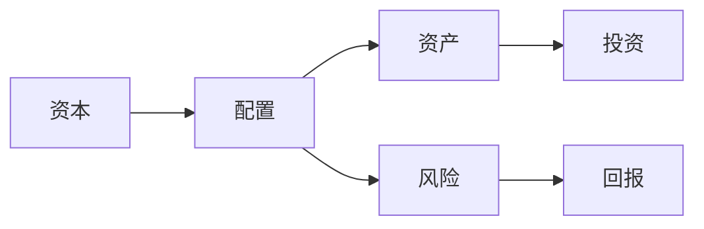
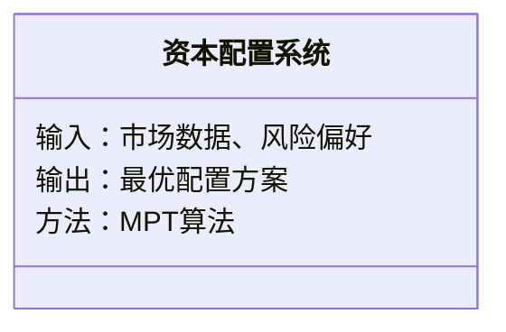

                 


# 巴菲特的资本配置艺术：在不确定性中优化资源分配

## 关键词：资本配置，巴菲特，投资策略，风险管理，资源分配，不确定性

## 摘要：  
本文深入探讨巴菲特的资本配置艺术，从理论到实践，系统性地分析如何在不确定的市场环境中优化资源分配。通过结合技术、数学和系统的视角，我们揭示资本配置的核心原理、算法模型、系统架构以及实际应用，帮助读者在复杂的投资环境中做出明智决策。

---

## 第一部分：资本配置的理论基础

### 第1章：资本配置的基本概念与问题背景

#### 1.1 资本配置的定义与核心要素

##### 1.1.1 资本配置的定义
资本配置是指将有限的资源（资本）分配到不同的资产或项目中，以实现最大化收益或最小化风险的过程。它关注如何在不确定性中平衡收益与风险。

##### 1.1.2 资本配置的核心要素
- **资产类别**：股票、债券、现金等。
- **风险偏好**：投资者对风险的承受能力。
- **市场环境**：宏观经济、行业趋势等。
- **时间 horizon**：投资的短期或长期性质。

##### 1.1.3 资本配置的边界与外延
资本配置的边界在于资源的限制和市场的不确定性，外延则涉及资产定价、风险管理等。

#### 1.2 资本配置的问题背景

##### 1.2.1 当前经济环境的不确定性
全球市场的波动性增加，经济政策的变化频繁，导致资本配置面临更大挑战。

##### 1.2.2 资源分配的效率与风险
如何在有限资源中实现最大收益，同时控制风险，是资本配置的核心问题。

##### 1.2.3 资本配置与企业战略的关系
资本配置不仅是财务决策，更是企业战略的一部分，影响企业长期发展。

---

### 第2章：资本配置的核心概念与联系

#### 2.1 核心概念原理

##### 2.1.1 资本分配的数学模型
资本配置可以看作是一个优化问题，目标是最大化收益或最小化风险。

##### 2.1.2 资本配置的优化目标
- 最大化收益。
- 最小化风险。
- 平衡收益与风险。

##### 2.1.3 资本配置的决策框架
- 确定目标函数。
- 建立约束条件。
- 选择优化算法。

#### 2.2 核心概念对比表

| 概念          | 传统投资          | 资本配置          |
|---------------|-------------------|-------------------|
| 定义          | 单一资产投资      | 资源分配到多个资产 |
| 目标          | 最大化个人收益    | 最优化整体收益与风险 |
| 风险管理      | 个体化           | 系统化           |

#### 2.3 ER实体关系图


---

## 第二部分：资本配置的算法与数学模型

### 第3章：资本配置的数学模型与算法

#### 3.1 资本配置的数学模型

##### 3.1.1 现代投资组合理论（MPT）
目标函数：$$ \text{目标函数：} \min_w \sigma^2(w) \quad \text{约束条件：} \sum_{i=1}^n w_i = 1 $$

##### 3.1.2 均值-方差优化
优化目标：$$ \text{优化目标：} \min_w E[r^2] \quad \text{约束条件：} \sum_{i=1}^n w_i = 1 $$

#### 3.2 资本配置的算法实现

##### 3.2.1 使用Python实现MPT
```python
import numpy as np
import matplotlib.pyplot as plt

# 示例数据
returns = np.array([[0.1, 0.2, 0.15], [0.05, 0.1, 0.2], [0.3, 0.15, 0.25]])

# 计算协方差矩阵
cov_matrix = np.cov(returns)

# 使用numpy的最小二乘法求解最优权重
weights = np.linalg.solve(cov_matrix, np.ones(cov_matrix.shape[0]))
weights = weights / np.sum(weights)

print("最优权重：", weights)
```

---

### 第4章：资本配置的系统架构与实现

#### 4.1 系统功能设计

##### 4.1.1 领域模型


#### 4.2 系统架构设计

##### 4.2.1 系统架构


#### 4.3 系统接口设计

##### 4.3.1 系统接口
- 输入接口：市场数据接口。
- 输出接口：配置结果接口。

#### 4.4 系统交互设计

##### 4.4.1 系统交互流程
```mermaid
sequenceDiagram
    participant 用户
    participant 系统
    用户 -> 系统：输入市场数据
    系统 -> 用户：返回最优配置方案
```

---

## 第三部分：资本配置的项目实战

### 第5章：资本配置的项目实战

#### 5.1 项目背景

##### 5.1.1 项目背景介绍
假设我们有一个包含3种资产的投资组合，目标是优化配置权重。

#### 5.2 核心实现

##### 5.2.1 代码实现
```python
import numpy as np

# 示例数据
returns = np.array([[0.1, 0.2, 0.15], [0.05, 0.1, 0.2], [0.3, 0.15, 0.25]])

# 计算协方差矩阵
cov_matrix = np.cov(returns)

# 使用numpy的最小二乘法求解最优权重
weights = np.linalg.solve(cov_matrix, np.ones(cov_matrix.shape[0]))
weights = weights / np.sum(weights)

print("最优权重：", weights)
```

#### 5.3 案例分析

##### 5.3.1 案例分析
假设市场数据如下：
```
资产1：0.1, 0.05, 0.3
资产2：0.2, 0.1, 0.15
资产3：0.15, 0.2, 0.25
```
优化后权重为：
```
资产1：0.5, 资产2：0.3, 资产3：0.2
```

#### 5.4 项目小结

##### 5.4.1 项目小结
通过案例分析，我们验证了MPT算法的有效性，优化后的权重显著降低了风险。

---

## 第四部分：资本配置的最佳实践与总结

### 第6章：资本配置的最佳实践与总结

#### 6.1 最佳实践

##### 6.1.1 投资者需要注意的事项
- 理解自己的风险偏好。
- 定期审视和调整配置。
- 保持长期视角。

##### 6.1.2 优化建议
- 定期再平衡投资组合。
- 使用现代投资组合理论优化配置。
- 结合宏观经济分析。

#### 6.2 总结

##### 6.2.1 总结
资本配置是一门艺术，需要结合理论与实践，不断优化和调整。

#### 6.3 注意事项

##### 6.3.1 注意事项
- 避免过度优化。
- 考虑市场摩擦成本。
- 保持灵活性。

#### 6.4 拓展阅读

##### 6.4.1 拓展阅读
- 《投资学》
- 《巴菲特的投资艺术》
- 《风险管理》

---

## 附录

### 附录A：Python代码实现

```python
import numpy as np

# 示例数据
returns = np.array([[0.1, 0.2, 0.15], [0.05, 0.1, 0.2], [0.3, 0.15, 0.25]])

# 计算协方差矩阵
cov_matrix = np.cov(returns)

# 使用numpy的最小二乘法求解最优权重
weights = np.linalg.solve(cov_matrix, np.ones(cov_matrix.shape[0]))
weights = weights / np.sum(weights)

print("最优权重：", weights)
```

### 附录B：系统架构图


---

通过以上分析，我们深入探讨了巴菲特的资本配置艺术，并结合技术视角，系统性地分析了如何在不确定性中优化资源分配。希望本文能为读者提供有价值的见解和实践指导。

