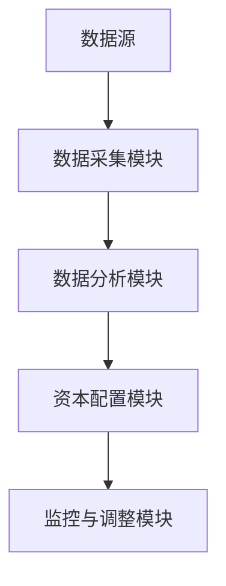

                 


# 巴菲特的资本配置艺术：数字化转型中的资源优化

> 关键词：资本配置，巴菲特，数字化转型，资源优化，系统架构，项目实战

> 摘要：本文将深入探讨巴菲特的资本配置艺术，并结合数字化转型的背景，分析资源优化的方法。通过系统架构设计和项目实战，展示如何将资本配置的理念与数字化技术相结合，实现资源的最优配置。

---

## 第一章：资本配置的基本概念

### 1.1 资本配置的定义与重要性

#### 1.1.1 资本配置的定义
资本配置是指将资金分配到不同的资产或项目中，以实现投资目标的过程。资本配置的核心在于优化资源分配，最大化投资回报。

#### 1.1.2 资本配置的重要性
资本配置直接影响企业的财务表现和长期发展。科学的资本配置能够提升企业竞争力，降低风险，实现可持续发展。

#### 1.1.3 资本配置的核心要素
- 资金分配：将资金分配到高回报、低风险的项目。
- 投资目标：明确投资目标，如收益最大化、风险最小化。
- 资源分配策略：根据市场环境和企业战略调整资源分配。

### 1.2 资本配置的基本原则

#### 1.2.1 资本配置的首要原则
资本配置应以企业战略目标为导向，确保资金分配符合企业长期发展需求。

#### 1.2.2 资本配置的次要原则
资金分配应考虑市场风险、流动性、收益潜力等因素，确保配置的合理性。

#### 1.2.3 资本配置的实施步骤
1. 确定投资目标和预算。
2. 分析市场环境和项目风险。
3. 制定资金分配方案。
4. 监控和调整配置策略。

---

## 第二章：巴菲特的资本配置理念

### 2.1 巴菲特的投资哲学

#### 2.1.1 价值投资的核心理念
巴菲特倡导价值投资，即以低于内在价值的价格买入优质资产。他强调长期投资，关注企业的基本面，如盈利能力、财务健康和管理团队。

#### 2.1.2 股东权益最大化的目标
巴菲特的目标是最大化股东权益，通过合理配置资本，实现股东价值的最大化。

#### 2.1.3 长期投资与企业价值评估
巴菲特注重长期投资，通过对企业价值的深入评估，选择具有持续竞争优势的企业进行投资。

### 2.2 巴菲特的资本配置策略

#### 2.2.1 股票投资的集中化策略
巴菲特倾向于集中投资，将大部分资金分配到少数优质企业，以减少风险并提高收益。

#### 2.2.2 股票选择的标准与方法
- 企业具有持续的盈利能力。
- 企业具有强大的竞争优势。
- 企业治理结构良好，管理层可靠。

#### 2.2.3 资本分配的动态调整
根据市场变化和企业情况，动态调整资本分配策略，优化资源配置。

---

## 第三章：资本配置的数学模型与算法

### 3.1 资本配置的数学模型

#### 3.1.1 资本配置的线性规划模型
线性规划模型用于优化资本分配，目标是最化收益或最小化风险。数学模型如下：

$$
\text{目标函数}： \max \sum_{i} w_i r_i
$$

$$
\text{约束条件}： \sum_{i} w_i = 1, \quad w_i \geq 0
$$

其中，\( w_i \) 表示投资于资产 \( i \) 的权重，\( r_i \) 表示资产 \( i \) 的预期收益。

#### 3.1.2 资本配置的动态规划模型
动态规划模型适用于多阶段资本配置问题，通过分阶段决策优化整体配置。

#### 3.1.3 资本配置的马科维茨均值-方差模型
马科维茨均值-方差模型用于优化投资组合的收益和风险。数学模型如下：

$$
\min \sigma^2 = \sum_{i,j} w_i w_j \sigma_{i,j}
$$

$$
\text{约束条件}： \sum_{i} w_i = 1, \quad w_i \geq 0
$$

其中，\( \sigma_{i,j} \) 表示资产 \( i \) 和 \( j \) 的协方差。

### 3.2 资本配置的算法实现

#### 3.2.1 均值-方差模型的实现步骤
1. 计算各资产的预期收益和协方差矩阵。
2. 求解优化问题，得到最优权重。
3. 验证结果，调整配置。

#### 3.2.2 资本配置的优化算法
使用Python的scipy.optimize模块中的minimize函数实现均值-方差模型的优化。

#### 3.2.3 资本配置的Python代码实现

```python
import numpy as np
from scipy.optimize import minimize

# 示例数据
n = 3
mu = np.array([0.1, 0.2, 0.15])
cov = np.array([[0.05, 0.02, 0.01],
               [0.02, 0.06, 0.03],
               [0.01, 0.03, 0.07]])

def objective(w):
    return np.dot(w.T, np.dot(cov, w))

# 约束条件
cons = ({'type': 'eq', 'fun': lambda w: np.sum(w) - 1},
        {'type': 'ineq', 'fun': lambda w: w})

w = np.array([1/3, 1/3, 1/3])
result = minimize(objective, w, constraints=cons)
print(result)
```

---

## 第四章：数字化转型中的资源优化

### 4.1 数字化转型的背景与意义

#### 4.1.1 数字化转型的定义
数字化转型是指利用数字技术（如大数据、人工智能、云计算等）重构业务模式、流程和决策方式，以实现业务创新和效率提升。

#### 4.1.2 数字化转型的核心特征
- 数据驱动决策
- 智能化业务流程
- 数字化生态系统

### 4.2 数字化转型中的资源优化

#### 4.2.1 资源优化的目标
通过数字化技术，优化资源配置，提升效率和效果，降低浪费。

#### 4.2.2 资源优化的关键技术
- 数据分析
- 人工智能
- 云计算

---

## 第五章：资本配置与数字化转型的融合

### 5.1 数字化技术在资本配置中的应用

#### 5.1.1 数据分析在资本配置中的作用
通过大数据分析，识别投资机会，评估项目风险，优化资本分配。

#### 5.1.2 人工智能在资本配置中的应用
使用机器学习模型预测市场趋势，优化投资组合，提高决策效率。

### 5.2 数字化转型中的资本配置策略

#### 5.2.1 数据驱动的资本配置
利用数据分析和预测模型，制定科学的资本分配策略。

#### 5.2.2 智能化资本配置
通过人工智能技术，实时监控市场变化，动态调整资本配置。

---

## 第六章：系统架构与项目实战

### 6.1 系统架构设计

#### 6.1.1 系统模块划分
- 数据采集模块
- 数据分析模块
- 资本配置模块
- 监控与调整模块

#### 6.1.2 系统架构图



### 6.2 项目实战

#### 6.2.1 项目背景
假设某企业需要优化资本配置，利用数字化技术提升投资效率。

#### 6.2.2 系统功能设计
- 数据采集：收集市场数据和企业财务数据。
- 数据分析：利用机器学习模型预测市场趋势。
- 资本配置：基于分析结果，制定资本分配方案。
- 监控与调整：实时监控投资表现，动态调整配置。

#### 6.2.3 核心代码实现

```python
import pandas as pd
from sklearn.linear_model import LinearRegression

# 示例数据
data = pd.DataFrame({
    '收益': [0.1, 0.2, 0.15],
    '风险': [0.05, 0.06, 0.07]
})

# 数据分析
model = LinearRegression()
model.fit(data[['风险']], data['收益'])

# 资本配置
predicted_return = model.predict(data[['风险']])
print(predicted_return)
```

---

## 第七章：总结与展望

### 7.1 总结
本文深入探讨了巴菲特的资本配置艺术，并结合数字化转型的背景，分析了资源优化的方法。通过系统架构设计和项目实战，展示了如何将资本配置的理念与数字化技术相结合，实现资源的最优配置。

### 7.2 展望
未来，随着技术的不断发展，资本配置将更加依赖数字化工具和人工智能技术。企业需要持续优化资本配置策略，提升投资效率和效果，实现可持续发展。

---

### 注意事项
- 本文内容仅供参考，具体投资决策需根据实际情况和专业建议。
- 数字化转型中的资源优化需要结合企业自身特点，制定个性化策略。

### 拓展阅读
- 巴菲特的其他投资理念
- 数字化转型的最新技术动态
- 人工智能在金融领域的应用

---

通过本文的分析，读者可以更好地理解资本配置的艺术，并在数字化转型中优化资源配置，实现企业价值的最大化。

