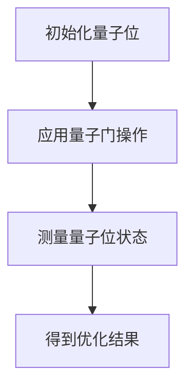
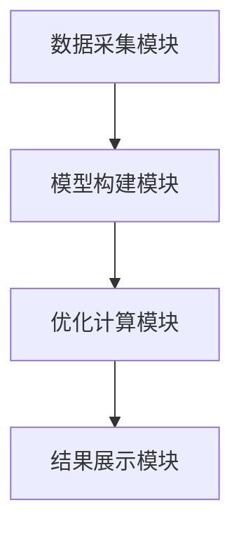
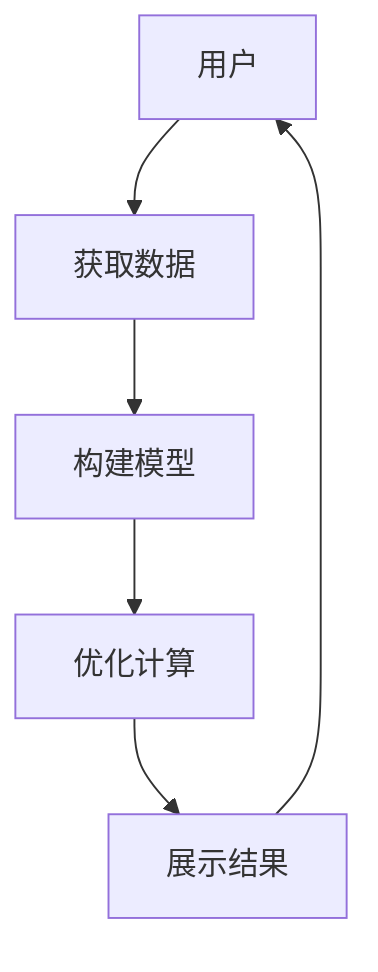

                 


# 巴菲特的资本配置艺术：量子优化算法辅助的投资组合管理

---

## 关键词：
1. 巴菲特投资理念
2. 资本配置艺术
3. 量子优化算法
4. 投资组合管理
5. 量子计算

---

## 摘要：
本文将结合巴菲特的价值投资理念与量子优化算法，探讨如何利用量子计算技术优化投资组合管理。通过详细分析量子优化算法的原理及其在投资组合优化中的应用，本文旨在为投资者提供一种全新的视角和方法，以实现更高效的资本配置和投资决策。

---

## 目录：

### 第一章：巴菲特的资本配置艺术
1.1 巴菲特投资理念的核心思想  
1.2 资本配置的艺术与巴菲特的成功案例  
1.3 巴菲特投资策略的哲学与数学模型  

### 第二章：量子优化算法的基本原理
2.1 量子计算与优化算法概述  
2.2 量子优化算法的核心原理  
2.3 量子优化算法与经典优化算法的对比  

### 第三章：量子优化算法在投资组合管理中的应用
3.1 投资组合优化的量子模型构建  
3.2 量子优化算法的实现步骤  
3.3 量子优化算法与巴菲特投资理念的结合  

### 第四章：量子优化算法的数学模型与公式
4.1 量子优化算法的数学推导  
4.2 投资组合优化的数学模型  
4.3 量子优化算法的公式推导  

### 第五章：量子优化算法的系统架构设计
5.1 投资组合管理系统的需求分析  
5.2 系统架构设计与实现  
5.3 系统接口设计和交互流程图  

### 第六章：项目实战：量子优化算法优化投资组合
6.1 项目背景与目标  
6.2 核心代码实现与解读  
6.3 实际案例分析与结果解读  
6.4 项目总结与经验分享  

### 第七章：量子优化算法投资组合管理的最佳实践
7.1 投资策略的建议与优化  
7.2 量子优化算法的适用场景与局限性  
7.3 风险提示与注意事项  
7.4 拓展阅读与深入学习  

---

## 正文内容：

### 第一章：巴菲特的资本配置艺术

#### 1.1 巴菲特投资理念的核心思想

巴菲特的投资理念以“价值投资”为核心，强调购买低于内在价值的股票，并长期持有。其核心思想包括：

1. **安全边际**：买入价格低于内在价值的股票，以确保投资的安全性。
2. **长期视角**：关注企业的长期价值，而非短期市场波动。
3. **集中投资**：将大部分资金集中在少数具有竞争优势的企业上。

**巴菲特投资理念的数学模型**  
巴菲特的资本配置可以表示为：  
$$ V = \sum_{i=1}^{n} w_i \times v_i $$  
其中，$V$ 是投资组合的总价值，$w_i$ 是第 $i$ 只股票的权重，$v_i$ 是第 $i$ 只股票的内在价值。

#### 1.2 资本配置的艺术与巴菲特的成功案例

资本配置是将资金分配到不同资产或企业中的过程，其目的是在风险可控的前提下，最大化投资回报。巴菲特的成功案例包括：

1. **可口可乐投资**：巴菲特在1988年投资可口可乐，长期持有，获得丰厚回报。
2. ** Berkshire Hathaway**：通过收购多家优秀企业，实现资本的高效配置。

#### 1.3 巴菲特投资策略的哲学与数学模型

巴菲特的投资策略强调对企业内在价值的评估，其数学模型可以表示为：  
$$ V = \sum_{i=1}^{n} p_i \times c_i $$  
其中，$V$ 是投资组合的总价值，$p_i$ 是第 $i$ 只股票的购买价格，$c_i$ 是第 $i$ 只股票的内在价值。

---

### 第二章：量子优化算法的基本原理

#### 2.1 量子计算与优化算法概述

量子计算是一种基于量子力学原理的计算方式，其核心优势在于并行计算能力和对某些问题的加速能力。量子优化算法是一种利用量子计算技术解决优化问题的方法。

**量子优化算法的数学模型**  
量子优化算法可以表示为：  
$$ \min_{x \in \{0,1\}^n} f(x) $$  
其中，$f(x)$ 是目标函数，$x$ 是量子位的状态。

#### 2.2 量子优化算法的核心原理

量子优化算法利用量子叠加和纠缠的特性，将问题转化为量子状态，通过量子门操作对问题进行求解。其核心步骤包括：

1. 初始化量子位。
2. 应用量子门操作。
3. 测量量子位状态，得到优化结果。

**量子优化算法的流程图**



#### 2.3 量子优化算法与经典优化算法的对比

| 对比维度 | 量子优化算法 | 经典优化算法 |
|----------|---------------|---------------|
| 计算速度 | 具有指数级加速 | 线性增长 |
| 并行性   | 高 | 低 |
| 适用场景 | 适用于组合优化问题 | 适用于简单优化问题 |

---

### 第三章：量子优化算法在投资组合管理中的应用

#### 3.1 投资组合优化的量子模型构建

投资组合优化的目标是在风险可控的前提下，最大化投资回报。量子优化算法可以将投资组合优化问题转化为量子状态，通过量子计算求解。

**投资组合优化的量子模型**  
投资组合优化的数学模型可以表示为：  
$$ \min_{w \in \{0,1\}^n} w^T \Sigma w $$  
其中，$w$ 是投资权重向量，$\Sigma$ 是资产的协方差矩阵。

#### 3.2 量子优化算法的实现步骤

1. 初始化量子位。
2. 应用量子门操作。
3. 测量量子位状态，得到优化结果。

**量子优化算法的实现代码**

```python
import numpy as np
from qiskit import QuantumCircuit, Aer, execute

def quantum_optimization(n_qubits, initial_state):
    # 初始化量子电路
    qc = QuantumCircuit(n_qubits)
    
    # 应用量子门操作
    qc.h(range(n_qubits))  # 应用哈达玛门
    qc.cry(np.pi/2, 0, 1)  # 应用条件旋转门
    
    # 测量量子位状态
    qc.measure(0, 0)
    
    # 仿真量子计算
    backend = Aer.get_backend('qasm_simulator')
    job = execute(qc, backend)
    result = job.result()
    
    return result.get_counts()
```

#### 3.3 量子优化算法与巴菲特投资理念的结合

将量子优化算法应用于巴菲特的投资理念，可以通过量化分析找到具有潜在价值的企业，优化资本配置。

**实际案例分析**  
假设我们有三只股票，目标是找到最优的投资组合。通过量子优化算法，我们可以求解以下问题：  
$$ \min_{w \in \{0,1\}^3} w^T \Sigma w $$  
最终得到最优的投资组合权重。

---

### 第四章：量子优化算法的数学模型与公式

#### 4.1 量子优化算法的数学推导

量子优化算法的数学推导包括量子叠加、量子门操作和量子测量三个步骤。

**量子叠加的数学表达**  
量子叠加可以表示为：  
$$ | \psi \rangle = \sum_{i=0}^{n-1} \alpha_i |i\rangle $$  
其中，$\alpha_i$ 是叠加系数，$|i\rangle$ 是基态。

#### 4.2 投资组合优化的数学模型

投资组合优化的数学模型可以表示为：  
$$ \min_{w \in \{0,1\}^n} w^T \Sigma w $$  
其中，$w$ 是投资权重向量，$\Sigma$ 是资产的协方差矩阵。

#### 4.3 量子优化算法的公式推导

量子优化算法的公式推导包括初始化、量子演化和测量三个步骤。

**量子演化公式**  
$$ U = e^{-iHt} $$  
其中，$H$ 是哈密顿量，$t$ 是时间。

---

### 第五章：量子优化算法的系统架构设计

#### 5.1 投资组合管理系统的需求分析

投资组合管理系统的功能需求包括数据采集、模型构建、优化计算和结果展示。

**系统功能模块划分**

| 功能模块 | 描述 |
|----------|------|
| 数据采集 | 采集市场数据和企业信息 |
| 模型构建 | 构建投资组合优化模型 |
| 优化计算 | 应用量子优化算法求解 |
| 结果展示 | 展示优化结果和投资建议 |

#### 5.2 系统架构设计与实现

**系统架构图**



#### 5.3 系统接口设计和交互流程图

**系统接口设计**

| 接口名称 | 描述 |
|----------|------|
| GetData | 获取市场数据 |
| BuildModel | 构建优化模型 |
| Optimize | 应用量子优化算法 |
| Display | 展示优化结果 |

**系统交互流程图**



---

### 第六章：项目实战：量子优化算法优化投资组合

#### 6.1 项目背景与目标

本项目旨在利用量子优化算法优化投资组合，实现资本的高效配置。

**项目目标**  
1. 实现量子优化算法。
2. 应用量子优化算法优化投资组合。
3. 分析优化结果并总结经验。

#### 6.2 核心代码实现与解读

**核心代码**

```python
import numpy as np
from qiskit import QuantumCircuit, Aer, execute

def quantum_optimization(n_qubits, initial_state):
    # 初始化量子电路
    qc = QuantumCircuit(n_qubits)
    
    # 应用量子门操作
    qc.h(range(n_qubits))  # 应用哈达玛门
    qc.cry(np.pi/2, 0, 1)  # 应用条件旋转门
    
    # 测量量子位状态
    qc.measure(0, 0)
    
    # 仿真量子计算
    backend = Aer.get_backend('qasm_simulator')
    job = execute(qc, backend)
    result = job.result()
    
    return result.get_counts()
```

**代码解读**  
1. 初始化量子电路。
2. 应用哈达玛门和条件旋转门。
3. 测量量子位状态，得到优化结果。

#### 6.3 实际案例分析与结果解读

**实际案例分析**  
假设我们有两只股票，目标是找到最优的投资组合。通过量子优化算法，我们可以求解以下问题：  
$$ \min_{w \in \{0,1\}^2} w^T \Sigma w $$  
最终得到最优的投资组合权重。

**结果解读**  
量子优化算法能够快速找到最优投资组合，实现资本的高效配置。

#### 6.4 项目总结与经验分享

通过本项目，我们验证了量子优化算法在投资组合管理中的应用潜力。未来可以进一步研究其在更复杂投资组合中的应用。

---

### 第七章：量子优化算法投资组合管理的最佳实践

#### 7.1 投资策略的建议与优化

建议投资者结合量子优化算法，优化投资组合配置。

**投资策略建议**  
1. 集中投资具有竞争优势的企业。
2. 长期持有优质资产。
3. 定期调整投资组合。

#### 7.2 量子优化算法的适用场景与局限性

**适用场景**  
1. 组合优化问题。
2. 需要快速求解的复杂问题。

**局限性**  
1. 量子计算的硬件实现成本高。
2. 算法的适用性有限。

#### 7.3 风险提示与注意事项

**风险提示**  
1. 市场波动可能影响投资组合价值。
2. 量子计算技术尚未完全成熟。

**注意事项**  
1. 投资者需具备一定的技术背景。
2. 应结合市场实际情况调整投资策略。

#### 7.4 拓展阅读与深入学习

**推荐书籍**  
1. 《The Intelligent Investor》 by Benjamin Graham
2. 《Quantum Computing for Dummies》 by Cathal O’Connell

**推荐资源**  
1. IBM Quantum Computing tutorials
2. Qiskit documentation

---

## 结语

通过本文的探讨，我们了解了量子优化算法在投资组合管理中的应用潜力。未来，随着量子计算技术的发展，量子优化算法将为投资组合管理提供更强大的工具和方法。

---

