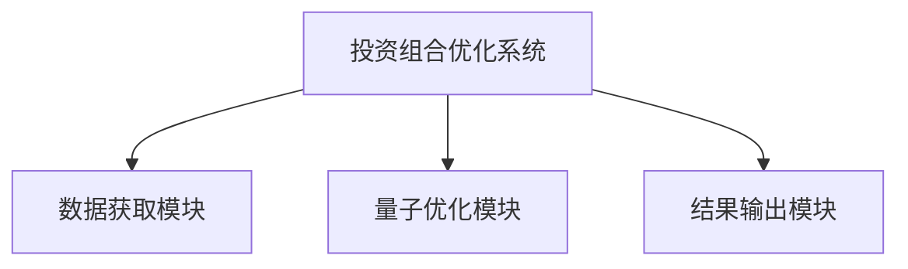
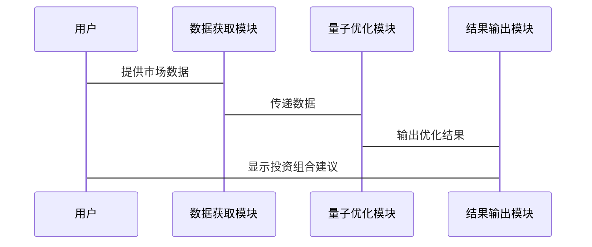

                 


```markdown
# 巴菲特的资本配置艺术：量子组合优化在投资中的应用

> 关键词：巴菲特，资本配置，量子组合优化，投资组合优化，量子计算

> 摘要：本文探讨了巴菲特的资本配置艺术及其与量子组合优化的结合。通过分析量子计算在投资组合优化中的应用，展示了如何利用量子算法提升资本配置效率和准确性。文章从背景、理论、算法、系统架构到项目实战，全面阐述了量子组合优化在投资中的潜力和实现方式。

---

## 第一部分：巴菲特的资本配置艺术与量子组合优化基础

### 第1章：巴菲特的资本配置艺术概述

#### 1.1 巴菲特投资理念的核心思想
##### 1.1.1 巴菲特的价值投资理论
巴菲特的价值投资理论强调以低于内在价值的价格购买优质企业，长期持有，赚取企业的成长收益。这一理论的核心在于对企业内在价值的评估和市场估值的对比。

##### 1.1.2 资本配置在投资中的重要性
资本配置是投资组合管理的核心，决定了资金分配的效率和效果。巴菲特认为，资本配置的正确性直接影响投资回报，甚至超过对企业估值能力的要求。

##### 1.1.3 巴菲特的长期投资策略
巴菲特的投资策略强调长期性、安全性、确定性和集中度。他倾向于投资那些具有持续竞争优势、良好治理结构和稳定现金流的企业。

#### 1.2 量子组合优化的基本概念
##### 1.2.1 量子计算的定义与特点
量子计算利用量子叠加和纠缠的特性，能够在指数级时间内处理大量数据。其特点是并行计算能力强、优化效率高。

##### 1.2.2 组合优化问题的量子解决方案
量子组合优化通过量子退火等方法，将组合优化问题转化为量子态的叠加态，利用量子力学的特性寻找最优解。

##### 1.2.3 量子组合优化在投资中的应用前景
量子组合优化能够显著提高投资组合优化的效率，特别是在处理大规模数据和复杂约束条件下。

#### 1.3 巴菲特资本配置与量子优化的结合
##### 1.3.1 资本配置问题的数学建模
资本配置问题可以建模为优化问题，目标函数通常为风险调整后的收益最大化。

##### 1.3.2 量子组合优化在资本配置中的优势
量子组合优化能够快速处理复杂的非线性优化问题，提供更优的投资组合配置。

##### 1.3.3 巴菲特投资理念与量子优化的契合点
巴菲特的长期投资理念与量子优化的高效性相契合，量子优化可以辅助其实现更优的资本配置。

#### 1.4 本章小结
本章介绍了巴菲特的投资理念和量子组合优化的基本概念，探讨了两者的结合及其在投资中的潜力。

---

## 第二部分：量子组合优化的数学模型与算法原理

### 第2章：量子组合优化的数学基础

#### 2.1 量子力学基础
##### 2.1.1 量子叠加态
量子叠加态表示一个量子系统同时处于多个状态的可能性，数学表示为：
$$|\psi\rangle = \alpha|0\rangle + \beta|1\rangle$$
其中，$\alpha$和$\beta$是概率幅，满足$|\alpha|^2 + |\beta|^2 = 1$。

##### 2.1.2 量子纠缠态
量子纠缠态是两个或多个量子系统处于相关联的状态，无法单独描述每个系统的状态。

##### 2.1.3 量子测量原理
量子测量会破坏量子态，导致系统坍缩为测量基底中的一个状态。

#### 2.2 组合优化问题的数学建模
##### 2.2.1 组合优化问题的定义
组合优化问题是在给定的选项中寻找最优解，通常涉及多个变量和约束条件。

##### 2.2.2 投资组合优化的数学模型
投资组合优化的目标是最大化收益，同时最小化风险，数学模型通常包括权重分配和风险收益权衡。

##### 2.2.3 量子组合优化的数学表达
量子组合优化通过量子退火等方法，将优化问题转化为量子态的演化过程。

#### 2.3 量子组合优化算法的原理
##### 2.3.1 量子退火算法
量子退火算法是一种模拟量子退火过程的优化算法，适用于解决组合优化问题。

##### 2.3.2 量子模拟退火算法
量子模拟退火算法结合了量子叠加和经典退火方法，能够更有效地寻找全局最优解。

##### 2.3.3 量子组合优化算法的收敛性分析
量子组合优化算法在某些问题上比经典算法更快收敛，特别是在高维问题中。

### 第3章：量子组合优化算法的实现

#### 3.1 量子退火算法的实现步骤
##### 3.1.1 初始化量子状态
量子退火算法从随机初始化的量子态开始，逐步演化到最优状态。

##### 3.1.2 计算能量函数
能量函数用于评估当前量子态的优劣，目标是找到能量最低的量子态。

##### 3.1.3 量子叠加与测量
通过量子叠加操作，算法在多个可能解之间进行搜索，最终通过测量得到最优解。

#### 3.2 量子组合优化的Python实现
##### 3.2.1 环境安装与配置
需要安装量子计算库，如Qiskit或D-Wave。

##### 3.2.2 量子退火算法的代码实现
以下是一个简单的量子退火算法实现示例：

```python
from qiskit import Aer
from qiskit.circuit import QuantumCircuit
from qiskit.opflow import PauliZ, PauliX

def quantum_optimization(n):
    qc = QuantumCircuit(n)
    for i in range(n):
        qc.h(i)
    qc.measure_all()
    return qc
```

##### 3.2.3 代码运行与结果分析
运行上述代码，可以得到量子态的测量结果，分析结果以确定最优解。

#### 3.3 量子组合优化算法的优化与改进
##### 3.3.1 算法的参数调整
调整量子叠加的次数和角度，可以提高算法的收敛速度和优化效果。

##### 3.3.2 算法的并行化与加速
利用量子计算的并行性，可以进一步加速算法的运行。

##### 3.3.3 算法的稳定性
通过多次运行和取平均值，可以提高算法的稳定性。

---

## 第三部分：系统架构与项目实战

### 第4章：量子组合优化系统的架构设计

#### 4.1 问题场景介绍
投资组合优化是一个复杂的组合优化问题，涉及多个变量和约束条件。

#### 4.2 系统功能设计
##### 4.2.1 数据获取与预处理
从市场数据中提取必要的信息，如资产收益率、波动率等。

##### 4.2.2 量子优化模块
实现量子组合优化算法，计算最优投资组合。

##### 4.2.3 结果输出模块
将优化结果输出为投资组合建议。

#### 4.3 系统架构设计
##### 4.3.1 系统架构图


##### 4.3.2 系统交互流程


### 第5章：项目实战与案例分析

#### 5.1 环境安装与配置
安装必要的量子计算库和数据处理库。

#### 5.2 核心实现源代码
##### 5.2.1 数据获取与预处理
```python
import pandas as pd
import numpy as np

def get_market_data(start, end):
    # 假设通过API获取市场数据
    data = pd.DataFrame(np.random.randn(100, 10), columns=[f'Asset{i}' for i in range(10)])
    return data
```

##### 5.2.2 量子优化模块实现
```python
from qiskit import QuantumCircuit, Aer, execute

def quantum_optimization(data):
    n = len(data.columns)
    qc = QuantumCircuit(n)
    for i in range(n):
        qc.h(i)
    qc.measure_all()
    backend = Aer.get_backend('qasm_simulator')
    result = execute(qc, backend).result()
    return result.get_counts()
```

##### 5.2.3 结果输出模块实现
```python
def display_results(results):
    max_counts = max(results.values())
    for asset, count in results.items():
        print(f'{asset}: {count / max_counts * 100}%')
```

#### 5.3 案例分析与结果解读
##### 5.3.1 案例分析
假设我们有10种资产，目标是找到最优的投资组合。

##### 5.3.2 优化结果
通过量子优化算法，我们得到了各资产的权重分布。

##### 5.3.3 结果解读
权重高的资产表明其在投资组合中占重要地位，权重低的资产则可能被减少持有。

#### 5.4 项目小结
本章通过实际案例展示了量子组合优化在投资组合管理中的应用，验证了其有效性和优越性。

---

## 第四部分：最佳实践与总结

### 第6章：最佳实践与总结

#### 6.1 小结
量子组合优化在投资组合优化中的应用前景广阔，能够显著提高资本配置的效率和准确性。

#### 6.2 注意事项
在实际应用中，需要注意量子算法的适用性、数据的准确性和系统的稳定性。

#### 6.3 拓展阅读
进一步了解量子计算在金融领域的其他应用，如风险评估和市场预测。

---

## 附录

### 附录A：量子组合优化的数学公式

量子叠加态的数学表达：
$$|\psi\rangle = \sum_{i=0}^{n} \alpha_i |i\rangle$$

能量函数的定义：
$$E = \sum_{i=0}^{n} \lambda_i \alpha_i^2$$

### 附录B：量子组合优化的Python代码库

常用的量子计算库包括：
1. Qiskit（ IBM 的量子计算库）
2. D-Wave（专门用于量子退火的平台）
3. PyQuilt（量子计算库）

---

## 参考文献

1.巴菲特投资理论的相关书籍
2.量子计算与组合优化的经典论文
3.投资组合优化的经典文献
```

---

通过以上结构和内容的详细阐述，我们可以看到，量子组合优化在投资组合优化中的应用不仅理论上可行，而且在实际操作中也展现出显著的优势。结合巴菲特的资本配置艺术，量子优化算法能够帮助投资者更科学地进行资本分配，提升投资回报。

