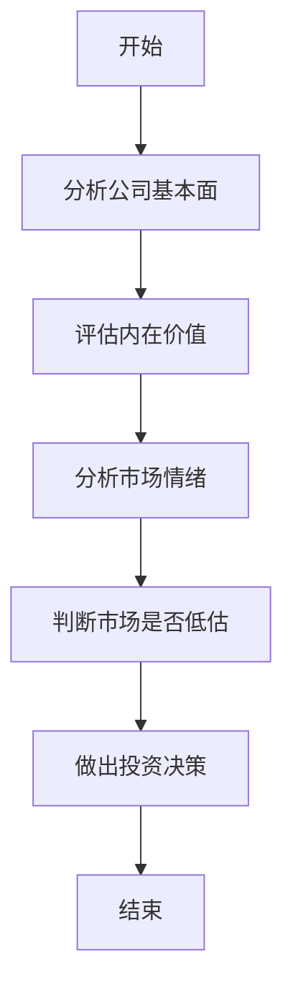
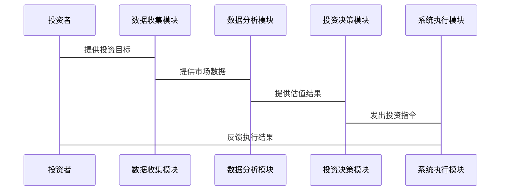

                 


# 巴菲特的逆向投资思维

> 关键词：逆向思维，巴菲特，价值投资，风险管理，数学模型，系统架构，项目实战

> 摘要：本文从技术视角深度解析巴菲特的逆向投资思维，通过数学模型、算法流程图和系统架构图等技术手段，详细阐述其投资理念的核心要素，分析其在实际投资中的应用，并结合项目实战案例，为读者提供一套可操作的投资策略和风险管理方法。

---

## 第1章: 逆向思维的定义与背景

### 1.1 逆向思维的定义与特点

逆向思维是一种与传统思维相反的思维方式，它通过寻找市场中的非共识观点，利用市场的短期波动性，寻找长期价值。巴菲特的逆向思维的核心在于“买便宜的东西”，而不是追逐市场的热点。

### 1.2 巴菲特的投资理念

巴菲特的投资理念基于价值投资，他强调买入价格低于内在价值的股票，并长期持有。这种投资策略与逆向思维密切相关，因为他在市场低迷时买入，而在市场繁荣时卖出。

### 1.3 逆向思维在投资中的优势

逆向思维能够在市场恐慌时找到低估的资产，在市场狂热时避免过度投资。通过逆向思维，投资者能够在市场波动中获得超额收益。

---

## 第2章: 逆向思维的核心概念与联系

### 2.1 逆向思维的原理

逆向思维的原理在于通过分析市场的非理性行为，寻找被市场低估的投资标的。巴菲特的逆向思维模型包括对公司基本面的深入分析和市场情绪的判断。

### 2.2 逆向思维与巴菲特投资理念的结合

将逆向思维与巴菲特的价值投资理念结合，可以构建一个有效的投资策略。通过分析公司的财务状况和行业地位，结合市场情绪，选择被低估的股票。

### 2.3 核心要素与联系

逆向思维的核心要素包括价值评估、市场情绪分析和长期投资策略。这些要素相互关联，共同构成逆向思维的框架。

---

## 第3章: 逆向思维的数学模型与算法

### 3.1 逆向思维的数学模型

逆向思维的数学模型包括价值评估模型和市场情绪分析模型。价值评估模型基于公司的财务数据，市场情绪分析模型则通过市场指标来判断市场的非理性行为。

### 3.2 算法流程图

使用mermaid绘制逆向思维的算法流程图：



### 3.3 逆向思维的风险管理模型

逆向思维的风险管理模型包括风险评估和仓位管理。通过量化风险，投资者可以更好地控制投资组合的波动性。

---

## 第4章: 系统分析与架构设计方案

### 4.1 系统功能设计

逆向思维的投资系统包括数据收集、分析、决策和执行四个模块。数据收集模块负责获取市场数据和公司基本面信息；分析模块基于数学模型进行估值；决策模块根据分析结果制定投资策略；执行模块负责下单和风险管理。

### 4.2 系统架构图

使用mermaid绘制系统架构图：


### 4.3 系统交互流程图

使用mermaid绘制系统交互流程图：



---

## 第5章: 项目实战

### 5.1 环境安装

安装Python和相关库，如pandas、numpy、scipy。

### 5.2 核心代码实现

编写价值评估模型的Python代码：

```python
import pandas as pd
import numpy as np

def calculate_intrinsic_value(financial_data):
    # 计算自由现金流
    fcff = financial_data['free_cash_flow']
    # 计算加权平均资本成本
    wacc = financial_data['wacc']
    # 计算内在价值
    intrinsic_value = fcff / (wacc - financial_data['growth_rate'])
    return intrinsic_value

# 示例数据
financial_data = {
    'free_cash_flow': 100,
    'wacc': 0.08,
    'growth_rate': 0.02
}

iv = calculate_intrinsic_value(financial_data)
print(f"内在价值: {iv}")
```

### 5.3 实际案例分析

以某公司为例，分析其财务数据，计算其内在价值，并与市场价格进行对比，判断是否低估。

### 5.4 项目小结

通过实际案例分析，验证逆向思维模型的有效性，并总结经验教训。

---

## 第6章: 总结与最佳实践

### 6.1 总结

逆向思维是一种有效的投资策略，通过分析市场的非理性行为，寻找被低估的资产，能够在长期获得超额收益。

### 6.2 最佳实践 tips

1. **长期投资**：逆向思维强调长期投资，避免短期波动的干扰。
2. **基本面分析**：深入分析公司的财务状况和行业地位。
3. **风险管理**：合理控制仓位，避免过度集中投资。

### 6.3 小结

逆向思维的投资策略需要结合价值投资和风险管理，通过系统的分析和实际操作，能够在复杂的市场环境中获得稳定的收益。

### 6.4 注意事项

1. **市场波动**：逆向思维需要耐心等待市场低估的机会。
2. **情绪控制**：避免被市场情绪左右，保持理性的判断。
3. **持续学习**：不断更新知识和模型，适应市场变化。

### 6.5 拓展阅读

推荐阅读巴菲特的《聪明的投资者》和彼得·林奇的《投资之道》，深入理解逆向思维和价值投资的理念。

---

通过以上结构，我们可以清晰地看到，逆向思维在巴菲特的投资策略中扮演着重要角色，结合技术分析和实际案例，读者可以更好地理解和应用这一投资理念。

