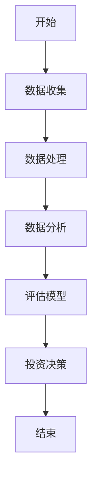

                 


# 巴菲特的长期持股策略

> 关键词：巴菲特，长期持股，价值投资，投资策略，数学模型

> 摘要：本文深入分析了巴菲特的长期持股策略，从其投资哲学、选股标准、组合管理、风险管理到数学模型，系统地阐述了这一策略的核心思想和实际应用。通过结合理论与实践，本文为投资者提供了在长期持股中如何选择优质企业、管理风险和优化回报的指导。

---

## 第1章: 巴菲特的生平与投资理念

### 1.1 巴菲特的早年经历

- **1.1.1 巴菲特的早年投资经历**
  - 巴菲特在青少年时期开始接触股票和投资，展现出非凡的商业头脑。
  - 他在高中时期通过购买和出售股票积累了第一桶金。
  - 早期的投资经历为他后来的价值投资理念奠定了基础。

- **1.1.2 巴菲特的合伙人制度**
  - 巴菲特在职业生涯早期创立了合伙企业，吸引优秀投资者共同参与。
  - 合伙人制度强调信任和长期合作，为后来的长期持股策略提供了实践基础。

- **1.1.3 巴菲特的伯克希尔哈撒韦公司**
  - 伯克希尔哈撒韦是巴菲特长期持股策略的重要实践平台。
  - 该公司通过收购优质企业并长期持有，实现了稳定的复利增长。

### 1.2 巴菲特的投资理念

- **1.2.1 价值投资的定义**
  - 价值投资是一种以企业内在价值为基础的投资方法。
  - 投资者通过分析企业的基本面，寻找市场价格低于内在价值的机会。

- **1.2.2 巴菲特的价值投资原则**
  - **安全边际**：买入价格低于内在价值，确保投资的安全性。
  - **长期视角**：关注企业的长期盈利能力，而非短期市场波动。
  - **集中投资**：将大部分资金投入到少数优质企业中，以获得更高的回报。

- **1.2.3 巴菲特与长期持股策略的关系**
  - 长期持股是巴菲特价值投资的核心策略之一。
  - 他相信市场短期波动不可预测，长期趋势更值得信赖。

### 1.3 巴菲特的长期持股策略的核心思想

- **1.3.1 长期持股的核心理念**
  - 长期持股意味着买入优质企业并长期持有，享受其成长带来的复利收益。
  - 通过长期持有，投资者可以避免频繁交易带来的成本和风险。

- **1.3.2 长期持股与市场波动的关系**
  - 市场波动是短期现象，长期趋势由企业的基本面决定。
  - 长期持股者应忽略短期波动，专注于企业的长期价值。

- **1.3.3 长期持股的哲学基础**
  - 巴菲特认为市场是不可预测的，长期持股是一种对市场的钝化策略。
  - 通过长期持股，投资者可以避免情绪化决策，保持理性的投资心态。

---

## 第2章: 价值投资的理论基础

### 2.1 价值投资的定义与特点

- **2.1.1 价值投资的定义**
  - 价值投资是一种基于企业内在价值的投资方法。
  - 投资者通过分析企业的财务状况、行业地位和竞争优势，寻找被市场低估的投资机会。

- **2.1.2 价值投资的核心特点**
  - **注重基本面分析**：价值投资者关注企业的财务报表、盈利能力和竞争优势。
  - **寻找安全边际**：买入价格低于内在价值，确保投资的安全性。
  - **长期视角**：关注企业的长期发展，而非短期市场波动。

- **2.1.3 价值投资与短期交易的区别**
  - 短期交易关注市场波动和价格走势，而价值投资关注企业的内在价值。
  - 短期交易需要频繁操作，而价值投资强调长期持有。

### 2.2 价值投资的核心原则

- **2.2.1 购买便宜的东西**
  - 买入价格低于内在价值，确保投资的安全性。
  - 通过安全边际降低投资风险。

- **2.2.2 长期持有的重要性**
  - 长期持有优质企业可以享受其成长带来的复利收益。
  - 避免短期波动对投资决策的干扰。

- **2.2.3 股票的安全边际**
  - 安全边际是买入价格与内在价值之间的差距。
  - 通过安全边际降低投资风险，确保投资的稳健性。

### 2.3 价值投资的哲学基础

- **2.3.1 价值投资的哲学思想**
  - 价值投资是一种哲学，强调对企业和市场的深刻理解。
  - 投资者应以理性和耐心应对市场的短期波动。

- **2.3.2 巴菲特的价值投资哲学**
  - 巴菲特认为市场短期波动不可预测，长期趋势更值得信赖。
  - 他强调企业质量的重要性，而非市场的短期表现。

- **2.3.3 价值投资与市场的矛盾**
  - 价值投资与市场的矛盾在于市场的短期波动与长期趋势的冲突。
  - 投资者需要在短期波动与长期趋势之间找到平衡点。

---

## 第3章: 巴菲特的选股标准与策略

### 3.1 巴菲特的选股标准

- **3.1.1 高质量的企业**
  - 选择具有强大竞争优势的企业，如品牌优势、技术壁垒和成本优势。
  - 企业应具备稳定的盈利能力，能够在长期市场波动中保持增长。

- **3.1.2 财务健康状况**
  - 企业应具备健康的财务状况，如低债务、高利润率和稳定的现金流。
  - 通过财务报表分析，评估企业的偿债能力和盈利能力。

- **3.1.3 管理层的诚信与能力**
  - 选择管理层诚信可靠、能力出众的企业。
  - 企业应具备良好的治理结构和透明的管理。

### 3.2 巴菲特的行业选择策略

- **3.2.1 高质量行业的定义**
  - 高质量行业是指那些具有稳定需求、较高进入壁垒和持续盈利能力的行业。
  - 例如，消费必需品、公用事业和金融行业等。

- **3.2.2 巴菲特偏好的行业**
  - 巴菲特偏好的行业包括保险、银行、能源和消费必需品等行业。
  - 这些行业具有稳定的市场需求和长期增长潜力。

- **3.2.3 行业选择的长期视角**
  - 巴菲特的行业选择基于长期趋势和企业竞争优势。
  - 他关注行业的长期增长潜力，而非短期市场热点。

### 3.3 巴菲特的组合管理策略

- **3.3.1 集中投资与分散投资**
  - 集中投资：将大部分资金投入到少数优质企业中，以获得更高的回报。
  - 分散投资：通过投资多个行业和企业，降低投资风险。

- **3.3.2 仓位分配的原则**
  - 根据企业的质量和内在价值，合理分配仓位。
  - 优质企业的仓位应高于一般企业。

- **3.3.3 组合优化的策略**
  - 定期评估投资组合的构成，剔除表现不佳的企业。
  - 根据市场变化和企业基本面，动态调整投资组合。

---

## 第4章: 长期持股策略的数学模型与分析

### 4.1 长期持股的数学模型

- **4.1.1 股票价值的计算公式**
  - 股票的内在价值可以通过企业的盈利能力、成长性和财务状况来评估。
  - 典型的股票估值公式包括市盈率（P/E）和市净率（P/B）等。

- **4.1.2 内在价值的评估模型**
  - 内在价值模型是价值投资的核心工具之一。
  - 通过分析企业的未来现金流，计算其内在价值。

- **4.1.3 长期回报的计算方法**
  - 长期回报可以通过复利公式计算：$$ (1 + r)^n - 1 $$，其中 \( r \) 是年化回报率，\( n \) 是投资期限。

### 4.2 风险管理的数学模型

- **4.2.1 风险调整后的回报模型**
  - 风险调整后的回报模型考虑了投资的风险因素。
  - 通过计算风险调整后的回报，投资者可以更好地评估投资的性价比。

- **4.2.2 风险分散的数学原理**
  - 风险分散是指通过投资多个不同的资产或行业，降低投资组合的整体风险。
  - 根据现代投资组合理论，风险分散可以有效降低非系统性风险。

- **4.2.3 风险与收益的平衡点**
  - 风险与收益是投资中的核心问题。
  - 长期持股策略通过降低短期波动风险，实现长期稳定的收益。

### 4.3 长期持股的收益分析

- **4.3.1 长期复利效应的数学公式**
  - 复利公式：$$ A = P (1 + r)^n $$
  - 其中 \( A \) 是最终金额，\( P \) 是本金，\( r \) 是年化回报率，\( n \) 是投资期限。

- **4.3.2 长期持股的收益分布**
  - 长期持股的收益分布通常呈现正态分布，但具有右偏特征。
  - 投资者应关注收益的长期趋势，而非短期波动。

- **4.3.3 长期持股的收益与风险关系**
  - 收益与风险通常是正相关的，但长期持股策略通过降低波动风险，实现收益与风险的平衡。

---

## 第5章: 巴菲特投资哲学的系统分析

### 5.1 投资决策系统的架构

- **5.1.1 数据收集与处理模块**
  - 数据收集：从财务报表、市场数据和行业报告中获取信息。
  - 数据处理：清洗、整合和分析数据，为投资决策提供支持。

- **5.1.2 数据分析与评估模块**
  - 数据分析：通过财务指标分析、行业分析和竞争分析，评估企业的内在价值。
  - 评估模型：使用内在价值模型和风险评估模型，对企业和行业进行综合评估。

- **5.1.3 投资决策模块**
  - 决策规则：根据企业的内在价值、市场估值和财务状况，制定投资决策。
  - 决策输出：生成投资建议，包括买入、持有和卖出决策。

### 5.2 投资决策系统的流程图



### 5.3 投资决策系统的接口设计

- **5.3.1 数据输入接口**
  - 输入数据包括企业的财务报表、市场数据和行业报告。
  - 数据格式：结构化数据，如CSV或JSON。

- **5.3.2 数据输出接口**
  - 输出数据包括企业的内在价值评估、投资建议和风险评估。
  - 数据格式：结构化数据，便于后续分析和展示。

- **5.3.3 用户交互接口**
  - 用户可以通过图形界面或命令行输入投资决策请求。
  - 系统输出投资建议和相关分析报告。

---

## 第6章: 巴菲特长期持股策略的项目实战

### 6.1 项目环境与工具安装

- **6.1.1 投资分析工具**
  - 使用Excel或Python进行数据处理和分析。
  - 安装必要的Python库，如Pandas、NumPy和Matplotlib。

### 6.2 系统核心实现源代码

```python
# 示例代码：计算内在价值
import pandas as pd
import numpy as np

# 假设企业未来现金流预测
cash_flows = [100, 120, 140, 160, 180]  # 单位：百万美元
discount_rate = 0.08  # 折现率

# 计算终值
terminal_value = cash_flows[-1] * (1 + discount_rate) / (discount_rate)
total_value = 0
for i in range(len(cash_flows)):
    total_value += cash_flows[i] / (1 + discount_rate) ** i

# 加上终值
total_value += terminal_value / (1 + discount_rate) ** len(cash_flows)

print(f"企业的内在价值为：${total_value:.2f} million")
```

### 6.3 代码应用解读与分析

- **代码解读**
  - 该代码通过现金流折现法计算企业的内在价值。
  - 使用递归公式计算终值，考虑了企业的永续增长率。

- **代码分析**
  - 现金流折现法是价值投资中常用的评估方法。
  - 通过计算内在价值，投资者可以确定企业的合理估值。

### 6.4 实际案例分析

- **案例：可口可乐公司**
  - 企业概况：可口可乐是全球领先的饮料公司，具备强大的品牌优势和市场地位。
  - 财务分析：公司具备稳定的现金流和较高的利润率。
  - 投资建议：长期持有可口可乐股票，享受其稳定的股息收益和成长性。

### 6.5 项目小结

- **项目总结**
  - 通过实战项目，投资者可以掌握巴菲特长期持股策略的实际应用。
  - 学习如何通过内在价值评估和风险分析，制定投资决策。

---

## 第7章: 最佳实践与小结

### 7.1 最佳实践 tips

- **长期持股的核心原则**
  - 选择优质企业，长期持有，避免频繁交易。
  - 注重企业的内在价值，而非市场短期波动。

- **风险管理的注意事项**
  - 合理分散投资，降低整体风险。
  - 定期评估投资组合，调整仓位。

### 7.2 小结

- **长期持股策略的优势**
  - 通过长期持有优质企业，享受复利收益。
  - 避免短期波动带来的风险和成本。

- **长期持股策略的挑战**
  - 需要深入分析企业的基本面，选择优质企业。
  - 长期持股需要耐心和纪律，避免情绪化决策。

### 7.3 注意事项

- **避免盲目模仿**
  - 投资者应根据自身情况，调整投资策略。
  - 避免盲目模仿巴菲特的策略，忽视自身风险承受能力。

- **定期复盘与调整**
  - 长期持股并非一成不变，需定期复盘投资组合。
  - 根据市场变化和企业基本面，动态调整投资策略。

### 7.4 拓展阅读

- **相关书籍**
  - 《巴菲特传：一个美国资本家的成功之路》
  - 《价值投资实战手册》

- **相关文章**
  - 巴菲特股东大会演讲
  - 价值投资经典案例分析

---

## 结语

通过本文的分析，我们可以看到，巴菲特的长期持股策略不仅是一种投资方法，更是一种投资哲学。它强调对企业内在价值的关注，长期视角和耐心等待的智慧。对于投资者来说，理解和掌握这一策略，不仅能够提升投资收益，还能够帮助我们在复杂的市场环境中保持理性和耐心。

