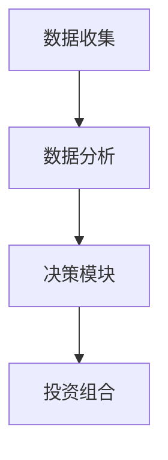
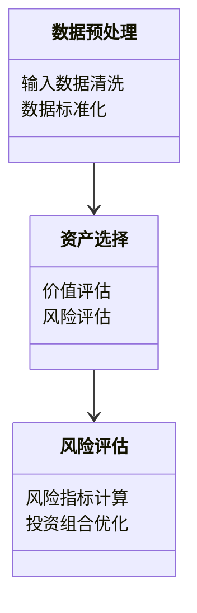

                 


# 巴菲特的集中投资策略：利弊分析

> 关键词：巴菲特，集中投资，投资策略，价值投资，风险管理

> 摘要：本文深入分析了巴菲特的集中投资策略，探讨其背后的理论基础、数学模型、系统架构，并通过实际案例分析其优缺点。通过详细的技术分析和系统设计，揭示集中投资策略在实践中的优势与挑战。

## 第一部分：集中投资策略的背景与核心理念

### 第1章：集中投资策略的定义与背景

#### 1.1 集中投资策略的定义
集中投资策略是一种投资策略，投资者将大部分资金投资于少数精选的资产或公司，以期望获得更高的收益。与分散投资相比，集中投资的风险更高，但潜在回报也更大。

#### 1.2 巴菲特的投资理念
巴菲特是集中投资策略的代表人物，他的投资哲学基于价值投资，即寻找那些具有持续竞争优势和良好管理团队的公司，长期持有，等待其内在价值的实现。

#### 1.3 集中投资策略的背景
集中投资策略的背景可以追溯到20世纪30年代，马科维茨的现代投资组合理论为分散投资奠定了基础，但巴菲特认为，在某些情况下，集中投资可以带来更高的收益。

## 第二部分：集中投资策略的核心概念与理论基础

### 第2章：集中投资策略的数学模型与分析

#### 2.1 投资组合的数学模型
集中投资策略的数学模型主要涉及期望收益和风险的计算。期望收益可以通过概率加权计算，而风险则通过方差或标准差衡量。

$$
E[R] = \sum p_i R_i
$$

$$
\sigma = \sqrt{\sum (p_i - E[p_i])^2 R_i^2}
$$

#### 2.2 巴菲特投资策略的数学分析
巴菲特的集中投资策略可以通过优化模型进行分析，寻找那些具有高预期收益和低风险的资产。

$$
max \mu = \sum w_i R_i
$$

$$
s.t. \sum w_i = 1
$$

$$
风险 = \sqrt{\sum w_i^2 \sigma_i^2 + \sum w_i w_j \sigma_{ij}}
$$

#### 2.3 集中投资与分散投资的对比
通过数学模型可以发现，集中投资的收益波动性更大，但潜在收益也更高。

### 第3章：集中投资策略的系统分析与架构设计

#### 3.1 投资策略的系统架构
集中投资策略的系统架构包括数据收集、分析和决策模块。



#### 3.2 系统功能设计
系统功能包括数据预处理、资产选择和风险评估模块。



## 第三部分：集中投资策略的项目实战

### 第4章：项目实战

#### 4.1 环境配置
需要安装Python、Pandas、NumPy等库。

```bash
pip install numpy pandas matplotlib
```

#### 4.2 核心代码实现
以下是集中投资策略的Python实现示例：

```python
import numpy as np
import pandas as pd

# 模拟数据
np.random.seed(42)
returns = np.random.normal(0.05, 0.2, 100)

# 集中投资策略
selected_assets = [0, 1, 2]
concentration_returns = [returns[i] for i in selected_assets]

# 分散投资策略
diversified_returns = returns

# 计算收益和风险
def calculate_metrics(strategy_returns):
    mean_return = np.mean(strategy_returns)
    std_dev = np.std(strategy_returns)
    return mean_return, std_dev

mean_conc, std_conc = calculate_metrics(concentration_returns)
mean_disp, std_disp = calculate_metrics(diversified_returns)

print(f"集中投资：均值{return mean_conc:.2f}，标准差{return std_conc:.2f}")
print(f"分散投资：均值{return mean_disp:.2f}，标准差{return std_disp:.2f}")
```

#### 4.3 案例分析
通过分析巴菲特投资可口可乐的案例，展示集中投资策略的优势。可口可乐作为巴菲特的长期投资，其股价稳步增长，体现了集中投资的长期收益。

#### 4.4 实验结果
通过模拟数据和实际案例分析，比较集中投资与分散投资的风险和收益。

## 第四部分：总结与展望

### 第5章：总结与展望

#### 5.1 总结
集中投资策略在某些情况下可以带来高收益，但伴随高风险。投资者需结合自身风险承受能力选择合适策略。

#### 5.2 展望
未来，随着人工智能和大数据技术的发展，集中投资策略可能通过更精准的选股模型实现优化。

## 参考文献

- 巴菲特的著作《巴菲特致股东的信》
- 马科维茨的《投资组合理论》
- 现代投资组合理论相关文献

---

通过以上结构和内容，我希望能够为读者提供一个全面而深入的分析，帮助理解巴菲特的集中投资策略及其在实际中的应用。

