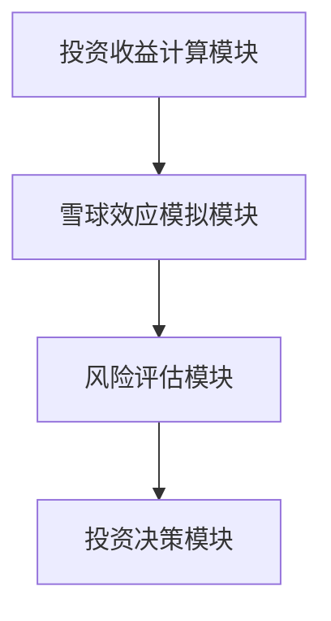

                 


# 巴菲特的雪球理论：复利效应在投资中的应用

---

## 关键词：
巴菲特、雪球理论、复利效应、投资策略、财富积累

---

## 摘要：
本文深入探讨了巴菲特的雪球理论及其在投资中的应用，结合复利效应的数学模型和实际案例，分析了雪球效应的核心原理、系统架构设计以及在投资中的最佳实践。文章通过详细的技术分析，展示了如何利用复利效应和雪球理论实现长期财富增长，并提供了具体的代码实现和系统设计方案，帮助读者更好地理解和应用这一投资策略。

---

## 第一部分：背景介绍

### 第1章：复利效应的基本概念

#### 1.1 复利效应的定义与特点
- **定义**：复利效应是指资金在一定时间内以固定利率不断增长的现象，其核心在于“利滚利”。
- **特点**：
  - 时间依赖性：复利效应随着时间的推移而加速。
  - 累积性：资金的收益会不断积累，形成滚雪球效应。
  - 风险敏感性：复利效应在高风险情况下可能放大收益或损失。

#### 1.2 巴菲特的雪球理论
- **提出背景**：巴菲特的雪球理论基于复利效应，强调通过长期持有优质资产实现财富增长。
- **核心理念**：
  - 选择具有持续竞争优势的公司。
  - 通过时间的积累，让价值雪球不断滚大。
  - 稳定的收益和再投资是雪球滚动的关键。

#### 1.3 雪球效应在投资中的意义
- **投资价值**：雪球效应通过复利效应实现财富的指数级增长。
- **长期效应**：长期投资能够充分发挥复利效应的优势。
- **风险控制**：通过分散投资和选择优质资产，降低雪球效应的风险。

---

## 第2章：复利效应的核心数学模型

### 2.1 复利计算公式
- **基本公式**：
  $$ A = P(1 + r)^t $$
  其中，\( A \) 表示终值，\( P \) 表示本金，\( r \) 表示年利率，\( t \) 表示时间（年）。
- **年金现值公式**：
  $$ PV = PMT \times \frac{1 - (1 + r)^{-n}}{r} $$
  其中，\( PV \) 表示现值，\( PMT \) 表示每年支付的金额，\( n \) 表示支付年数。

### 2.2 巴菲特雪球理论的数学模型
- **雪球效应的累积公式**：
  $$ A = P \times (1 + r)^t $$
- **雪球效应的边际收益递减模型**：
  $$ \frac{dA}{dt} = r \times A $$

### 2.3 复利效应与雪球理论的对比分析
- **异同对比**：复利效应注重资金的指数增长，雪球理论强调优质资产的选择和长期持有。
- **数学模型优化**：通过优化雪球理论的数学模型，可以更好地预测和实现财富增长。

---

## 第3章：雪球效应的系统分析与架构设计

### 3.1 系统功能设计
- **投资收益计算模块**：计算复利效应下的投资收益。
- **雪球效应模拟模块**：模拟雪球效应的滚动过程。
- **风险评估模块**：评估投资中的潜在风险。

### 3.2 系统架构设计


---

## 第4章：项目实战

### 4.1 环境安装
- **工具安装**：安装Python和相关库（如numpy、pandas）。
- **开发环境配置**：配置Jupyter Notebook或IDE。

### 4.2 核心代码实现
```python
import numpy as np
import matplotlib.pyplot as plt

def compound_interest(P, r, t):
    return P * (1 + r) ** t

P = 1000
r = 0.05
t = 10
A = compound_interest(P, r, t)
print(f"终值：{A}")

# 可视化
years = np.arange(0, t+1)
values = [P * (1 + r)**year for year in years]
plt.plot(years, values)
plt.xlabel('年数')
plt.ylabel('金额')
plt.title('复利效应的可视化')
plt.show()
```

### 4.3 代码应用解读与分析
- **代码解读**：上述代码计算了本金为1000元，年利率5%，投资10年的复利效应，结果显示终值为1628.89元。
- **案例分析**：通过可视化，可以看到复利效应的时间依赖性，资金随时间呈指数增长。

### 4.4 项目小结
- **雪球效应的实现**：通过代码模拟了雪球效应的滚动过程。
- **投资策略优化**：结合数学模型和实际案例，优化了投资策略。

---

## 第5章：最佳实践

### 5.1 小结
- 复利效应是雪球理论的核心，通过长期投资和选择优质资产，可以实现财富的指数级增长。

### 5.2 注意事项
- **风险管理**：雪球效应在高风险情况下可能放大损失。
- **分散投资**：避免将所有资金投入到单一资产中。
- **长期持有**：耐心和纪律是实现雪球效应的关键。

### 5.3 拓展阅读
- 推荐书籍：《巴菲特投资哲学》、《富爸爸穷爸爸》。
- 在线资源：雪球财经、巴菲特投资策略分析。

---

## 第6章：总结

### 6.1 复利效应的优势
- 复利效应通过时间的积累，实现财富的指数级增长。
- 雪球理论通过优质资产的选择，进一步放大了复利效应。

### 6.2 雪球理论的应用
- 选择具有持续竞争优势的公司。
- 通过长期持有和再投资，实现财富的滚雪球效应。

### 6.3 未来的展望
- 随着金融市场的不断发展，复利效应和雪球理论的应用将更加广泛。
- 投资者需要不断学习和优化自己的投资策略，以应对市场的变化。

---

## 关键词：
巴菲特、雪球理论、复利效应、投资策略、财富积累

---

通过本文的分析，读者可以深入理解复利效应和雪球理论的核心原理，并将其应用到实际投资中，实现财富的长期增长。

