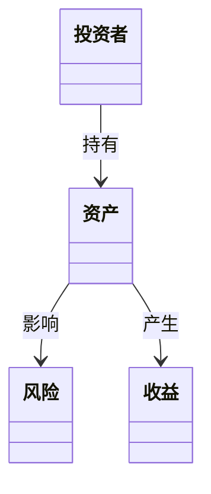
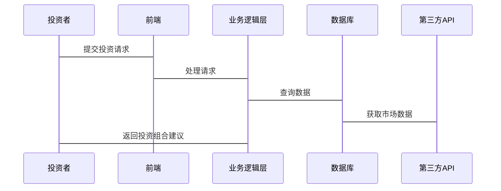

                 


# 巴菲特的风险管理：如何避免永久性资本损失

## 关键词：巴菲特, 风险管理, 永久性资本损失, 安全边际, 分散投资, 价值评估, 投资组合优化

## 摘要：本文通过分析巴菲特的投资理念和风险管理策略，探讨如何避免永久性资本损失。文章从巴菲特的哲学出发，详细阐述风险管理的核心原则，包括安全边际和分散投资，结合数学模型和系统设计，提供实际案例分析，帮助读者掌握风险管理的系统化方法。

---

## 第一部分: 巴菲特投资理念与风险管理基础

### 第1章: 巴菲特投资理念概述

#### 1.1 巴菲特的生平与投资哲学

##### 1.1.1 巴菲特的生平简介

沃伦·巴菲特（Warren Buffett），1934年8月31日出生于美国堪萨斯州奥马哈市。他是世界著名投资者、慈善家，被誉为“股神”。巴菲特的财富故事始于他青少年时期，他通过投资报纸摊位、购买廉价股票等方式积累资金。1956年，他筹集了105,000美元创建巴菲特合伙公司（ Buffett Partnership, Ltd.），标志着他正式开始职业投资生涯。1970年，他收购了伯克希尔·哈撒韦公司（Berkshire Hathaway），并将其打造成一个多元化的投资帝国。

##### 1.1.2 巴菲特投资哲学的核心理念

巴菲特的投资哲学以“价值投资”为核心，强调长期持有优质资产，寻找具有持续竞争优势的企业，并以合理的价格买入。他倡导“margin of safety”（安全边际）的概念，认为在价格远低于内在价值时买入，可以有效降低投资风险。

##### 1.1.3 巴菲特对风险管理的独特见解

巴菲特认为，风险管理的核心在于避免永久性资本损失。他强调，投资的本质是寻找具有强大护城河的企业，并在市场恐慌时寻找低估的机会，而不是盲目追涨杀跌。他将风险管理视为投资成功的关键，甚至认为风险管理比投资决策本身更重要。

#### 1.2 风险管理的核心概念

##### 1.2.1 风险的定义与分类

在投资领域，风险通常指投资本金或收益可能遭受损失的可能性。风险可以分为系统性风险和非系统性风险。系统性风险是整个市场或经济环境带来的风险，而非系统性风险则是特定资产或企业特有的风险。

##### 1.2.2 永久性资本损失的内涵

永久性资本损失是指投资本金的永久性损失，通常发生在投资对象的核心价值被颠覆或消失的情况下。例如，购买一家夕阳产业公司的股票，当该产业逐渐被淘汰时，投资者可能面临无法收回本金的风险。

##### 1.2.3 风险管理的目标与原则

风险管理的目标是通过科学的方法和策略，将投资风险控制在可接受的范围内，同时最大化投资收益。其原则包括分散投资、安全边际、长期视角等。

---

### 第2章: 巴菲特风险管理的原则

#### 2.1 安全边际的概念与应用

##### 2.1.1 安全边际的定义

安全边际是巴菲特投资策略中的核心概念，指买入价格低于企业内在价值的部分。例如，如果一家企业的内在价值为100美元，投资者以80美元买入，则20美元的差价即为安全边际。

##### 2.1.2 安全边际在投资决策中的作用

安全边际的作用在于提供一个缓冲区，即使企业的实际价值低于预期，也能避免永久性资本损失。巴菲特认为，安全边际是抵御市场波动的重要保障。

##### 2.1.3 安全边际的计算与实际应用

计算安全边际的方法是将企业的内在价值与市场价进行比较。例如，使用DCF模型计算出的内在价值为120美元，市场价为100美元，则安全边际为20%。

#### 2.2 分散投资与风险控制

##### 2.2.1 分散投资的基本原理

分散投资是指通过投资不同资产或行业来降低风险。巴菲特认为，分散投资可以避免单一资产带来的重大损失，同时捕捉多个领域的投资机会。

##### 2.2.2 分散投资在风险管理中的作用

分散投资通过降低非系统性风险，提高了投资组合的整体稳定性。例如，将资金分配到股票、债券、房地产等多种资产类别中，可以有效分散风险。

##### 2.2.3 巴菲特分散投资的实践案例

伯克希尔·哈撒韦的投资组合涵盖多个行业，如保险、能源、制造等。这种分散投资策略帮助巴菲特在市场波动中保持稳定收益。

---

## 第二部分: 风险管理的系统化方法

### 第4章: 投资组合管理与风险控制

#### 4.1 投资组合管理的基本原理

##### 4.1.1 投资组合管理的定义

投资组合管理是通过优化资产配置来实现投资目标的过程。它包括资产选择、权重分配和动态调整等步骤。

##### 4.1.2 投资组合管理的目标

投资组合管理的目标是在风险可控的前提下，实现收益最大化。它通过科学的资产配置，平衡风险与收益。

##### 4.1.3 投资组合管理的步骤

投资组合管理的步骤包括：目标设定、资产选择、权重分配、动态调整和风险评估。

#### 4.2 风险控制的数学模型

##### 4.2.1 风险价值（VaR）的计算公式

VaR是衡量投资组合风险的重要指标，其计算公式为：

$$ VaR = \mu + z \times \sigma $$

其中，$\mu$是平均回报率，$z$是标准正态分布的分位数，$\sigma$是标准差。

##### 4.2.2 风险调整后的收益（RAR）的计算公式

RAR考虑了风险因素，计算公式为：

$$ RAR = \frac{R_p - R_f}{\sigma_p} $$

其中，$R_p$是投资组合的收益，$R_f$是无风险利率，$\sigma_p$是投资组合的标准差。

##### 4.2.3 投资组合风险的优化方法

投资组合风险的优化可以通过均值-方差优化模型实现。其目标是最小化风险（方差）的同时实现收益最大化。

---

### 第5章: 市场周期与风险管理

#### 5.1 市场周期的定义与特征

##### 5.1.1 市场周期的阶段划分

市场周期通常分为上升期、顶峰期、下跌期和底部期四个阶段。投资者需要根据市场周期调整投资策略。

##### 5.1.2 市场周期对投资决策的影响

在市场顶部，投资者应保持谨慎；在市场底部，投资者应积极布局。巴菲特通常在市场恐慌时寻找低估机会。

##### 5.1.3 巴菲特对市场周期的应对策略

巴菲特强调在市场恐慌时买入优质资产，并在市场狂热时保持冷静。

#### 5.2 市场波动与风险管理

##### 5.2.1 市场波动的定义与测量

市场波动是价格短期剧烈波动的现象，通常通过波动率指标（如标准差）来衡量。

##### 5.2.2 市场波动对投资组合的影响

市场波动可能导致投资组合的短期损失，但长期来看，优质资产的投资收益仍然可观。

##### 5.2.3 巴菲特

---

## 第三部分: 项目实战与系统设计

### 第6章: 系统分析与架构设计方案

#### 6.1 项目介绍

本项目旨在构建一个基于巴菲特风险管理策略的投资管理系统，帮助投资者实现安全边际分析、分散投资和风险控制。

#### 6.2 系统功能设计

##### 6.2.1 领域模型



##### 6.2.2 系统架构


##### 6.2.3 系统接口设计

- 接口1：获取市场数据
- 接口2：计算内在价值
- 接口3：生成投资组合

##### 6.2.4 系统交互



---

### 第7章: 项目实战

#### 7.1 环境安装

安装Python、Pandas、NumPy等工具。

#### 7.2 核心实现源代码

```python
import pandas as pd
import numpy as np

def calculate_intrinsic_value(enterprise_value, cash, debt):
    return (enterprise_value + cash - debt) / shares_outstanding

def calculate_margin_of Safety(price, intrinsic_value):
    return (intrinsic_value - price) / intrinsic_value * 100

# 示例数据
data = {
    '企业价值': [1000, 1200],
    '现金': [200, 150],
    '债务': [300, 200],
    '股价': [80, 90]
}

df = pd.DataFrame(data)

# 计算内在价值和安全边际
intrinsic_values = []
margins = []
for i in range(len(df)):
    iv = calculate_intrinsic_value(df['企业价值'][i], df['现金'][i], df['债务'][i])
    mo = calculate_margin_of_Safety(df['股价'][i], iv)
    intrinsic_values.append(iv)
    margins.append(mo)

df['内在价值'] = intrinsic_values
df['安全边际%'] = margins

print(df)
```

---

## 第四部分: 总结与启示

### 8.1 总结

巴菲特的风险管理策略强调安全边际和分散投资，通过长期视角和价值评估，避免永久性资本损失。系统化的方法和数学模型可以帮助投资者更好地实施这些策略。

### 8.2 启示

投资者应将巴菲特的哲学与现代风险管理工具结合，构建适合自己的投资系统。同时，保持长期视角，避免短期波动的干扰。

---

### 8.3 小结

- 安全边际是抵御风险的关键
- 分散投资降低非系统性风险
- 系统化方法提升风险管理效率
- 长期视角实现稳健投资

### 8.4 注意事项

- 风险管理需要持续学习和调整
- 避免过度依赖单一策略
- 保持对市场的敏感性和灵活性

### 8.5 拓展阅读

- 《巴菲特致股东的信》
- 《投资中最简单的事》
- 《证券分析》（本杰明·格雷厄姆）

---

通过本文的分析，读者可以深入了解巴菲特的风险管理哲学，并将其应用于实际投资中，从而实现稳健的资本增长。

