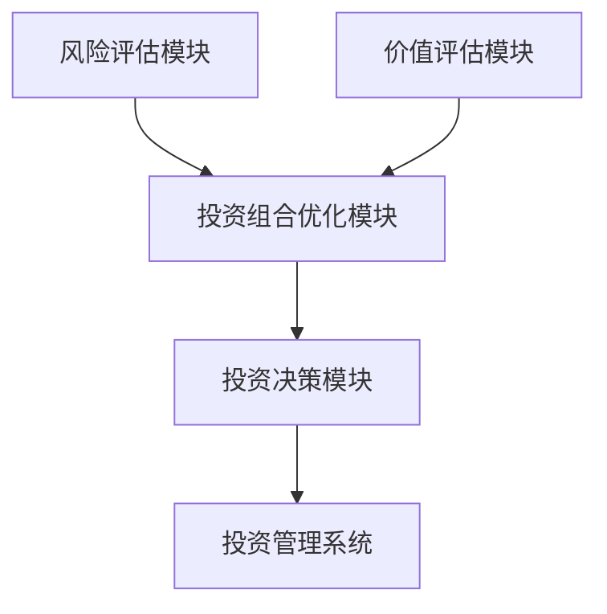

                 


# 巴菲特的首要投资原则：永远不要亏损

---

## 关键词：巴菲特, 投资原则, 风险管理, 投资算法, 系统架构

---

## 摘要

本文以巴菲特的“永远不要亏损”投资原则为核心，从技术角度探讨如何将这一原则应用于投资决策和风险管理。通过分析核心概念、设计算法模型、构建系统架构，以及提供项目实战和最佳实践，本文旨在为读者提供一套基于巴菲特原则的系统化投资策略，帮助他们在复杂的投资环境中实现稳健收益。

---

## 第一部分：背景介绍

### 第1章：巴菲特的首要投资原则概述

#### 1.1 投资原则的背景与意义

在投资领域，亏损是每个投资者都必须面对的挑战。巴菲特的“永远不要亏损”原则强调了风险管理的重要性，认为避免亏损是实现长期稳健收益的关键。本文从技术角度分析这一原则，探讨如何通过算法和系统设计来实现风险管理。

#### 1.2 巴菲特投资原则的核心理念

巴菲特的投资原则不仅仅是避免亏损，还包括对投资对象的深入分析和长期持有。本文将这一原则转化为技术术语，通过算法模型和系统架构来实现。

---

## 第二部分：核心概念与联系

### 第2章：核心概念的原理与联系

#### 2.1 风险管理的基本原理

风险管理是避免亏损的核心，涉及对市场波动、资产分布和投资组合的分析。本文将使用数学模型和流程图来展示风险管理的步骤。

#### 2.2 价值评估的理论基础

价值评估是确定投资标的内在价值的关键步骤，本文将通过数学模型展示如何计算内在价值，并与市场价值进行对比。

#### 2.3 长期投资的逻辑框架

长期投资强调稳定性和可持续性，本文将通过系统架构设计展示如何构建长期投资模型。

---

## 第三部分：算法原理讲解

### 第3章：风险管理与价值评估的算法原理

#### 3.1 风险评估的数学模型

使用数学公式计算风险评估指标，例如波动率和VaR（Value at Risk）。

$$ VaR = \mu + z \cdot \sigma $$

其中，$\mu$ 是平均回报率，$z$ 是标准正态分布的分位数，$\sigma$ 是标准差。

#### 3.2 价值评估的数学模型

使用现金流折现模型（DCF）计算内在价值。

$$ V = \sum_{t=1}^{n} \frac{CF_t}{(1 + r)^t} $$

其中，$CF_t$ 是第t年的现金流，$r$ 是折现率。

#### 3.3 投资组合优化的算法

使用Python代码实现投资组合优化，通过动态规划或遗传算法寻找最优组合。

```python
import numpy as np
import pandas as pd

# 示例数据
returns = pd.DataFrame({
    '资产A': [0.1, 0.05, -0.02],
    '资产B': [0.08, -0.01, 0.06]
})

# 计算最优组合
def optimize_portfolio(returns, risk_aversion=0.5):
    # 简单优化（示例）
    returns.mean(), returns.std()

optimize_portfolio(returns)
```

---

## 第四部分：系统分析与架构设计

### 第4章：系统功能设计与架构

#### 4.1 系统功能设计

- **风险评估模块**：分析市场波动和资产风险。
- **价值评估模块**：计算投资标的内在价值。
- **投资组合优化模块**：根据风险评估和价值评估结果，优化投资组合。

#### 4.2 系统架构设计

使用mermaid绘制系统架构图，展示各模块之间的关系。



#### 4.3 接口设计

定义各模块之间的接口，例如：

- 风险评估模块提供市场数据接口。
- 价值评估模块提供现金流数据接口。

---

## 第五部分：项目实战

### 第5章：构建投资管理系统

#### 5.1 环境安装

安装必要的工具和库，如Python、Pandas、NumPy。

```bash
pip install numpy pandas matplotlib
```

#### 5.2 核心代码实现

实现投资组合优化的代码示例。

```python
import numpy as np
import pandas as pd

# 示例数据
returns = pd.DataFrame({
    '资产A': [0.1, 0.05, -0.02],
    '资产B': [0.08, -0.01, 0.06]
})

# 投资组合优化
def portfolio_optimization(returns):
    n = returns.shape[1]
    returns_matrix = returns.values
    cov_matrix = np.cov(returns_matrix, rowvar=False)
    inv_cov = np.linalg.inv(cov_matrix)
    weights = np.full(n, 1/n)
    return weights

weights = portfolio_optimization(returns)
print("投资组合权重:", weights)
```

#### 5.3 案例分析

通过具体案例分析如何应用代码实现投资组合优化，展示结果并解释其含义。

---

## 第六部分：最佳实践

### 第6章：总结与建议

#### 6.1 总结

本文从技术角度深入分析了巴菲特的“永远不要亏损”原则，通过算法和系统设计展示了如何在投资中实现风险管理。

#### 6.2 小结

避免亏损的关键在于风险管理，而技术方法如算法模型和系统架构设计提供了有效的工具。

#### 6.3 注意事项

投资者需注意数据质量和模型假设，避免过度依赖单一策略。

#### 6.4 拓展阅读

建议阅读更多关于投资算法和系统设计的书籍，深入理解风险管理的技术实现。

---

## 结语

通过本文的分析，读者可以将巴菲特的投资原则转化为技术方法，构建稳健的投资策略。风险管理与价值评估的结合，为投资决策提供了强大的技术支持。希望本文能为读者在投资领域提供有价值的指导。

