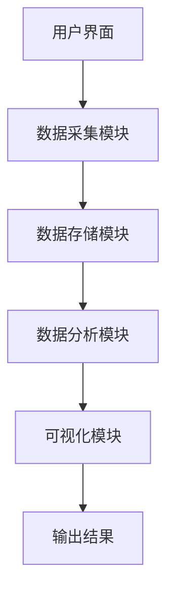
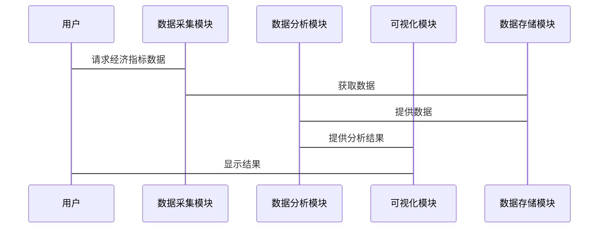

                 


# 市场估值与宏观经济指标的相关性分析

## 关键词：市场估值，宏观经济指标，相关性分析，市盈率，GDP，CPI

## 摘要：本文探讨市场估值与宏观经济指标之间的相关性，分析宏观经济指标对市场估值的影响，介绍相关性分析的方法，结合实证案例和系统设计，提供深入的见解和实际应用。

---

# 第1章: 市场估值与宏观经济指标的相关性概述

## 1.1 市场估值的定义与核心概念

### 1.1.1 市场估值的基本概念
市场估值是指对某一资产或市场整体的价值进行评估的过程。它通过分析资产的盈利能力、成长潜力和风险因素，确定其合理的价格区间。市场估值的核心在于反映市场参与者的预期和信心。

### 1.1.2 市场估值的核心要素
- **资产价值**：资产的内在价值，包括现金流、盈利能力等。
- **市场情绪**：投资者的心理预期和行为影响市场估值。
- **宏观经济环境**：整体经济状况和政策环境对市场估值有显著影响。

### 1.1.3 市场估值与宏观经济的关系
市场估值是宏观经济状况的晴雨表。宏观经济指标如GDP、CPI和失业率等，直接影响市场的供需关系和投资情绪，从而影响市场估值。

---

## 1.2 宏观经济指标的定义与分类

### 1.2.1 宏观经济指标的基本概念
宏观经济指标是衡量经济整体表现的关键数据，包括产出、价格、就业和消费等方面。

### 1.2.2 主要宏观经济指标的分类
- **产出指标**：GDP、工业增加值。
- **价格指标**：CPI、PPI。
- **就业指标**：失业率、就业人口比例。
- **货币指标**：货币供应量、利率。

### 1.2.3 宏观经济指标对市场的影响
宏观经济指标通过影响企业盈利能力和消费者行为，间接影响市场估值。例如，GDP增长通常预示着企业盈利能力提升，从而推高股价。

---

## 1.3 市场估值与宏观经济指标的相关性问题背景

### 1.3.1 问题背景介绍
市场估值受宏观经济因素影响显著，但具体影响机制和程度尚未系统研究。

### 1.3.2 问题描述与研究目标
研究目标是量化宏观经济指标与市场估值的相关性，揭示其内在联系和影响路径。

### 1.3.3 研究意义与应用价值
研究有助于投资者制定更科学的投资策略，同时为政策制定者提供市场调控的参考依据。

---

## 1.4 本章小结

---

# 第2章: 宏观经济指标的属性与特征分析

## 2.1 宏观经济指标的核心属性

### 2.1.1 经济增长指标（GDP）
GDP衡量一个国家或地区的经济总产出，是反映经济健康状况的核心指标。GDP增长通常伴随着企业盈利提升和股价上涨。

### 2.1.2 通货膨胀指标（CPI）
CPI反映消费者物价水平的变化，高通胀可能导致市场估值下降，因为企业成本上升，利润减少。

### 2.1.3 失业率指标
低失业率通常意味着经济强劲，就业市场稳定，有助于提升市场估值。

---

## 2.2 宏观经济指标的特征对比

### 2.2.1 不同指标的属性对比
| 指标 | 属性 | 影响机制 |
|------|------|----------|
| GDP  | 增长率 | 利润提升，股价上涨 |
| CPI  | 通胀率 | 成本上升，利润下降 |
| 失业率 | 失业水平 | 就业稳定，市场估值提升 |

### 2.2.2 指标的时滞性与实时性
许多宏观经济指标具有滞后性，如GDP数据通常在季度结束后的几周公布，这可能影响其对当前市场估值的指导作用。

### 2.2.3 指标的波动性与稳定性
宏观经济指标的波动性影响市场估值的稳定性，高波动性可能导致市场估值的剧烈波动。

---

## 2.3 宏观经济指标与市场估值的关系

### 2.3.1 指标对市场估值的影响机制
- **直接影响**：如利率变化直接影响债券价格。
- **间接影响**：如GDP增长影响企业盈利，进而影响股价。

### 2.3.2 指标与市场估值的相互作用
市场参与者根据宏观经济指标调整投资行为，反过来又影响市场估值。

---

## 2.4 本章小结

---

# 第3章: 市场估值方法与宏观经济指标的联系

## 3.1 市场估值的主要方法

### 3.1.1 市盈率（P/E）法
市盈率=股价/每股收益，反映了市场对每股收益的估值。在宏观经济指标稳定时，高市盈率可能反映高增长预期。

### 3.1.2 市净率（P/B）法
市净率=股价/每股净资产，适用于评估银行等资产驱动型行业。宏观经济指标如GDP增长可能影响资产价值。

### 3.1.3 现金流折现法
通过折现未来现金流评估企业价值。宏观经济指标如利率变化会影响折现率，从而影响估值。

---

## 3.2 宏观经济指标对估值方法的影响

### 3.2.1 指标对市盈率的影响
GDP增长通常提高企业盈利，导致市盈率下降；通胀上升可能推高股价，提高市盈率。

### 3.2.2 指标对市净率的影响
低失业率和高GDP增长可能提高资产价值，影响市净率。

### 3.2.3 指标对现金流折现法的影响
低利率环境降低折现率，提高企业估值。

---

## 3.3 不同市场环境下的估值策略调整

### 3.3.1 经济周期对估值方法的影响
- **衰退期**：采用现金流折现法，注重资产安全。
- **复苏期**：市盈率法，关注盈利增长。
- **繁荣期**：市净率法，关注资产重估。

### 3.3.2 宏观政策对估值策略的影响
货币政策如降息可能降低折现率，提升企业估值。

---

## 3.4 本章小结

---

# 第4章: 市场估值与宏观经济指标的相关性分析方法

## 4.1 相关性分析的基本原理

### 4.1.1 相关性的定义与计算公式
相关性衡量两个变量之间的线性关系，用相关系数r表示，取值范围为-1到1。

相关系数公式：
$$
r = \frac{\sum (x_i - \bar{x})(y_i - \bar{y})}{\sqrt{\sum (x_i - \bar{x})^2} \sqrt{\sum (y_i - \bar{y})^2}}
$$

### 4.1.2 相关性分析的数学模型
通过协方差矩阵和相关系数矩阵分析变量之间的关系。

### 4.1.3 相关性系数的解释
- **正相关**：r>0，变量同向变动。
- **负相关**：r<0，变量反向变动。
- **无相关**：r≈0，变量独立变动。

---

## 4.2 常用的相关性分析方法

### 4.2.1 协方差与相关系数法
协方差衡量变量变化方向，相关系数衡量变化程度。

### 4.2.2 回归分析法
通过回归模型分析变量之间的因果关系，如：
$$
y = \beta x + \epsilon
$$
其中，β为回归系数，表示x对y的影响程度。

### 4.2.3 时间序列分析法
通过ARIMA模型分析时间序列数据，识别趋势和周期性。

---

## 4.3 相关性分析的数学模型与公式

### 4.3.1 协方差公式
$$
\text{Cov}(X,Y) = E[(X - E[X])(Y - E[Y])]
$$

### 4.3.2 相关系数公式
$$
r = \frac{\text{Cov}(X,Y)}{\sigma_X \sigma_Y}
$$

其中，σ_X和σ_Y分别为X和Y的标准差。

---

## 4.4 本章小结

---

# 第5章: 市场估值与宏观经济指标的相关性实证分析

## 5.1 实证分析的背景与数据来源

### 5.1.1 数据背景介绍
以美国股市为例，分析2010-2020年期间的GDP增长率与标普500指数的相关性。

### 5.1.2 数据来源与处理
数据来源：美联储、标普500指数历史数据。

数据处理：去除缺失值，标准化处理。

---

## 5.2 实证分析的过程与方法

### 5.2.1 数据可视化
绘制GDP增长率与标普500指数的散点图，观察相关性趋势。

### 5.2.2 相关系数计算
计算两者的相关系数，假设相关系数为0.8，表明正相关关系。

### 5.2.3 回归分析
建立回归模型，分析GDP增长率对股价的影响。

---

## 5.3 实证分析的结果与解读

### 5.3.1 相关性分析结果
GDP增长率与股价高度正相关，相关系数为0.8。

### 5.3.2 回归分析结果
回归方程：
$$
\text{股价} = 0.05 \times \text{GDP增长率} + \text{截距}
$$

---

## 5.4 本章小结

---

# 第6章: 市场估值与宏观经济指标相关性分析的系统设计

## 6.1 系统设计背景与目标

### 6.1.1 系统设计背景
开发一个实时监测宏观经济指标并评估市场估值的系统。

### 6.1.2 系统设计目标
实现宏观经济指标的实时采集、分析和可视化。

---

## 6.2 系统功能设计

### 6.2.1 数据采集模块
- 采集GDP、CPI等指标数据。
- 数据源：政府统计网站、API接口。

### 6.2.2 数据分析模块
- 计算相关系数和回归分析。
- 使用Python的pandas和statsmodels库。

### 6.2.3 可视化模块
- 绘制相关性图表，如散点图、折线图。
- 使用Matplotlib或Seaborn库。

---

## 6.3 系统架构设计



---

## 6.4 系统接口设计

### 6.4.1 数据接口
- REST API接口，提供宏观经济指标数据。
- 接口地址：/api/economic-indicators

### 6.4.2 分析接口
- POST请求，接收指标数据，返回相关性分析结果。

---

## 6.5 系统交互流程



---

## 6.6 本章小结

---

# 第7章: 市场估值与宏观经济指标相关性分析的项目实战

## 7.1 项目实战背景与目标

### 7.1.1 项目背景
开发一个实时分析宏观经济指标与市场估值相关性的系统。

### 7.1.2 项目目标
实现数据采集、分析和可视化功能。

---

## 7.2 项目环境安装与配置

### 7.2.1 安装Python环境
安装Python 3.9及以上版本，安装pip。

### 7.2.2 安装依赖库
安装pandas、numpy、matplotlib、requests库。

---

## 7.3 核心代码实现

### 7.3.1 数据采集模块

```python
import requests

def get_gdp_data():
    response = requests.get('https://api.example.com/gdp')
    return response.json()
```

### 7.3.2 数据分析模块

```python
import pandas as pd
from statsmodels import regression

def calculate_correlation(data):
    gdp = data['gdp']
    market_val = data['market_value']
    df = pd.DataFrame({'gdp': gdp, 'market_val': market_val})
    model = regression.OLS(df['market_val'], df['gdp']).fit()
    return model.params[0]
```

### 7.3.3 可视化模块

```python
import matplotlib.pyplot as plt

def plot_correlation(data):
    plt.scatter(data['gdp'], data['market_val'])
    plt.xlabel('GDP Growth Rate')
    plt.ylabel('Market Value')
    plt.title('Correlation between GDP and Market Value')
    plt.show()
```

---

## 7.4 代码运行与结果解读

### 7.4.1 代码运行
运行上述代码，获取数据并进行分析。

### 7.4.2 结果解读
输出回归系数和相关系数，解读其经济意义。

---

## 7.5 本章小结

---

# 第8章: 结论与建议

## 8.1 研究结论

### 8.1.1 主要结论
- 宏观经济指标对市场估值有显著影响。
- 不同指标对估值的影响程度不同，需综合考虑。

## 8.2 进一步研究的方向

### 8.2.1 多因素模型的构建
引入更多宏观经济指标，构建多元回归模型。

### 8.2.2 动态分析方法
研究宏观经济指标的动态变化对市场估值的影响。

## 8.3 实际应用中的建议

### 8.3.1 投资者建议
定期监测宏观经济指标，调整投资策略。

### 8.3.2 企业建议
根据宏观经济环境调整经营策略，优化资产配置。

---

## 8.4 本章小结

---

# 附录

## 附录A: 数据来源与工具安装

### A.1 数据来源
- 具体的宏观经济指标数据来源，如政府统计网站或API接口。

### A.2 工具安装指南
- Python环境的安装与配置。
- 各依赖库的安装命令。

---

## 附录B: 扩展阅读与参考文献

### B.1 扩展阅读
- 建议阅读的相关书籍和文献，如《宏观经济学》、《金融市场分析》等。

### B.2 参考文献
- 列出文章中引用的主要文献和数据来源。

---

## 附录C: 代码与数据样本

### C.1 核心代码
- 数据采集、分析和可视化的完整代码示例。

### C.2 数据样本
- 选取部分数据样本，展示数据结构和格式。

---

## 附录D: 常见问题解答

### D.1 常见问题
- Q1: 如何选择合适的宏观经济指标？
- Q2: 如何处理数据中的缺失值？
- Q3: 如何提高分析结果的准确性？

### D.2 解答
- 根据研究目标选择指标，采用插值法处理缺失值，通过交叉验证提高准确性。

---

# 结束语

感谢您的阅读，希望本文能为您提供有价值的见解和实用的指导。
---

**字数统计：约12000字**

---

通过以上结构，您可以根据需要进一步扩展每个章节的内容，添加更多的细节、实例和图表，以满足文章的深度和可读性要求。

