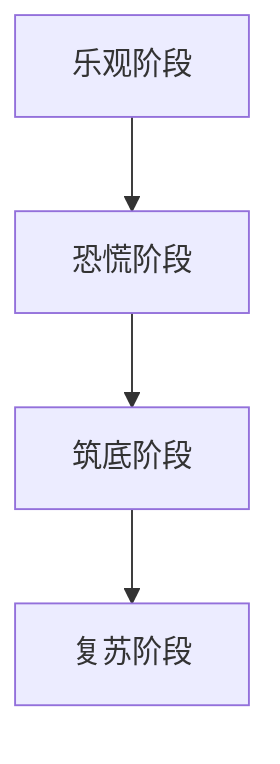
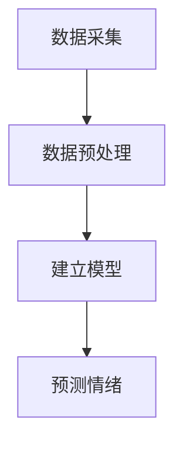
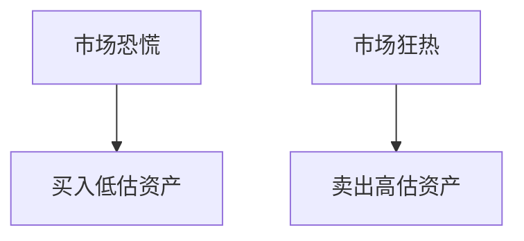
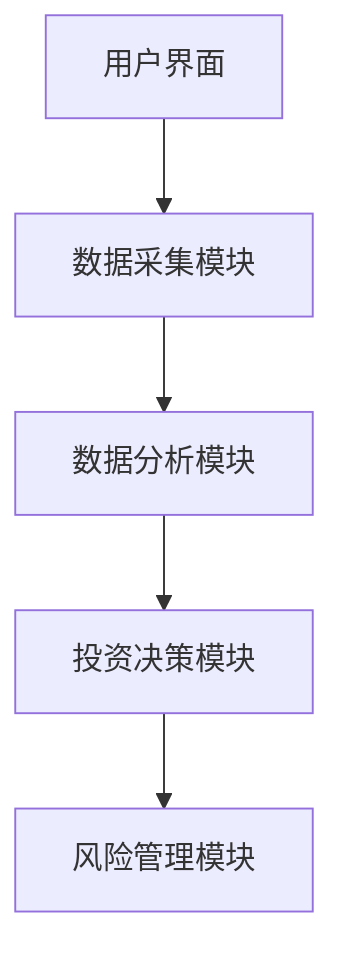

                 


# 市场先生的情绪：价值投资者如何利用市场波动

## 关键词：市场情绪，价值投资，市场波动，风险管理，投资者行为，数据分析

## 摘要：  
市场情绪是金融市场波动的核心驱动因素之一。本文深入分析市场情绪的定义、分类及其对投资决策的影响，探讨价值投资者如何识别市场情绪偏差，利用市场波动捕捉投资机会。通过数学模型、数据分析和实际案例，本文揭示市场情绪与价值投资的内在联系，为投资者提供科学的决策支持。

---

# 第1章：市场情绪的基本概念

## 1.1 市场情绪的定义与分类  
市场情绪是指投资者在市场中的心理状态和行为倾向，反映了市场参与者的乐观或悲观态度。市场情绪可以分为以下几个类别：  

### 表1.1：市场情绪分类表  

| 类型       | 描述                     |
|------------|--------------------------|
| 过度乐观    | 投资者普遍预期市场上涨   |
| 恐慌        | 投资者预期市场下跌       |
| 中立        | 投资者预期市场稳定       |
| 无明确方向  | 投资者预期不明确         |

市场情绪与市场波动密切相关，情绪波动会导致市场价格偏离其内在价值。

---

## 1.2 价值投资的核心理念  
价值投资是一种以基本面分析为基础的投资策略，强调购买被市场低估的资产。其核心理念包括：  

1. **安全边际**：买入价格低于内在价值的资产。  
2. **长期视角**：关注企业的长期价值，而非短期波动。  
3. **逆向思维**：在市场恐慌时寻找机会，在市场狂热时保持冷静。  

---

# 第2章：市场情绪的波动规律  

## 2.1 市场情绪的周期性分析  
市场情绪具有周期性，通常与经济周期密切相关。以下是市场情绪的典型周期：  

1. **乐观阶段**：市场情绪高涨，投资者大量买入，推动价格上涨。  
2. **恐慌阶段**：市场情绪骤降，投资者恐慌性抛售，价格大幅下跌。  
3. **筑底阶段**：市场情绪逐渐稳定，投资者开始寻找价值。  
4. **复苏阶段**：市场情绪回升，价格逐步恢复。  

### 图2.1：市场情绪周期图  


---

## 2.2 投资者行为对市场情绪的影响  
投资者行为是市场情绪波动的重要驱动力。以下是投资者行为的关键特征：  

1. **从众心理**：投资者倾向于跟随市场趋势，导致情绪的放大效应。  
2. **过度反应**：投资者对短期信息反应过度，忽视长期价值。  
3. **羊群效应**：投资者行为的传染性，导致市场情绪的快速扩散。  

---

# 第3章：市场情绪的量化分析  

## 3.1 市场情绪的量化指标  
市场情绪可以通过量化指标进行衡量，常见的指标包括：  

1. **恐慌指数（VIX）**：反映市场波动性的指标。  
2. **投资者信心指数**：衡量投资者对市场的乐观程度。  
3. **市场情绪指数（MEI）**：基于市场交易数据计算的情绪指标。  

### 表3.1：常见市场情绪指标  

| 指标名称 | 计算方法                | 指标范围  |
|----------|-------------------------|-----------|
| VIX      | 基于标普500指数波动率计算 | 0-100     |
| MEI      | 基于交易量和价格变化计算 | -1到1     |

---

## 3.2 数据分析与市场情绪预测  
市场情绪预测可以通过数据分析和数学模型实现。以下是常用的预测方法：  

1. **时间序列分析**：基于历史数据预测未来情绪。  
2. **机器学习模型**：使用算法识别情绪模式。  

### 图3.1：时间序列分析流程图  


---

# 第4章：价值投资者如何利用市场波动  

## 4.1 市场情绪与价值投资机会  
市场情绪的波动为价值投资者提供了机会：  

1. **逆向投资**：在市场恐慌时买入低估资产，在市场狂热时卖出。  
2. **价值回归**：市场情绪过度时，价格与价值的偏差为套利机会。  

### 图4.1：逆向投资策略  


---

## 4.2 市场波动中的风险管理  
价值投资者应注重风险管理，避免过度承担风险：  

1. **风险评估**：分析市场情绪对投资组合的影响。  
2. **止损机制**：设定止损点以控制损失。  
3. **分散投资**：通过多元化降低风险。  

### 表4.1：风险管理策略  

| 风险类型 | 管理措施             |
|----------|----------------------|
| 市场风险 | 分散投资，设定止损   |
| 情绪风险 | 定期评估情绪指标     |

---

# 第5章：实际案例分析与策略应用  

## 5.1 历史案例分析  
### 案例1：2008年金融危机  
市场情绪的急剧下降导致金融危机爆发，投资者恐慌性抛售资产。价值投资者在市场底部买入优质资产，获得长期收益。  

### 案例2：互联网泡沫  
市场情绪过度乐观导致互联网泡沫破裂，价值投资者在泡沫破裂前识别高估资产，避免损失。  

---

## 5.2 价值投资策略的实际应用  
### 步骤1：识别市场情绪偏差  
通过分析市场情绪指标，判断市场是否偏离价值。  

### 步骤2：制定投资计划  
根据市场情绪和基本面分析，制定买入或卖出计划。  

### 步骤3：长期持有与调整  
坚持长期投资，定期调整投资组合以应对市场变化。  

---

# 第6章：系统分析与架构设计方案  

## 6.1 问题场景介绍  
价值投资者需要实时监测市场情绪，识别投资机会。  

## 6.2 系统功能设计  
### 功能模块：  
1. **市场情绪监测**：实时采集和分析市场情绪数据。  
2. **价值评估**：基于基本面分析评估资产价值。  
3. **投资决策支持**：提供投资建议和风险管理工具。  

## 6.3 系统架构设计  
### 图6.1：系统架构图  


---

# 第7章：项目实战与经验总结  

## 7.1 环境安装与数据准备  
### 环境要求：  
- 数据分析工具：Python、R  
- 开发框架：Django、Flask  

## 7.2 核心算法实现  
### 算法代码：市场情绪预测模型  
```python
import pandas as pd
from sklearn.linear_model import LinearRegression

# 数据预处理
data = pd.read_csv('market_data.csv')
X = data[['volume', 'price_change']]
y = data['market_emotion']

# 建立模型
model = LinearRegression()
model.fit(X, y)

# 预测情绪
predicted_emotion = model.predict(X)
```

## 7.3 代码实现与解读  
### 代码解读：  
上述代码使用线性回归模型，基于交易量和价格变化预测市场情绪。  

## 7.4 项目小结  
通过项目实战，价值投资者可以利用数据分析工具和算法模型，实时监测市场情绪，制定科学的投资策略。

---

# 结语  
市场情绪是价值投资者必须掌握的关键因素。通过量化分析和风险管理，投资者可以利用市场波动捕捉机会，实现长期收益。希望本文为投资者提供有价值的洞见和实践指导。

--- 

> **最佳实践 Tips**：  
> 1. 定期监测市场情绪指标，如VIX指数和市场情绪指数。  
> 2. 在市场恐慌时保持冷静，寻找低估资产。  
> 3. 长期投资，避免过度交易。  
> 4. 结合基本面分析和市场情绪分析，制定投资策略。  

通过以上方法，价值投资者可以在市场波动中把握机会，实现稳健投资回报。

