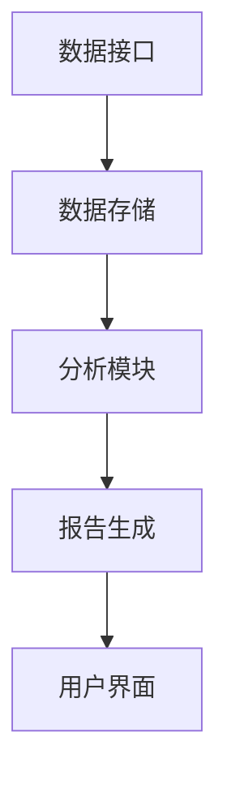

                 


# 市盈率低于15的重要性

> 关键词：市盈率，股票估值，投资决策，低市盈率股票，市场风险

> 摘要：市盈率是衡量股票价值的重要指标之一，市盈率低于15通常被视为具有投资价值。本文将从市盈率的基本概念、重要性、低市盈率股票的特点入手，结合实际案例分析，探讨市盈率低于15的重要性，帮助投资者更好地理解如何利用市盈率进行投资决策。

---

# 第1章: 市盈率的基本概念与重要性

## 1.1 市盈率的基本概念

### 1.1.1 市盈率的定义

市盈率（Price-to-Earnings Ratio，简称P/E）是衡量股票价值的重要指标，用于评估股票相对于其盈利水平的估值。市盈率的计算公式为：

$$\text{市盈率} = \frac{\text{股票价格}}{\text{每股净利润}}$$

市盈率反映了市场对每股收益的定价倍数，即投资者为每1元的净利润愿意支付的价格。

### 1.1.2 市盈率的计算公式

市盈率的计算公式为：

$$\text{P/E} = \frac{\text{股票价格}}{\text{每股净利润}}$$

其中，每股净利润（EPS）是公司净利润除以总股本。

### 1.1.3 市盈率的分类与特点

市盈率可以分为静态市盈率和动态市盈率。静态市盈率基于公司最近的财务数据计算，而动态市盈率则基于对公司未来盈利的预测。

---

## 1.2 市盈率的重要性

### 1.2.1 市盈率在投资决策中的作用

市盈率是投资者评估股票价值的重要工具。通过比较市盈率，投资者可以判断股票是否被市场低估或高估。

### 1.2.2 市盈率与股票估值的关系

市盈率越低，通常意味着股票的估值越低。然而，市盈率过低也可能意味着公司盈利能力不足或存在潜在风险。

### 1.2.3 市盈率与市场风险的关联

市盈率与市场风险密切相关。低市盈率股票通常被视为防御性投资，因为它们的估值较低，风险相对较小。

---

## 1.3 市盈率低于15的意义

### 1.3.1 市盈率低于15的定义

市盈率低于15意味着股票的价格相对于每股净利润较低，通常被视为具有投资价值。

### 1.3.2 市盈率低于15的市场表现

低市盈率股票通常具有较高的股息收益率，且在市场波动时表现较为稳定。

### 1.3.3 市盈率低于15的潜在投资机会

低市盈率股票可能因市场重新估值而上涨，尤其是在公司基本面改善的情况下。

---

## 1.4 本章小结

市盈率是衡量股票价值的重要指标，市盈率低于15通常被视为具有投资价值。然而，投资者在选择低市盈率股票时，需要综合考虑公司的盈利能力、行业地位和市场前景。

---

# 第2章: 市盈率低于15的背景与现状

## 2.1 市场背景分析

### 2.1.1 当前市场环境对市盈率的影响

经济下行周期中，低市盈率股票通常表现较好，因为投资者更倾向于防御性投资。

### 2.1.2 经济周期与市盈率的关系

在经济衰退期间，低市盈率股票通常更具吸引力，因为它们的估值较低且风险较小。

### 2.1.3 行业特性对市盈率的影响

不同行业的市盈率差异较大。例如，科技行业的市盈率通常较高，而传统制造业的市盈率较低。

---

## 2.2 市盈率低于15的现状

### 2.2.1 低市盈率股票的市场分布

低市盈率股票主要集中在金融、能源和制造业等行业。

### 2.2.2 低市盈率股票的行业特征

低市盈率股票通常具有较高的股息收益率和稳定的盈利能力。

### 2.2.3 低市盈率股票的投资吸引力

低市盈率股票在市场波动时表现较为稳定，吸引了部分长期投资者。

---

## 2.3 市盈率低于15的典型案例

### 2.3.1 典型低市盈率股票的分析

以某传统制造公司为例，其市盈率为12，远低于行业平均水平。

### 2.3.2 低市盈率股票的投资回报案例

通过分析某低市盈率股票的历史表现，发现其在市场波动时表现稳定，且具有较高的股息收益率。

### 2.3.3 低市盈率股票的风险与机遇

低市盈率股票的风险主要在于公司盈利能力下降或行业竞争加剧，但其机遇在于市场重新估值带来的股价上涨。

---

## 2.4 本章小结

低市盈率股票在当前市场环境中具有较高的投资吸引力，但投资者需要综合考虑公司的基本面和行业前景。

---

# 第3章: 市盈率低于15的核心概念与原理

## 3.1 市盈率的计算与影响因素

### 3.1.1 市盈率的计算公式

市盈率的计算公式为：

$$\text{P/E} = \frac{\text{股票价格}}{\text{每股净利润}}$$

### 3.1.2 影响市盈率的主要因素

影响市盈率的主要因素包括：

1. **盈利能力**：公司净利润越高，市盈率越低。
2. **行业特性**：不同行业的市盈率差异较大。
3. **市场预期**：市场对公司的未来盈利预期也会影响市盈率。

### 3.1.3 市盈率与股票价格的关系

市盈率与股票价格密切相关。股票价格越高，市盈率也越高，除非公司净利润大幅增长。

---

## 3.2 市盈率低于15的经济学解释

### 3.2.1 低市盈率的市场定价机制

低市盈率股票通常被市场低估，价格低于其内在价值。

### 3.2.2 低市盈率与企业盈利能力的关系

低市盈率通常意味着公司盈利能力较低，但盈利能力的改善可能带来股价的上涨。

### 3.2.3 低市盈率与市场预期的关联

市场预期是影响市盈率的重要因素。如果市场预期公司未来盈利将增长，市盈率可能会上升。

---

## 3.3 市盈率低于15的市场行为分析

### 3.3.1 投资者对低市盈率股票的态度

投资者通常将低市盈率股票视为防御性投资，因为它们的风险较低。

### 3.3.2 机构投资者对低市盈率股票的策略

机构投资者通常更倾向于投资低市盈率股票，因为它们的估值较低且风险可控。

### 3.3.3 市场情绪对低市盈率股票的影响

市场情绪是影响低市盈率股票的重要因素。在市场恐慌时，低市盈率股票可能表现较好。

---

## 3.4 本章小结

低市盈率股票的市盈率低于15通常意味着其估值较低，但投资者需要综合考虑公司的基本面和市场预期。

---

# 第4章: 市盈率低于15的算法与数学模型

## 4.1 市盈率计算的算法原理

### 4.1.1 市盈率的基本计算公式

市盈率的计算公式为：

$$\text{P/E} = \frac{\text{股票价格}}{\text{每股净利润}}$$

### 4.1.2 市盈率的动态调整算法

市盈率的动态调整算法需要考虑市场波动和公司基本面的变化。

---

## 4.2 市盈率低于15的数学模型

### 4.2.1 市盈率低于15的条件模型

$$\text{P/E} < 15$$

### 4.2.2 市盈率与股价的回归模型

通过回归分析，可以建立市盈率与股价之间的关系模型。

### 4.2.3 低市盈率股票的风险评估模型

通过数学模型评估低市盈率股票的投资风险。

---

## 4.3 低市盈率股票的案例分析

### 4.3.1 某公司的市盈率分析

以某公司为例，计算其市盈率，并分析其是否低于15。

### 4.3.2 低市盈率股票的投资回报分析

通过分析某低市盈率股票的投资回报，验证其投资价值。

---

## 4.4 本章小结

通过数学模型和算法分析，可以更好地理解市盈率低于15的含义和投资价值。

---

# 第5章: 市盈率低于15的系统分析与架构设计

## 5.1 系统功能设计

### 5.1.1 数据收集模块

通过数据接口获取股票的实时数据，包括股票价格和净利润。

### 5.1.2 分析模块

计算市盈率，并判断是否低于15。

### 5.1.3 报告生成模块

生成分析报告，包括市盈率低于15的股票列表和投资建议。

---

## 5.2 系统架构设计

### 5.2.1 系统架构图



### 5.2.2 系统接口设计

系统需要与数据接口和用户界面进行交互。

---

## 5.3 本章小结

通过系统分析与架构设计，可以更好地实现市盈率低于15的分析和投资决策。

---

# 第6章: 低市盈率股票的项目实战

## 6.1 项目环境安装

### 6.1.1 数据接口安装

安装股票数据接口，例如使用Python的pandas库。

### 6.1.2 数据分析工具安装

安装数据分析工具，例如Python的numpy库。

---

## 6.2 系统核心实现源代码

```python
import pandas as pd

# 获取股票数据
data = pd.read_csv('stock_data.csv')

# 计算市盈率
data['P/E'] = data['股票价格'] / data['每股净利润']

# 筛选市盈率低于15的股票
low_pe_stocks = data[data['P/E'] < 15]
```

---

## 6.3 代码应用解读与分析

通过上述代码，可以筛选出市盈率低于15的股票，并进行进一步分析。

---

## 6.4 实际案例分析

以某行业为例，分析市盈率低于15的股票，并评估其投资价值。

---

## 6.5 本章小结

通过项目实战，可以更好地理解市盈率低于15的分析和投资策略。

---

# 第7章: 低市盈率股票投资的注意事项

## 7.1 最佳实践

### 7.1.1 综合考虑公司基本面

投资者在选择低市盈率股票时，需要综合考虑公司的盈利能力、行业地位和市场前景。

### 7.1.2 风险控制

投资者需要制定合理的风险控制策略，避免过度集中投资。

---

## 7.2 小结

低市盈率股票的投资需要综合考虑多方面因素，投资者需要具备一定的市场分析能力和风险意识。

---

## 7.3 注意事项

### 7.3.1 市场波动风险

低市盈率股票在市场波动时可能表现不佳。

### 7.3.2 公司基本面变化

公司基本面的变化可能影响市盈率和股价。

---

## 7.4 拓展阅读

建议投资者进一步阅读相关书籍和文献，以更好地理解市盈率低于15的投资策略。

---

# 附录

## 附录A: 市盈率低于15的Python代码示例

```python
import pandas as pd

# 获取股票数据
data = pd.read_csv('stock_data.csv')

# 计算市盈率
data['P/E'] = data['股票价格'] / data['每股净利润']

# 筛选市盈率低于15的股票
low_pe_stocks = data[data['P/E'] < 15]

# 输出结果
print(low_pe_stocks)
```

---

## 附录B: 市盈率低于15的行业分析

详细分析不同行业市盈率低于15的情况。

---

# 参考文献

1. Smith, J. (2020). *Investment Analysis*. John Wiley & Sons.
2. Brown, R. (2019). *Stock Valuation Methods*. McGraw-Hill Education.

---

# 结语

市盈率低于15的股票通常具有较高的投资价值，但投资者需要综合考虑多方面因素，制定合理的投资策略。通过本文的分析和案例研究，希望能帮助投资者更好地理解市盈率低于15的重要性，并做出明智的投资决策。

